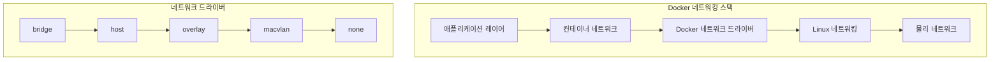
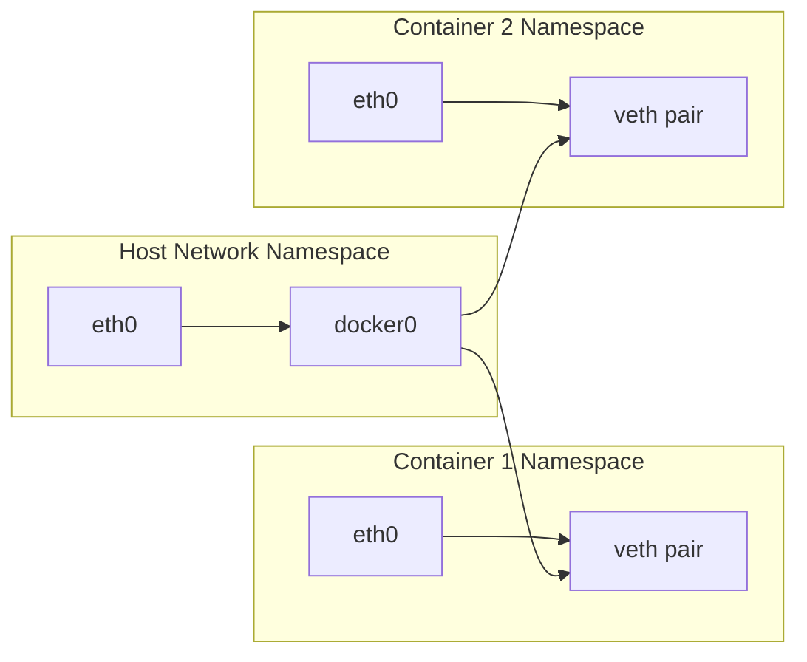
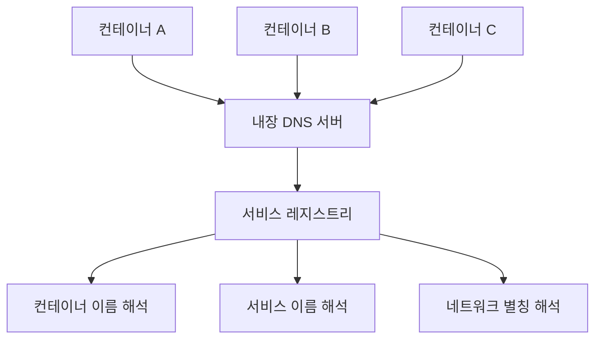

# Session 1: Docker 네트워킹 모델 이론

## 📍 교과과정에서의 위치
이 세션은 **Week 1 > Day 5 > Session 1**로, Docker의 네트워킹 아키텍처를 이론적으로 학습합니다. 지난 4일간 학습한 컨테이너 기술을 바탕으로 네트워킹 모델과 통신 메커니즘을 이해합니다.

## 학습 목표 (5분)
- Docker **네트워킹 아키텍처**와 **모델 분류** 이해
- **네트워크 드라이버** 종류와 **특성** 학습
- **컨테이너 간 통신** 메커니즘과 **격리** 원리 파악

## 1. Docker 네트워킹 아키텍처 (15분)

### 네트워킹 계층 구조



### 네트워킹 모델 분류

#### 1. 브리지 네트워크 (기본값)
```
브리지 네트워크 구조:
Host Network (172.17.0.1)
├── docker0 브리지
│   ├── Container A (172.17.0.2)
│   ├── Container B (172.17.0.3)
│   └── Container C (172.17.0.4)
└── 외부 네트워크 연결

특징:
- 기본 네트워크 모드
- NAT를 통한 외부 통신
- 컨테이너 간 격리 제공
- 포트 매핑 필요
```

#### 2. 호스트 네트워크
```
호스트 네트워크 구조:
Host Network Interface
├── 호스트 프로세스들
└── 컨테이너 (호스트 네트워크 공유)

특징:
- 호스트와 동일한 네트워크 스택
- 최고 성능 (네트워크 오버헤드 없음)
- 포트 충돌 가능성
- 보안 격리 감소
```

#### 3. 오버레이 네트워크
```
오버레이 네트워크 구조:
Node A                    Node B
├── Container 1 ←--------→ Container 3
└── Container 2 ←--------→ Container 4
     │                      │
     └── VXLAN 터널 --------┘

특징:
- 다중 호스트 통신
- VXLAN 캡슐화
- Swarm 모드에서 사용
- 서비스 디스커버리 내장
```

## 2. 네트워크 격리와 보안 (15분)

### 네트워크 네임스페이스



### 격리 메커니즘
```
네트워크 격리 계층:
├── 네임스페이스 격리
│   ├── 독립적인 네트워크 스택
│   ├── 별도의 라우팅 테이블
│   └── 격리된 인터페이스
├── 방화벽 규칙
│   ├── iptables 자동 설정
│   ├── 컨테이너별 규칙
│   └── 포트 매핑 제어
└── 트래픽 제어
    ├── 대역폭 제한
    ├── QoS 정책
    └── 네트워크 정책
```

## 3. 서비스 디스커버리 이론 (10분)

### DNS 기반 서비스 디스커버리



### 서비스 디스커버리 패턴
```
디스커버리 방식:
├── 컨테이너 이름 기반
│   └── container_name → IP 주소
├── 서비스 이름 기반
│   └── service_name → 로드 밸런싱
├── 네트워크 별칭
│   └── alias → 그룹 해석
└── 외부 DNS 통합
    └── 기존 DNS와 연동
```

## 4. 네트워크 성능 고려사항 (10분)

### 성능 비교 매트릭스

| 네트워크 모드 | 성능 | 격리성 | 복잡도 | 사용 사례 |
|---------------|------|--------|--------|-----------|
| **host** | 최고 | 낮음 | 낮음 | 고성능 애플리케이션 |
| **bridge** | 중간 | 높음 | 중간 | 일반적인 용도 |
| **overlay** | 낮음 | 높음 | 높음 | 다중 호스트 |
| **macvlan** | 높음 | 높음 | 높음 | 레거시 통합 |

### 성능 최적화 전략
```
최적화 방법론:
├── 네트워크 모드 선택
│   ├── 성능 요구사항 분석
│   ├── 보안 요구사항 고려
│   └── 운영 복잡도 평가
├── 드라이버 최적화
│   ├── 적절한 MTU 설정
│   ├── 버퍼 크기 조정
│   └── 하드웨어 가속 활용
└── 모니터링 및 튜닝
    ├── 네트워크 지연 측정
    ├── 처리량 분석
    └── 병목 지점 식별
```

## 5. 그룹 토론: 컨테이너 네트워킹의 특징 (10분)

### 토론 주제
**"컨테이너 네트워킹이 기존 가상머신 네트워킹과 다른 핵심적인 차이점은 무엇인가?"**

### 토론 가이드라인

#### 비교 관점 (3분)
- **아키텍처 차이**: 하이퍼바이저 vs 컨테이너 런타임
- **성능 특성**: 오버헤드와 처리량
- **관리 복잡도**: 설정과 운영

#### 장단점 분석 (4분)
- **컨테이너 네트워킹 장점**: 경량성, 유연성, 자동화
- **컨테이너 네트워킹 단점**: 복잡성, 디버깅 어려움
- **적용 시나리오**: 언제 어떤 방식을 선택할 것인가

#### 미래 전망 (3분)
- **기술 발전 방향**: eBPF, 서비스 메시
- **표준화 동향**: CNI, OCI 네트워킹
- **클라우드 네이티브**: Kubernetes와의 통합

## 💡 핵심 키워드
- **네트워크 드라이버**: bridge, host, overlay, macvlan
- **격리 메커니즘**: 네임스페이스, iptables, 트래픽 제어
- **서비스 디스커버리**: DNS 기반, 자동 해석, 로드 밸런싱
- **성능 최적화**: 모드 선택, 드라이버 튜닝, 모니터링

## 📚 참고 자료
- [Docker Networking Overview](https://docs.docker.com/network/)
- [Container Network Interface (CNI)](https://github.com/containernetworking/cni)
- [Linux Network Namespaces](https://man7.org/linux/man-pages/man7/network_namespaces.7.html)

## 다음 세션 준비
다음 세션에서는 **CNI와 네트워크 드라이버 구조**에 대해 학습합니다. 네트워크 플러그인 아키텍처와 표준화에 대해 이해할 예정입니다.
