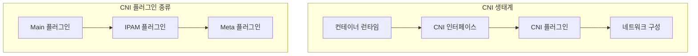
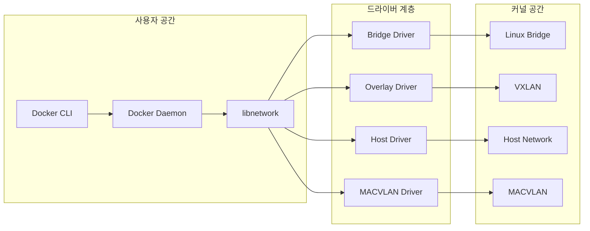
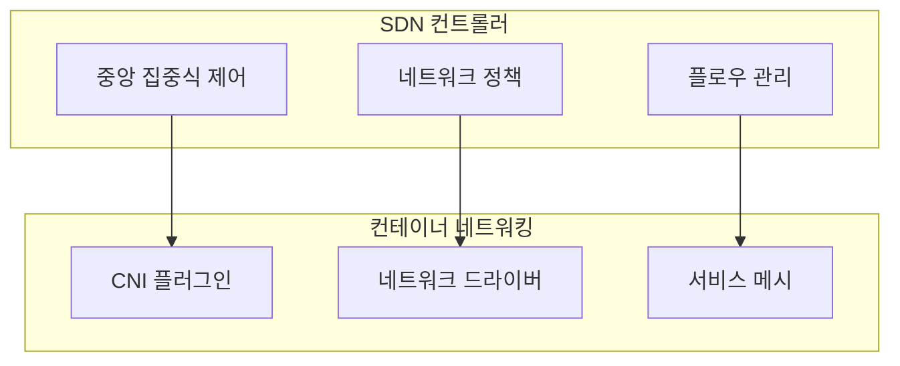
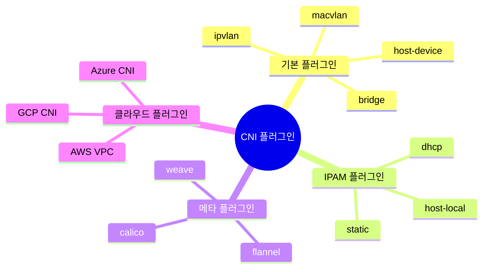

# Session 2: CNI와 네트워크 드라이버 구조

## 📍 교과과정에서의 위치
이 세션은 **Week 1 > Day 5 > Session 2**로, Container Network Interface(CNI) 표준과 네트워크 드라이버 아키텍처를 이론적으로 학습합니다. Docker 네트워킹의 표준화와 플러그인 시스템을 이해합니다.

## 학습 목표 (5분)
- **CNI 표준**과 **네트워크 플러그인** 아키텍처 이해
- **네트워크 드라이버** 종류와 **구현 방식** 학습
- **SDN과 컨테이너** 네트워킹 통합 개념 파악

## 1. CNI (Container Network Interface) 표준 (15분)

### CNI 아키텍처



### CNI 표준 구조
```
CNI 스펙 구성:
   🔹 네트워크 설정 (JSON)
      • 플러그인 이름
      • 네트워크 타입
      • 설정 매개변수
   🔹 실행 인터페이스
      • ADD: 네트워크 추가
      • DEL: 네트워크 제거
      • CHECK: 상태 확인
   🔹 결과 형식
   🔹 IP 주소 할당
   🔹 라우팅 정보
   🔹 DNS 설정
```

## 2. 네트워크 드라이버 아키텍처 (15분)

### Docker 네트워크 드라이버 계층



### 드라이버별 특성 비교

| 드라이버 | 구현 방식 | 성능 | 격리성 | 복잡도 |
|----------|-----------|------|--------|--------|
| **bridge** | Linux Bridge + iptables | 중간 | 높음 | 낮음 |
| **host** | 호스트 네트워크 직접 사용 | 최고 | 없음 | 최저 |
| **overlay** | VXLAN 터널링 | 낮음 | 높음 | 높음 |
| **macvlan** | MAC 주소 가상화 | 높음 | 높음 | 중간 |

## 3. SDN과 컨테이너 네트워킹 통합 (10분)

### Software Defined Networking 통합



### 통합 아키텍처 패턴
```
SDN + 컨테이너 통합:
   🔹 중앙 집중식 네트워크 관리
      • 정책 기반 라우팅
      • 동적 네트워크 구성
      • 자동 스케일링
   🔹 프로그래머블 네트워크
      • API 기반 제어
      • 자동화된 설정
      • 실시간 모니터링
   🔹 마이크로세그멘테이션
   🔹 세밀한 보안 제어
   🔹 트래픽 격리
   🔹 제로 트러스트 모델
```

## 4. 네트워크 플러그인 생태계 (10분)

### 주요 CNI 플러그인



### 플러그인 선택 기준
```
선택 고려사항:
   🔹 성능 요구사항
      • 처리량 (Throughput)
      • 지연시간 (Latency)
      • 확장성 (Scalability)
   🔹 기능 요구사항
      • 멀티 호스트 지원
      • 보안 정책
      • 서비스 디스커버리
   🔹 운영 복잡도
      • 설정 복잡성
      • 디버깅 용이성
      • 모니터링 지원
   🔹 생태계 호환성
   🔹 Kubernetes 지원
   🔹 클라우드 통합
   🔹 커뮤니티 지원
```

## 5. 그룹 토론: CNI 표준화의 영향 (10분)

### 토론 주제
**"CNI 표준화가 컨테이너 생태계에 미친 가장 큰 영향은 무엇인가?"**

### 토론 가이드라인

#### 표준화 이전 vs 이후 (3분)
- 이전: 벤더별 독자적 구현
- 이후: 표준 인터페이스 통일
- 변화: 상호 운용성 향상

#### 긍정적 영향 (4분)
- 플러그인 생태계: 다양한 선택지
- 벤더 중립성: 종속성 감소
- 혁신 촉진: 경쟁을 통한 발전

#### 도전과제 (3분)
- 복잡성 증가: 선택의 어려움
- 성능 오버헤드: 추상화 비용
- 호환성 문제: 버전 관리

## 💡 핵심 키워드
- CNI 표준: 플러그인 인터페이스, 상호 운용성
- 네트워크 드라이버: libnetwork, 계층 구조
- SDN 통합: 중앙 집중식 제어, 프로그래머블 네트워크
- 플러그인 생태계: 다양성, 선택 기준, 호환성

## 📚 참고 자료
- [CNI Specification](https://github.com/containernetworking/cni/blob/master/SPEC.md)
- [Docker libnetwork](https://github.com/docker/libnetwork)
- [Kubernetes Network Plugins](https://kubernetes.io/docs/concepts/extend-kubernetes/compute-storage-net/network-plugins/)

## 다음 세션 준비
다음 세션에서는 **스토리지 드라이버 아키텍처**에 대해 학습합니다. 컨테이너의 데이터 저장과 관리 메커니즘을 이해할 예정입니다.
