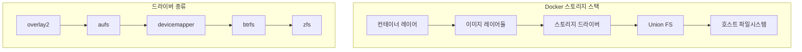
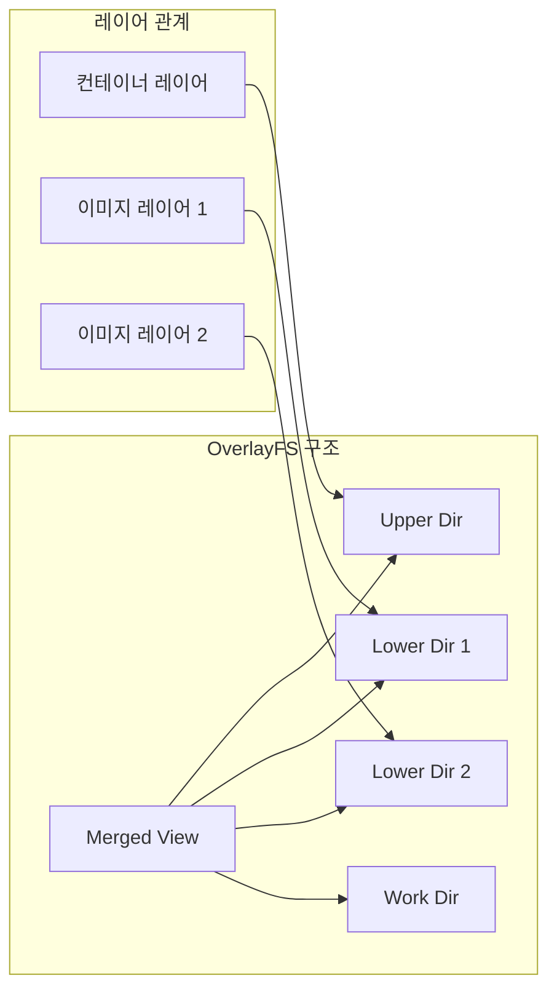
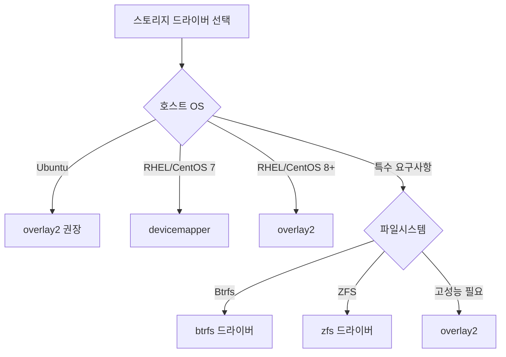

# Session 3: 스토리지 드라이버 아키텍처

## 📍 교과과정에서의 위치
이 세션은 **Week 1 > Day 5 > Session 3**으로, Docker의 스토리지 드라이버 아키텍처와 Union File System 구현체들을 이론적으로 학습합니다. 컨테이너의 데이터 저장 메커니즘을 이해합니다.

## 학습 목표 (5분)
- **스토리지 드라이버** 종류와 **특성** 이해
- **Union FS 구현체**와 **성능 특성** 학습
- **스토리지 최적화** 전략과 **선택 기준** 파악

## 1. 스토리지 드라이버 아키텍처 (15분)

### Docker 스토리지 계층 구조



### 스토리지 드라이버 비교

| 드라이버 | 파일시스템 | 성능 | 안정성 | 지원 OS |
|----------|------------|------|--------|---------|
| **overlay2** | OverlayFS | 높음 | 높음 | Linux 4.0+ |
| **aufs** | AUFS | 중간 | 높음 | Ubuntu |
| **devicemapper** | Device Mapper | 낮음 | 중간 | RHEL/CentOS |
| **btrfs** | Btrfs | 중간 | 중간 | Btrfs FS |
| **zfs** | ZFS | 높음 | 높음 | ZFS FS |

## 2. Union File System 구현체 (15분)

### OverlayFS 아키텍처



### Copy-on-Write 메커니즘
```
CoW 동작 원리:
   🔹 읽기 작업
      • 상위 레이어부터 검색
      • 파일 발견 시 즉시 반환
      • 하위 레이어로 순차 탐색
   🔹 쓰기 작업
      • 파일이 상위 레이어에 존재
         • 직접 수정
      • 파일이 하위 레이어에만 존재
      • 상위 레이어로 복사
      • 복사본 수정
   🔹 삭제 작업
   🔹 상위 레이어 파일 삭제
   🔹 하위 레이어 파일은 whiteout 마킹
```

## 3. 성능 특성 분석 (10분)

### 드라이버별 성능 프로파일

```mermaid
radar
    title 스토리지 드라이버 성능 비교
    options
        scale: 0 to 5
    data
        overlay2: [5, 4, 5, 4, 5]
        aufs: [3, 5, 4, 3, 3]
        devicemapper: [2, 3, 3, 5, 2]
        btrfs: [4, 3, 4, 4, 4]
        zfs: [5, 2, 5, 5, 3]
    labels
        읽기 성능
        쓰기 성능
        메모리 효율성
        디스크 효율성
        안정성
```

### 성능 최적화 전략
```
최적화 방법론:
   🔹 드라이버 선택
      • 워크로드 특성 분석
      • 호스트 환경 고려
      • 성능 요구사항 매칭
   🔹 레이어 최적화
      • 레이어 수 최소화
      • 큰 파일 처리 최적화
      • 캐시 친화적 구조
   🔹 시스템 튜닝
   🔹 파일시스템 옵션
   🔹 커널 매개변수
   🔹 하드웨어 최적화
```

## 4. 스토리지 선택 기준 (10분)

### 환경별 권장 드라이버



### 선택 기준 매트릭스
```
고려사항별 우선순위:

성능 우선:
1. overlay2 (최고 성능)
2. zfs (높은 성능 + 기능)
3. btrfs (중간 성능 + 기능)

안정성 우선:
1. overlay2 (검증된 안정성)
2. aufs (오랜 검증)
3. zfs (엔터프라이즈급)

기능 우선:
1. zfs (스냅샷, 압축, 중복제거)
2. btrfs (스냅샷, 서브볼륨)
3. overlay2 (기본 기능)

호환성 우선:
1. overlay2 (광범위한 지원)
2. devicemapper (RHEL 기본)
3. aufs (Ubuntu 전통)
```

## 5. 그룹 토론: 스토리지 드라이버 선택 (10분)

### 토론 주제
**"스토리지 드라이버 선택 시 가장 중요한 기준은 무엇인가?"**

### 토론 가이드라인

#### 시나리오별 분석 (4분)
- 개발 환경: 편의성 vs 성능
- 테스트 환경: 안정성 vs 기능
- 프로덕션: 성능 vs 안정성

#### 트레이드오프 고려 (3분)
- 성능 vs 기능: 단순함 vs 고급 기능
- 안정성 vs 혁신: 검증된 기술 vs 최신 기술
- 호환성 vs 최적화: 범용성 vs 특화

#### 미래 고려사항 (3분)
- 컨테이너 기술 발전: 새로운 드라이버
- 하드웨어 발전: NVMe, 메모리 스토리지
- 클라우드 네이티브: 분산 스토리지

## 💡 핵심 키워드
- 스토리지 드라이버: overlay2, aufs, devicemapper, btrfs, zfs
- Union FS: Copy-on-Write, 레이어 병합, 성능 최적화
- 선택 기준: 성능, 안정성, 기능, 호환성
- 최적화 전략: 드라이버 선택, 레이어 구조, 시스템 튜닝

## 📚 참고 자료
- [Docker Storage Drivers](https://docs.docker.com/storage/storagedriver/)
- [OverlayFS Documentation](https://www.kernel.org/doc/Documentation/filesystems/overlayfs.txt)
- [Device Mapper](https://www.kernel.org/doc/Documentation/device-mapper/)

## 다음 세션 준비
다음 세션에서는 **볼륨과 바인드 마운트 개념**에 대해 학습합니다. 데이터 영속성과 컨테이너 외부 스토리지 연결을 이해할 예정입니다.
