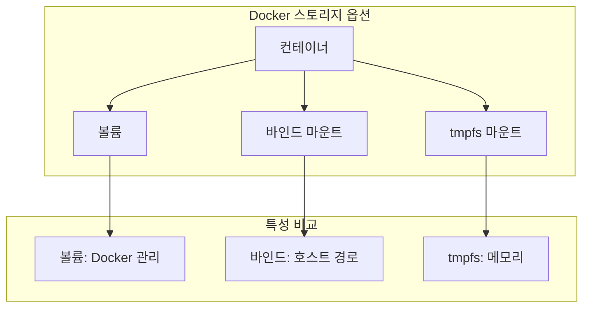
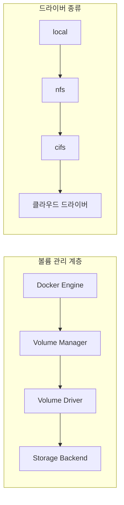
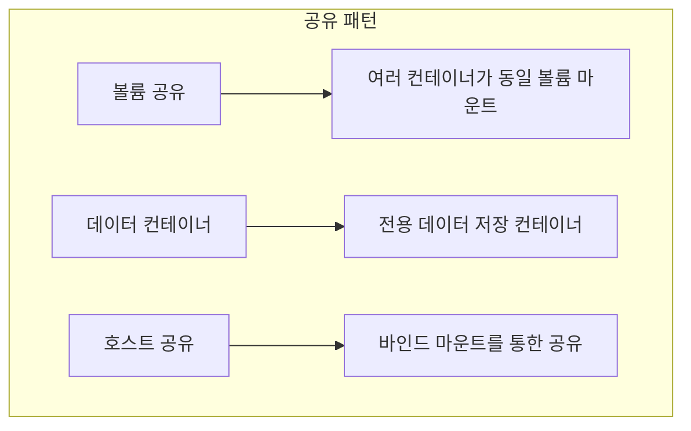
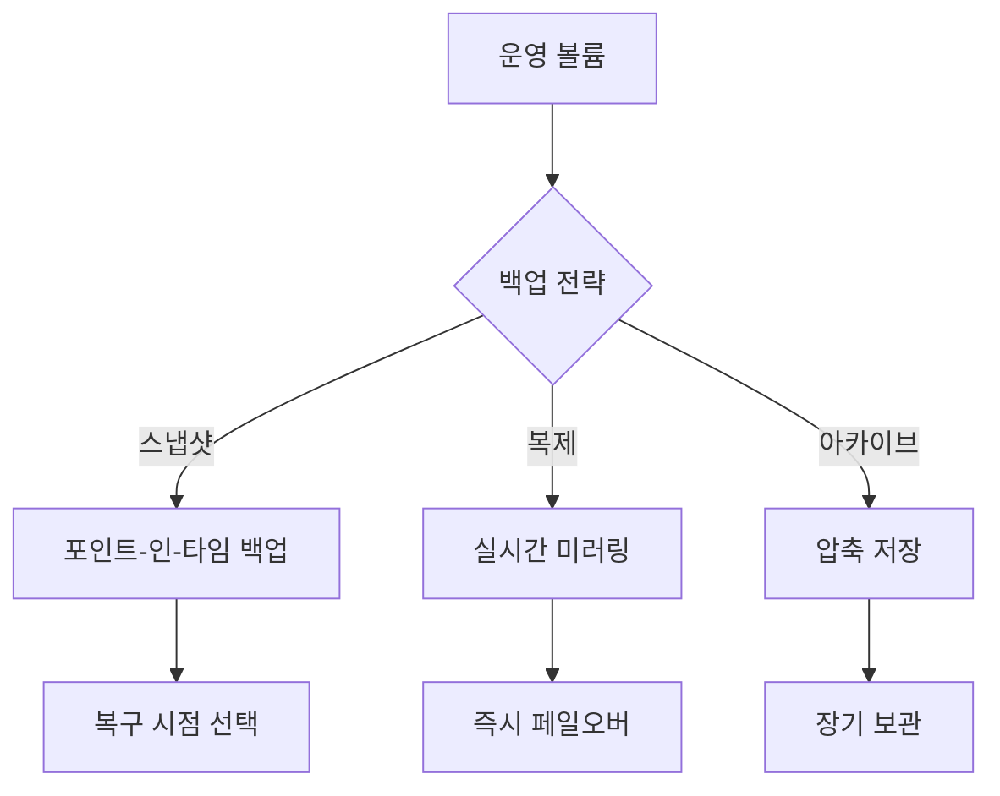

# Session 4: 볼륨과 바인드 마운트 개념

## 📍 교과과정에서의 위치
이 세션은 **Week 1 > Day 5 > Session 4**로, Docker의 데이터 영속성 모델과 스토리지 패턴을 이론적으로 학습합니다. 컨테이너의 임시적 특성과 데이터 영속성의 균형점을 이해합니다.

## 학습 목표 (5분)
- **데이터 영속성** 모델과 **스토리지 패턴** 이해
- **볼륨 드라이버**와 **플러그인** 아키텍처 학습
- **데이터 백업**과 **마이그레이션** 전략 파악

## 1. 데이터 영속성 모델 (15분)

### Docker 스토리지 옵션



### 스토리지 패턴 분류
```
데이터 영속성 패턴:

1. 임시 데이터 (Ephemeral)
   🔹 컨테이너 내부 파일시스템
   🔹 컨테이너 삭제 시 소멸
   🔹 캐시, 임시 파일 등

2. 영속 데이터 (Persistent)
   🔹 Docker 볼륨
   🔹 컨테이너 독립적 생명주기
   🔹 데이터베이스, 로그 등

3. 공유 데이터 (Shared)
   🔹 바인드 마운트
   🔹 호스트-컨테이너 공유
   🔹 설정 파일, 소스 코드 등

4. 메모리 데이터 (In-Memory)
   🔹 tmpfs 마운트
   🔹 고성능 임시 저장
   🔹 세션 데이터, 캐시 등
```

## 2. 볼륨 드라이버 아키텍처 (15분)

### 볼륨 플러그인 시스템



### 볼륨 라이프사이클
```
볼륨 생명주기:

생성 단계:
   🔹 볼륨 정의 (이름, 드라이버, 옵션)
   🔹 드라이버별 초기화
   🔹 메타데이터 저장

사용 단계:
   🔹 컨테이너 마운트
   🔹 데이터 읽기/쓰기
   🔹 다중 컨테이너 공유

관리 단계:
   🔹 백업 및 스냅샷
   🔹 크기 모니터링
   🔹 성능 최적화

정리 단계:
   🔹 컨테이너 언마운트
   🔹 참조 카운트 관리
   🔹 자동/수동 삭제
```

## 3. 데이터 공유 메커니즘 (10분)

### 컨테이너 간 데이터 공유 패턴



### 동기화 전략
```
데이터 동기화 방법:

읽기 전용 공유:
   🔹 설정 파일 배포
   🔹 정적 리소스 공유
   🔹 참조 데이터 제공

읽기-쓰기 공유:
   🔹 파일 잠금 메커니즘
   🔹 애플리케이션 레벨 동기화
   🔹 데이터베이스 클러스터링

비동기 동기화:
   🔹 이벤트 기반 복제
   🔹 배치 동기화
   🔹 메시지 큐 활용

실시간 동기화:
   🔹 분산 파일시스템
   🔹 클러스터 스토리지
   🔹 네트워크 스토리지
```

## 4. 백업과 마이그레이션 전략 (10분)

### 데이터 백업 아키텍처



### 마이그레이션 방법론
```
데이터 마이그레이션 전략:

호스트 간 이동:
   🔹 볼륨 백업 → 복원
   🔹 네트워크 복사 (rsync, scp)
   🔹 클라우드 스토리지 경유

클러스터 간 이동:
   🔹 분산 스토리지 활용
   🔹 오케스트레이션 도구 사용
   🔹 서비스 메시 통합

클라우드 마이그레이션:
   🔹 클라우드 네이티브 스토리지
   🔹 하이브리드 스토리지
   🔹 멀티 클라우드 전략

제로 다운타임 마이그레이션:
   🔹 실시간 복제
   🔹 트래픽 라우팅
   🔹 점진적 전환
```

## 5. 그룹 토론: 데이터 영속성과 컨테이너 철학 (10분)

### 토론 주제
**"데이터 영속성과 컨테이너의 '불변성' 철학 사이의 균형점은 어디인가?"**

### 토론 가이드라인

#### 철학적 관점 (3분)
- **컨테이너 불변성**: 상태 없는 설계
- **데이터 영속성**: 비즈니스 요구사항
- **균형점**: 상태와 로직의 분리

#### 실무적 접근 (4분)
- **12-Factor App**: 상태 외부화
- **마이크로서비스**: 데이터 소유권
- **클라우드 네이티브**: 관리형 서비스 활용

#### 미래 방향성 (3분)
- **서버리스**: 완전한 상태 분리
- **엣지 컴퓨팅**: 분산 데이터 관리
- **AI/ML**: 모델과 데이터의 분리

## 💡 핵심 키워드
- **데이터 영속성**: 볼륨, 바인드 마운트, tmpfs
- **볼륨 드라이버**: 플러그인 시스템, 라이프사이클 관리
- **공유 메커니즘**: 동기화, 잠금, 분산 스토리지
- **백업 전략**: 스냅샷, 복제, 마이그레이션

## 📚 참고 자료
- [Docker Volumes](https://docs.docker.com/storage/volumes/)
- [Bind Mounts](https://docs.docker.com/storage/bind-mounts/)
- [Volume Plugins](https://docs.docker.com/engine/extend/plugins_volume/)

## 다음 세션 준비
다음 세션에서는 **Docker 보안 아키텍처**에 대해 학습합니다. 컨테이너 보안 모델과 격리 메커니즘을 이해할 예정입니다.
