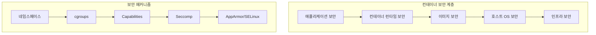
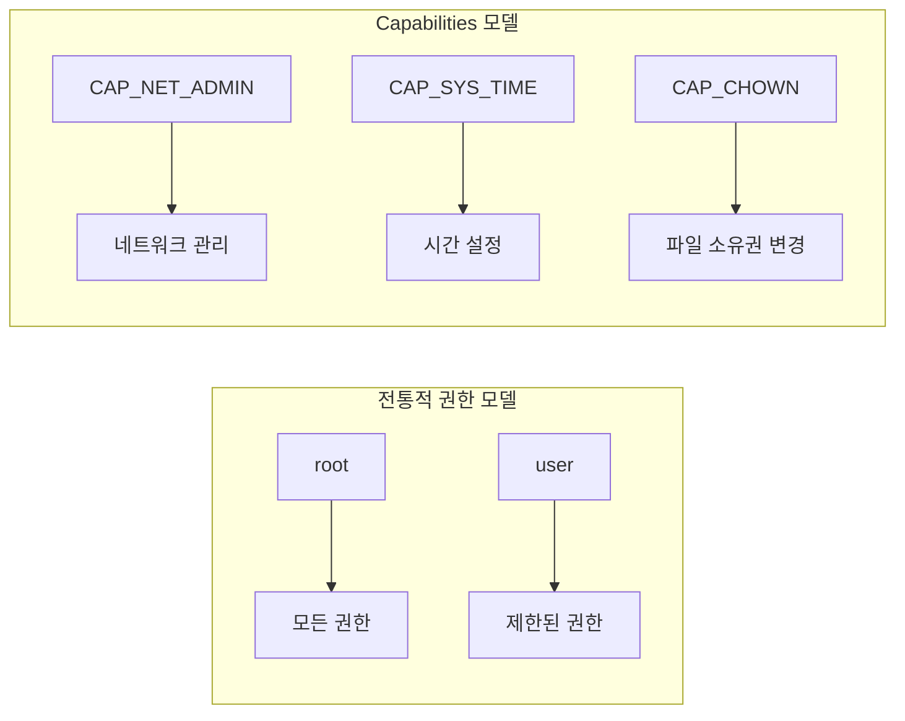
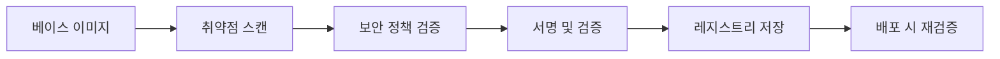
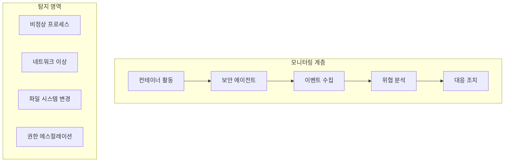

# Session 5: Docker 보안 아키텍처

## 📍 교과과정에서의 위치
이 세션은 **Week 1 > Day 5 > Session 5**로, Docker의 보안 아키텍처와 격리 메커니즘을 이론적으로 학습합니다. 컨테이너 보안 모델과 위험 관리 방안을 이해합니다.

## 학습 목표 (5분)
- **컨테이너 보안 모델**과 **격리 메커니즘** 이해
- **네임스페이스와 cgroups** 보안 활용 학습
- **보안 정책**과 **접근 제어** 프레임워크 파악

## 1. 컨테이너 보안 모델 (15분)

### 다층 보안 아키텍처



### 보안 경계와 격리
```
보안 격리 계층:

프로세스 격리:
├── PID 네임스페이스
│   ├── 독립적인 프로세스 트리
│   ├── 호스트 프로세스 은닉
│   └── 컨테이너 간 프로세스 격리
├── 사용자 네임스페이스
│   ├── UID/GID 매핑
│   ├── 권한 격리
│   └── 루트 권한 제한
└── 마운트 네임스페이스
    ├── 파일시스템 격리
    ├── 독립적인 마운트 포인트
    └── 호스트 파일시스템 보호

네트워크 격리:
├── 네트워크 네임스페이스
├── 독립적인 네트워크 스택
└── 트래픽 격리 및 제어

리소스 격리:
├── cgroups 제한
├── CPU, 메모리, I/O 제한
└── 리소스 고갈 공격 방지
```

## 2. 권한 관리와 접근 제어 (15분)

### Linux Capabilities 모델



### 보안 프로파일 적용
```
보안 강화 메커니즘:

Seccomp (Secure Computing):
├── 시스템 콜 필터링
├── 허용된 시스템 콜만 실행
├── 공격 표면 축소
└── 기본 프로파일 제공

AppArmor/SELinux:
├── 강제 접근 제어 (MAC)
├── 프로파일 기반 정책
├── 파일 시스템 접근 제어
└── 네트워크 접근 제어

사용자 네임스페이스:
├── 비특권 컨테이너 실행
├── 루트 권한 매핑
├── 호스트 보안 강화
└── 권한 에스컬레이션 방지

읽기 전용 루트 파일시스템:
├── 런타임 변경 방지
├── 악성 코드 설치 차단
├── 불변 인프라 구현
└── 컴플라이언스 준수
```

## 3. 이미지 보안과 취약점 관리 (10분)

### 이미지 보안 파이프라인



### 취약점 관리 전략
```
이미지 보안 관리:

빌드 시점 보안:
├── 최소 베이스 이미지 사용
├── 불필요한 패키지 제거
├── 보안 업데이트 적용
└── 시크릿 정보 제외

스캔 및 분석:
├── 정적 분석 도구
├── 취약점 데이터베이스 연동
├── 라이선스 검증
└── 악성 코드 탐지

지속적 모니터링:
├── 새로운 취약점 알림
├── 자동 패치 적용
├── 정책 위반 탐지
└── 컴플라이언스 보고

공급망 보안:
├── 이미지 서명 검증
├── 신뢰할 수 있는 레지스트리
├── 빌드 프로세스 보안
└── 의존성 관리
```

## 4. 런타임 보안 모니터링 (10분)

### 보안 모니터링 아키텍처



### 위협 탐지 및 대응
```
런타임 보안 전략:

행동 기반 탐지:
├── 베이스라인 학습
├── 이상 행동 탐지
├── 머신러닝 활용
└── 실시간 분석

네트워크 보안:
├── 트래픽 모니터링
├── 비정상 연결 탐지
├── DPI (Deep Packet Inspection)
└── 네트워크 분할

파일 무결성 모니터링:
├── 중요 파일 감시
├── 변경 사항 추적
├── 백도어 탐지
└── 규정 준수 검증

자동 대응:
├── 컨테이너 격리
├── 네트워크 차단
├── 알림 및 로깅
└── 포렌식 데이터 수집
```

## 5. 그룹 토론: 컨테이너 보안의 핵심 (10분)

### 토론 주제
**"컨테이너 보안에서 가장 중요한 것은 격리인가 모니터링인가?"**

### 토론 가이드라인

#### 격리 중심 접근 (3분)
- **예방적 보안**: 문제 발생 자체를 차단
- **강력한 격리**: 네임스페이스, cgroups 활용
- **최소 권한 원칙**: 필요한 권한만 부여

#### 모니터링 중심 접근 (3분)
- **탐지 및 대응**: 실시간 위협 탐지
- **행동 분석**: 이상 패턴 식별
- **지속적 개선**: 학습을 통한 보안 강화

#### 통합적 접근 (4분)
- **다층 방어**: 격리 + 모니터링 조합
- **제로 트러스트**: 모든 것을 검증
- **DevSecOps**: 보안을 개발 프로세스에 통합

## 💡 핵심 키워드
- **보안 격리**: 네임스페이스, cgroups, capabilities
- **접근 제어**: Seccomp, AppArmor, SELinux
- **이미지 보안**: 취약점 스캔, 서명 검증, 공급망 보안
- **런타임 보안**: 행동 분석, 위협 탐지, 자동 대응

## 📚 참고 자료
- [Docker Security](https://docs.docker.com/engine/security/)
- [Container Security Best Practices](https://kubernetes.io/docs/concepts/security/)
- [NIST Container Security Guide](https://csrc.nist.gov/publications/detail/sp/800-190/final)

## 다음 세션 준비
다음 세션에서는 **컨테이너 오케스트레이션 개념**에 대해 학습합니다. 대규모 컨테이너 관리와 서비스 메시를 이해할 예정입니다.
