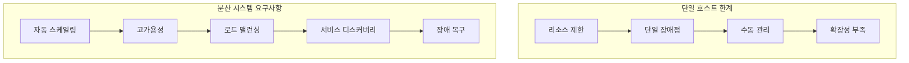
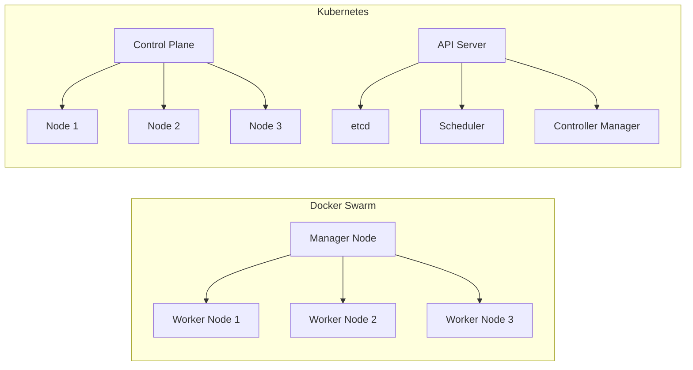
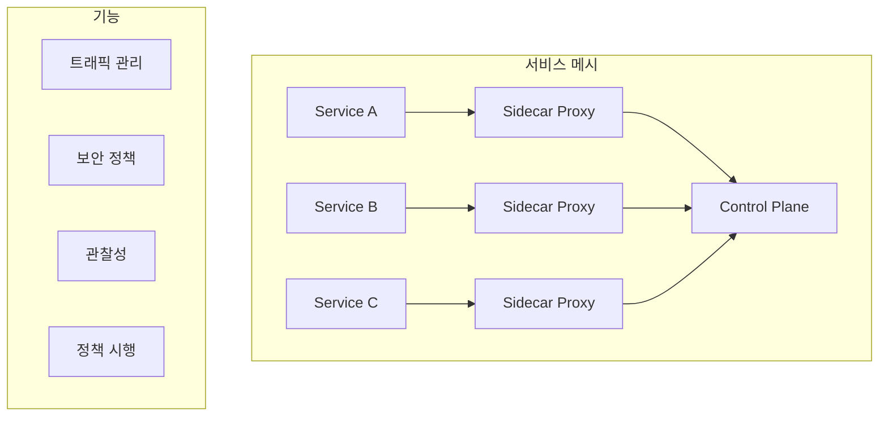
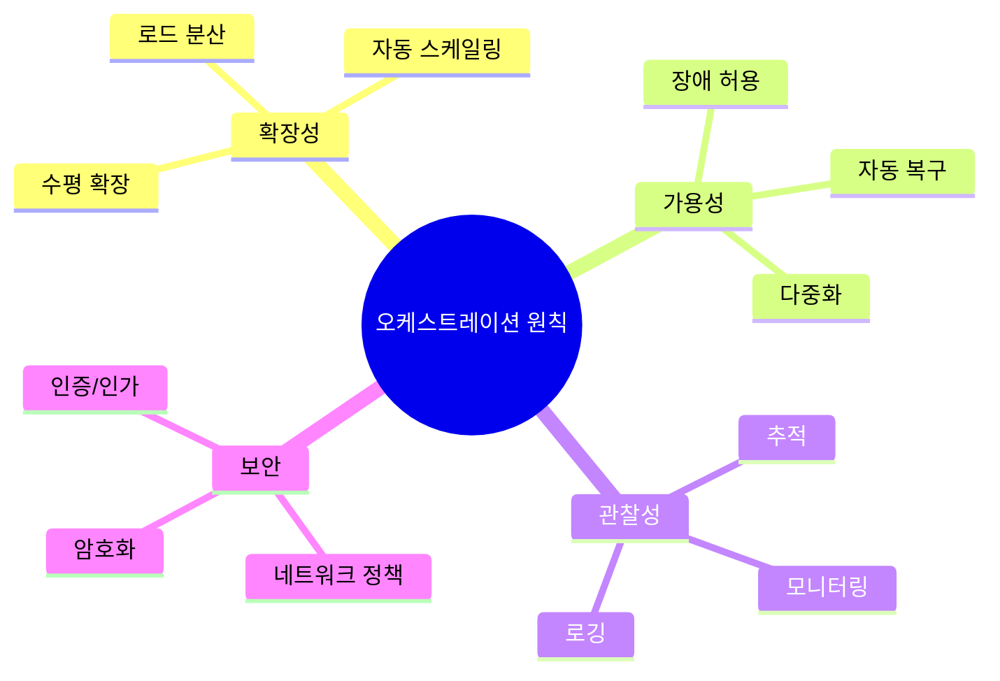

# Session 6: 컨테이너 오케스트레이션 개념

## 📍 교과과정에서의 위치
이 세션은 **Week 1 > Day 5 > Session 6**으로, 대규모 컨테이너 관리 문제와 오케스트레이션 솔루션을 이론적으로 학습합니다. 단일 컨테이너에서 분산 시스템으로의 확장을 이해합니다.

## 학습 목표 (5분)
- **대규모 컨테이너 관리** 문제와 **해결 방안** 이해
- **Docker Swarm**과 **Kubernetes** 아키텍처 비교
- **서비스 메시**와 **마이크로서비스** 패턴 학습

## 1. 대규모 컨테이너 관리 문제 (15분)

### 스케일링 도전과제



### 오케스트레이션 필요성
```
관리 복잡성 증가:

컨테이너 수명주기:
   🔹 자동 배포 및 시작
   🔹 상태 모니터링
   🔹 장애 시 재시작
   🔹 버전 업데이트

리소스 관리:
   🔹 호스트 간 배치 최적화
   🔹 리소스 할당 및 제한
   🔹 용량 계획
   🔹 비용 최적화

네트워크 관리:
   🔹 서비스 간 통신
   🔹 로드 밸런싱
   🔹 트래픽 라우팅
   🔹 보안 정책

데이터 관리:
   🔹 영속 스토리지
   🔹 백업 및 복구
   🔹 데이터 마이그레이션
   🔹 일관성 보장
```

## 2. Docker Swarm vs Kubernetes 비교 (15분)

### 아키텍처 비교



### 특성 비교 매트릭스

| 특성 | Docker Swarm | Kubernetes |
|------|--------------|------------|
| **복잡도** | 낮음 | 높음 |
| **학습 곡선** | 완만 | 가파름 |
| **기능 범위** | 기본적 | 포괄적 |
| **생태계** | 제한적 | 풍부함 |
| **확장성** | 중간 | 높음 |
| **커뮤니티** | 작음 | 매우 큼 |

## 3. 서비스 메시와 마이크로서비스 (10분)

### 서비스 메시 아키텍처



### 마이크로서비스 패턴
```
마이크로서비스 아키텍처:

서비스 분해:
   🔹 비즈니스 기능별 분리
   🔹 독립적 배포 단위
   🔹 기술 스택 자유도
   🔹 팀 자율성

통신 패턴:
   🔹 동기 통신 (HTTP/gRPC)
   🔹 비동기 메시징
   🔹 이벤트 기반 아키텍처
   🔹 서비스 메시 활용

데이터 관리:
   🔹 서비스별 데이터베이스
   🔹 이벤트 소싱
   🔹 CQRS 패턴
   🔹 분산 트랜잭션

운영 패턴:
   🔹 서킷 브레이커
   🔹 벌크헤드 패턴
   🔹 재시도 및 타임아웃
   🔹 카나리 배포
```

## 4. 오케스트레이션 설계 원칙 (10분)

### 분산 시스템 설계 원칙



### 운영 모범 사례
```
오케스트레이션 모범 사례:

선언적 구성:
   🔹 원하는 상태 정의
   🔹 자동 수렴
   🔹 버전 관리
   🔹 재현 가능한 배포

불변 인프라:
   🔹 이미지 기반 배포
   🔹 설정 외부화
   🔹 상태 없는 서비스
   🔹 교체 가능한 인스턴스

점진적 배포:
   🔹 롤링 업데이트
   🔹 블루-그린 배포
   🔹 카나리 배포
   🔹 A/B 테스팅

모니터링 및 관찰성:
   🔹 메트릭 수집
   🔹 로그 집계
   🔹 분산 추적
   🔹 알림 시스템
```

## 5. 그룹 토론: 오케스트레이션 도입 시점 (10분)

### 토론 주제
**"언제 오케스트레이션 도구를 도입해야 하는가?"**

### 토론 가이드라인

#### 도입 신호 (3분)
- **컨테이너 수 증가**: 수동 관리의 한계
- **다중 호스트**: 분산 환경 필요성
- **고가용성 요구**: 장애 허용 시스템

#### 조직 준비도 (4분)
- **기술적 역량**: 학습 곡선 고려
- **운영 복잡도**: 관리 오버헤드
- **비즈니스 요구**: ROI 분석

#### 단계적 접근 (3분)
- **1단계**: Docker Compose (개발/테스트)
- **2단계**: Docker Swarm (간단한 운영)
- **3단계**: Kubernetes (엔터프라이즈)

## 💡 핵심 키워드
- **오케스트레이션**: 자동화, 스케일링, 고가용성
- **분산 시스템**: 서비스 디스커버리, 로드 밸런싱, 장애 복구
- **서비스 메시**: 사이드카 패턴, 트래픽 관리, 관찰성
- **설계 원칙**: 선언적 구성, 불변 인프라, 점진적 배포

## 📚 참고 자료
- [Docker Swarm](https://docs.docker.com/engine/swarm/)
- [Kubernetes Concepts](https://kubernetes.io/docs/concepts/)
- [Service Mesh Patterns](https://www.oreilly.com/library/view/istio-up-and/9781492043775/)

## 다음 세션 준비
다음 세션에서는 **Week 1 전체 개념 종합**을 진행합니다. DevOps부터 오케스트레이션까지의 전체 여정을 정리할 예정입니다.
