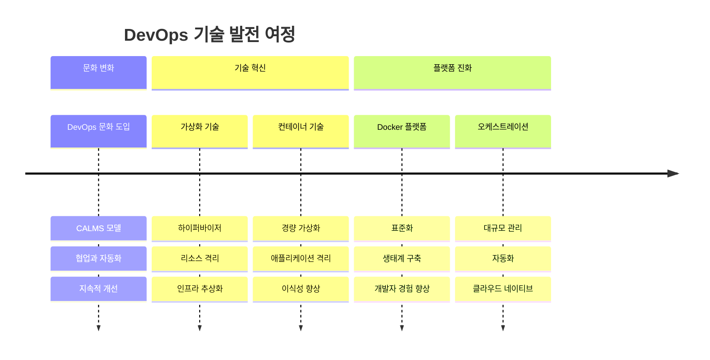
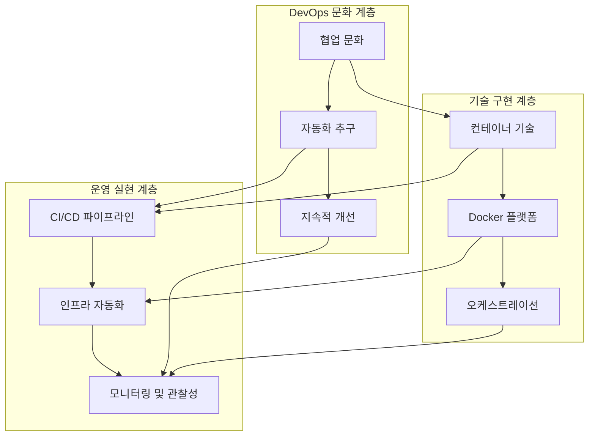
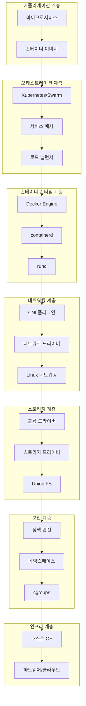
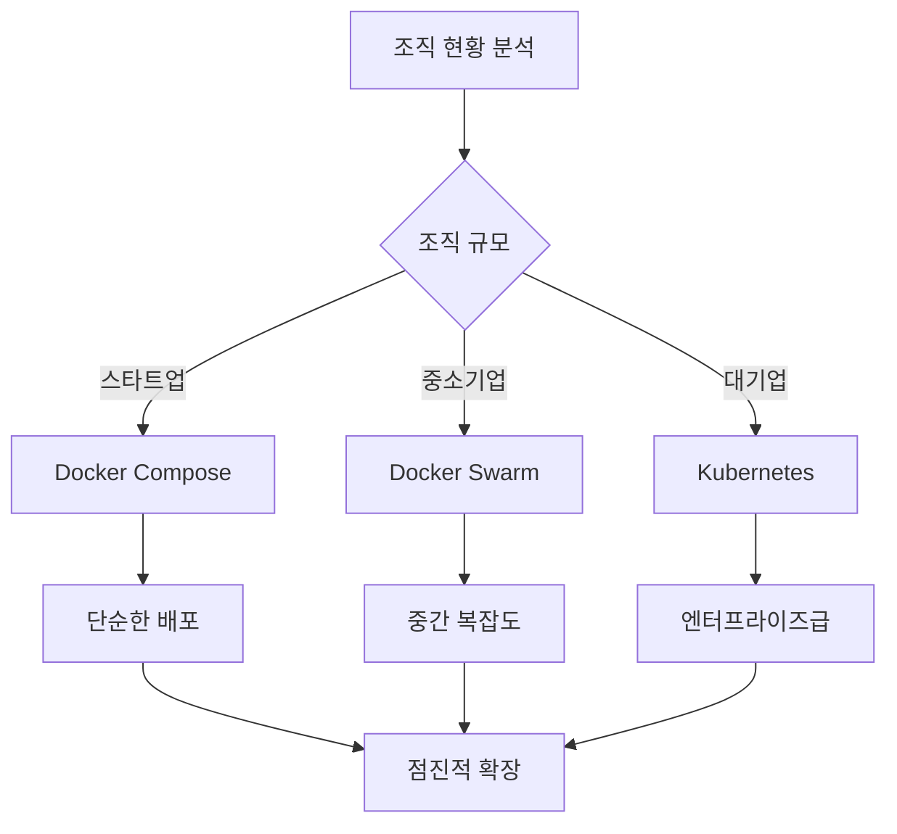
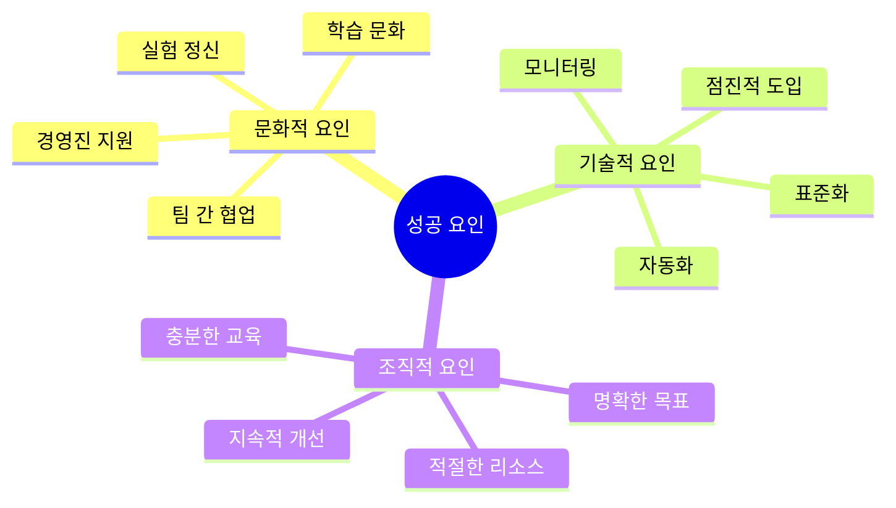

# Session 7: Week 1 전체 개념 종합

## 📍 교과과정에서의 위치
이 세션은 **Week 1 > Day 5 > Session 7**로, Week 1에서 학습한 모든 개념을 통합적으로 정리합니다. DevOps부터 컨테이너 오케스트레이션까지의 전체 여정을 연결하고 실무 적용 관점에서 종합합니다.

## 학습 목표 (5분)
- **DevOps부터 Docker까지** 전체 개념 연결
- **컨테이너 기술 스택** 전체 아키텍처 이해
- **실무 적용** 시나리오와 **모범 사례** 학습

## 1. DevOps to Container 여정 (15분)

### 기술 발전 로드맵



### 개념 간 상호 연관성



## 2. 컨테이너 기술 스택 전체 아키텍처 (15분)

### 통합 아키텍처 뷰



### 기술 스택 매트릭스
```
컨테이너 기술 스택 구성:

개발 단계:
├── DevOps 문화 → 협업과 자동화
├── 컨테이너 설계 → 12-Factor App
├── 이미지 빌드 → Dockerfile 최적화
└── 테스트 자동화 → CI/CD 통합

배포 단계:
├── 이미지 관리 → 레지스트리 전략
├── 오케스트레이션 → 선언적 배포
├── 네트워킹 → 서비스 메시
└── 스토리지 → 데이터 영속성

운영 단계:
├── 모니터링 → 관찰성 구현
├── 보안 → 다층 방어
├── 스케일링 → 자동 확장
└── 장애 대응 → 자동 복구

최적화 단계:
├── 성능 튜닝 → 리소스 최적화
├── 비용 관리 → 효율성 향상
├── 보안 강화 → 지속적 개선
└── 프로세스 개선 → 학습과 적응
```

## 3. 실무 적용 시나리오 (10분)

### 조직별 적용 전략



### 단계별 도입 로드맵
```
실무 도입 단계:

Phase 1: 기초 구축 (1-3개월)
├── DevOps 문화 교육
├── Docker 기본 교육
├── 개발 환경 컨테이너화
└── 기본 CI/CD 구축

Phase 2: 확장 적용 (3-6개월)
├── 테스트 환경 컨테이너화
├── 이미지 관리 체계 구축
├── 모니터링 시스템 도입
└── 보안 정책 수립

Phase 3: 운영 최적화 (6-12개월)
├── 프로덕션 환경 적용
├── 오케스트레이션 도입
├── 자동화 확대
└── 성능 최적화

Phase 4: 고도화 (지속적)
├── 클라우드 네이티브 전환
├── 마이크로서비스 아키텍처
├── 서비스 메시 도입
└── AI/ML 파이프라인 통합
```

## 4. 모범 사례와 안티패턴 (10분)

### 성공 요인 분석



### 주요 안티패턴
```
피해야 할 안티패턴:

기술적 안티패턴:
├── 모놀리식 컨테이너
├── 루트 권한 실행
├── 하드코딩된 설정
└── 상태 저장 컨테이너

운영적 안티패턴:
├── 수동 배포 프로세스
├── 모니터링 부재
├── 백업 전략 없음
└── 보안 정책 미흡

조직적 안티패턴:
├── 일방적 도입 강요
├── 교육 투자 부족
├── 단기 성과 집착
└── 변화 저항 무시

문화적 안티패턴:
├── 사일로 조직 유지
├── 실패에 대한 처벌
├── 혁신 기회 차단
└── 학습 시간 부족
```

## 5. 그룹 토론: DevOps와 컨테이너 기술의 상호 영향 (10분)

### 토론 주제
**"DevOps 문화와 컨테이너 기술이 서로에게 미친 영향은 무엇인가?"**

### 토론 가이드라인

#### DevOps → 컨테이너 기술 (3분)
- **자동화 요구**: 컨테이너 오케스트레이션 발전
- **협업 문화**: 표준화된 개발 환경
- **지속적 배포**: 불변 인프라 패턴

#### 컨테이너 기술 → DevOps (4분)
- **배포 단순화**: CI/CD 파이프라인 혁신
- **환경 일관성**: 개발-운영 간극 해소
- **마이크로서비스**: 팀 자율성 향상

#### 미래 전망 (3분)
- **클라우드 네이티브**: 완전한 통합
- **서버리스**: 새로운 패러다임
- **AI/ML Ops**: 지능형 운영

## 💡 Week 1 핵심 개념 총정리
- **DevOps 문화**: 협업, 자동화, 지속적 개선의 기반
- **컨테이너 기술**: 가상화의 진화, 애플리케이션 중심 사고
- **Docker 플랫폼**: 표준화와 생태계 구축의 핵심
- **통합 아키텍처**: 전체 스택의 유기적 연결

## 📚 참고 자료
- [DevOps Handbook](https://itrevolution.com/the-devops-handbook/)
- [Container Patterns](https://kubernetes.io/blog/2018/03/principles-of-container-app-design/)
- [Cloud Native Patterns](https://www.manning.com/books/cloud-native-patterns)

## 다음 세션 준비
다음 세션에서는 **Week 1 이론 총정리 및 Week 2 준비**를 진행합니다. 실습을 위한 환경 구성과 학습 계획을 수립할 예정입니다.
