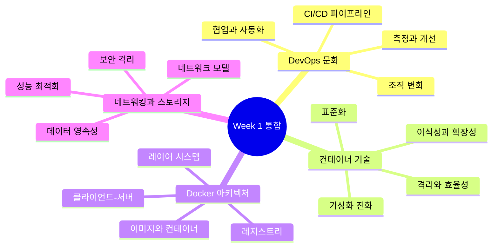
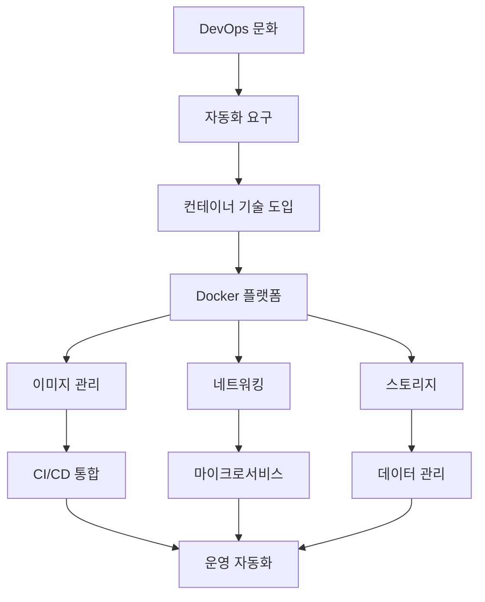

# Session 8: 이론 총정리 및 Week 2 준비

## 📍 교과과정에서의 위치
이 세션은 **Week 1**의 최종 세션으로, 5일간 학습한 모든 이론적 내용을 종합 정리하고 Week 2 실습을 위한 준비를 완료합니다. DevOps부터 Docker까지의 전체 개념을 통합적으로 이해하고 실무 적용을 위한 토대를 마련합니다.

## 학습 목표 (5분)
- **Week 1 전체 개념** 통합적 정리
- **이론과 실습** 연결점 이해
- **Week 2 실습** 준비 완료
- **실무 적용** 시나리오 구상

## 1. Week 1 핵심 개념 통합 정리 (20분)

### DevOps to Docker 개념 연결도



### 개념 간 상호 연관성



### Week 1 학습 성과 체크리스트

```
✅ DevOps 기초 (Day 1)
├── DevOps 정의와 핵심 가치 이해
├── 전통적 개발 vs DevOps 방식 비교
├── CALMS 모델과 조직 변화
└── CI/CD 파이프라인 개념

✅ 컨테이너 기술 이론 (Day 2)
├── 가상화 기술 발전사
├── 컨테이너 vs 가상머신 아키텍처
├── Linux 기반 기술 (네임스페이스, cgroups)
└── 컨테이너 보안 모델

✅ Docker 명령어 체계 (Day 3)
├── CLI 아키텍처와 설계 철학
├── Management Commands 구조
├── 컨테이너 라이프사이클 관리
└── 디버깅 방법론

✅ 이미지 관리 이론 (Day 4)
├── 레이어 시스템과 Union FS
├── Dockerfile 설계 원칙
├── 멀티 스테이지 빌드 패턴
└── 이미지 보안과 최적화

✅ 네트워킹과 아키텍처 (Day 5)
├── 네트워킹 모델과 드라이버
├── 스토리지 아키텍처
├── 보안 프레임워크
└── 오케스트레이션 개념
```

## 2. 이론에서 실습으로의 연결점 (15분)

### Week 2 실습 로드맵

```mermaid
gantt
    title Week 2 실습 계획
    dateFormat  X
    axisFormat %d
    
    section Docker 기초 실습
    환경 구성        :1, 2
    기본 명령어      :2, 3
    이미지 빌드      :3, 4
    
    section 네트워킹 실습
    네트워크 생성    :4, 5
    컨테이너 통신    :5, 6
    
    section 고급 실습
    Docker Compose   :6, 7
    볼륨 관리       :7, 8
    종합 프로젝트    :8, 9
```



### 이론-실습 매핑표

| Week 1 이론 | Week 2 실습 | 연결점 |
|-------------|-------------|--------|
| **DevOps 문화** | CI/CD 파이프라인 구축 | 자동화 실현 |
| **컨테이너 개념** | Docker 설치 및 실행 | 이론의 실제 구현 |
| **CLI 아키텍처** | 명령어 실습 | 구조 이해 → 효율적 사용 |
| **이미지 관리** | Dockerfile 작성 | 설계 원칙 → 실제 구현 |
| **네트워킹 모델** | 네트워크 구성 | 이론 → 실무 적용 |

## 3. 실무 적용 시나리오 (10분)

### 단계별 적용 전략

```
Phase 1: 개발 환경 컨테이너화 (1-2주)
├── 로컬 개발 환경 Docker화
├── 개발팀 Docker 교육
├── 기본 이미지 표준화
└── 개발 워크플로우 정립

Phase 2: CI/CD 파이프라인 구축 (2-4주)
├── 이미지 빌드 자동화
├── 테스트 환경 컨테이너화
├── 레지스트리 구축
└── 배포 파이프라인 구성

Phase 3: 운영 환경 적용 (4-8주)
├── 프로덕션 이미지 최적화
├── 모니터링 시스템 구축
├── 보안 정책 적용
└── 장애 대응 체계 구축

Phase 4: 고도화 (지속적)
├── 오케스트레이션 도입
├── 마이크로서비스 전환
├── 클라우드 네이티브 적용
└── 지속적 최적화
```

## 4. Week 2 실습 환경 준비 (5분)

### 필수 설치 도구 체크리스트

```
🔧 기본 도구:
□ Docker Desktop (최신 버전)
□ Git (버전 관리)
□ VS Code (IDE)
□ 터미널/PowerShell

🌐 계정 준비:
□ Docker Hub 계정
□ GitHub 계정
□ 클라우드 계정 (선택사항)

📁 작업 환경:
□ 실습용 디렉토리 생성
□ Git 저장소 준비
□ 샘플 프로젝트 다운로드

🧪 테스트 실행:
□ docker --version
□ docker run hello-world
□ 기본 명령어 동작 확인
```

## 5. 그룹 토론: Week 2 실습 계획 수립 (15분)

### 토론 주제
**"Week 1에서 학습한 이론 중 Week 2 실습에서 가장 집중하고 싶은 영역은 무엇인가?"**

### 토론 진행 방식

#### 1단계: 개인 우선순위 설정 (3분)
각자 다음 영역 중 관심도 순으로 순위 매기기:
- Docker 기본 명령어 마스터
- Dockerfile 작성 및 최적화
- 네트워킹과 볼륨 관리
- CI/CD 파이프라인 구축
- 보안 및 모니터링

#### 2단계: 그룹 토론 (8분)
- **학습 목표 공유**: 각자의 우선순위와 이유
- **실습 계획 수립**: 그룹별 실습 프로젝트 아이디어
- **협업 방안**: 페어 프로그래밍, 코드 리뷰 등

#### 3단계: 발표 및 피드백 (4분)
- 그룹별 실습 계획 발표 (2분씩)
- 전체 피드백 및 조정

### 실습 프로젝트 아이디어
```
초급 프로젝트:
├── 개인 블로그 컨테이너화
├── 간단한 웹 애플리케이션 배포
└── 개발 환경 Docker화

중급 프로젝트:
├── 3-tier 웹 애플리케이션
├── 마이크로서비스 아키텍처
└── CI/CD 파이프라인 구축

고급 프로젝트:
├── 모니터링 시스템 구축
├── 보안 강화 프로젝트
└── 성능 최적화 프로젝트
```

## 6. Week 1 회고 및 마무리 (5분)

### 학습 성과 점검

**개인 회고 질문:**
1. Week 1에서 가장 인상 깊었던 개념은?
2. 이론 학습에서 어려웠던 부분은?
3. Week 2 실습에 대한 기대와 우려는?
4. 실무에 바로 적용하고 싶은 내용은?

### Week 2 성공을 위한 조언
```
💡 실습 성공 팁:
├── 이론 복습을 게을리하지 말 것
├── 에러를 두려워하지 말고 적극적으로 실험
├── 동료와의 협업과 지식 공유
├── 공식 문서를 참조하는 습관
└── 실무 시나리오를 염두에 둔 학습
```

## 💡 Week 1 핵심 키워드 총정리
- **DevOps 문화**: CALMS, 협업, 자동화, 지속적 개선
- **컨테이너 기술**: 격리, 이식성, 효율성, 표준화
- **Docker 아키텍처**: 클라이언트-서버, 레이어, 레지스트리
- **관리 전략**: 이미지 최적화, 네트워킹, 보안, 오케스트레이션

## 📚 Week 2 준비 자료
- [Docker 공식 튜토리얼](https://docs.docker.com/get-started/)
- [Dockerfile 레퍼런스](https://docs.docker.com/engine/reference/builder/)
- [Docker Compose 가이드](https://docs.docker.com/compose/)
- [실습 예제 저장소](https://github.com/docker/getting-started)

## 🎯 Week 2 학습 목표 미리보기
- Docker 명령어 실무 활용 능력 개발
- 실제 애플리케이션 컨테이너화 경험
- CI/CD 파이프라인 구축 실습
- 팀 프로젝트를 통한 협업 경험

---
**축하합니다! Week 1 이론 과정을 완주하셨습니다. 이제 Week 2에서 실습을 통해 이론을 실제로 구현해보겠습니다!** 🎉
