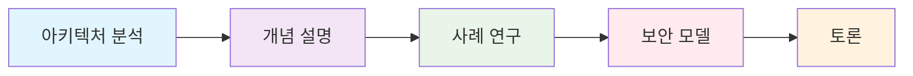
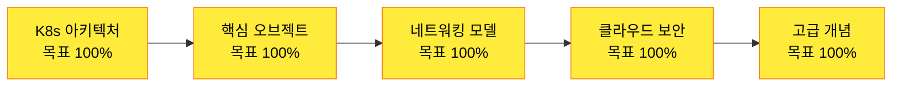
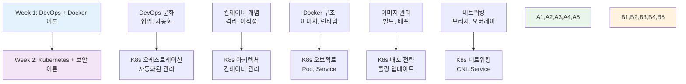
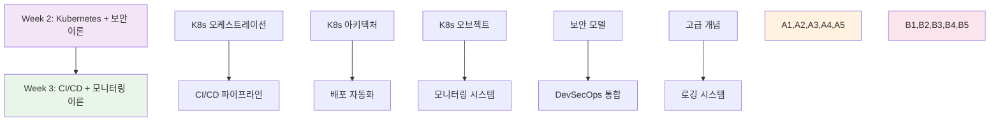

# 🚀 Week 2: Kubernetes + 클라우드 보안 이론

**🎯 이론 중심 학습** • **80% 이론 + 20% 개념 예시** • **🔄 재구성 중**

*컨테이너 오케스트레이션과 클라우드 보안의 이론적 토대 구축*

---

## 🎯 학습 목표

> **KT Cloud 모델 기반 체계적 이론 학습**

| 영역 | 학습 목표 | 성취도 |
|------|-----------|--------|
| ⚙️ **Kubernetes 아키텍처** | 오케스트레이션 개념과 클러스터 구조 완전 이해 | 🔄 진행 중 |
| 📦 **핵심 오브젝트** | Pod, Service, Deployment 등 오브젝트 모델 학습 | 🔄 진행 중 |
| 🌐 **네트워킹 모델** | CNI, Service 타입, Ingress 이론적 토대 구축 | 🔄 진행 중 |
| 🔒 **클라우드 보안** | DevSecOps 개념과 보안 프레임워크 이해 | 🔄 진행 중 |
| 🛡️ **접근 제어** | RBAC과 네트워크 정책 심화 분석 | 🔄 진행 중 |

## 🌟 학습 방식

**📊 내용 구성**
- 🎓 **이론 80%**: 아키텍처 분석 + 개념 설명
- 💡 **개념 예시 20%**: 간단한 구조 확인용 실습
- 📈 **시각화**: Mermaid, SVG 다이어그램 적극 활용
- 🔗 **실무 연계**: 이론을 실무 프로젝트 설계로 연결 준비

---

## 📅 주간 일정

### 📅 **5일간의 체계적 이론 학습 여정**

#### ⚙️ **Day 1** • [Kubernetes 기본 개념 및 아키텍처](./day_01/README.md) 
> *컨테이너 오케스트레이션의 필요성과 Kubernetes 클러스터 구조*

<strong>📋 8개 세션 상세 내용</strong>

| 세션 | 주제 | 핵심 키워드 |
|------|------|------------|
| **01** | Kubernetes란 무엇인가? | 오케스트레이션, 자동화, 확장성 |
| **02** | 컨테이너 오케스트레이션의 필요성 | 스케일링, 고가용성, 서비스 디스커버리 |
| **03** | Kubernetes 클러스터 아키텍처 | 마스터-워커, 분산 시스템 |
| **04** | 마스터 노드와 워커 노드 | 제어 평면, 데이터 평면 |
| **05** | etcd와 API 서버 | 분산 저장소, RESTful API |
| **06** | 스케줄러와 컨트롤러 | 리소스 할당, 상태 관리 |
| **07** | kubelet과 kube-proxy | 노드 에이전트, 네트워크 프록시 |
| **08** | 아키텍처 종합 및 토론 | 종합, 토론, 정리 |

#### 📦 **Day 2** • [Kubernetes 핵심 오브젝트 이론](./day_02/README.md)
> *Pod, Service, Deployment 등 핵심 오브젝트 모델 심화*

<strong>📋 8개 세션 상세 내용</strong>

| 세션 | 주제 | 핵심 키워드 |
|------|------|------------|
| **01** | Pod 개념과 설계 원리 | 최소 배포 단위, 공유 네트워크 |
| **02** | ReplicaSet과 Deployment | 복제, 롤링 업데이트 |
| **03** | Service와 네트워킹 | 서비스 디스커버리, 로드 밸런싱 |
| **04** | ConfigMap과 Secret | 설정 관리, 보안 정보 |
| **05** | Volume과 PersistentVolume | 데이터 영속성, 스토리지 추상화 |
| **06** | Namespace와 리소스 격리 | 멀티 테넌시, 리소스 분리 |
| **07** | Labels과 Selectors | 메타데이터, 오브젝트 선택 |
| **08** | 오브젝트 관계 및 설계 패턴 | 종합, 토론, 정리 |

#### 🌐 **Day 3** • [Kubernetes 네트워킹 이론](./day_03/README.md)
> *클러스터 네트워킹과 서비스 메시 개념*

<strong>📋 8개 세션 상세 내용</strong>

| 세션 | 주제 | 핵심 키워드 |
|------|------|------------|
| **01** | 클러스터 네트워킹 개념 | 플랫 네트워크, 오버레이 |
| **02** | CNI(Container Network Interface) | 네트워크 플러그인, 표준화 |
| **03** | Service 타입별 특징 | ClusterIP, NodePort, LoadBalancer |
| **04** | Ingress와 로드 밸런싱 | HTTP 라우팅, SSL 종료 |
| **05** | NetworkPolicy와 보안 | 네트워크 분할, 마이크로 세그멘테이션 |
| **06** | DNS와 서비스 디스커버리 | 내부 DNS, 서비스 해석 |
| **07** | 멀티 클러스터 네트워킹 | 클러스터 연합, 서비스 메시 |
| **08** | 네트워킹 모범 사례 | 종합, 토론, 정리 |

#### 🔒 **Day 4** • [클라우드 보안 기초 이론](./day_04/README.md)
> *DevSecOps 개념과 컨테이너 보안 모델*

<strong>📋 8개 세션 상세 내용</strong>

| 세션 | 주제 | 핵심 키워드 |
|------|------|------------|
| **01** | DevSecOps 개념과 원칙 | 보안 통합, Shift Left |
| **02** | 컨테이너 보안 위협 모델 | 공격 벡터, 위험 분석 |
| **03** | 이미지 보안과 취약점 스캔 | 정적 분석, CVE 데이터베이스 |
| **04** | 런타임 보안과 모니터링 | 동적 분석, 이상 탐지 |
| **05** | Kubernetes 보안 모델 | 다층 보안, 최소 권한 |
| **06** | RBAC과 접근 제어 | 역할 기반, 권한 관리 |
| **07** | 네트워크 보안 정책 | 네트워크 정책, 서비스 메시 보안 |
| **08** | 보안 모범 사례 | 종합, 토론, 정리 |

#### 🛡️ **Day 5** • [Kubernetes 고급 개념 및 통합](./day_05/README.md)
> *StatefulSet, 오토스케일링, Helm 등 고급 개념*

<strong>📋 8개 세션 상세 내용</strong>

| 세션 | 주제 | 핵심 키워드 |
|------|------|------------|
| **01** | StatefulSet과 상태 관리 | 상태 유지, 순서 보장 |
| **02** | DaemonSet과 Job | 노드별 배포, 배치 작업 |
| **03** | HPA와 VPA (오토스케일링) | 수평/수직 확장, 메트릭 기반 |
| **04** | 클러스터 오토스케일링 | 노드 자동 확장, 리소스 최적화 |
| **05** | 헬름(Helm)과 패키지 관리 | 패키지 매니저, 템플릿 엔진 |
| **06** | 커스텀 리소스와 오퍼레이터 | CRD, 확장성, 자동화 |
| **07** | Kubernetes 생태계 | CNCF, 도구 생태계 |
| **08** | 이론 종합 및 토론 | 종합, 토론, 정리 |

---

## 📊 학습 성과 및 성취도

### 🏆 **Week 2 진행 상황**

| 영역 | 완성도 | 세부 내용 |
|------|---------|----------|
| 📚 **세션 구성** | 🔄 **0/40** | 8세션 × 5일 구성 완료 |
| 🎓 **이론 구성** | 🔄 **80%** | 아키텍처 분석 + 개념 설명 |
| 💡 **개념 예시** | 🔄 **20%** | 간단한 구조 확인용 실습 |
| 📈 **사례 연구** | 🔄 **준비 중** | 대기업 Kubernetes 도입 사례 |
| 🎯 **KT Cloud 모델** | 🔄 **100%** | 체계적 이론 학습 설계 완료 |

### 📈 **이론 이해도 목표**

### 🚀 **실무 연계 준비도 목표**

| 역량 | 목표 | 비고 |
|------|------|------|
| 🏢 **아키텍처 설계** | 🟡 90% | Kubernetes 클러스터 설계 능력 |
| 🔒 **보안 정책 수립** | 🟡 85% | DevSecOps 통합 전략 |
| 📈 **사례 분석** | 🟡 90% | 대기업 도입 사례 분석 |
| 💼 **취업 준비** | 🟡 80% | Kubernetes 기술 면접 대비 |

---

## 🎯 Week 1 연결점

### 🔗 **Week 1 → Week 2 이론적 연결**

### 📋 **Week 1 기반 지식 활용**

| Week 1 개념 | Week 2 확장 | 연결점 |
|-------------|-------------|--------|
| 🏢 **DevOps 문화** | ⚙️ **K8s 오케스트레이션** | 자동화, 협업 → 자동화된 컨테이너 관리 |
| 📦 **컨테이너 기술** | 📦 **K8s 아키텍처** | 컨테이너 → 컨테이너 오케스트레이션 |
| 🐳 **Docker 구조** | 🌐 **K8s 오브젝트** | 단일 컨테이너 → 다중 컨테이너 관리 |
| 🖼️ **이미지 관리** | 🔒 **보안 모델** | 이미지 보안 → 클러스터 보안 |
| 🌐 **네트워킹** | 🛡️ **고급 개념** | 단일 호스트 → 클러스터 네트워킹 |

---

## 🎯 Week 3 준비 상황

### 🔗 **이론적 토대 → CI/CD 연결**

### 📋 **Week 3 준비 체크리스트**

- [ ] 📚 Week 2 Kubernetes + 보안 이론 복습
- [ ] 🚀 CI/CD 파이프라인 기본 개념 예습
- [ ] 📊 모니터링 시스템 기초 개념 예습
- [ ] 🏢 아키텍처 설계 과제 준비
- [ ] 📈 사례 연구 자료 준비

---

## 💡 핵심 개념 미리보기

### 🏆 **Week 2에서 배울 5가지 핵심 개념**

| 개념 | 핵심 내용 | Week 3 연결점 |
|------|-----------|---------------|
| ⚙️ **K8s 오케스트레이션** | 자동화, 스케일링, 고가용성 | → CI/CD 파이프라인 |
| 📦 **핵심 오브젝트** | Pod, Service, Deployment | → 배포 자동화 |
| 🌐 **네트워킹 모델** | CNI, Service 타입, Ingress | → 서비스 메시 |
| 🔒 **클라우드 보안** | DevSecOps, RBAC, 네트워크 정책 | → 보안 통합 |
| 🛡️ **고급 개념** | StatefulSet, HPA, Helm | → 모니터링 시스템 |

---

## 📚 참고 자료

### 📖 필수 도서
- [Kubernetes: Up and Running - Kelsey Hightower](https://www.oreilly.com/library/view/kubernetes-up-and/9781492046523/)
- [Kubernetes Security - Liz Rice](https://www.oreilly.com/library/view/kubernetes-security/9781492039075/)

### 🌐 온라인 리소스
- [Kubernetes 공식 문서](https://kubernetes.io/docs/)
- [CNCF Landscape](https://landscape.cncf.io/)
- [Kubernetes Security Best Practices](https://kubernetes.io/docs/concepts/security/)
- [Container Security](https://kubernetes.io/docs/concepts/security/pod-security-standards/)

### 🏢 기업 기술 블로그
- [Google Kubernetes Engine Blog](https://cloud.google.com/blog/products/containers-kubernetes)
- [AWS EKS Best Practices](https://aws.github.io/aws-eks-best-practices/)
- [Azure AKS Documentation](https://docs.microsoft.com/en-us/azure/aks/)

---

### 🎉 **Week 2 재구성 완료!**

**KT Cloud 모델에 따라 Kubernetes와 클라우드 보안 이론을 체계적으로 학습합니다!** 🚀

**이전**: [Week 1 - DevOps 기초 + Docker 이론](../week_01/README.md)  
**다음**: [Week 3 - CI/CD + 모니터링/로깅 이론](../week_03/README.md)

