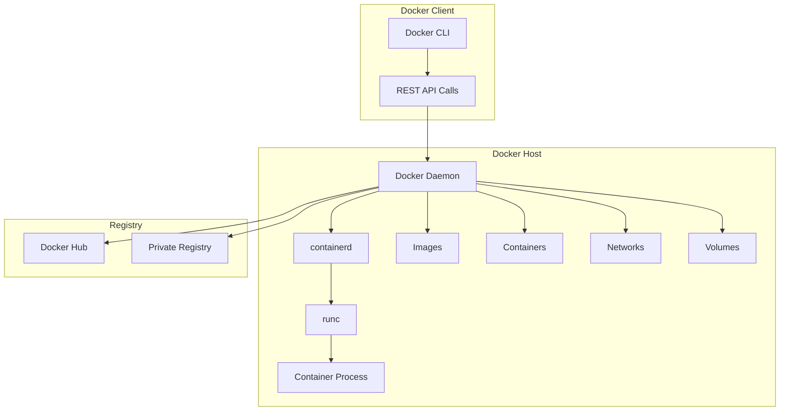
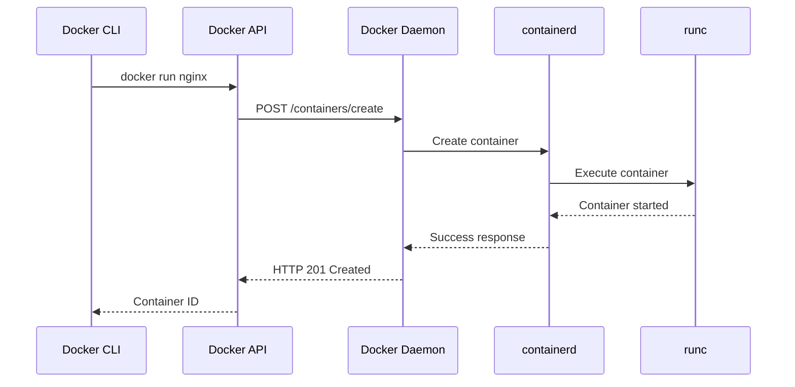

# Session 1: Docker Engine 아키텍처 심화 분석

## 📍 교과과정에서의 위치
이 세션은 **Week 2 > Day 1 > Session 1**로, Week 1에서 학습한 Docker 기본 개념을 바탕으로 Docker Engine의 내부 아키텍처를 심화 분석합니다.

## 학습 목표 (5분)
- **Docker Engine** 내부 구조와 **컴포넌트** 완전 이해
- **Client-Server 아키텍처** 및 **API 통신** 방식 분석
- **Docker Daemon** 역할과 **프로세스 관리** 메커니즘

## 1. 이론: Docker Engine 전체 아키텍처 (20분)

### Docker Engine 구성 요소



### 핵심 컴포넌트 분석

#### Docker Daemon (dockerd)
```
Docker Daemon 역할:
├── REST API 서버 역할
├── 이미지 관리 (빌드, 태그, 푸시/풀)
├── 컨테이너 라이프사이클 관리
├── 네트워크 및 볼륨 관리
├── 보안 및 권한 제어
└── 플러그인 시스템 관리

통신 방식:
├── Unix Socket: /var/run/docker.sock
├── TCP Socket: 2376 (TLS), 2375 (비보안)
├── Named Pipe: Windows 환경
└── REST API: HTTP/HTTPS 프로토콜
```

#### containerd
```
containerd 특징:
├── 컨테이너 런타임 관리
├── 이미지 전송 및 저장
├── 컨테이너 실행 및 감독
├── 네트워크 인터페이스 관리
└── OCI 표준 준수

아키텍처:
├── gRPC API 제공
├── 플러그인 아키텍처
├── CRI (Container Runtime Interface) 지원
└── Kubernetes와 직접 통합 가능
```

#### runc
```
runc 역할:
├── OCI Runtime Specification 구현
├── 컨테이너 프로세스 실제 실행
├── 네임스페이스 및 cgroups 설정
├── 보안 컨텍스트 적용
└── 컨테이너 격리 보장

기술적 특징:
├── Go 언어로 구현
├── libcontainer 라이브러리 사용
├── 경량화된 바이너리
└── 표준 준수로 호환성 보장
```

## 2. 이론: Docker API 및 통신 메커니즘 (15분)

### REST API 구조 분석

```
Docker Engine API v1.41:

컨테이너 관리:
├── POST /containers/create
├── POST /containers/{id}/start
├── POST /containers/{id}/stop
├── GET /containers/json
└── DELETE /containers/{id}

이미지 관리:
├── GET /images/json
├── POST /images/create
├── POST /build
├── DELETE /images/{name}
└── POST /images/{name}/push

시스템 정보:
├── GET /info
├── GET /version
├── GET /events
└── GET /_ping
```

### 클라이언트-서버 통신 흐름



## 3. 이론: 프로세스 격리 및 보안 모델 (10분)

### Linux 네임스페이스 활용

```
네임스페이스 종류:

PID Namespace:
├── 프로세스 ID 격리
├── 컨테이너 내부에서 PID 1부터 시작
├── 호스트 프로세스와 완전 분리
└── 프로세스 트리 격리

Network Namespace:
├── 네트워크 인터페이스 격리
├── IP 주소 및 라우팅 테이블 분리
├── 포트 번호 공간 격리
└── 방화벽 규칙 독립성

Mount Namespace:
├── 파일시스템 마운트 포인트 격리
├── 루트 파일시스템 변경 가능
├── 볼륨 마운트 독립성
└── 파일시스템 보안 강화

UTS Namespace:
├── 호스트명 및 도메인명 격리
├── 컨테이너별 독립적 식별
└── 네트워크 식별자 분리

IPC Namespace:
├── 프로세스 간 통신 격리
├── 공유 메모리 세그먼트 분리
├── 세마포어 및 메시지 큐 격리
└── 시스템 V IPC 객체 분리

User Namespace:
├── 사용자 및 그룹 ID 매핑
├── 권한 격리 및 보안 강화
├── 루트 권한 제한
└── 호스트 시스템 보호
```

### cgroups 리소스 제어

```
Control Groups (cgroups) 기능:

CPU 제어:
├── CPU 사용률 제한
├── CPU 가중치 설정
├── CPU 코어 할당
└── 실시간 스케줄링

메모리 제어:
├── 메모리 사용량 제한
├── 스왑 메모리 제어
├── OOM (Out of Memory) 관리
└── 메모리 통계 수집

블록 I/O 제어:
├── 디스크 읽기/쓰기 제한
├── IOPS 제한
├── 대역폭 제어
└── I/O 우선순위 설정

네트워크 제어:
├── 네트워크 대역폭 제한
├── 패킷 우선순위 설정
├── 트래픽 셰이핑
└── QoS 정책 적용
```

## 4. 개념 예시: 아키텍처 분석 (7분)

### Docker 시스템 정보 분석 예시

```bash
# Docker 시스템 정보 확인 (개념 예시)
docker system info

# 예상 출력 분석:
# Server Version: 20.10.21
# Storage Driver: overlay2
# Logging Driver: json-file
# Cgroup Driver: cgroupfs
# Plugins:
#  Volume: local
#  Network: bridge host ipvlan macvlan null overlay
#  Log: awslogs fluentd gcplogs gelf journald json-file local
```

### 프로세스 구조 분석 예시

```bash
# Docker 관련 프로세스 확인 (개념 예시)
ps aux | grep docker

# 예상 프로세스 구조:
# dockerd (Docker Daemon)
# ├── containerd (Container Runtime)
# │   ├── containerd-shim (Container Shim)
# │   │   └── runc (OCI Runtime)
# │   │       └── nginx (Container Process)
# └── docker-proxy (Port Forwarding)
```

## 5. 토론 및 정리 (3분)

### 핵심 개념 정리
- Docker Engine은 **모듈러 아키텍처**로 구성
- **containerd**와 **runc**의 분리로 표준화 달성
- **네임스페이스**와 **cgroups**를 통한 완전한 격리
- **REST API**를 통한 표준화된 인터페이스 제공

### 토론 주제
"Docker Engine의 모듈러 아키텍처가 가져다주는 장점과 Kubernetes 생태계에서의 의미는 무엇인가?"

## 💡 핵심 키워드
- **Docker Engine**: dockerd, containerd, runc
- **아키텍처**: Client-Server, REST API, 모듈러 설계
- **격리 기술**: Namespace, cgroups, 보안 모델
- **표준화**: OCI, CRI, 호환성

## 📚 참고 자료
- [Docker Engine 아키텍처](https://docs.docker.com/get-started/overview/)
- [containerd 아키텍처](https://containerd.io/docs/)
- [OCI Runtime Specification](https://github.com/opencontainers/runtime-spec)
