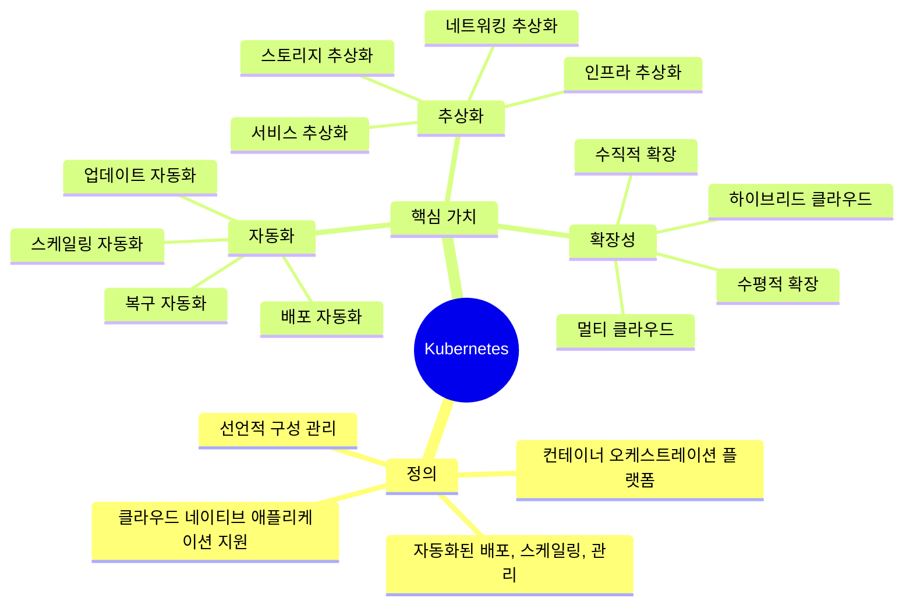
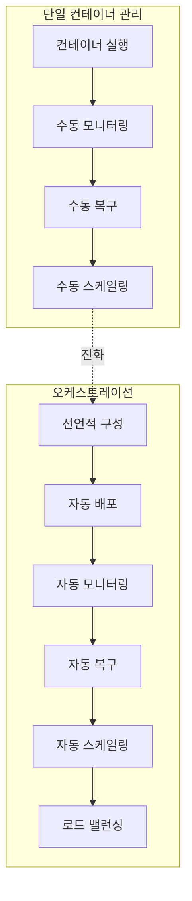
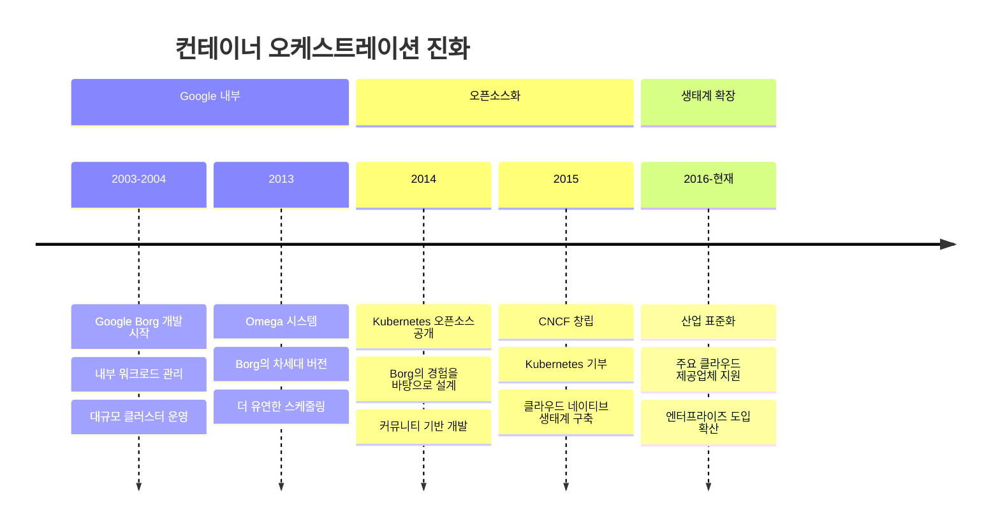
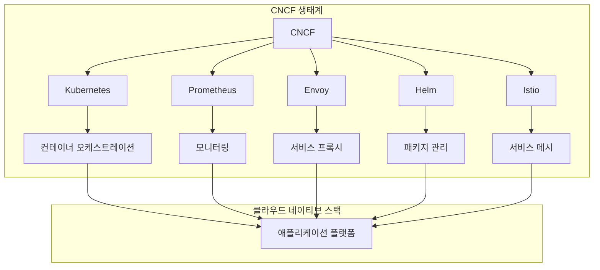
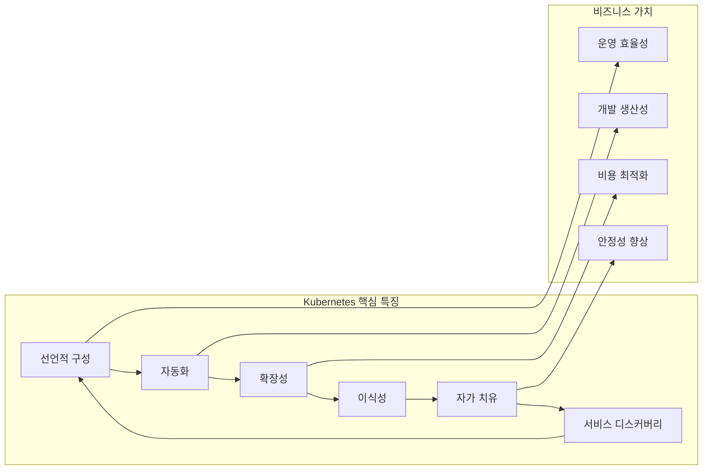

# Session 1: Kubernetes란 무엇인가?

## 📍 교과과정에서의 위치
이 세션은 **Week 2 > Day 1 > Session 1**로, Kubernetes의 기본 개념과 등장 배경을 이해하는 첫 번째 단계입니다. Week 1에서 학습한 Docker와 컨테이너 기술을 바탕으로 오케스트레이션의 필요성을 학습합니다.

## 학습 목표 (5분)
- **Kubernetes의 정의**와 **핵심 가치** 완전 이해
- **컨테이너 오케스트레이션**의 **개념**과 **등장 배경** 학습
- **Google Borg**에서 **Kubernetes**로의 **진화 과정** 파악
- **CNCF 생태계**에서의 **Kubernetes 위치** 이해

## 1. Kubernetes 정의와 핵심 가치 (15분)

### Kubernetes란?



### 공식 정의 분석
> "Kubernetes는 컨테이너화된 워크로드와 서비스를 관리하기 위한 이식 가능하고 확장 가능한 오픈소스 플랫폼으로, 선언적 구성과 자동화를 모두 용이하게 합니다."

**핵심 키워드 분석:**
- **이식 가능(Portable)**: 다양한 환경에서 동일하게 작동
- **확장 가능(Extensible)**: 플러그인과 확장을 통한 기능 확장
- **선언적 구성(Declarative)**: 원하는 상태를 선언하면 자동으로 달성
- **자동화(Automation)**: 수동 작업을 최소화하는 자동화 시스템

## 2. 컨테이너 오케스트레이션 개념 (10분)

### 오케스트레이션이란?



### 오케스트레이션의 핵심 기능
```
컨테이너 오케스트레이션 기능:

배포 관리:
   🔹 롤링 업데이트
   🔹 블루-그린 배포
   🔹 카나리 배포
   🔹 롤백 관리

리소스 관리:
   🔹 CPU/메모리 할당
   🔹 스토리지 관리
   🔹 네트워크 구성
   🔹 보안 정책

운영 자동화:
   🔹 헬스 체크
   🔹 자동 복구
   🔹 스케일링
   🔹 로드 밸런싱

서비스 관리:
   🔹 서비스 디스커버리
   🔹 구성 관리
   🔹 시크릿 관리
   🔹 모니터링
```

## 3. Google Borg에서 Kubernetes로의 진화 (10분)

### 기술 진화 과정



### Borg vs Kubernetes 비교
```
Google Borg → Kubernetes 진화:

설계 철학:
   🔹 Borg: Google 내부 최적화
   🔹 Kubernetes: 범용성과 이식성

아키텍처:
   🔹 Borg: 중앙집중식 모놀리식
   🔹 Kubernetes: 모듈화된 마이크로서비스

사용성:
   🔹 Borg: 복잡한 내부 도구
   🔹 Kubernetes: 사용자 친화적 API

확장성:
   🔹 Borg: Google 규모 특화
   🔹 Kubernetes: 다양한 규모 지원

생태계:
   🔹 Borg: 폐쇄적 내부 시스템
   🔹 Kubernetes: 오픈소스 생태계
```

## 4. CNCF와 오픈소스 생태계 (10분)

### CNCF(Cloud Native Computing Foundation) 역할



### Kubernetes의 생태계 위치
```
클라우드 네이티브 생태계에서의 Kubernetes:

핵심 플랫폼:
   🔹 컨테이너 오케스트레이션의 사실상 표준
   🔹 다른 CNCF 프로젝트의 기반 플랫폼
   🔹 클라우드 제공업체의 관리형 서비스 기반
   🔹 엔터프라이즈 솔루션의 핵심 구성 요소

주요 특징:
   🔹 벤더 중립성 (Vendor Neutral)
   🔹 커뮤니티 기반 개발
   🔹 광범위한 산업 지원
   🔹 지속적인 혁신과 발전

영향력:
   🔹 컨테이너 표준화 주도
   🔹 클라우드 네이티브 패러다임 정의
   🔹 DevOps 문화 확산
   🔹 마이크로서비스 아키텍처 활성화
```

## 5. Kubernetes의 핵심 특징 (5분)

### 주요 특징 분석



## 💬 그룹 토론: Kubernetes가 컨테이너 생태계에 미친 혁신적 영향 (10분)

### 토론 주제
**"Kubernetes가 컨테이너 생태계와 소프트웨어 개발 문화에 미친 가장 혁신적인 영향은 무엇인가?"**

### 토론 가이드라인

#### 기술적 영향 (3분)
- **표준화**: 컨테이너 오케스트레이션의 사실상 표준
- **추상화**: 인프라 복잡성 숨김
- **자동화**: 운영 작업의 자동화

#### 문화적 영향 (4분)
- **DevOps 가속화**: 개발과 운영의 통합
- **클라우드 네이티브**: 새로운 애플리케이션 설계 패러다임
- **마이크로서비스**: 서비스 분해와 독립적 배포

#### 비즈니스 영향 (3분)
- **디지털 전환**: 기업의 클라우드 전환 가속화
- **혁신 속도**: 더 빠른 제품 출시
- **비용 효율성**: 리소스 활용도 향상

## 💡 핵심 개념 정리
- **Kubernetes**: 컨테이너 오케스트레이션을 위한 오픈소스 플랫폼
- **오케스트레이션**: 컨테이너의 배포, 관리, 스케일링을 자동화
- **선언적 구성**: 원하는 상태를 선언하면 시스템이 자동으로 달성
- **CNCF**: 클라우드 네이티브 기술의 발전을 주도하는 재단

## 📚 참고 자료
- [Kubernetes 공식 문서](https://kubernetes.io/docs/concepts/overview/what-is-kubernetes/)
- [CNCF 공식 사이트](https://www.cncf.io/)
- [Google Borg 논문](https://research.google/pubs/pub43438/)

## 다음 세션 준비
다음 세션에서는 **컨테이너 오케스트레이션의 필요성**에 대해 더 자세히 알아보겠습니다. 단일 컨테이너 관리의 한계와 대규모 운영에서 발생하는 문제들을 분석할 예정입니다.