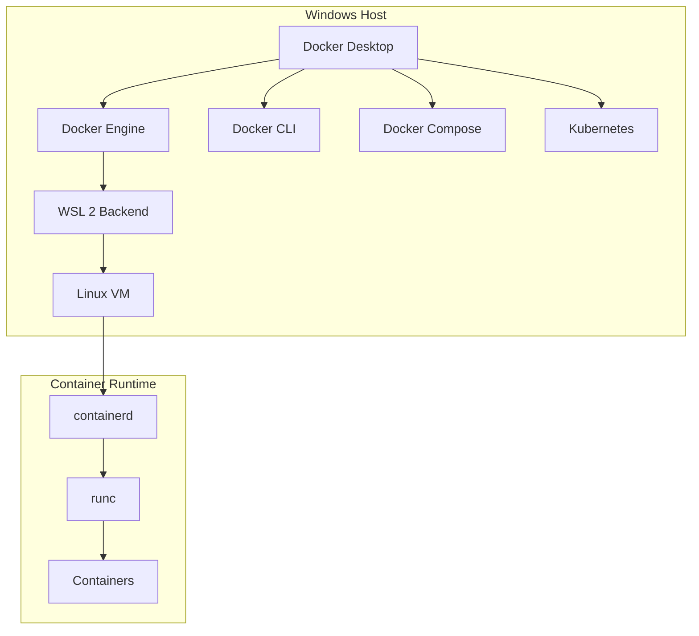
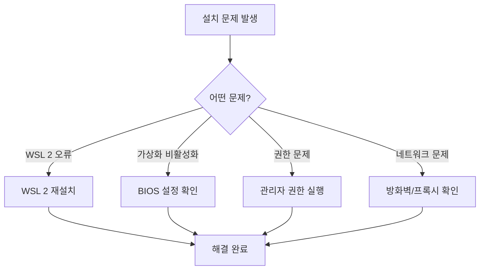

# Session 1: Docker 설치 및 환경 설정 (Windows)

## 📍 교과과정에서의 위치
이 세션은 **Week 2 > Day 1 > Session 1**로, Week 1에서 학습한 Docker 이론을 실제로 구현하는 첫 번째 실습입니다. Windows 환경에서 Docker Desktop을 설치하고 설정하는 과정을 단계별로 진행합니다.

## 학습 목표 (5분)
- **Docker Desktop** 아키텍처와 **설치 요구사항** 이해
- **Windows 환경**에서 Docker 설치 및 **초기 설정** 완료
- **WSL 2** 연동 및 **가상화 기술** 활성화

## 1. 이론: Docker Desktop 아키텍처 (20분)

### Windows에서의 Docker 구조



### 설치 요구사항 분석
```
Windows 시스템 요구사항:

필수 조건:
├── Windows 10 64-bit Pro/Enterprise/Education
├── Build 19041 이상 (Version 2004)
├── BIOS에서 가상화 기술 활성화
└── 최소 4GB RAM (권장 8GB)

선택 사항:
├── WSL 2 (권장)
├── Hyper-V (대안)
└── Windows Subsystem for Linux

성능 고려사항:
├── SSD 권장 (빠른 I/O)
├── 충분한 디스크 공간 (20GB+)
└── 네트워크 연결 (이미지 다운로드)
```

### WSL 2 vs Hyper-V 비교

| 특성 | WSL 2 | Hyper-V |
|------|-------|---------|
| **성능** | 높음 | 중간 |
| **리소스 사용** | 효율적 | 많음 |
| **시작 시간** | 빠름 | 느림 |
| **파일 공유** | 빠름 | 느림 |
| **호환성** | Windows 10 Home 지원 | Pro 이상만 |

## 2. 실습: Docker Desktop 설치 (25분)

### 단계 1: 시스템 준비 (5분)

```powershell
# PowerShell을 관리자 권한으로 실행
# Windows 기능 확인
Get-WindowsOptionalFeature -Online -FeatureName Microsoft-Windows-Subsystem-Linux
Get-WindowsOptionalFeature -Online -FeatureName VirtualMachinePlatform

# WSL 2 활성화
dism.exe /online /enable-feature /featurename:Microsoft-Windows-Subsystem-Linux /all /norestart
dism.exe /online /enable-feature /featurename:VirtualMachinePlatform /all /norestart
```

### 단계 2: Docker Desktop 다운로드 및 설치 (10분)

```bash
# 1. Docker Desktop 다운로드
# URL: https://desktop.docker.com/win/main/amd64/Docker%20Desktop%20Installer.exe

# 2. 설치 프로그램 실행
# - "Use WSL 2 instead of Hyper-V" 옵션 선택
# - "Add shortcut to desktop" 옵션 선택

# 3. 설치 완료 후 재부팅
```

### 단계 3: WSL 2 설정 (5분)

```powershell
# WSL 2를 기본 버전으로 설정
wsl --set-default-version 2

# Ubuntu 배포판 설치 (선택사항)
wsl --install -d Ubuntu

# WSL 2 상태 확인
wsl --list --verbose
```

### 단계 4: Docker Desktop 초기 설정 (5분)

```bash
# Docker Desktop 시작 후 설정
# 1. Docker Desktop 실행
# 2. 라이선스 동의
# 3. 계정 로그인 (선택사항)
# 4. 설정 확인:
#    - General > Use WSL 2 based engine 체크
#    - Resources > WSL Integration 설정
```

## 3. 설치 검증 및 테스트 (5분)

### 기본 동작 확인

```bash
# Docker 버전 확인
docker --version
docker-compose --version

# Docker 시스템 정보
docker system info

# 첫 번째 테스트 실행
docker run hello-world
```

### 예상 출력 결과
```
Docker version 24.0.6, build ed223bc
Docker Compose version v2.21.0

Hello from Docker!
This message shows that your installation appears to be working correctly.
```

## 4. 트러블슈팅 가이드 (10분)

### 일반적인 문제와 해결책



### 주요 해결 방법

```powershell
# WSL 2 문제 해결
wsl --update
wsl --shutdown
# Docker Desktop 재시작

# 가상화 확인
systeminfo | findstr /i "hyper-v"

# Docker 서비스 재시작
net stop com.docker.service
net start com.docker.service
```

## 5. Q&A 및 정리 (5분)

### 핵심 포인트 정리
- ✅ Docker Desktop = Docker Engine + 관리 도구
- ✅ WSL 2가 Hyper-V보다 성능상 유리
- ✅ 가상화 기술 활성화 필수
- ✅ hello-world 컨테이너로 설치 검증

### 다음 세션 준비
- Linux/macOS 사용자를 위한 설치 방법
- 크로스 플랫폼 호환성 고려사항

## 💡 핵심 키워드
- **Docker Desktop**: Windows용 Docker 통합 환경
- **WSL 2**: Windows Subsystem for Linux 2
- **가상화**: Hyper-V, VT-x/AMD-V 기술
- **컨테이너 런타임**: containerd, runc

## 📚 참고 자료
- [Docker Desktop for Windows](https://docs.docker.com/desktop/windows/)
- [WSL 2 설치 가이드](https://docs.microsoft.com/en-us/windows/wsl/install)
- [Docker Desktop 시스템 요구사항](https://docs.docker.com/desktop/windows/install/)

## 🔧 실습 체크리스트
- [ ] Docker Desktop 설치 완료
- [ ] WSL 2 활성화 및 연동
- [ ] docker --version 명령어 실행 성공
- [ ] hello-world 컨테이너 실행 성공
