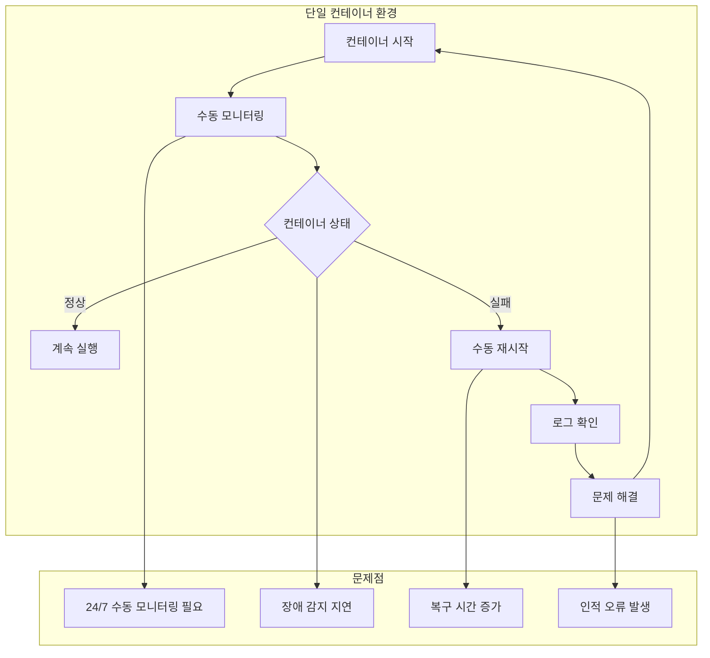
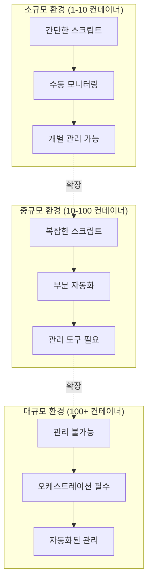
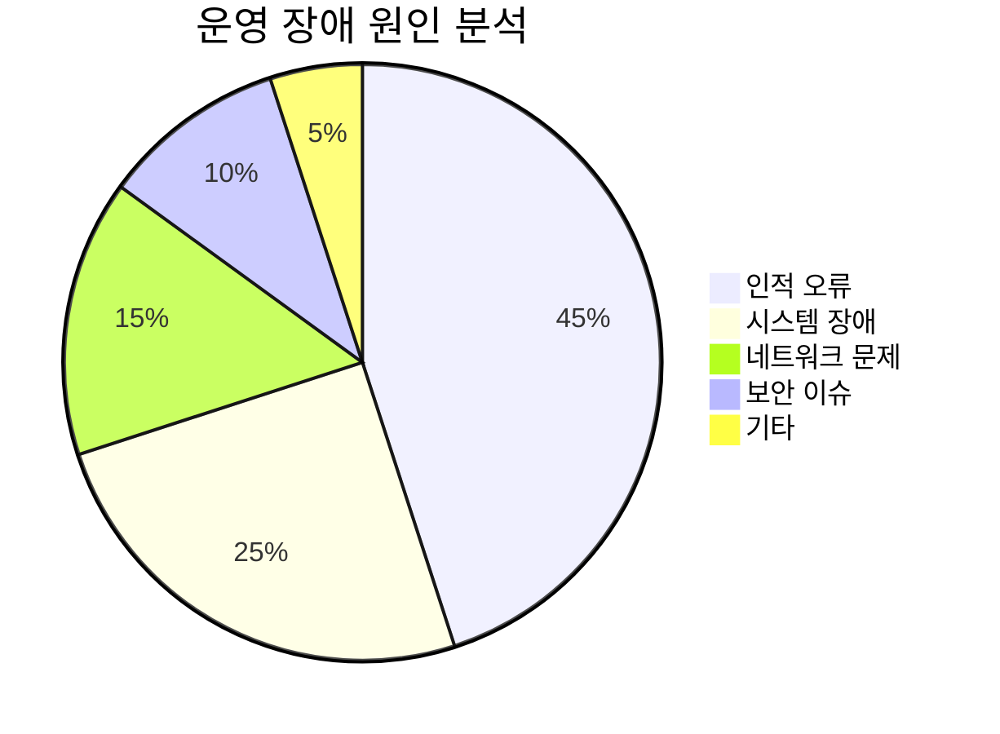
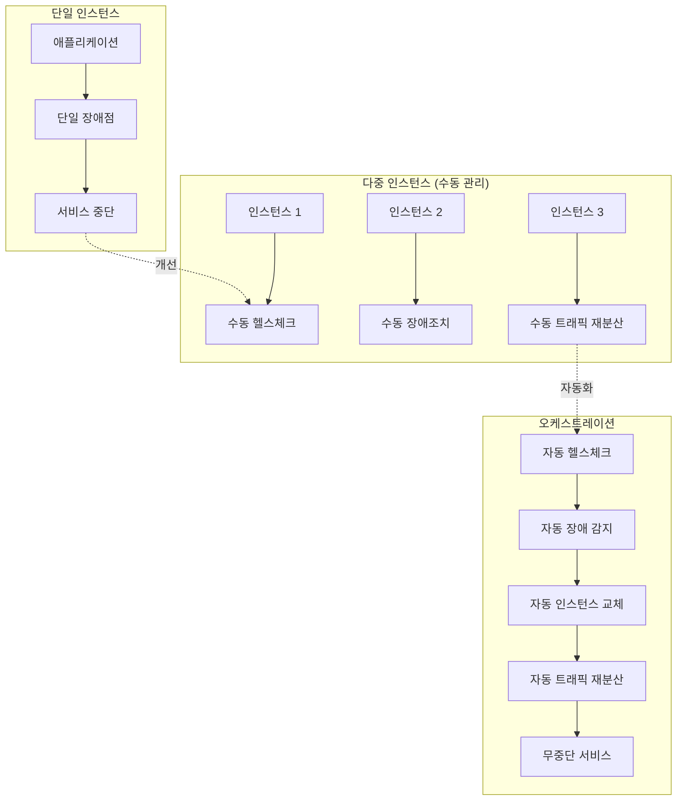
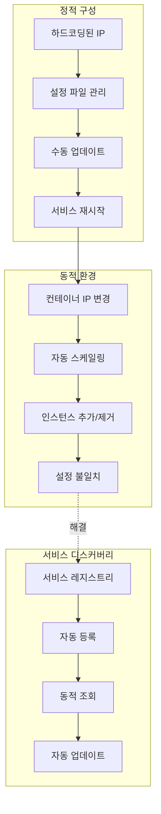
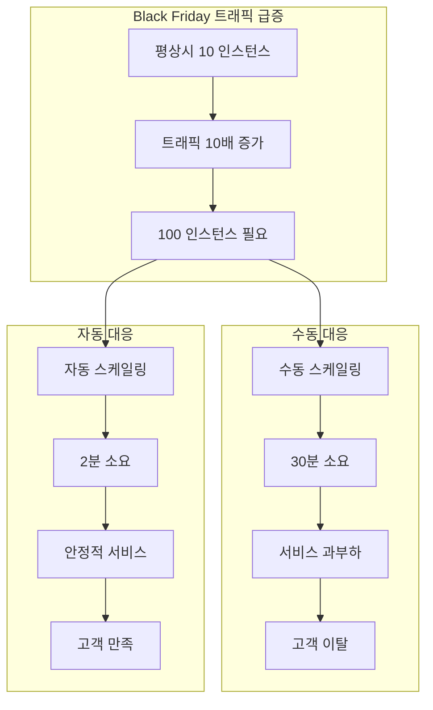

# Session 2: 컨테이너 오케스트레이션의 필요성

## 📍 교과과정에서의 위치
이 세션은 **Week 2 > Day 1 > Session 2**로, 단일 컨테이너 관리의 한계를 분석하고 오케스트레이션이 해결하는 핵심 문제들을 이해합니다. Session 1에서 학습한 Kubernetes 개념을 바탕으로 실제 필요성을 구체적으로 파악합니다.

## 학습 목표 (5분)
- **단일 컨테이너 관리**의 **한계**와 **대규모 운영 문제** 이해
- **수동 관리**의 **복잡성**과 **확장성 문제** 분석
- **고가용성**과 **장애 복구** 요구사항 파악
- **서비스 디스커버리**와 **로드 밸런싱** 필요성 학습

## 1. 단일 컨테이너 관리의 한계 (15분)

### 컨테이너 수명주기 관리 문제



### 확장성 문제 분석
```
단일 컨테이너 관리의 확장성 한계:

수평적 확장 문제:
├── 수동으로 여러 인스턴스 시작
├── 각 인스턴스별 개별 관리 필요
├── 로드 밸런싱 수동 구성
└── 트래픽 분산 관리 복잡성

수직적 확장 문제:
├── 리소스 사용량 수동 모니터링
├── 컨테이너 재시작 필요
├── 다운타임 발생
└── 최적 리소스 할당 어려움

운영 복잡성:
├── 각 컨테이너별 개별 설정
├── 환경 변수 관리 복잡성
├── 네트워크 구성 수동 관리
└── 스토리지 연결 수동 처리
```

## 2. 수동 관리의 복잡성과 확장성 문제 (12분)

### 대규모 환경에서의 관리 복잡성



### 운영 복잡성 증가 패턴
```
컨테이너 수에 따른 관리 복잡성:

1-5개 컨테이너:
├── 수동 관리 가능
├── 간단한 스크립트 활용
├── 개별 모니터링
└── 문제 발생 시 빠른 대응

10-50개 컨테이너:
├── 부분적 자동화 필요
├── 모니터링 도구 도입
├── 배포 스크립트 복잡화
└── 장애 영향 범위 확대

100개 이상 컨테이너:
├── 수동 관리 불가능
├── 완전 자동화 필수
├── 실시간 모니터링 필요
└── 오케스트레이션 도구 필수
```

### 인적 오류와 운영 리스크



## 3. 고가용성과 장애 복구 요구사항 (10분)

### 고가용성 아키텍처 필요성



### 장애 복구 시나리오 비교
```
장애 복구 방식 비교:

수동 복구:
├── 장애 감지: 5-30분
├── 원인 분석: 10-60분
├── 복구 작업: 15-120분
├── 서비스 재개: 30-210분
└── 총 다운타임: 최대 3.5시간

자동 복구 (오케스트레이션):
├── 장애 감지: 10-30초
├── 자동 분석: 즉시
├── 자동 복구: 30-120초
├── 서비스 재개: 1-3분
└── 총 다운타임: 최대 3분

가용성 개선:
├── 수동: 99.9% (월 43분 다운타임)
├── 자동: 99.99% (월 4분 다운타임)
└── 개선 효과: 10배 향상
```

## 4. 서비스 디스커버리와 로드 밸런싱 필요성 (10분)

### 서비스 디스커버리 문제



### 로드 밸런싱 복잡성
```
로드 밸런싱 관리 복잡성:

수동 로드 밸런싱:
├── 정적 설정 파일 관리
├── 백엔드 서버 수동 등록
├── 헬스체크 수동 구성
├── 장애 서버 수동 제외
└── 트래픽 분산 수동 조정

자동 로드 밸런싱:
├── 동적 백엔드 발견
├── 자동 헬스체크
├── 장애 서버 자동 제외
├── 트래픽 자동 분산
└── 성능 기반 라우팅

운영 효율성:
├── 설정 변경 시간: 수동 30분 → 자동 즉시
├── 장애 대응 시간: 수동 10분 → 자동 30초
├── 운영 인력: 수동 24/7 → 자동 최소화
└── 오류 발생률: 수동 높음 → 자동 낮음
```

## 5. 실제 운영 시나리오 분석 (5분)

### 전자상거래 플랫폼 사례



## 💬 그룹 토론: 언제 오케스트레이션 도구를 도입해야 하는가? (8분)

### 토론 주제
**"조직에서 컨테이너 오케스트레이션 도구를 도입해야 하는 시점과 기준은 무엇인가?"**

### 토론 가이드라인

#### 기술적 기준 (3분)
- **컨테이너 수**: 몇 개부터 오케스트레이션이 필요한가?
- **복잡성**: 어느 정도 복잡성에서 도입해야 하는가?
- **가용성 요구사항**: SLA 수준에 따른 필요성

#### 조직적 기준 (3분)
- **팀 규모**: 개발/운영 팀 크기와 역량
- **운영 부담**: 현재 운영 부담과 자동화 필요성
- **비용 대비 효과**: 도입 비용 vs 운영 효율성

#### 비즈니스 기준 (2분)
- **서비스 중요도**: 비즈니스 크리티컬 서비스 여부
- **성장 계획**: 향후 확장 계획과 준비
- **경쟁력**: 시장에서의 기술적 경쟁력

## 💡 핵심 개념 정리
- **확장성 한계**: 수동 관리는 대규모 환경에서 불가능
- **고가용성**: 자동 장애 복구와 무중단 서비스 필요
- **서비스 디스커버리**: 동적 환경에서 서비스 간 통신 관리
- **운영 자동화**: 인적 오류 최소화와 운영 효율성 향상

## 📚 참고 자료
- [Container Orchestration Explained](https://kubernetes.io/docs/concepts/overview/)
- [High Availability Patterns](https://kubernetes.io/docs/concepts/cluster-administration/)
- [Service Discovery in Microservices](https://kubernetes.io/docs/concepts/services-networking/)

## 다음 세션 준비
다음 세션에서는 **Kubernetes 클러스터 아키텍처**에 대해 학습합니다. 분산 시스템으로서의 Kubernetes 설계 원칙과 전체 구조를 이해할 예정입니다.