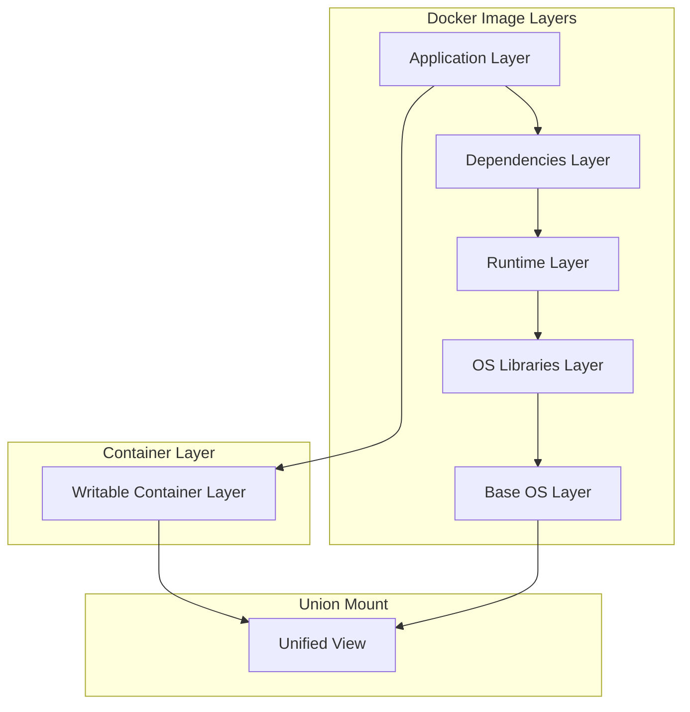
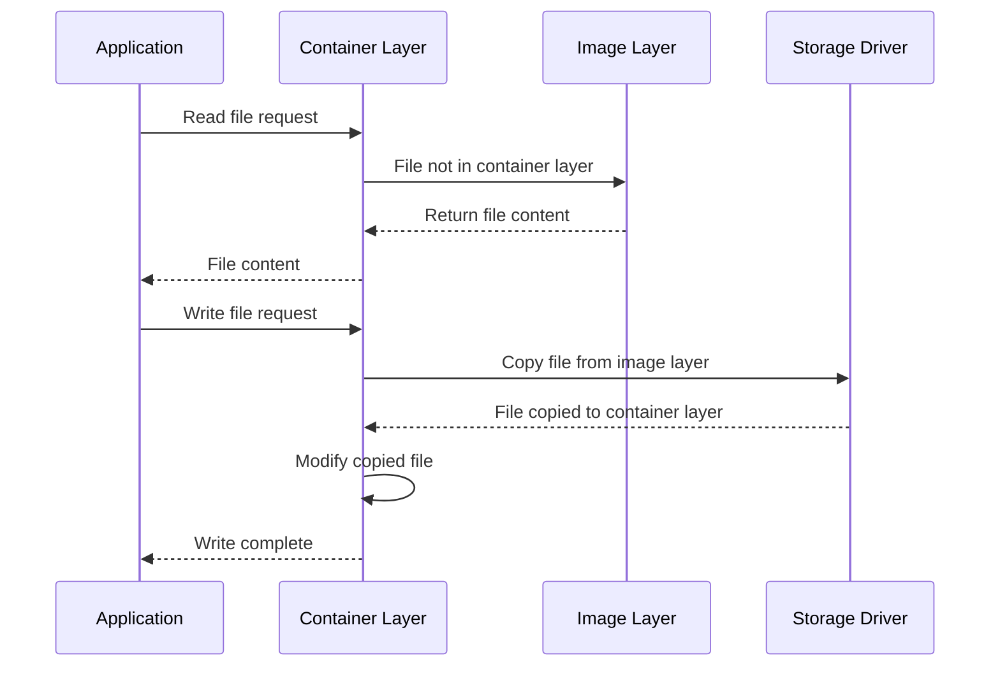

# Session 2: Docker 이미지 레이어 시스템 심화

## 📍 교과과정에서의 위치
이 세션은 **Week 2 > Day 1 > Session 2**로, Docker Engine 아키텍처 이해를 바탕으로 이미지 레이어 시스템의 내부 동작 원리를 심화 분석합니다.

## 학습 목표 (5분)
- **Union File System** 개념과 **레이어 구조** 완전 이해
- **Copy-on-Write** 메커니즘과 **스토리지 드라이버** 분석
- **이미지 최적화** 전략과 **레이어 캐싱** 원리

## 1. 이론: Union File System과 레이어 아키텍처 (20분)

### Docker 이미지 레이어 구조



### Union File System 동작 원리

```
Union File System 특징:

레이어 스택:
├── 읽기 전용 이미지 레이어들
├── 최상위 쓰기 가능 컨테이너 레이어
├── 통합된 단일 파일시스템 뷰 제공
└── 레이어 간 투명한 오버레이

파일 접근 순서:
├── 1. 컨테이너 레이어에서 파일 검색
├── 2. 상위 이미지 레이어부터 순차 검색
├── 3. 첫 번째 발견된 파일 반환
└── 4. 하위 레이어의 동일 파일은 숨김 처리

레이어 공유:
├── 동일한 베이스 이미지 레이어 공유
├── 스토리지 공간 효율성 극대화
├── 이미지 다운로드 시간 단축
└── 메모리 사용량 최적화
```

### 스토리지 드라이버 비교 분석

```
주요 스토리지 드라이버:

overlay2 (권장):
├── 현재 기본 드라이버
├── 최고 성능과 안정성
├── 2개 레이어만 사용 (lower, upper)
├── 메모리 효율성 우수
├── 파일 복사 최소화
└── 대부분 Linux 배포판 지원

aufs (레거시):
├── 초기 Docker 기본 드라이버
├── 다중 레이어 지원
├── 복잡한 구조로 성능 저하
├── 메인라인 커널 미포함
└── Ubuntu에서만 주로 사용

devicemapper:
├── Red Hat 계열 기본 드라이버
├── 블록 레벨 스토리지
├── 스냅샷 기반 레이어 관리
├── 설정 복잡성 높음
└── 성능 최적화 어려움

btrfs:
├── Copy-on-Write 파일시스템
├── 네이티브 스냅샷 지원
├── 압축 및 중복 제거 기능
├── 안정성 이슈 존재
└── 특수 용도로 제한적 사용

zfs:
├── 고급 파일시스템 기능
├── 데이터 무결성 보장
├── 압축 및 암호화 지원
├── 높은 메모리 요구사항
└── 엔터프라이즈 환경 적합
```

## 2. 이론: Copy-on-Write 메커니즘 (15분)

### CoW 동작 원리 분석



### CoW 최적화 전략

```
Copy-on-Write 최적화:

파일 수정 시나리오:
├── 첫 번째 수정: 전체 파일 복사 (비용 높음)
├── 후속 수정: 컨테이너 레이어에서 직접 수정
├── 대용량 파일: 블록 단위 복사 (드라이버별 상이)
└── 작은 파일: 전체 파일 복사

성능 고려사항:
├── 첫 번째 쓰기 지연 (Copy-up 비용)
├── 대용량 파일 수정 시 스토리지 사용량 증가
├── 레이어 깊이에 따른 읽기 성능 영향
└── 메모리 사용량 증가 가능성

최적화 방법:
├── 자주 수정되는 파일은 볼륨 사용
├── 이미지 레이어 수 최소화
├── 대용량 파일은 별도 볼륨으로 분리
└── 멀티 스테이지 빌드로 레이어 최적화
```

## 3. 이론: 이미지 빌드 최적화 전략 (10분)

### Dockerfile 레이어 최적화

```
레이어 최적화 원칙:

명령어 통합:
├── RUN 명령어 체이닝으로 레이어 수 감소
├── 패키지 설치와 정리를 한 번에 처리
├── 임시 파일 생성과 삭제를 동일 레이어에서
└── 불필요한 중간 파일 제거

캐시 활용:
├── 자주 변경되지 않는 명령어를 상위에 배치
├── 종속성 설치를 애플리케이션 코드보다 먼저
├── .dockerignore로 불필요한 파일 제외
└── 레이어 캐시 무효화 최소화

멀티 스테이지 빌드:
├── 빌드 도구와 런타임 환경 분리
├── 최종 이미지에 불필요한 파일 제외
├── 보안 취약점 감소
└── 이미지 크기 대폭 감소
```

### 이미지 크기 최적화 기법

```
크기 최적화 전략:

베이스 이미지 선택:
├── Alpine Linux: 최소 크기 (5MB)
├── Distroless: 보안 강화된 최소 이미지
├── Scratch: 정적 바이너리용 빈 이미지
└── 공식 slim 태그: 균형잡힌 선택

불필요한 요소 제거:
├── 패키지 매니저 캐시 정리
├── 임시 파일 및 로그 파일 삭제
├── 개발 도구 및 헤더 파일 제거
└── 문서 및 매뉴얼 페이지 제거

압축 및 최적화:
├── 바이너리 스트리핑 (디버그 정보 제거)
├── 파일 압축 활용
├── 심볼릭 링크 최적화
└── 중복 파일 제거
```

## 4. 개념 예시: 레이어 분석 실습 (7분)

### 이미지 레이어 구조 분석 예시

```bash
# 이미지 히스토리 확인 (개념 예시)
docker history nginx:alpine

# 예상 출력 분석:
# IMAGE          CREATED       SIZE      COMMENT
# f6d0b4767a6c   2 weeks ago   23.4MB    
# <missing>      2 weeks ago   0B        CMD ["nginx" "-g" "daemon off;"]
# <missing>      2 weeks ago   0B        EXPOSE 80
# <missing>      2 weeks ago   1.27MB    RUN apk add --no-cache nginx
# <missing>      2 weeks ago   0B        WORKDIR /var/www/html
# <missing>      2 weeks ago   5.61MB    ADD file:9a4f77dfaba7fd2aa78186e4ef0e7486ad55101cefc1fabbc1b385601bb38920
```

### 레이어 캐시 동작 예시

```dockerfile
# 최적화 전 (개념 예시)
FROM node:alpine
COPY . /app
WORKDIR /app
RUN npm install
CMD ["npm", "start"]

# 최적화 후 (개념 예시)
FROM node:alpine
WORKDIR /app
COPY package*.json ./
RUN npm install
COPY . .
CMD ["npm", "start"]

# 캐시 효과:
# - package.json 변경 시에만 npm install 재실행
# - 소스 코드 변경 시 종속성 설치 캐시 유지
```

### 스토리지 사용량 분석 예시

```bash
# Docker 시스템 사용량 확인 (개념 예시)
docker system df

# 예상 출력:
# TYPE            TOTAL     ACTIVE    SIZE      RECLAIMABLE
# Images          15        5         2.1GB     1.2GB (57%)
# Containers      8         2         45MB      32MB (71%)
# Local Volumes   3         1         156MB     78MB (50%)
# Build Cache     0         0         0B        0B
```

## 5. 토론 및 정리 (3분)

### 핵심 개념 정리
- **Union File System**을 통한 효율적인 레이어 관리
- **Copy-on-Write** 메커니즘으로 스토리지 최적화
- **레이어 캐싱**을 활용한 빌드 성능 향상
- **멀티 스테이지 빌드**로 이미지 크기 최소화

### 토론 주제
"컨테이너 환경에서 레이어 시스템이 가져다주는 효율성과 성능 최적화 방안은 무엇인가?"

## 💡 핵심 키워드
- **레이어 시스템**: Union FS, overlay2, 스토리지 드라이버
- **Copy-on-Write**: CoW, 파일 복사, 성능 최적화
- **이미지 최적화**: 멀티 스테이지, 캐싱, 크기 최소화
- **스토리지 효율성**: 레이어 공유, 중복 제거

## 📚 참고 자료
- [Docker 스토리지 드라이버](https://docs.docker.com/storage/storagedriver/)
- [이미지 레이어 관리](https://docs.docker.com/develop/dev-best-practices/)
- [Dockerfile 최적화](https://docs.docker.com/develop/dockerfile_best-practices/)
