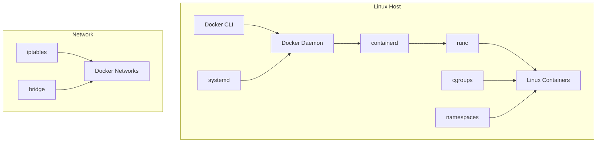
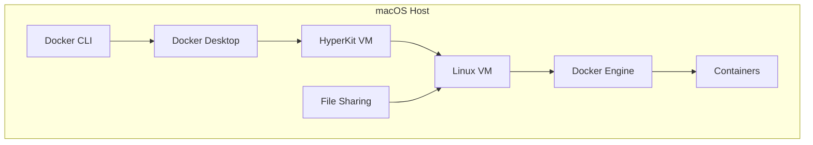
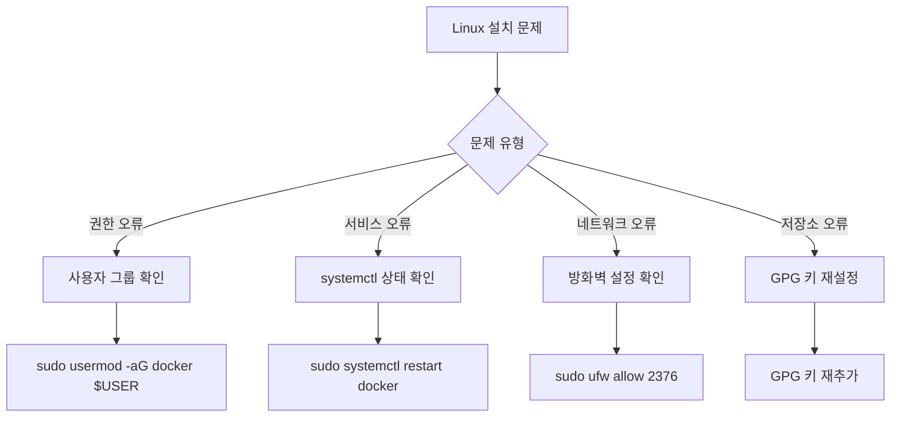

# Session 2: Docker 설치 및 환경 설정 (Linux/macOS)

## 📍 교과과정에서의 위치
이 세션은 **Week 2 > Day 1 > Session 2**로, Linux와 macOS 환경에서 Docker를 설치하고 설정하는 과정을 다룹니다. Windows와는 다른 설치 방법과 네이티브 환경의 장점을 실습합니다.

## 학습 목표 (5분)
- **Linux/macOS** 환경에서 Docker Engine 설치 방법 학습
- **패키지 매니저**를 활용한 설치 과정 실습
- **사용자 권한** 설정 및 **보안 고려사항** 이해

## 1. 이론: Linux/macOS Docker 아키텍처 (20분)

### Linux에서의 Docker 구조



### macOS에서의 Docker 구조



### 플랫폼별 특징 비교

| 특성 | Linux | macOS | Windows |
|------|-------|-------|---------|
| **네이티브 지원** | ✅ | ❌ (VM 필요) | ❌ (WSL/Hyper-V) |
| **성능** | 최고 | 중간 | 중간 |
| **설치 복잡도** | 중간 | 낮음 | 높음 |
| **리소스 사용** | 최소 | 중간 | 높음 |

## 2. 실습: Linux Docker 설치 (Ubuntu 기준) (12분)

### 단계 1: 시스템 업데이트 및 준비

```bash
# 시스템 패키지 업데이트
sudo apt update
sudo apt upgrade -y

# 필수 패키지 설치
sudo apt install -y \
    apt-transport-https \
    ca-certificates \
    curl \
    gnupg \
    lsb-release
```

### 단계 2: Docker 공식 GPG 키 및 저장소 추가

```bash
# Docker 공식 GPG 키 추가
curl -fsSL https://download.docker.com/linux/ubuntu/gpg | sudo gpg --dearmor -o /usr/share/keyrings/docker-archive-keyring.gpg

# Docker 저장소 추가
echo \
  "deb [arch=$(dpkg --print-architecture) signed-by=/usr/share/keyrings/docker-archive-keyring.gpg] https://download.docker.com/linux/ubuntu \
  $(lsb_release -cs) stable" | sudo tee /etc/apt/sources.list.d/docker.list > /dev/null
```

### 단계 3: Docker Engine 설치

```bash
# 패키지 목록 업데이트
sudo apt update

# Docker Engine 설치
sudo apt install -y docker-ce docker-ce-cli containerd.io docker-buildx-plugin docker-compose-plugin

# Docker 서비스 시작 및 활성화
sudo systemctl start docker
sudo systemctl enable docker
```

### 단계 4: 사용자 권한 설정

```bash
# docker 그룹에 현재 사용자 추가
sudo usermod -aG docker $USER

# 그룹 변경사항 적용 (재로그인 또는 newgrp 사용)
newgrp docker

# 권한 확인
groups $USER
```

## 3. 실습: macOS Docker 설치 (8분)

### 방법 1: Docker Desktop 설치

```bash
# Homebrew를 사용한 설치 (권장)
brew install --cask docker

# 또는 직접 다운로드
# https://desktop.docker.com/mac/main/amd64/Docker.dmg (Intel)
# https://desktop.docker.com/mac/main/arm64/Docker.dmg (Apple Silicon)
```

### 방법 2: Homebrew로 Docker Engine 설치

```bash
# Docker 설치
brew install docker

# Docker Machine 설치 (VM 관리용)
brew install docker-machine

# VirtualBox 설치 (VM 드라이버)
brew install --cask virtualbox

# Docker Machine으로 VM 생성
docker-machine create --driver virtualbox default
eval $(docker-machine env default)
```

## 4. 설치 검증 및 테스트 (5분)

### 공통 검증 명령어

```bash
# Docker 버전 확인
docker --version
docker compose version

# Docker 시스템 정보
docker system info

# Docker 서비스 상태 확인 (Linux)
sudo systemctl status docker

# 첫 번째 컨테이너 실행
docker run hello-world

# 실행 중인 컨테이너 확인
docker ps

# 모든 컨테이너 확인 (중지된 것 포함)
docker ps -a
```

### 예상 출력 예시

```bash
$ docker --version
Docker version 24.0.6, build ed223bc

$ docker run hello-world
Unable to find image 'hello-world:latest' locally
latest: Pulling from library/hello-world
2db29710123e: Pull complete 
Digest: sha256:7d91b69e04a9029b99f3585aaaccae2baa80bcf318f4a5d2165a9898cd2dc0a1
Status: Downloaded newer image for hello-world:latest

Hello from Docker!
This message shows that your installation appears to be working correctly.
```

## 5. 트러블슈팅 및 최적화 (10분)

### Linux 트러블슈팅



### 일반적인 문제 해결

```bash
# Docker 데몬이 실행되지 않는 경우
sudo systemctl start docker
sudo systemctl status docker

# 권한 거부 오류
sudo chmod 666 /var/run/docker.sock
# 또는
sudo usermod -aG docker $USER

# 디스크 공간 부족
docker system prune -a
docker volume prune

# 네트워크 문제
sudo systemctl restart docker
docker network ls
```

### 성능 최적화 설정

```bash
# Docker 데몬 설정 파일 생성/편집
sudo nano /etc/docker/daemon.json

# 최적화 설정 예시
{
  "log-driver": "json-file",
  "log-opts": {
    "max-size": "10m",
    "max-file": "3"
  },
  "storage-driver": "overlay2",
  "storage-opts": [
    "overlay2.override_kernel_check=true"
  ]
}

# 설정 적용
sudo systemctl restart docker
```

## 6. Q&A 및 정리 (5분)

### 플랫폼별 장단점 정리

```
Linux:
✅ 네이티브 성능, 최소 오버헤드
✅ 완전한 기능 지원
❌ 초기 설정 복잡

macOS:
✅ 간단한 설치 (Docker Desktop)
✅ 개발자 친화적 환경
❌ VM 오버헤드, 파일 공유 성능

Windows:
✅ WSL 2로 성능 개선
✅ 통합 개발 환경
❌ 복잡한 설정, 높은 리소스 사용
```

### 다음 세션 준비
- 모든 플랫폼에서 Docker 설치 완료
- 첫 번째 컨테이너 실행 준비

## 💡 핵심 키워드
- **Docker Engine**: Linux 네이티브 Docker 런타임
- **containerd**: 컨테이너 런타임 인터페이스
- **사용자 그룹**: docker 그룹 권한 관리
- **systemd**: Linux 서비스 관리

## 📚 참고 자료
- [Docker Engine 설치 (Ubuntu)](https://docs.docker.com/engine/install/ubuntu/)
- [Docker Desktop for Mac](https://docs.docker.com/desktop/mac/)
- [Docker 보안 가이드](https://docs.docker.com/engine/security/)

## 🔧 실습 체크리스트
- [ ] 운영체제별 Docker 설치 완료
- [ ] 사용자 권한 설정 완료
- [ ] docker --version 명령어 성공
- [ ] hello-world 컨테이너 실행 성공
- [ ] Docker 서비스 자동 시작 설정
