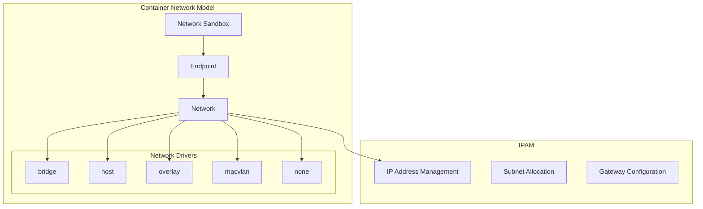
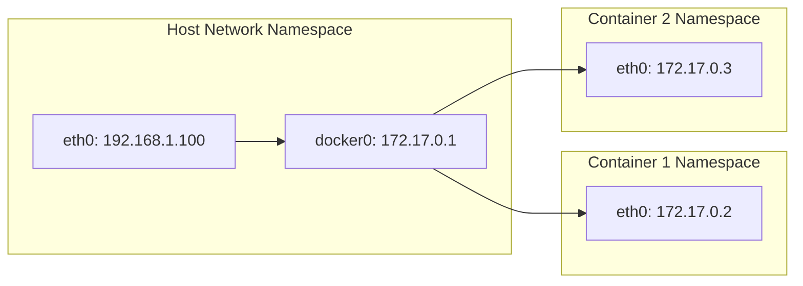

# Session 3: Docker 네트워킹 모델 심화 분석

## 📍 교과과정에서의 위치
이 세션은 **Week 2 > Day 1 > Session 3**으로, Docker Engine과 레이어 시스템 이해를 바탕으로 Docker 네트워킹의 내부 구조와 동작 원리를 심화 분석합니다.

## 학습 목표 (5분)
- **Docker 네트워킹 모델**과 **드라이버 아키텍처** 완전 이해
- **CNM(Container Network Model)** 구조와 **네트워크 격리** 메커니즘
- **포트 매핑**과 **서비스 디스커버리** 내부 동작 원리

## 1. 이론: Container Network Model (CNM) 아키텍처 (20분)

### CNM 핵심 구성 요소



### CNM 구성 요소 상세 분석

```
Container Network Model 구조:

Network Sandbox:
├── 컨테이너의 네트워크 스택 격리 공간
├── 네트워크 인터페이스, 라우팅 테이블, DNS 설정 포함
├── Linux Network Namespace로 구현
├── 컨테이너별 독립적인 네트워크 환경 제공
└── 여러 네트워크에 동시 연결 가능

Endpoint:
├── Network Sandbox와 Network 간의 연결점
├── 가상 네트워크 인터페이스로 구현
├── MAC 주소와 IP 주소 할당
├── 네트워크별 독립적인 설정 가능
└── 동적 생성 및 제거 지원

Network:
├── 동일한 네트워크에 속한 Endpoint들의 집합
├── 네트워크 드라이버에 의해 구현
├── 서브넷, 게이트웨이, DNS 설정 관리
├── 네트워크 정책 및 보안 규칙 적용
└── 멀티 호스트 네트워킹 지원
```

### 네트워크 드라이버 심화 분석

```
주요 네트워크 드라이버:

bridge (기본 드라이버):
├── Linux bridge 기반 가상 스위치
├── docker0 브리지 인터페이스 사용
├── NAT를 통한 외부 통신
├── 포트 매핑으로 서비스 노출
├── 단일 호스트 내 컨테이너 통신
└── 격리된 네트워크 세그먼트 제공

host:
├── 호스트 네트워크 스택 직접 사용
├── 네트워크 격리 없음
├── 최고 성능 (오버헤드 없음)
├── 포트 충돌 가능성
├── 보안 위험 증가
└── 특수 용도 (모니터링, 네트워크 도구)

overlay:
├── 멀티 호스트 네트워킹 지원
├── VXLAN 터널링 기술 사용
├── Docker Swarm 클러스터링 필수
├── 분산 서비스 디스커버리
├── 암호화된 통신 지원
└── 로드 밸런싱 내장

macvlan:
├── 컨테이너에 물리적 MAC 주소 할당
├── VLAN 태깅 지원
├── 레거시 애플리케이션 호환성
├── 브로드캐스트 도메인 분리
├── 네트워크 가상화 없이 직접 연결
└── 물리 네트워크와 동일한 세그먼트

none:
├── 네트워크 인터페이스 없음
├── 완전한 네트워크 격리
├── 사용자 정의 네트워킹
├── 보안이 중요한 워크로드
└── 특수 네트워크 구성
```

## 2. 이론: 네트워크 격리 및 보안 메커니즘 (15분)

### 네트워크 네임스페이스 격리



### 네트워크 보안 및 격리 정책

```
네트워크 보안 메커니즘:

iptables 규칙:
├── Docker가 자동으로 iptables 규칙 생성
├── DOCKER 체인을 통한 트래픽 제어
├── 컨테이너 간 통신 규칙 관리
├── 외부 접근 제어 및 포트 매핑
├── NAT 규칙을 통한 주소 변환
└── 사용자 정의 규칙과의 상호작용

네트워크 정책:
├── 기본적으로 동일 네트워크 내 통신 허용
├── 사용자 정의 네트워크에서 DNS 기반 서비스 디스커버리
├── 네트워크별 독립적인 격리 정책
├── 외부 네트워크와의 통신 제어
└── 컨테이너 간 트래픽 암호화 (overlay)

보안 고려사항:
├── 기본 bridge 네트워크의 보안 한계
├── 사용자 정의 네트워크 권장
├── 최소 권한 원칙 적용
├── 네트워크 세그멘테이션 활용
└── 모니터링 및 로깅 강화
```

## 3. 이론: 서비스 디스커버리 및 로드 밸런싱 (10분)

### DNS 기반 서비스 디스커버리

```
서비스 디스커버리 메커니즘:

내장 DNS 서버:
├── 각 컨테이너에 127.0.0.11:53 DNS 서버
├── 컨테이너 이름을 IP 주소로 해석
├── 네트워크별 독립적인 DNS 네임스페이스
├── 서비스 이름 기반 로드 밸런싱
└── 동적 서비스 등록 및 해제

네트워크 별명 (Alias):
├── 하나의 컨테이너에 여러 DNS 이름 할당
├── 서비스 그룹핑 및 추상화
├── 롤링 업데이트 시 무중단 서비스
├── 마이크로서비스 아키텍처 지원
└── 레거시 애플리케이션 호환성

외부 DNS 통합:
├── 업스트림 DNS 서버 설정
├── 사용자 정의 DNS 서버 지정
├── DNS 검색 도메인 설정
├── 호스트 파일 오버라이드
└── 하이브리드 DNS 해석
```

### 로드 밸런싱 메커니즘

```
Docker 내장 로드 밸런싱:

라운드 로빈 알고리즘:
├── 동일한 서비스 이름의 여러 컨테이너
├── DNS 쿼리마다 순차적 IP 반환
├── 간단하고 효과적인 부하 분산
├── 컨테이너 상태 자동 감지
└── 장애 컨테이너 자동 제외

연결 기반 로드 밸런싱:
├── TCP 연결 레벨에서 부하 분산
├── 세션 지속성 미지원
├── 상태 비저장 서비스에 적합
├── 높은 처리량과 낮은 지연시간
└── 컨테이너 스케일링 자동 반영

외부 로드 밸런서 통합:
├── HAProxy, NGINX 등과 연동
├── 고급 로드 밸런싱 알고리즘
├── 헬스 체크 및 장애 조치
├── SSL 터미네이션
└── 세션 지속성 지원
```

## 4. 개념 예시: 네트워킹 구성 분석 (7분)

### 네트워크 구성 분석 예시

```bash
# 네트워크 목록 확인 (개념 예시)
docker network ls

# 예상 출력:
# NETWORK ID     NAME      DRIVER    SCOPE
# 3f7e8b9c2d1a   bridge    bridge    local
# 5a9b8c7d6e2f   host      host      local
# 8c7d6e2f9a3b   none      null      local
```

### 네트워크 상세 정보 분석 예시

```bash
# 브리지 네트워크 상세 정보 (개념 예시)
docker network inspect bridge

# 예상 출력 구조:
# {
#     "Name": "bridge",
#     "Driver": "bridge",
#     "IPAM": {
#         "Config": [{"Subnet": "172.17.0.0/16"}]
#     },
#     "Containers": {
#         "container_id": {
#             "IPv4Address": "172.17.0.2/16"
#         }
#     }
# }
```

### 컨테이너 네트워크 연결 예시

```bash
# 사용자 정의 네트워크 생성 (개념 예시)
docker network create --driver bridge mynetwork

# 컨테이너를 특정 네트워크에 연결 (개념 예시)
docker run -d --name web --network mynetwork nginx
docker run -d --name db --network mynetwork mysql

# 네트워크 내 DNS 해석 테스트 (개념 예시)
docker exec web ping db
# 결과: db 컨테이너의 IP로 ping 성공
```

## 5. 토론 및 정리 (3분)

### 핵심 개념 정리
- **CNM 아키텍처**를 통한 표준화된 네트워킹
- **네트워크 드라이버**별 특성과 사용 사례
- **DNS 기반 서비스 디스커버리**와 자동 로드 밸런싱
- **네트워크 격리**를 통한 보안 강화

### 토론 주제
"마이크로서비스 아키텍처에서 Docker 네트워킹이 제공하는 서비스 디스커버리와 격리의 장점은 무엇인가?"

## 💡 핵심 키워드
- **CNM**: Network Sandbox, Endpoint, Network
- **네트워크 드라이버**: bridge, overlay, macvlan, host
- **서비스 디스커버리**: DNS, 네트워크 별명, 로드 밸런싱
- **네트워크 보안**: 격리, iptables, 네트워크 정책

## 📚 참고 자료
- [Docker 네트워킹 개요](https://docs.docker.com/network/)
- [Container Network Model](https://github.com/docker/libnetwork/blob/master/docs/design.md)
- [Docker 네트워크 드라이버](https://docs.docker.com/network/drivers/)
