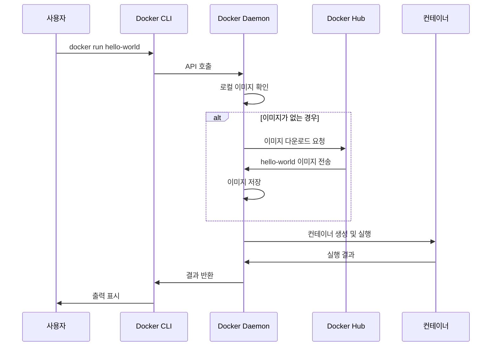
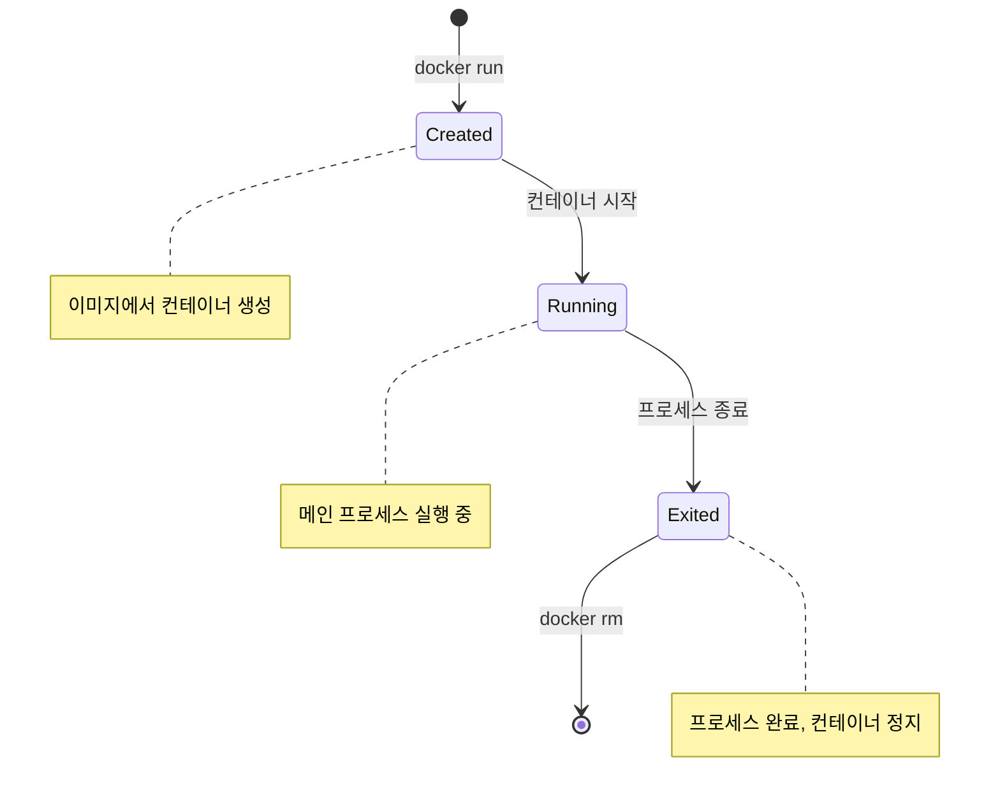
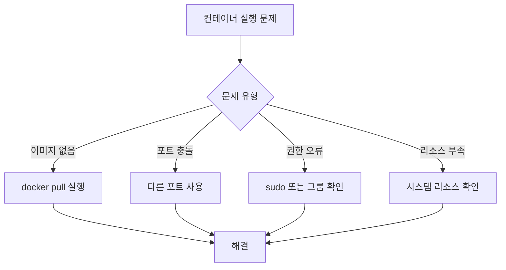

# Session 3: 첫 번째 컨테이너 실행

## 📍 교과과정에서의 위치
이 세션은 **Week 2 > Day 1 > Session 3**으로, Docker 설치를 완료한 후 실제로 첫 번째 컨테이너를 실행하는 과정입니다. Week 1에서 학습한 컨테이너 개념을 실제로 체험하는 중요한 단계입니다.

## 학습 목표 (5분)
- **Hello World 컨테이너**의 동작 원리 이해
- **docker run** 명령어의 기본 사용법 습득
- **이미지 다운로드**부터 **컨테이너 실행**까지 전체 과정 체험

## 1. 이론: Hello World 컨테이너 동작 원리 (20분)

### docker run 명령어 실행 과정



### 컨테이너 라이프사이클



### hello-world 이미지 구조 분석

```
hello-world 이미지 내용:
├── 실행 파일: /hello
├── 크기: 약 13KB (매우 경량)
├── 기능: 환영 메시지 출력 후 종료
└── 목적: Docker 설치 검증용

실행 시 출력 메시지:
1. Docker 설치 확인 메시지
2. 실행 과정 설명
3. 추가 학습 가이드
4. Docker Hub 링크
```

## 2. 실습: 첫 번째 컨테이너 실행 (25분)

### 단계 1: hello-world 컨테이너 실행 (5분)

```bash
# 첫 번째 컨테이너 실행
docker run hello-world

# 예상 출력:
# Unable to find image 'hello-world:latest' locally
# latest: Pulling from library/hello-world
# 2db29710123e: Pull complete 
# Digest: sha256:7d91b69e04a9029b99f3585aaaccae2baa80bcf318f4a5d2165a9898cd2dc0a1
# Status: Downloaded newer image for hello-world:latest
# 
# Hello from Docker!
# This message shows that your installation appears to be working correctly.
```

### 단계 2: 실행 과정 분석 (5분)

```bash
# 다운로드된 이미지 확인
docker images

# 실행된 컨테이너 확인 (실행 중인 것만)
docker ps

# 모든 컨테이너 확인 (종료된 것 포함)
docker ps -a

# 컨테이너 상세 정보 확인
docker inspect <container_id>
```

### 단계 3: 다양한 컨테이너 실행 (10분)

```bash
# Ubuntu 컨테이너 실행 (대화형 모드)
docker run -it ubuntu:20.04 /bin/bash

# 컨테이너 내부에서 명령어 실행
ls -la
cat /etc/os-release
whoami
exit

# Alpine Linux 컨테이너 실행 (경량 배포판)
docker run -it alpine:latest /bin/sh

# 컨테이너 내부에서
apk update
apk add curl
curl --version
exit
```

### 단계 4: 웹 서버 컨테이너 실행 (5분)

```bash
# Nginx 웹 서버 컨테이너 실행
docker run -d -p 8080:80 --name my-nginx nginx:latest

# 실행 중인 컨테이너 확인
docker ps

# 웹 브라우저에서 http://localhost:8080 접속 확인
# 또는 curl로 테스트
curl http://localhost:8080

# 컨테이너 로그 확인
docker logs my-nginx
```

## 3. docker run 옵션 상세 분석 (5분)

### 주요 옵션 설명

```bash
# 기본 형식
docker run [OPTIONS] IMAGE [COMMAND] [ARG...]

# 주요 옵션들:
-d, --detach          # 백그라운드 실행
-i, --interactive     # 대화형 모드 (STDIN 열기)
-t, --tty            # 가상 터미널 할당
-p, --publish        # 포트 매핑 (호스트:컨테이너)
--name               # 컨테이너 이름 지정
-v, --volume         # 볼륨 마운트
-e, --env            # 환경 변수 설정
--rm                 # 종료 시 자동 삭제
```

### 옵션 조합 예시

```bash
# 대화형 임시 컨테이너
docker run -it --rm ubuntu:20.04 bash

# 백그라운드 웹 서버 (포트 매핑)
docker run -d -p 80:80 --name webserver nginx

# 환경 변수와 볼륨 마운트
docker run -d \
  -e MYSQL_ROOT_PASSWORD=mypassword \
  -v /my/data:/var/lib/mysql \
  --name mysql-db \
  mysql:8.0
```

## 4. 컨테이너 관리 기본 명령어 (15분)

### 컨테이너 상태 확인

```bash
# 실행 중인 컨테이너 목록
docker ps

# 모든 컨테이너 목록 (중지된 것 포함)
docker ps -a

# 컨테이너 상세 정보
docker inspect <container_name_or_id>

# 컨테이너 리소스 사용량 실시간 모니터링
docker stats

# 특정 컨테이너의 프로세스 확인
docker top <container_name>
```

### 컨테이너 제어

```bash
# 컨테이너 중지
docker stop <container_name>

# 컨테이너 시작
docker start <container_name>

# 컨테이너 재시작
docker restart <container_name>

# 컨테이너 일시 정지
docker pause <container_name>

# 컨테이너 일시 정지 해제
docker unpause <container_name>

# 컨테이너 강제 종료
docker kill <container_name>
```

### 컨테이너 정리

```bash
# 중지된 컨테이너 삭제
docker rm <container_name>

# 실행 중인 컨테이너 강제 삭제
docker rm -f <container_name>

# 모든 중지된 컨테이너 삭제
docker container prune

# 사용하지 않는 모든 리소스 정리
docker system prune
```

## 5. 실습 과제 및 Q&A (5분)

### 실습 과제

```bash
# 과제 1: 다양한 이미지로 컨테이너 실행
docker run -it centos:7 /bin/bash
docker run -it python:3.9 python
docker run -d --name redis-server redis:latest

# 과제 2: 컨테이너 관리 연습
# 1. 실행 중인 모든 컨테이너 확인
# 2. 특정 컨테이너 중지
# 3. 중지된 컨테이너 재시작
# 4. 불필요한 컨테이너 정리

# 과제 3: 로그 및 모니터링
docker logs <container_name>
docker stats --no-stream
```

### 일반적인 문제와 해결책



## 💡 핵심 키워드
- **docker run**: 컨테이너 생성 및 실행 명령어
- **이미지 풀링**: 원격 레지스트리에서 이미지 다운로드
- **컨테이너 라이프사이클**: Created → Running → Exited
- **대화형 모드**: -it 옵션으로 터미널 접근

## 📚 참고 자료
- [docker run 레퍼런스](https://docs.docker.com/engine/reference/run/)
- [Docker Hub](https://hub.docker.com/)
- [컨테이너 라이프사이클](https://docs.docker.com/engine/reference/commandline/ps/)

## 🔧 실습 체크리스트
- [ ] hello-world 컨테이너 실행 성공
- [ ] Ubuntu/Alpine 컨테이너 대화형 실행
- [ ] Nginx 웹 서버 컨테이너 실행 및 접근
- [ ] 기본 컨테이너 관리 명령어 실습
- [ ] 컨테이너 상태 확인 및 로그 조회
