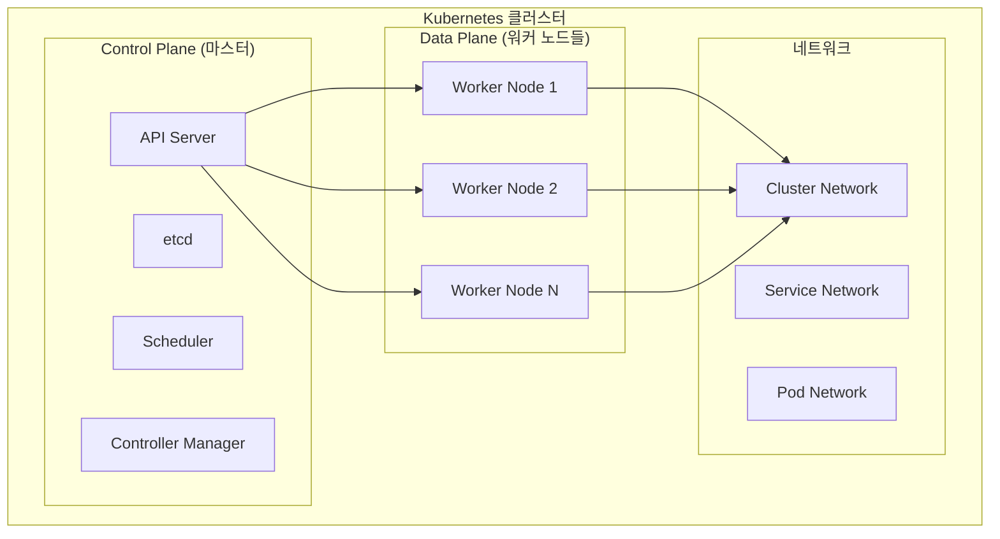
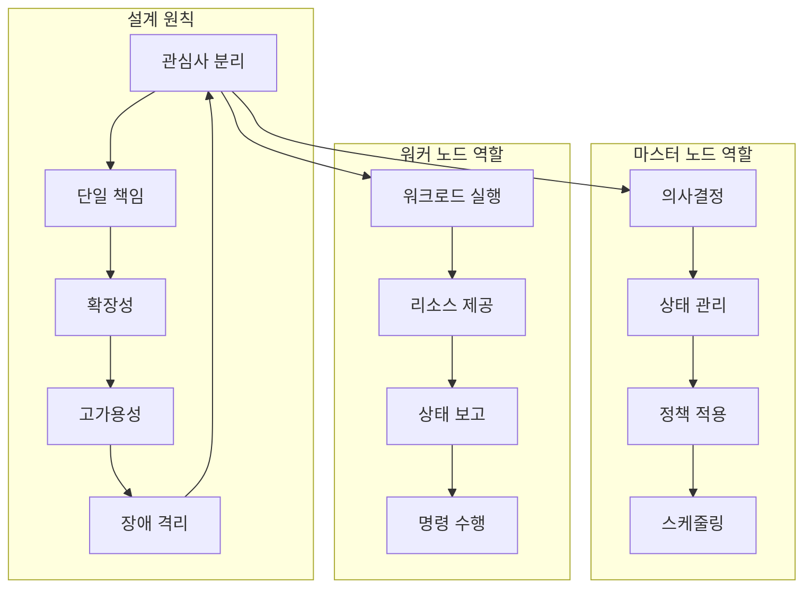
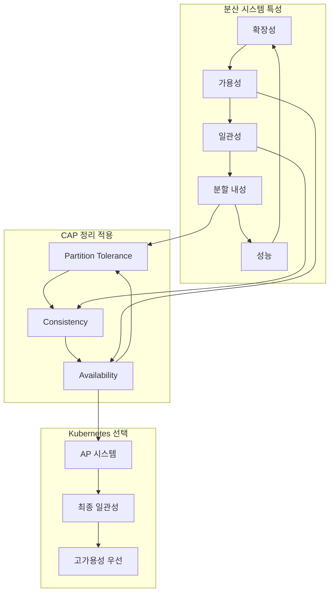
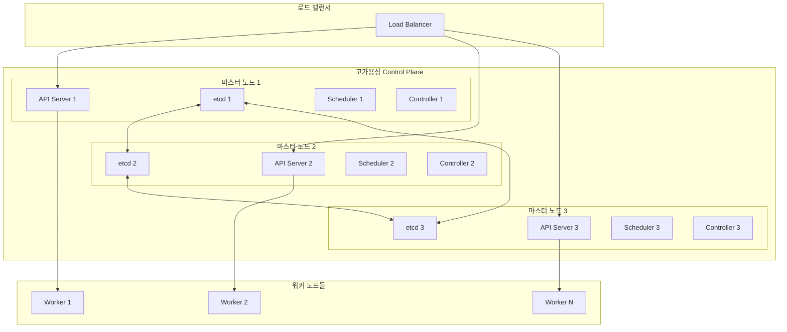
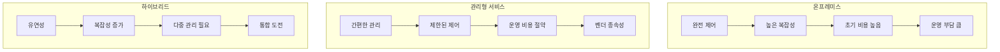

# Session 3: Kubernetes 클러스터 아키텍처

## 📍 교과과정에서의 위치
이 세션은 **Week 2 > Day 1 > Session 3**으로, Kubernetes의 전체 클러스터 아키텍처를 이해합니다. Session 2에서 학습한 오케스트레이션 필요성을 바탕으로 Kubernetes가 이를 어떻게 해결하는지 구조적으로 분석합니다.

## 학습 목표 (5분)
- **클러스터 개념**과 **전체 구조** 완전 이해
- **마스터-워커 아키텍처** 설계 원칙 학습
- **분산 시스템**으로서의 **Kubernetes 특성** 파악
- **고가용성 클러스터** 구성 방안 이해

## 1. 클러스터 개념과 전체 구조 (15분)

### Kubernetes 클러스터 정의



### 클러스터 구성 요소 분석
```
Kubernetes 클러스터 구성:

Control Plane (제어 평면):
   🔹 API Server: 모든 통신의 중앙 허브
   🔹 etcd: 클러스터 상태 저장소
   🔹 Scheduler: Pod 배치 결정
   🔹 Controller Manager: 상태 관리 및 제어
   🔹 Cloud Controller Manager: 클라우드 통합

Data Plane (데이터 평면):
   🔹 kubelet: 노드 에이전트
   🔹 kube-proxy: 네트워크 프록시
   🔹 Container Runtime: 컨테이너 실행 엔진
   🔹 Pod: 최소 배포 단위

네트워크 계층:
   🔹 Cluster Network: 노드 간 통신
   🔹 Pod Network: Pod 간 통신
   🔹 Service Network: 서비스 추상화
   🔹 Ingress: 외부 트래픽 진입점
```

## 2. 마스터-워커 아키텍처 설계 원칙 (12분)

### 아키텍처 설계 철학



### 마스터-워커 통신 패턴
```
Control Plane ↔ Worker Node 통신:

API 기반 통신:
   🔹 RESTful HTTP/HTTPS
   🔹 gRPC (내부 컴포넌트)
   🔹 인증서 기반 보안
   🔹 RBAC 권한 제어

통신 방향:
   🔹 Master → Worker: 명령 전달
   🔹 Worker → Master: 상태 보고
   🔹 양방향: 실시간 모니터링
   🔹 비동기: 이벤트 기반 처리

보안 고려사항:
   🔹 TLS 암호화 통신
   🔹 상호 인증 (mTLS)
   🔹 네트워크 정책 적용
   🔹 최소 권한 원칙
```

## 3. 분산 시스템으로서의 Kubernetes 특성 (10분)

### 분산 시스템 특성 분석



### 분산 시스템 도전과제와 해결방안
```
분산 시스템 도전과제:

네트워크 분할 (Network Partition):
   🔹 문제: 노드 간 통신 단절
   🔹 해결: 쿼럼 기반 의사결정
   🔹 도구: etcd 클러스터링
   🔹 전략: 다중 가용영역 배치

상태 일관성 (State Consistency):
   🔹 문제: 분산된 상태 동기화
   🔹 해결: 단일 진실 소스 (etcd)
   🔹 패턴: 이벤트 소싱
   🔹 보장: 최종 일관성

장애 감지와 복구:
   🔹 문제: 부분 장애 감지 어려움
   🔹 해결: 헬스체크 메커니즘
   🔹 도구: Liveness/Readiness Probe
   🔹 전략: 자동 복구 및 재시작

확장성 관리:
   🔹 문제: 성능과 일관성 트레이드오프
   🔹 해결: 계층적 아키텍처
   🔹 패턴: 샤딩과 파티셔닝
   🔹 최적화: 캐싱과 로드 밸런싱
```

## 4. 고가용성 클러스터 구성 방안 (10분)

### HA 클러스터 아키텍처



### HA 구성 모범 사례
```
고가용성 클러스터 구성:

마스터 노드 HA:
   🔹 홀수 개 노드 (3, 5, 7개)
   🔹 다중 가용영역 분산
   🔹 로드 밸런서 앞단 배치
   🔹 자동 장애조치 구성

etcd 클러스터 HA:
   🔹 쿼럼 기반 의사결정
   🔹 리더 선출 메커니즘
   🔹 데이터 복제 및 동기화
   🔹 백업 및 복구 전략

네트워크 HA:
   🔹 다중 네트워크 경로
   🔹 네트워크 분할 대응
   🔹 DNS 기반 서비스 디스커버리
   🔹 로드 밸런싱 및 헬스체크

스토리지 HA:
   🔹 분산 스토리지 시스템
   🔹 데이터 복제 및 백업
   🔹 스냅샷 및 복구
   🔹 성능 모니터링

모니터링 및 알림:
   🔹 클러스터 상태 모니터링
   🔹 성능 메트릭 수집
   🔹 장애 알림 시스템
   🔹 자동 복구 메커니즘
```

## 5. 클러스터 배포 모델 비교 (5분)

### 배포 모델 분석



## 💬 그룹 토론: 분산 시스템으로서 Kubernetes의 장단점 (8분)

### 토론 주제
**"분산 시스템으로서 Kubernetes의 장점과 단점은 무엇이며, 이를 어떻게 극복할 수 있는가?"**

### 토론 가이드라인

#### 장점 분석 (3분)
- **확장성**: 수평적 확장과 탄력성
- **가용성**: 장애 격리와 자동 복구
- **유연성**: 다양한 워크로드 지원

#### 단점 분석 (3분)
- **복잡성**: 학습 곡선과 운영 복잡성
- **오버헤드**: 리소스 사용량과 성능
- **디버깅**: 분산 환경에서의 문제 추적

#### 극복 방안 (2분)
- **도구와 자동화**: 관리 도구 활용
- **모니터링**: 관찰성 향상
- **교육과 문화**: 팀 역량 강화

## 💡 핵심 개념 정리
- **클러스터**: 여러 노드가 하나의 시스템으로 동작하는 구조
- **마스터-워커**: 제어와 실행의 분리를 통한 확장성 확보
- **분산 시스템**: CAP 정리를 고려한 가용성 우선 설계
- **고가용성**: 단일 장애점 제거와 자동 복구 메커니즘

## 📚 참고 자료
- [Kubernetes Architecture](https://kubernetes.io/docs/concepts/overview/components/)
- [High Availability Clusters](https://kubernetes.io/docs/setup/production-environment/tools/kubeadm/high-availability/)
- [Distributed Systems Concepts](https://kubernetes.io/docs/concepts/cluster-administration/)

## 다음 세션 준비
다음 세션에서는 **마스터 노드와 워커 노드**의 구체적인 역할과 구성 요소를 자세히 학습합니다. 각 노드 타입의 책임과 상호작용을 심화 분석할 예정입니다.