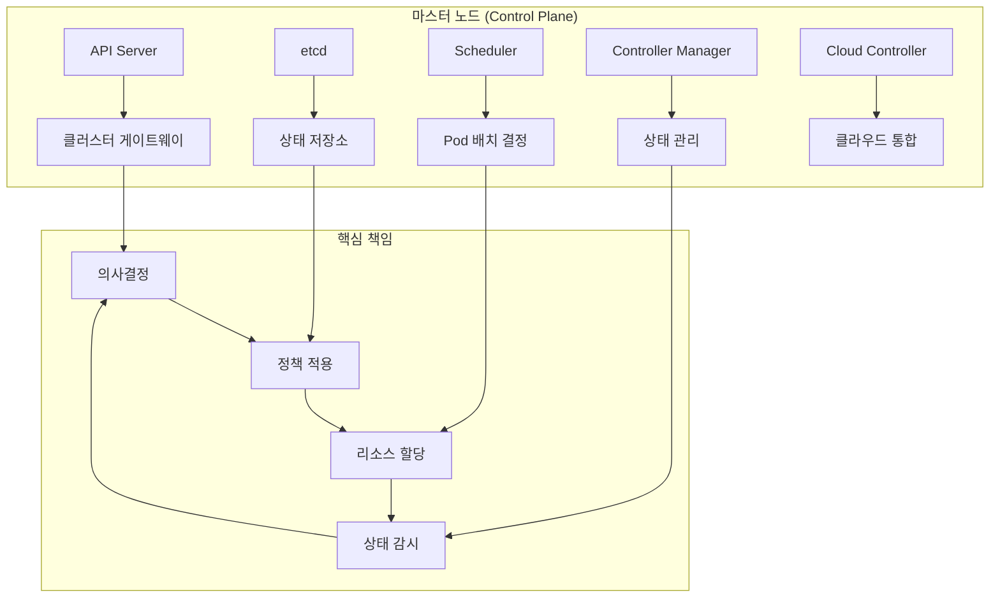
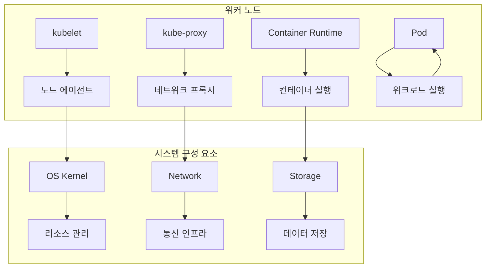
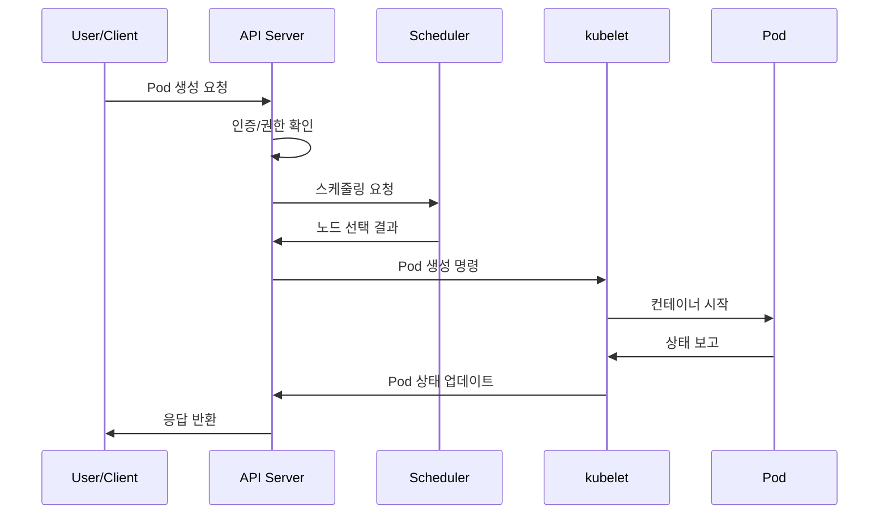
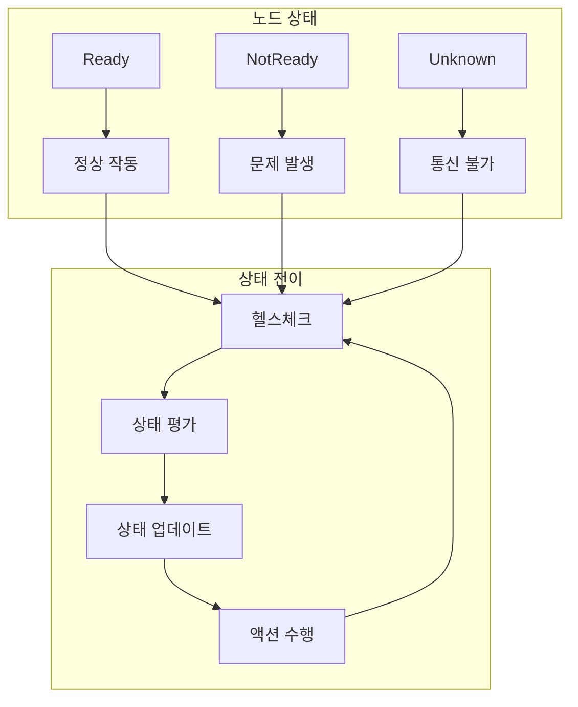

# Session 4: 마스터 노드와 워커 노드

## 📍 교과과정에서의 위치
이 세션은 **Week 2 > Day 1 > Session 4**로, Kubernetes 클러스터의 핵심 구성 요소인 마스터 노드와 워커 노드의 역할과 책임을 구체적으로 분석합니다.

## 학습 목표 (5분)
- **마스터 노드**의 **역할**과 **책임** 완전 이해
- **워커 노드**의 **구성**과 **기능** 학습
- **노드 간 통신** 메커니즘 파악
- **노드 관리**와 **상태 모니터링** 이해

## 1. 마스터 노드의 역할과 책임 (15분)

### Control Plane 구성 요소



### 마스터 노드 핵심 기능
```
Control Plane 핵심 기능:

클러스터 관리:
├── 전체 클러스터 상태 관리
├── 리소스 할당 및 스케줄링
├── 정책 적용 및 준수
└── 보안 및 접근 제어

API 게이트웨이:
├── 모든 요청의 중앙 처리
├── 인증 및 권한 부여
├── 요청 검증 및 변환
└── 감사 로깅

상태 관리:
├── Desired State 정의
├── Current State 모니터링
├── 차이 감지 및 조정
└── 이벤트 생성 및 전파

스케줄링:
├── Pod 배치 최적화
├── 리소스 요구사항 고려
├── 제약 조건 적용
└── 부하 분산
```

## 2. 워커 노드의 구성과 기능 (12분)

### 워커 노드 아키텍처



### 워커 노드 핵심 역할
```
워커 노드 핵심 역할:

워크로드 실행:
├── Pod 생성 및 관리
├── 컨테이너 라이프사이클 관리
├── 리소스 모니터링
└── 상태 보고

네트워킹:
├── Pod 간 통신 지원
├── Service 트래픽 라우팅
├── 로드 밸런싱
└── 네트워크 정책 적용

스토리지:
├── 볼륨 마운트
├── 데이터 영속성
├── 스토리지 드라이버 관리
└── 백업 및 복구

모니터링:
├── 노드 상태 보고
├── 리소스 사용량 수집
├── 헬스체크 수행
└── 로그 수집
```

## 3. 노드 간 통신 메커니즘 (10분)

### 통신 아키텍처



## 4. 노드 관리와 상태 모니터링 (10분)

### 노드 상태 관리



## 💬 그룹 토론: 마스터 노드 고가용성 구성의 중요성 (8분)

### 토론 주제
**"마스터 노드의 고가용성 구성이 왜 중요하며, 어떤 방식으로 구현해야 하는가?"**

## 💡 핵심 개념 정리
- **마스터 노드**: 클러스터의 두뇌 역할, 의사결정과 관리
- **워커 노드**: 실제 워크로드 실행, 리소스 제공
- **통신 메커니즘**: API 기반 비동기 통신
- **상태 관리**: 지속적인 모니터링과 자동 복구

## 다음 세션 준비
다음 세션에서는 **etcd와 API 서버**의 구체적인 역할과 기능을 학습합니다.