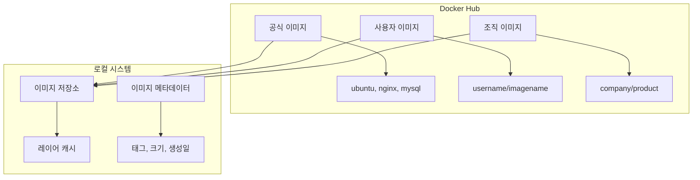
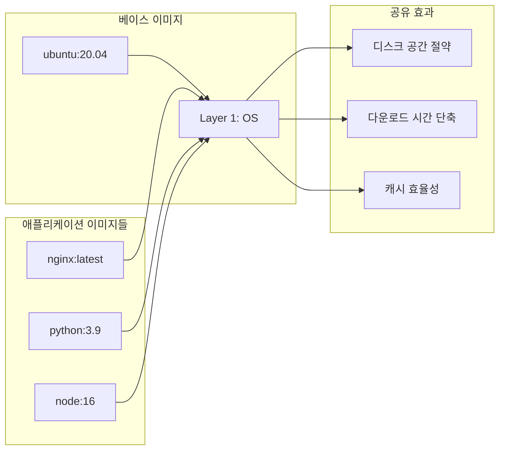
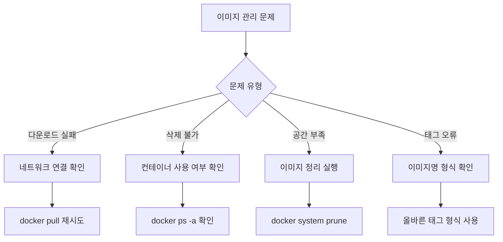

# Session 4: 기본 명령어 실습 - 이미지 관리

## 📍 교과과정에서의 위치
이 세션은 **Week 2 > Day 1 > Session 4**로, Docker 이미지 관리의 핵심 명령어들을 실습합니다. Week 1에서 학습한 이미지 레이어 이론을 바탕으로 실제 이미지 검색, 다운로드, 관리 과정을 체험합니다.

## 학습 목표 (5분)
- **이미지 검색, 다운로드, 관리** 개념 이해
- **pull, images, rmi** 명령어 실습
- **이미지 태그**와 **버전 관리** 실무 적용

## 1. 이론: 이미지 관리 개념 (20분)

### Docker 이미지 생태계



### 이미지 네이밍 규칙

```
이미지 이름 구조:
[registry]/[namespace]/[repository]:[tag]

예시:
├── nginx:latest                    # 공식 이미지, 최신 태그
├── nginx:1.21-alpine              # 특정 버전, Alpine 기반
├── docker.io/library/nginx:latest # 전체 경로 명시
├── myregistry.com/myapp:v1.0      # 프라이빗 레지스트리
└── username/myapp:dev             # 사용자 이미지, 개발 태그

태그 규칙:
├── latest: 기본 태그 (생략 가능)
├── 버전: 1.0, 2.1.3, v1.0.0
├── 환경: dev, staging, prod
└── 플랫폼: alpine, ubuntu, slim
```

### 이미지 레이어와 공유



## 2. 실습: 이미지 검색 및 정보 확인 (12분)

### Docker Hub에서 이미지 검색

```bash
# 이미지 검색 (Docker Hub)
docker search nginx

# 검색 결과 필터링 (공식 이미지만)
docker search --filter is-official=true nginx

# 검색 결과 제한 (상위 5개)
docker search --limit 5 python

# 별점 기준 필터링 (25개 이상)
docker search --filter stars=25 redis
```

### 예상 검색 결과 분석

```
NAME                DESCRIPTION                     STARS     OFFICIAL   AUTOMATED
nginx               Official build of Nginx.        15000+    [OK]       
nginx/nginx-ingress NGINX Ingress Controller...     500+                 [OK]
jwilder/nginx-proxy Automated Nginx reverse proxy   2000+                [OK]
```

### 이미지 상세 정보 확인

```bash
# Docker Hub API를 통한 태그 확인 (curl 사용)
curl -s "https://registry.hub.docker.com/v2/repositories/library/nginx/tags/" | jq '.results[].name'

# 또는 웹 브라우저에서 확인
# https://hub.docker.com/_/nginx
```

## 3. 실습: 이미지 다운로드 (pull) (8분)

### 기본 이미지 다운로드

```bash
# 최신 버전 다운로드 (latest 태그)
docker pull nginx

# 특정 버전 다운로드
docker pull nginx:1.21-alpine

# 여러 태그 동시 다운로드
docker pull ubuntu:20.04
docker pull ubuntu:22.04
docker pull python:3.9
docker pull python:3.10-slim
```

### 다운로드 과정 분석

```bash
# 다운로드 진행 상황 확인
docker pull redis:latest

# 예상 출력:
# latest: Pulling from library/redis
# a2abf6c4d29d: Pull complete 
# c7063460b523: Pull complete 
# 4f4fb700ef54: Pull complete 
# 5d63b154079e: Pull complete 
# 6b199dea92a8: Pull complete 
# 8f3cf4c4d6c2: Pull complete 
# Digest: sha256:b6124ab2e45cc332e16398022a411d7e37181f21e849924e1ebe2a8a2c2f38e5
# Status: Downloaded newer image for redis:latest
```

### 플랫폼별 이미지 다운로드

```bash
# 특정 아키텍처 이미지 다운로드
docker pull --platform linux/amd64 nginx:alpine
docker pull --platform linux/arm64 nginx:alpine

# 현재 플랫폼 확인
docker version --format '{{.Server.Arch}}'
```

## 4. 실습: 이미지 목록 및 관리 (10분)

### 로컬 이미지 목록 확인

```bash
# 모든 이미지 목록
docker images

# 특정 이미지만 필터링
docker images nginx

# 이미지 크기순 정렬
docker images --format "table {{.Repository}}\t{{.Tag}}\t{{.Size}}" | sort -k3 -h

# 댕글링 이미지 확인 (태그가 없는 이미지)
docker images -f dangling=true

# 이미지 상세 정보 (JSON 형식)
docker images --format json
```

### 이미지 정보 상세 분석

```bash
# 특정 이미지 상세 정보
docker inspect nginx:latest

# 이미지 히스토리 (레이어 정보)
docker history nginx:latest

# 이미지 크기 분석
docker images --format "table {{.Repository}}\t{{.Tag}}\t{{.Size}}\t{{.CreatedAt}}"
```

### 이미지 태그 관리

```bash
# 기존 이미지에 새 태그 추가
docker tag nginx:latest my-nginx:v1.0
docker tag nginx:latest localhost:5000/nginx:latest

# 태그 확인
docker images nginx
docker images my-nginx

# 이미지 ID로 태그 추가
docker tag <image_id> my-app:production
```

## 5. 실습: 이미지 삭제 및 정리 (10분)

### 개별 이미지 삭제

```bash
# 태그로 이미지 삭제
docker rmi nginx:1.21-alpine

# 이미지 ID로 삭제
docker rmi <image_id>

# 강제 삭제 (컨테이너가 사용 중인 경우)
docker rmi -f nginx:latest

# 여러 이미지 동시 삭제
docker rmi ubuntu:20.04 ubuntu:22.04 python:3.9
```

### 대량 이미지 정리

```bash
# 사용하지 않는 이미지 모두 삭제
docker image prune

# 댕글링 이미지만 삭제
docker image prune -f

# 모든 미사용 이미지 삭제 (태그된 것 포함)
docker image prune -a

# 특정 기간 이전 이미지 삭제
docker image prune -a --filter "until=24h"
```

### 시스템 전체 정리

```bash
# 전체 시스템 정리 (이미지, 컨테이너, 네트워크, 볼륨)
docker system prune

# 모든 것 삭제 (사용 중이지 않은 모든 리소스)
docker system prune -a

# 볼륨까지 포함하여 정리
docker system prune -a --volumes

# 정리 전 예상 공간 확인
docker system df
```

## 6. 실습 과제 및 문제 해결 (5분)

### 종합 실습 과제

```bash
# 과제 1: 이미지 관리 워크플로우
# 1. Python 3.9와 3.10 이미지 다운로드
docker pull python:3.9
docker pull python:3.10-slim

# 2. 이미지 크기 비교
docker images python

# 3. 커스텀 태그 생성
docker tag python:3.9 my-python:stable
docker tag python:3.10-slim my-python:latest

# 4. 불필요한 이미지 정리
docker rmi python:3.9
docker image prune
```

### 일반적인 문제 해결



### 유용한 팁과 트릭

```bash
# 이미지 크기 최적화 확인
docker images --format "table {{.Repository}}\t{{.Tag}}\t{{.Size}}" | grep -E "(alpine|slim)"

# 최근 생성된 이미지 확인
docker images --format "table {{.Repository}}\t{{.Tag}}\t{{.CreatedSince}}" | head -10

# 특정 패턴의 이미지 일괄 삭제
docker rmi $(docker images --format "{{.Repository}}:{{.Tag}}" | grep "my-app")

# 이미지 레이어 공유 현황 확인
docker system df -v
```

## 💡 핵심 키워드
- **docker pull**: 이미지 다운로드 명령어
- **docker images**: 로컬 이미지 목록 확인
- **docker rmi**: 이미지 삭제 명령어
- **이미지 태그**: 버전 및 변형 관리 시스템

## 📚 참고 자료
- [Docker Hub](https://hub.docker.com/)
- [docker pull 레퍼런스](https://docs.docker.com/engine/reference/commandline/pull/)
- [이미지 관리 가이드](https://docs.docker.com/engine/reference/commandline/images/)

## 🔧 실습 체크리스트
- [ ] Docker Hub에서 이미지 검색 성공
- [ ] 다양한 태그의 이미지 다운로드
- [ ] 로컬 이미지 목록 확인 및 분석
- [ ] 이미지 태그 생성 및 관리
- [ ] 불필요한 이미지 정리 실습
