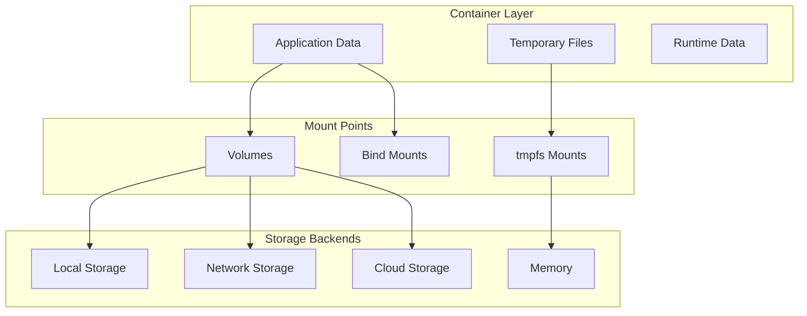
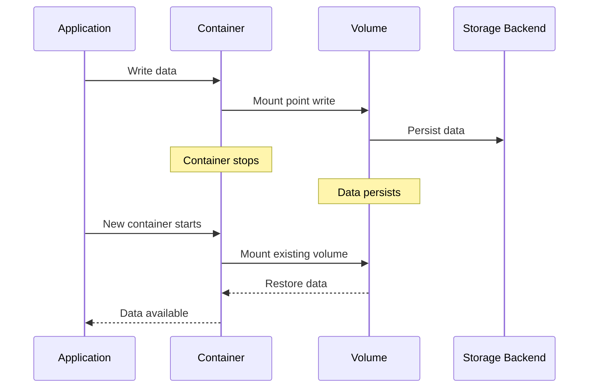

# Session 4: Docker 볼륨 및 스토리지 관리 심화

## 📍 교과과정에서의 위치
이 세션은 **Week 2 > Day 1 > Session 4**로, Docker 네트워킹 이해를 바탕으로 데이터 영속성과 스토리지 관리의 내부 메커니즘을 심화 분석합니다.

## 학습 목표 (5분)
- **Docker 스토리지 아키텍처**와 **데이터 영속성** 메커니즘 이해
- **볼륨 드라이버**와 **마운트 타입** 비교 분석
- **스토리지 성능 최적화**와 **백업 전략** 설계 원리

## 1. 이론: Docker 스토리지 아키텍처 (20분)

### 스토리지 계층 구조



### 마운트 타입 상세 분석

```
Docker 스토리지 마운트 타입:

Volumes (권장):
├── Docker가 완전히 관리하는 스토리지
├── /var/lib/docker/volumes/ 경로에 저장
├── 호스트 파일시스템과 독립적
├── 여러 컨테이너 간 안전한 공유
├── 볼륨 드라이버를 통한 확장성
├── 백업 및 마이그레이션 용이
├── Docker CLI/API로 완전한 관리
└── 프로덕션 환경 권장 방식

Bind Mounts:
├── 호스트 파일시스템 직접 마운트
├── 절대 경로 또는 상대 경로 지정
├── 호스트 파일 시스템 구조에 의존
├── 개발 환경에서 소스 코드 공유
├── 설정 파일 및 로그 파일 접근
├── 보안 위험 증가 (호스트 접근)
├── 플랫폼 종속성 높음
└── 개발 및 디버깅 용도

tmpfs Mounts:
├── 메모리 기반 임시 파일시스템
├── 컨테이너 종료 시 데이터 소멸
├── 민감한 데이터 임시 저장
├── 고성능 임시 작업 공간
├── 디스크 I/O 없는 최고 성능
├── 메모리 사용량 증가
├── 데이터 영속성 없음
└── 캐시 및 임시 데이터 용도
```

## 2. 이론: 데이터 영속성 및 생명주기 관리 (15분)

### 데이터 생명주기 패턴



### 스토리지 성능 최적화

```
성능 최적화 전략:

I/O 최적화:
├── SSD vs HDD 선택 기준
├── 파일시스템 튜닝 (ext4, xfs)
├── 마운트 옵션 최적화
├── 블록 크기 및 정렬
├── 다중 볼륨 I/O 분산
└── tmpfs 활용 임시 데이터

백업 전략:
├── 볼륨 스냅샷 생성
├── 애플리케이션 일관성 백업
├── 증분 백업 구현
├── 클라우드 동기화
├── 재해 복구 계획
└── 자동화된 복구 프로세스
```

## 3. 개념 예시: 스토리지 구성 분석 (12분)

### 볼륨 관리 예시

```bash
# 볼륨 생성 및 관리 (개념 예시)
docker volume create mydata
docker volume inspect mydata

# 예상 출력:
# "Mountpoint": "/var/lib/docker/volumes/mydata/_data"
```

### 마운트 타입 비교 예시

```bash
# 볼륨 마운트 (개념 예시)
docker run -v mydata:/app/data nginx

# 바인드 마운트 (개념 예시)
docker run -v /host/path:/app/data nginx

# tmpfs 마운트 (개념 예시)
docker run --tmpfs /app/temp nginx
```

## 4. 토론 및 정리 (8분)

### 핵심 개념 정리
- **볼륨 시스템**을 통한 데이터 영속성 보장
- **마운트 타입별** 특성과 적절한 사용 사례
- **성능 최적화**를 위한 스토리지 계층 설계
- **백업 및 재해 복구** 전략의 중요성

### 토론 주제
"컨테이너 환경에서 데이터 영속성과 성능을 동시에 만족하는 스토리지 아키텍처 설계 방안은 무엇인가?"

## 💡 핵심 키워드
- **스토리지 타입**: Volume, Bind Mount, tmpfs
- **볼륨 드라이버**: local, NFS, 클라우드 스토리지
- **성능 최적화**: I/O 튜닝, 캐싱, 네트워크 스토리지
- **데이터 관리**: 백업, 복구, 마이그레이션

## 📚 참고 자료
- [Docker 스토리지 개요](https://docs.docker.com/storage/)
- [볼륨 관리](https://docs.docker.com/storage/volumes/)
