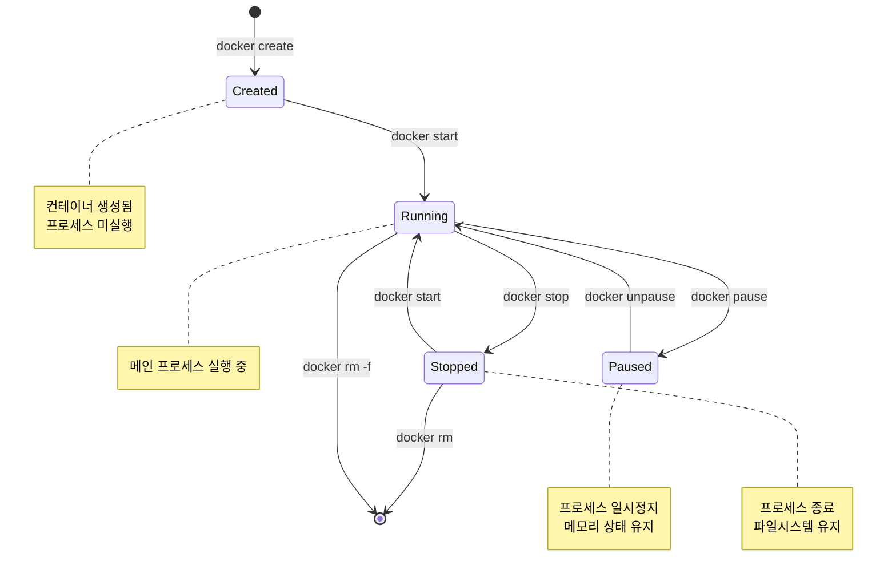
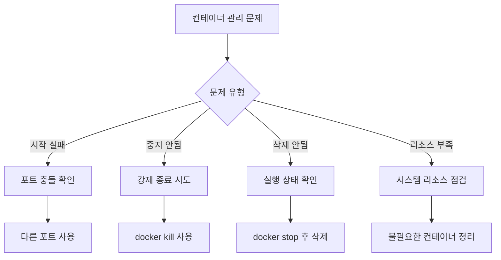

# Session 5: 기본 명령어 실습 - 컨테이너 관리

## 📍 교과과정에서의 위치
이 세션은 **Week 2 > Day 1 > Session 5**로, 컨테이너의 상태 관리와 라이프사이클 제어 명령어를 실습합니다. Week 1에서 학습한 컨테이너 상태 모델을 실제 명령어로 조작하는 과정을 체험합니다.

## 학습 목표 (5분)
- **컨테이너 상태**와 **관리 명령어** 이해
- **ps, start, stop, rm** 명령어 실습
- **컨테이너 라이프사이클** 실제 조작 경험

## 1. 이론: 컨테이너 상태와 관리 명령어 (20분)

### 컨테이너 상태 다이어그램



### 컨테이너 관리 명령어 분류

```
생성 및 실행:
├── docker create    # 컨테이너 생성 (실행 안함)
├── docker run       # 생성 + 실행
└── docker start     # 중지된 컨테이너 시작

상태 제어:
├── docker stop      # 정상 종료 (SIGTERM)
├── docker kill      # 강제 종료 (SIGKILL)
├── docker restart   # 재시작
├── docker pause     # 일시정지
└── docker unpause   # 일시정지 해제

정보 확인:
├── docker ps        # 실행 중인 컨테이너
├── docker ps -a     # 모든 컨테이너
├── docker inspect   # 상세 정보
├── docker logs      # 로그 확인
└── docker stats     # 리소스 사용량

정리:
├── docker rm        # 컨테이너 삭제
├── docker rm -f     # 강제 삭제
└── docker container prune  # 일괄 정리
```

### 컨테이너 식별 방법

```
컨테이너 식별자:
├── Container ID (전체): sha256:1234567890abcdef...
├── Container ID (단축): 1234567890ab
├── Container Name: my-nginx, web-server
└── 태그 조합: nginx:latest

사용 예시:
├── docker stop 1234567890ab
├── docker stop my-nginx
├── docker logs web-server
└── docker rm $(docker ps -aq)  # 모든 컨테이너 ID
```

## 2. 실습: 컨테이너 생성 및 시작 (12분)

### docker create vs docker run 비교

```bash
# 방법 1: create + start (2단계)
docker create --name nginx-test nginx:latest
docker ps -a  # Created 상태 확인
docker start nginx-test
docker ps     # Running 상태 확인

# 방법 2: run (1단계)
docker run -d --name nginx-run nginx:latest
docker ps     # 바로 Running 상태
```

### 다양한 실행 모드 실습

```bash
# 백그라운드 실행 (-d, --detach)
docker run -d --name bg-nginx nginx:latest

# 포그라운드 실행 (기본값)
docker run --name fg-nginx nginx:latest
# Ctrl+C로 종료

# 대화형 실행 (-it)
docker run -it --name interactive-ubuntu ubuntu:20.04 /bin/bash
# 컨테이너 내부에서 명령어 실행 후 exit

# 일회성 실행 (--rm)
docker run --rm --name temp-container alpine:latest echo "Hello World"
# 실행 완료 후 자동 삭제됨
```

### 컨테이너 이름 관리

```bash
# 자동 생성된 이름 확인
docker run -d nginx:latest
docker ps  # 랜덤 이름 확인 (예: quirky_einstein)

# 명시적 이름 지정
docker run -d --name my-web-server nginx:latest
docker run -d --name my-database mysql:8.0

# 이름 중복 오류 체험
docker run -d --name my-web-server nginx:latest  # 오류 발생
```

## 3. 실습: 컨테이너 상태 확인 (8분)

### docker ps 명령어 활용

```bash
# 실행 중인 컨테이너만 표시
docker ps

# 모든 컨테이너 표시 (중지된 것 포함)
docker ps -a

# 최근 생성된 컨테이너 N개
docker ps -n 3

# 마지막으로 생성된 컨테이너
docker ps -l

# 컨테이너 ID만 표시
docker ps -q
docker ps -aq  # 모든 컨테이너 ID
```

### 출력 형식 커스터마이징

```bash
# 기본 출력 형식
docker ps --format "table {{.ID}}\t{{.Image}}\t{{.Status}}\t{{.Names}}"

# JSON 형식으로 출력
docker ps --format json

# 특정 필드만 출력
docker ps --format "{{.Names}}: {{.Status}}"

# 필터링과 함께 사용
docker ps --filter "status=running" --format "table {{.Names}}\t{{.Image}}"
```

### 컨테이너 상세 정보 확인

```bash
# 컨테이너 상세 정보 (JSON)
docker inspect nginx-test

# 특정 정보만 추출
docker inspect --format='{{.State.Status}}' nginx-test
docker inspect --format='{{.NetworkSettings.IPAddress}}' nginx-test
docker inspect --format='{{.Config.Image}}' nginx-test

# 여러 컨테이너 동시 조회
docker inspect nginx-test mysql-db redis-cache
```

## 4. 실습: 컨테이너 제어 (10분)

### 컨테이너 중지 및 시작

```bash
# 정상 종료 (SIGTERM 신호)
docker stop nginx-test

# 강제 종료 (SIGKILL 신호)
docker kill nginx-test

# 시간 제한 설정 (10초 후 강제 종료)
docker stop -t 10 nginx-test

# 컨테이너 재시작
docker restart nginx-test

# 여러 컨테이너 동시 제어
docker stop nginx-test mysql-db redis-cache
docker start nginx-test mysql-db redis-cache
```

### 컨테이너 일시정지

```bash
# 컨테이너 일시정지 (프로세스 freeze)
docker pause nginx-test
docker ps  # Status가 "Paused" 표시

# 일시정지 해제
docker unpause nginx-test
docker ps  # Status가 "Up" 표시

# 일시정지 중 리소스 확인
docker stats --no-stream nginx-test
```

### 실행 중인 컨테이너 모니터링

```bash
# 실시간 리소스 사용량
docker stats

# 특정 컨테이너만 모니터링
docker stats nginx-test mysql-db

# 한 번만 출력 (실시간 아님)
docker stats --no-stream

# 컨테이너 내부 프로세스 확인
docker top nginx-test
```

## 5. 실습: 컨테이너 삭제 및 정리 (10분)

### 개별 컨테이너 삭제

```bash
# 중지된 컨테이너 삭제
docker rm nginx-test

# 실행 중인 컨테이너 강제 삭제
docker rm -f nginx-run

# 여러 컨테이너 동시 삭제
docker rm container1 container2 container3

# 볼륨과 함께 삭제
docker rm -v nginx-with-volume
```

### 대량 컨테이너 정리

```bash
# 모든 중지된 컨테이너 삭제
docker container prune

# 확인 없이 강제 삭제
docker container prune -f

# 특정 조건의 컨테이너 삭제
docker rm $(docker ps -aq --filter "status=exited")

# 특정 이미지로 생성된 컨테이너 삭제
docker rm $(docker ps -aq --filter "ancestor=nginx")
```

### 필터를 활용한 선택적 정리

```bash
# 24시간 이전에 생성된 컨테이너 삭제
docker container prune --filter "until=24h"

# 특정 라벨을 가진 컨테이너 삭제
docker rm $(docker ps -aq --filter "label=environment=test")

# 종료 코드가 0이 아닌 컨테이너 삭제
docker rm $(docker ps -aq --filter "exited=1")
```

## 6. 종합 실습 및 문제 해결 (5분)

### 컨테이너 관리 워크플로우

```bash
# 실습 시나리오: 웹 서버 관리
# 1. 웹 서버 컨테이너 생성 및 실행
docker run -d -p 8080:80 --name production-web nginx:latest

# 2. 상태 확인
docker ps
docker stats --no-stream production-web

# 3. 설정 변경을 위한 일시 중지
docker pause production-web

# 4. 일시정지 해제 및 재시작
docker unpause production-web
docker restart production-web

# 5. 로그 확인
docker logs production-web

# 6. 유지보수 완료 후 정리
docker stop production-web
docker rm production-web
```

### 일반적인 문제 해결



### 유용한 명령어 조합

```bash
# 모든 컨테이너 강제 중지
docker stop $(docker ps -q)

# 모든 컨테이너 삭제 (실행 중인 것 포함)
docker rm -f $(docker ps -aq)

# 특정 패턴 이름의 컨테이너만 삭제
docker rm $(docker ps -aq --filter "name=test-*")

# 컨테이너 상태별 개수 확인
docker ps -a --format "{{.Status}}" | sort | uniq -c
```

## 💡 핵심 키워드
- **docker ps**: 컨테이너 목록 및 상태 확인
- **docker start/stop**: 컨테이너 시작/중지 제어
- **docker rm**: 컨테이너 삭제 및 정리
- **컨테이너 라이프사이클**: Created → Running → Stopped

## 📚 참고 자료
- [docker ps 레퍼런스](https://docs.docker.com/engine/reference/commandline/ps/)
- [컨테이너 라이프사이클](https://docs.docker.com/engine/reference/run/)
- [docker rm 가이드](https://docs.docker.com/engine/reference/commandline/rm/)

## 🔧 실습 체크리스트
- [ ] 컨테이너 생성과 시작 분리 실습
- [ ] 다양한 실행 모드 체험
- [ ] 컨테이너 상태 확인 및 모니터링
- [ ] 컨테이너 제어 명령어 실습
- [ ] 컨테이너 정리 및 대량 관리
