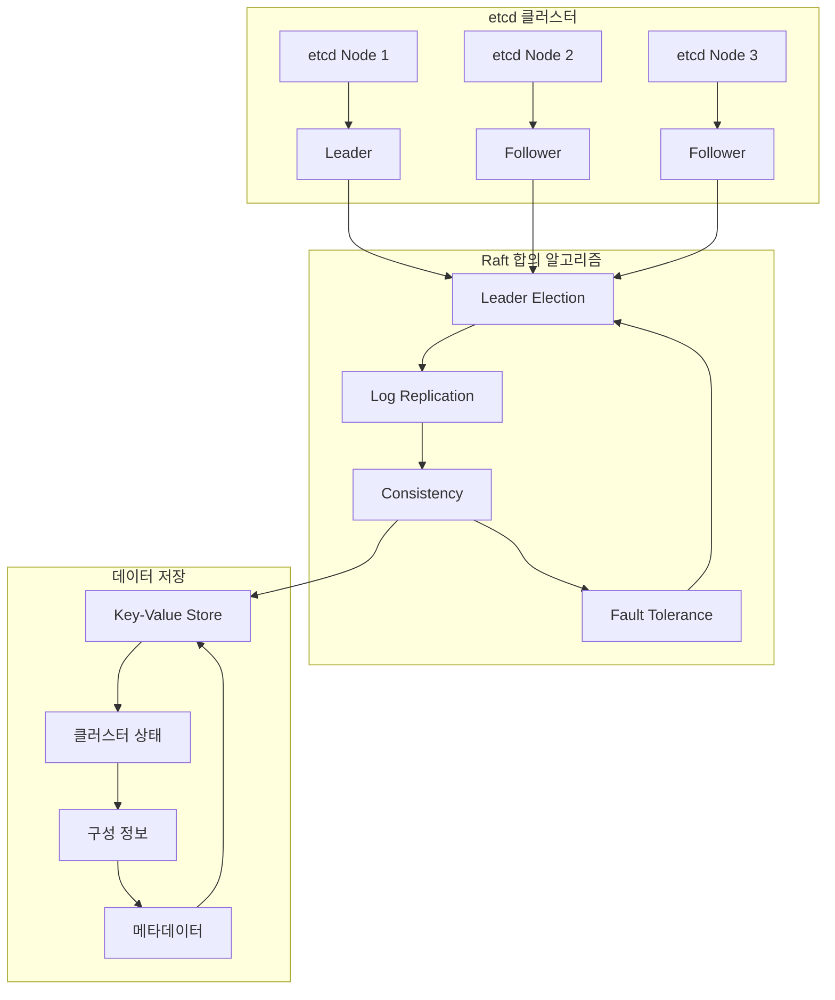
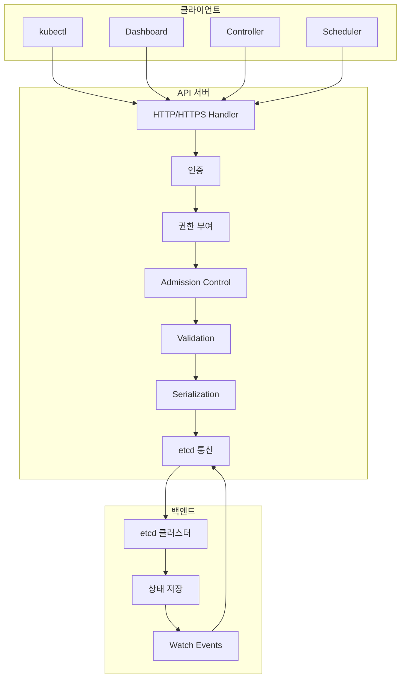
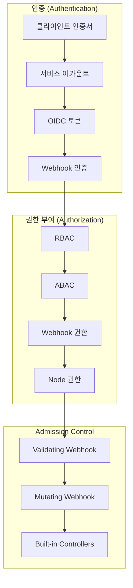

# Session 5: etcd와 API 서버

## 📍 교과과정에서의 위치
이 세션은 **Week 2 > Day 1 > Session 5**로, Kubernetes의 핵심 구성 요소인 etcd와 API 서버의 역할과 상호작용을 심화 학습합니다.

## 학습 목표 (5분)
- **etcd**의 **분산 저장소** 역할과 **일관성 보장** 메커니즘 이해
- **API 서버**의 **중앙 집중식 관리** 기능과 **RESTful API** 구조 학습
- **선언적 구성 모델**의 **장점**과 **구현 방식** 파악
- **인증**과 **권한 부여** 메커니즘 이해

## 1. etcd의 역할과 분산 저장소 개념 (15분)

### etcd 아키텍처



### etcd 핵심 특징
```
etcd 분산 저장소 특징:

일관성 보장:
├── Strong Consistency (강한 일관성)
├── ACID 트랜잭션 지원
├── Raft 합의 알고리즘 사용
└── 쿼럼 기반 의사결정

고가용성:
├── 다중 노드 클러스터
├── 자동 리더 선출
├── 장애 노드 자동 복구
└── 데이터 복제 및 동기화

성능 최적화:
├── 메모리 기반 인덱싱
├── 압축 및 스냅샷
├── Watch 메커니즘
└── 배치 처리 지원

보안:
├── TLS 암호화 통신
├── 클라이언트 인증서
├── RBAC 권한 제어
└── 감사 로깅
```

## 2. API 서버의 중앙 집중식 관리 기능 (12분)

### API 서버 아키텍처



### API 서버 핵심 기능
```
API 서버 핵심 기능:

요청 처리:
├── RESTful API 제공
├── HTTP/HTTPS 프로토콜 지원
├── JSON/YAML 형식 처리
└── 비동기 처리 지원

보안 관리:
├── 인증 (Authentication)
├── 권한 부여 (Authorization)
├── Admission Control
└── 감사 로깅

상태 관리:
├── 리소스 CRUD 작업
├── 상태 검증 및 변환
├── 이벤트 생성 및 전파
└── Watch 스트림 제공

확장성:
├── 수평적 확장 지원
├── 로드 밸런싱
├── 캐싱 메커니즘
└── 성능 최적화
```

## 3. RESTful API와 선언적 구성 모델 (10분)

### RESTful API 구조

```mermaid
graph LR
    subgraph "HTTP Methods"
        A[GET] --> B[리소스 조회]
        C[POST] --> D[리소스 생성]
        E[PUT] --> F[리소스 업데이트]
        G[DELETE] --> H[리소스 삭제]
        I[PATCH] --> J[부분 업데이트]
    end
    
    subgraph "리소스 경로"
        K[/api/v1/pods] --> L[Pod 리소스]
        M[/api/v1/services] --> N[Service 리소스]
        O[/apis/apps/v1/deployments] --> P[Deployment 리소스]
    end
    
    B --> K
    D --> M
    F --> O
```

### 선언적 구성 모델
```
선언적 vs 명령적 구성:

선언적 구성 (Declarative):
├── 원하는 최종 상태 정의
├── 시스템이 자동으로 달성
├── 멱등성 보장
└── 자동 복구 가능

명령적 구성 (Imperative):
├── 단계별 명령 실행
├── 수동 상태 관리
├── 순서 의존성
└── 오류 시 수동 복구

Kubernetes 접근법:
├── YAML/JSON 매니페스트
├── kubectl apply 명령
├── Controller 패턴
└── Reconciliation Loop
```

## 4. 인증과 권한 부여 메커니즘 (10분)

### 보안 아키텍처



## 💬 그룹 토론: 선언적 구성 모델의 장점과 한계 (8분)

### 토론 주제
**"선언적 구성 모델이 가져다주는 장점과 한계는 무엇이며, 어떤 상황에서 가장 효과적인가?"**

## 💡 핵심 개념 정리
- **etcd**: 분산 키-값 저장소, 클러스터 상태의 단일 진실 소스
- **API 서버**: 모든 통신의 중앙 허브, RESTful API 제공
- **선언적 구성**: 원하는 상태 정의, 자동 달성
- **보안**: 다층 보안 모델, 인증-권한-승인 제어

## 다음 세션 준비
다음 세션에서는 **스케줄러와 컨트롤러**의 역할과 동작 원리를 학습합니다.