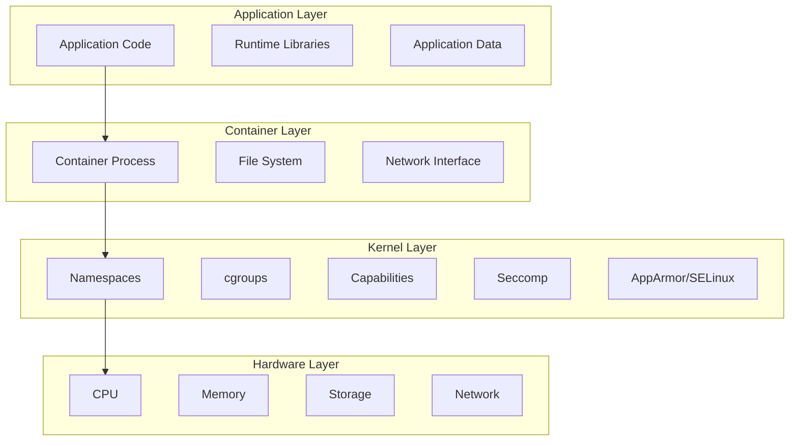
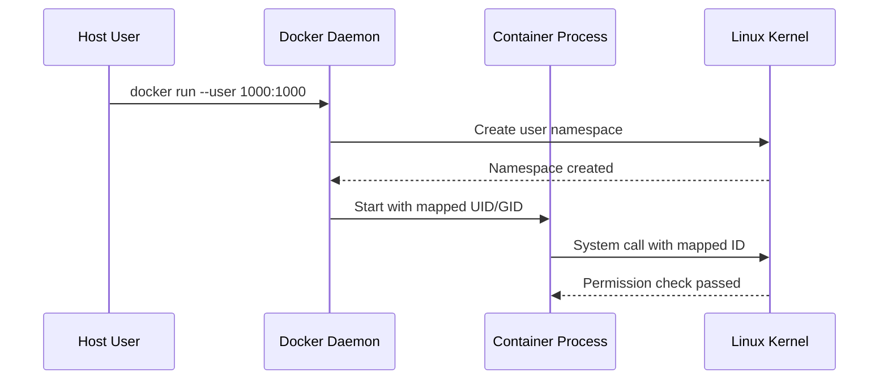

# Session 5: Docker 보안 모델 및 격리 메커니즘

## 📍 교과과정에서의 위치
이 세션은 **Week 2 > Day 1 > Session 5**로, Docker 스토리지 관리 이해를 바탕으로 컨테이너 보안 아키텍처와 격리 메커니즘을 심화 분석합니다.

## 학습 목표 (5분)
- **컨테이너 보안 모델**과 **격리 경계** 완전 이해
- **권한 관리 시스템**과 **보안 강화 기법** 분석
- **취약점 관리**와 **보안 모니터링** 전략 설계

## 1. 이론: 컨테이너 보안 아키텍처 (20분)

### 보안 격리 계층 구조



### Linux 보안 메커니즘 활용

```
컨테이너 격리 기술:

Namespaces (네임스페이스):
├── PID: 프로세스 ID 격리
├── NET: 네트워크 인터페이스 격리
├── MNT: 파일시스템 마운트 격리
├── UTS: 호스트명/도메인명 격리
├── IPC: 프로세스 간 통신 격리
├── USER: 사용자/그룹 ID 격리
└── TIME: 시스템 시간 격리 (최신)

Control Groups (cgroups):
├── CPU 사용률 제한
├── 메모리 사용량 제한
├── 디스크 I/O 제한
├── 네트워크 대역폭 제한
├── 디바이스 접근 제어
├── 프로세스 수 제한
└── 리소스 회계 및 모니터링

Linux Capabilities:
├── 루트 권한 세분화
├── 필요한 권한만 부여
├── CAP_NET_ADMIN: 네트워크 관리
├── CAP_SYS_ADMIN: 시스템 관리
├── CAP_DAC_OVERRIDE: 파일 권한 무시
├── CAP_SETUID: 사용자 ID 변경
└── 최소 권한 원칙 적용

Seccomp (Secure Computing):
├── 시스템 콜 필터링
├── 허용된 시스템 콜만 실행
├── 공격 표면 최소화
├── 기본 프로필 제공
├── 사용자 정의 프로필 지원
└── 성능 오버헤드 최소화
```

## 2. 이론: 권한 관리 및 접근 제어 (15분)

### 사용자 및 권한 모델



### 보안 강화 기법

```
Docker 보안 강화:

사용자 네임스페이스:
├── 컨테이너 내 root를 호스트 일반 사용자로 매핑
├── 권한 에스컬레이션 방지
├── 호스트 시스템 보호 강화
├── 파일 시스템 권한 격리
├── 프로세스 권한 제한
└── 컨테이너 탈출 공격 완화

읽기 전용 파일시스템:
├── 루트 파일시스템 읽기 전용 마운트
├── 런타임 파일 변조 방지
├── 임시 파일용 tmpfs 볼륨 사용
├── 로그 및 데이터용 별도 볼륨
├── 애플리케이션 무결성 보장
└── 악성 코드 실행 차단

네트워크 보안:
├── 사용자 정의 네트워크 사용
├── 불필요한 포트 노출 금지
├── 네트워크 세그멘테이션
├── 트래픽 암호화 (TLS)
├── 방화벽 규칙 적용
└── 네트워크 모니터링

리소스 제한:
├── CPU 사용률 제한
├── 메모리 사용량 제한
├── 파일 디스크립터 제한
├── 프로세스 수 제한
├── 네트워크 대역폭 제한
└── DoS 공격 방지
```

## 3. 이론: 취약점 관리 및 보안 모니터링 (10분)

### 이미지 보안 스캔

```
보안 스캔 전략:

정적 분석:
├── 베이스 이미지 취약점 스캔
├── 패키지 의존성 분석
├── 설정 파일 보안 검사
├── 시크릿 정보 노출 검사
├── 라이선스 컴플라이언스
└── 보안 정책 준수 확인

동적 분석:
├── 런타임 행동 모니터링
├── 네트워크 트래픽 분석
├── 파일 시스템 변경 감지
├── 프로세스 실행 추적
├── 시스템 콜 모니터링
└── 이상 행동 탐지

지속적 모니터링:
├── 실시간 보안 이벤트 수집
├── 로그 분석 및 상관관계 분석
├── 침입 탐지 시스템 (IDS)
├── 보안 정보 및 이벤트 관리 (SIEM)
├── 자동화된 대응 체계
└── 보안 대시보드 및 알림
```

### 보안 모범 사례

```
컨테이너 보안 모범 사례:

이미지 보안:
├── 신뢰할 수 있는 베이스 이미지 사용
├── 최소한의 패키지만 설치
├── 정기적인 이미지 업데이트
├── 이미지 서명 및 검증
├── 프라이빗 레지스트리 사용
└── 멀티 스테이지 빌드 활용

런타임 보안:
├── 비특권 사용자로 실행
├── 읽기 전용 루트 파일시스템
├── 불필요한 권한 제거
├── 네트워크 정책 적용
├── 리소스 제한 설정
└── 보안 프로필 적용

운영 보안:
├── 정기적인 보안 패치
├── 접근 제어 및 인증
├── 감사 로그 수집
├── 백업 및 복구 계획
├── 인시던트 대응 절차
└── 보안 교육 및 훈련
```

## 4. 개념 예시: 보안 구성 분석 (12분)

### 보안 강화 실행 예시

```bash
# 보안 강화된 컨테이너 실행 (개념 예시)
docker run -d \
  --user 1000:1000 \
  --read-only \
  --tmpfs /tmp \
  --cap-drop ALL \
  --cap-add NET_BIND_SERVICE \
  --security-opt no-new-privileges \
  --security-opt seccomp=default.json \
  nginx:alpine
```

### 보안 스캔 예시

```bash
# 이미지 취약점 스캔 (개념 예시)
docker scan nginx:latest

# 예상 출력:
# ✓ Tested 82 dependencies for known issues
# ✗ Found 3 vulnerabilities
# 
# Issues with no direct upgrade or patch:
#   ✗ Medium severity vulnerability found in openssl
#   ✗ Low severity vulnerability found in zlib
```

### 보안 정책 적용 예시

```yaml
# Docker Compose 보안 설정 (개념 예시)
version: '3.8'
services:
  web:
    image: nginx:alpine
    user: "1000:1000"
    read_only: true
    tmpfs:
      - /tmp
      - /var/cache/nginx
    cap_drop:
      - ALL
    cap_add:
      - NET_BIND_SERVICE
    security_opt:
      - no-new-privileges:true
```

## 5. 토론 및 정리 (8분)

### 핵심 개념 정리
- **다층 보안 모델**을 통한 컨테이너 격리
- **Linux 보안 메커니즘** 활용한 권한 제어
- **취약점 관리**와 **지속적 모니터링** 체계
- **보안 모범 사례** 적용을 통한 위험 최소화

### 토론 주제
"컨테이너 환경에서 보안과 편의성의 균형을 맞추는 최적의 보안 아키텍처는 무엇인가?"

## 💡 핵심 키워드
- **격리 기술**: Namespace, cgroups, Capabilities, Seccomp
- **권한 관리**: 사용자 네임스페이스, 최소 권한 원칙
- **보안 강화**: 읽기 전용 파일시스템, 네트워크 보안
- **취약점 관리**: 보안 스캔, 모니터링, 모범 사례

## 📚 참고 자료
- [Docker 보안](https://docs.docker.com/engine/security/)
- [컨테이너 보안 가이드](https://cheatsheetseries.owasp.org/cheatsheets/Docker_Security_Cheat_Sheet.html)
