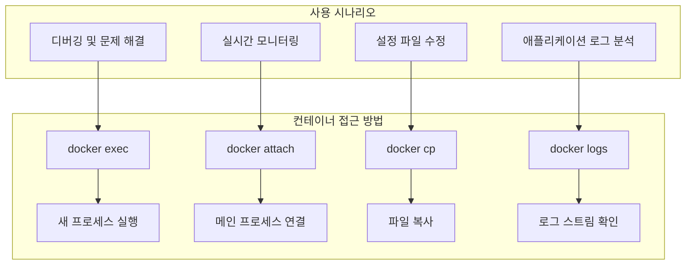
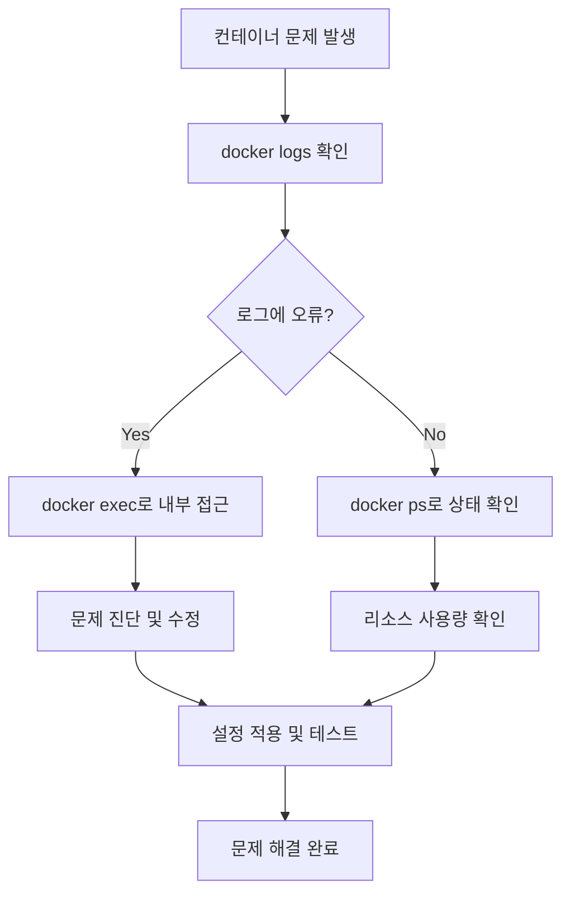

# Session 6: 컨테이너 내부 접근 및 상호작용

## 📍 교과과정에서의 위치
이 세션은 **Week 2 > Day 1 > Session 6**으로, 실행 중인 컨테이너 내부에 접근하고 상호작용하는 방법을 실습합니다. Week 1에서 학습한 컨테이너 격리 개념을 바탕으로 실제 컨테이너 내부 조작을 체험합니다.

## 학습 목표 (5분)
- **컨테이너 내부 접근** 방법과 원리 이해
- **exec, attach** 명령어로 컨테이너 조작
- **파일 복사** 및 **로그 확인** 실습

## 1. 이론: 컨테이너 내부 접근 방법과 원리 (20분)

### 컨테이너 접근 방식 비교



### exec vs attach 차이점

| 특성 | docker exec | docker attach |
|------|-------------|---------------|
| **프로세스** | 새 프로세스 생성 | 기존 메인 프로세스 연결 |
| **독립성** | 독립적 실행 | 메인 프로세스와 연동 |
| **종료 영향** | 컨테이너에 영향 없음 | 컨테이너 종료 가능 |
| **사용 목적** | 디버깅, 관리 작업 | 실시간 모니터링 |
| **다중 접속** | 여러 세션 가능 | 하나의 세션만 |

### 컨테이너 내부 프로세스 구조

```
컨테이너 프로세스 트리:
├── PID 1: 메인 프로세스 (nginx, apache, etc.)
├── PID 2-N: 자식 프로세스들
└── exec으로 실행된 프로세스들
    ├── bash 세션
    ├── 디버깅 도구
    └── 임시 작업 프로세스

네임스페이스 공유:
├── PID 네임스페이스: 프로세스 격리
├── Network 네임스페이스: 네트워크 공유
├── Mount 네임스페이스: 파일시스템 공유
└── User 네임스페이스: 사용자 권한
```

## 2. 실습: docker exec 명령어 활용 (15분)

### 기본 exec 사용법

```bash
# 실습용 컨테이너 준비
docker run -d --name web-server nginx:latest
docker run -d --name db-server mysql:8.0 -e MYSQL_ROOT_PASSWORD=mypassword

# 기본 명령어 실행
docker exec web-server ls -la /etc/nginx/
docker exec web-server ps aux
docker exec web-server whoami

# 대화형 셸 접근
docker exec -it web-server /bin/bash

# 컨테이너 내부에서 실행할 명령어들:
ls -la
cd /usr/share/nginx/html/
cat index.html
nginx -v
exit
```

### 다양한 exec 옵션 활용

```bash
# 특정 사용자로 실행
docker exec -u root web-server id
docker exec -u www-data web-server id

# 환경 변수 설정
docker exec -e MY_VAR=test web-server env | grep MY_VAR

# 작업 디렉토리 지정
docker exec -w /var/log web-server pwd
docker exec -w /var/log web-server ls -la

# 백그라운드 실행 (-d 옵션)
docker exec -d web-server touch /tmp/background-task
docker exec web-server ls -la /tmp/
```

### 실용적인 exec 활용 사례

```bash
# 설정 파일 확인 및 수정
docker exec -it web-server nano /etc/nginx/nginx.conf

# 로그 파일 실시간 모니터링
docker exec -it web-server tail -f /var/log/nginx/access.log

# 패키지 설치 (임시)
docker exec -it web-server apt update
docker exec -it web-server apt install -y curl vim

# 네트워크 연결 테스트
docker exec web-server curl -I http://localhost
docker exec web-server netstat -tlnp
```

## 3. 실습: docker attach 명령어 (8분)

### attach 기본 사용법

```bash
# 포그라운드로 실행 중인 컨테이너에 연결
docker run -it --name interactive-container ubuntu:20.04

# 다른 터미널에서 attach
docker attach interactive-container

# 주의: Ctrl+C 시 컨테이너가 종료됨
# 안전한 분리: Ctrl+P, Ctrl+Q
```

### attach vs exec 비교 실습

```bash
# 테스트용 컨테이너 실행 (로그 출력)
docker run -d --name log-container alpine:latest sh -c 'while true; do echo "$(date): Hello World"; sleep 2; done'

# attach로 로그 스트림 확인
docker attach log-container
# Ctrl+C로 종료하면 컨테이너도 종료됨

# 컨테이너 재시작
docker start log-container

# exec로 별도 프로세스 실행
docker exec -it log-container sh
# exit로 종료해도 컨테이너는 계속 실행됨
```

### attach 사용 시 주의사항

```bash
# 안전한 분리 방법 연습
docker run -it --name detach-practice ubuntu:20.04

# 컨테이너 내부에서:
echo "This is main process"
# Ctrl+P, Ctrl+Q로 안전하게 분리

# 다시 연결
docker attach detach-practice

# 완전 종료
exit
```

## 4. 실습: 파일 복사 (docker cp) (12분)

### 호스트 ↔ 컨테이너 파일 복사

```bash
# 테스트용 파일 준비
echo "Hello from host" > host-file.txt
mkdir host-directory
echo "File in directory" > host-directory/dir-file.txt

# 호스트 → 컨테이너 복사
docker cp host-file.txt web-server:/tmp/
docker cp host-directory web-server:/tmp/

# 컨테이너 내부에서 확인
docker exec web-server ls -la /tmp/
docker exec web-server cat /tmp/host-file.txt
docker exec web-server cat /tmp/host-directory/dir-file.txt
```

### 컨테이너 → 호스트 복사

```bash
# 컨테이너 내부에 파일 생성
docker exec web-server sh -c 'echo "Generated in container" > /tmp/container-file.txt'
docker exec web-server sh -c 'mkdir -p /tmp/logs && echo "Log entry" > /tmp/logs/app.log'

# 컨테이너 → 호스트 복사
docker cp web-server:/tmp/container-file.txt ./
docker cp web-server:/tmp/logs ./container-logs

# 복사된 파일 확인
cat container-file.txt
cat container-logs/app.log
```

### 실용적인 파일 복사 사례

```bash
# 설정 파일 백업
docker cp web-server:/etc/nginx/nginx.conf ./nginx-backup.conf

# 수정된 설정 파일 적용
cp nginx-backup.conf nginx-modified.conf
# nginx-modified.conf 파일 수정 후
docker cp nginx-modified.conf web-server:/etc/nginx/nginx.conf

# 설정 적용 확인
docker exec web-server nginx -t
docker exec web-server nginx -s reload

# 로그 파일 수집
docker cp web-server:/var/log/nginx ./nginx-logs
ls -la nginx-logs/
```

## 5. 실습: 로그 확인 및 모니터링 (10분)

### 기본 로그 확인

```bash
# 전체 로그 확인
docker logs web-server

# 최근 로그만 확인 (마지막 10줄)
docker logs --tail 10 web-server

# 실시간 로그 스트림
docker logs -f web-server

# 타임스탬프 포함
docker logs -t web-server

# 특정 시간 이후 로그
docker logs --since "2024-01-01T00:00:00" web-server
docker logs --since "1h" web-server
```

### 고급 로그 필터링

```bash
# 로그 검색 (grep과 조합)
docker logs web-server 2>&1 | grep "error"
docker logs web-server 2>&1 | grep -i "404"

# 로그 파일로 저장
docker logs web-server > web-server-logs.txt
docker logs --since "24h" web-server > recent-logs.txt

# 여러 컨테이너 로그 동시 확인
docker logs -f web-server &
docker logs -f db-server &
# jobs 명령어로 백그라운드 작업 확인
```

### 컨테이너 내부 로그 파일 접근

```bash
# 애플리케이션별 로그 파일 확인
docker exec web-server ls -la /var/log/nginx/
docker exec web-server tail -f /var/log/nginx/access.log
docker exec web-server tail -f /var/log/nginx/error.log

# 로그 파일 복사 및 분석
docker cp web-server:/var/log/nginx/access.log ./
docker cp web-server:/var/log/nginx/error.log ./

# 로그 분석 예시
grep "GET" access.log | wc -l
grep "POST" access.log | wc -l
grep "404" access.log
```

## 6. 종합 실습 및 문제 해결 (5분)

### 컨테이너 디버깅 시나리오

```bash
# 문제 상황 시뮬레이션
docker run -d --name problem-container nginx:latest

# 1단계: 컨테이너 상태 확인
docker ps
docker logs problem-container

# 2단계: 내부 접근하여 문제 진단
docker exec -it problem-container /bin/bash

# 컨테이너 내부에서:
ps aux                    # 프로세스 확인
netstat -tlnp            # 포트 확인
ls -la /etc/nginx/       # 설정 파일 확인
nginx -t                 # 설정 문법 검사
cat /var/log/nginx/error.log  # 에러 로그 확인

# 3단계: 설정 수정 및 적용
# 필요시 설정 파일 수정
nginx -s reload          # 설정 재로드
exit

# 4단계: 외부에서 재확인
docker logs problem-container
curl -I http://localhost:80
```

### 일반적인 문제 해결 패턴



## 💡 핵심 키워드
- **docker exec**: 컨테이너 내부에서 새 프로세스 실행
- **docker attach**: 메인 프로세스에 연결
- **docker cp**: 호스트와 컨테이너 간 파일 복사
- **docker logs**: 컨테이너 로그 스트림 확인

## 📚 참고 자료
- [docker exec 레퍼런스](https://docs.docker.com/engine/reference/commandline/exec/)
- [docker attach 가이드](https://docs.docker.com/engine/reference/commandline/attach/)
- [docker cp 사용법](https://docs.docker.com/engine/reference/commandline/cp/)

## 🔧 실습 체크리스트
- [ ] docker exec로 컨테이너 내부 명령어 실행
- [ ] 대화형 셸로 컨테이너 접근
- [ ] docker attach와 exec 차이점 체험
- [ ] 파일 복사 (양방향) 실습
- [ ] 로그 확인 및 실시간 모니터링
