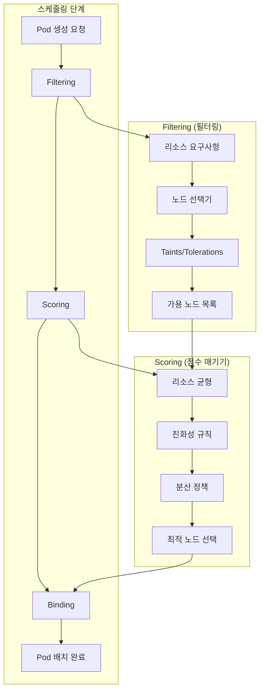
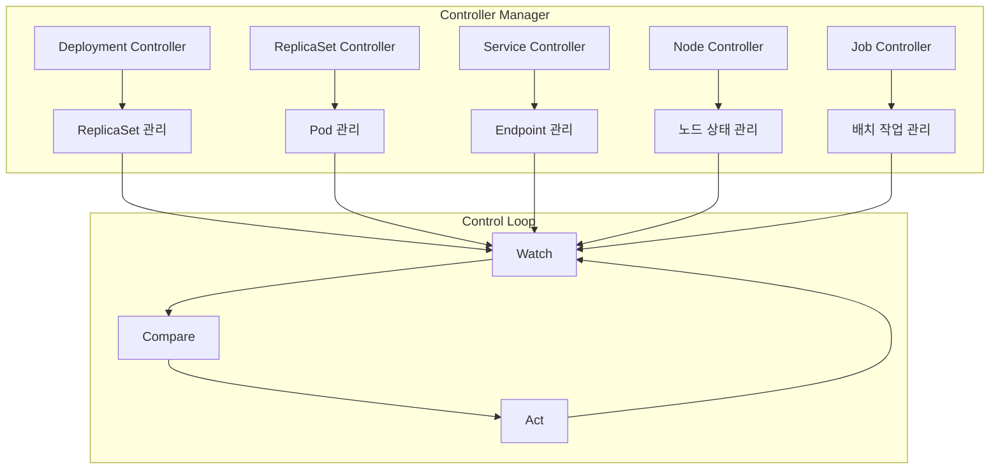
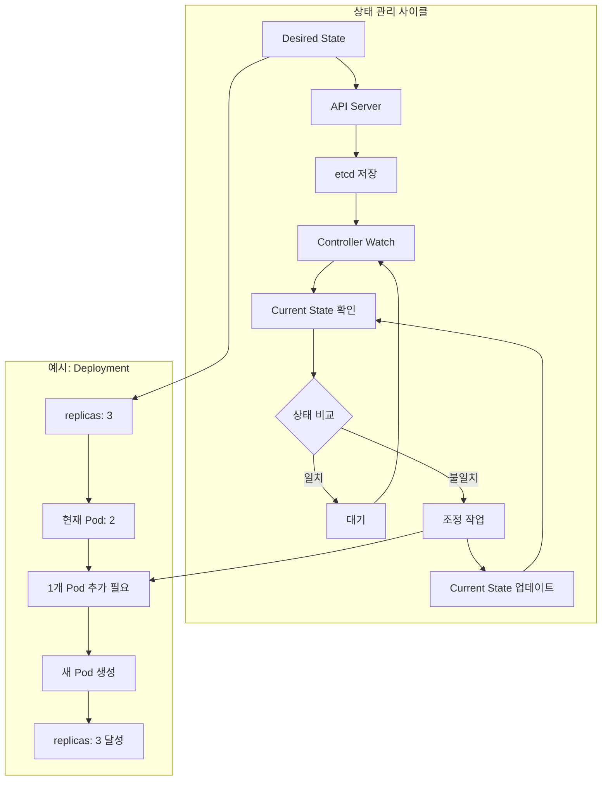
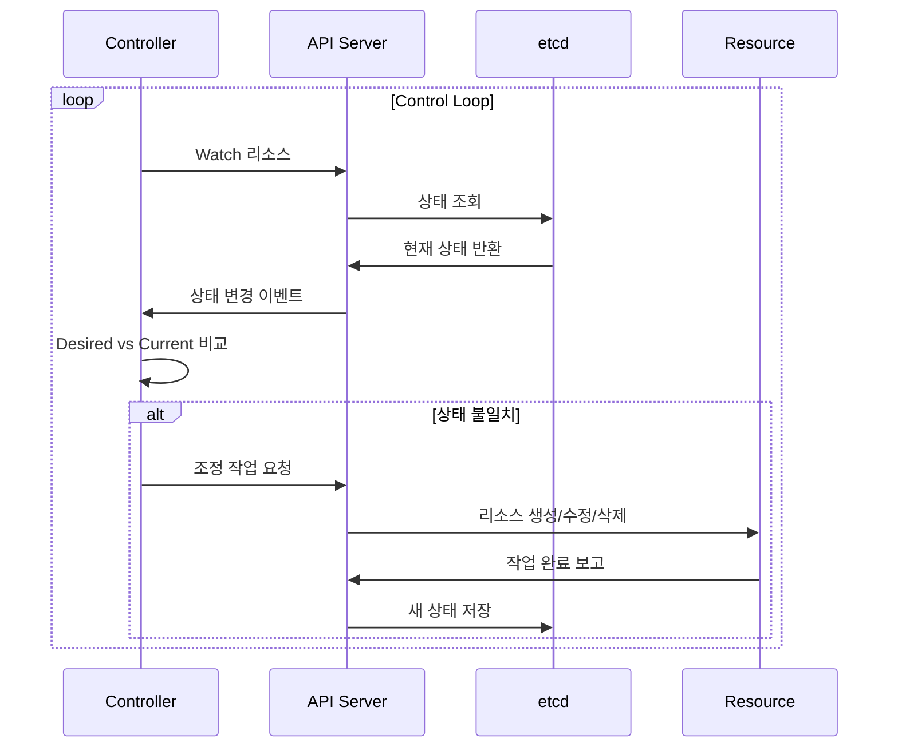

# Session 6: 스케줄러와 컨트롤러

## 📍 교과과정에서의 위치
이 세션은 **Week 2 > Day 1 > Session 6**으로, Kubernetes의 자동화 핵심인 스케줄러와 컨트롤러의 동작 원리와 역할을 학습합니다.

## 학습 목표 (5분)
- **kube-scheduler**의 **Pod 배치 알고리즘** 이해
- **Controller Manager**의 **상태 관리** 역할 학습
- **Desired State**와 **Current State** 개념 파악
- **Control Loop** 패턴과 **자동 복구** 메커니즘 이해

## 1. kube-scheduler의 Pod 배치 알고리즘 (15분)

### 스케줄링 프로세스



### 스케줄링 알고리즘 상세
```
스케줄링 알고리즘:

1단계 - Filtering (필터링):
   🔹 NodeResourcesFit: 리소스 요구사항 확인
   🔹 NodeAffinity: 노드 친화성 규칙
   🔹 PodAffinity/AntiAffinity: Pod 친화성 규칙
   🔹 TaintToleration: Taint/Toleration 매칭
   🔹 VolumeBinding: 볼륨 바인딩 가능성
   🔹 NodePorts: 포트 충돌 확인

2단계 - Scoring (점수 매기기):
   🔹 NodeResourcesFit: 리소스 활용도 최적화
   🔹 BalancedResourceAllocation: 균형잡힌 리소스 사용
   🔹 ImageLocality: 이미지 로컬리티 고려
   🔹 InterPodAffinity: Pod 간 친화성 점수
   🔹 NodeAffinity: 노드 친화성 점수
   🔹 TaintToleration: Toleration 우선순위

3단계 - Binding (바인딩):
   🔹 최고 점수 노드 선택
   🔹 API 서버에 바인딩 정보 전송
   🔹 kubelet에 Pod 생성 지시
   🔹 스케줄링 완료 확인
```

## 2. Controller Manager의 상태 관리 역할 (12분)

### 컨트롤러 아키텍처



### 주요 컨트롤러 유형
```
핵심 컨트롤러 유형:

워크로드 컨트롤러:
   🔹 Deployment Controller: 배포 관리
   🔹 ReplicaSet Controller: 복제본 관리
   🔹 StatefulSet Controller: 상태 저장 앱 관리
   🔹 DaemonSet Controller: 데몬 프로세스 관리
   🔹 Job Controller: 배치 작업 관리
   🔹 CronJob Controller: 스케줄된 작업 관리

서비스 컨트롤러:
   🔹 Service Controller: 서비스 관리
   🔹 Endpoint Controller: 엔드포인트 관리
   🔹 Ingress Controller: 외부 접근 관리
   🔹 NetworkPolicy Controller: 네트워크 정책

인프라 컨트롤러:
   🔹 Node Controller: 노드 상태 관리
   🔹 Namespace Controller: 네임스페이스 관리
   🔹 PersistentVolume Controller: 스토리지 관리
   🔹 ServiceAccount Controller: 계정 관리
```

## 3. Desired State와 Current State 개념 (10분)

### 상태 관리 모델



### 상태 조정 메커니즘
```
상태 조정 (Reconciliation) 과정:

상태 감지:
   🔹 Watch API를 통한 실시간 모니터링
   🔹 리소스 변경 이벤트 수신
   🔹 주기적 상태 확인
   🔹 장애 감지 및 알림

차이 분석:
   🔹 Desired State vs Current State 비교
   🔹 변경 필요 사항 식별
   🔹 우선순위 결정
   🔹 실행 계획 수립

조정 실행:
   🔹 필요한 리소스 생성/수정/삭제
   🔹 단계별 실행 및 검증
   🔹 롤백 메커니즘 준비
   🔹 상태 업데이트

검증 및 모니터링:
   🔹 조정 결과 확인
   🔹 새로운 Current State 기록
   🔹 성공/실패 이벤트 생성
   🔹 다음 사이클 준비
```

## 4. Control Loop 패턴과 자동 복구 (10분)

### Control Loop 패턴



### 자동 복구 시나리오
```
자동 복구 시나리오:

Pod 장애 복구:
   🔹 Pod 상태 모니터링 (Liveness Probe)
   🔹 장애 Pod 감지 및 종료
   🔹 새로운 Pod 자동 생성
   🔹 서비스 트래픽 자동 재라우팅

노드 장애 복구:
   🔹 노드 상태 모니터링 (Node Controller)
   🔹 응답 없는 노드 감지
   🔹 해당 노드의 Pod 다른 노드로 이동
   🔹 클러스터 용량 자동 조정

리소스 부족 대응:
   🔹 리소스 사용량 모니터링
   🔹 임계값 초과 감지
   🔹 자동 스케일링 트리거
   🔹 추가 리소스 할당

구성 변경 적용:
   🔹 매니페스트 변경 감지
   🔹 롤링 업데이트 실행
   🔹 헬스체크 기반 검증
   🔹 문제 시 자동 롤백
```

## 💬 그룹 토론: 자동화된 상태 관리의 핵심 원리 (8분)

### 토론 주제
**"Kubernetes의 자동화된 상태 관리가 기존 시스템 관리 방식과 다른 점은 무엇이며, 어떤 장점을 제공하는가?"**

## 💡 핵심 개념 정리
- **스케줄러**: 최적의 노드 선택을 위한 필터링과 점수 매기기
- **컨트롤러**: Control Loop 패턴을 통한 지속적 상태 관리
- **Desired State**: 원하는 최종 상태의 선언적 정의
- **자동 복구**: 장애 감지와 자동 조정을 통한 시스템 안정성

## 다음 세션 준비
다음 세션에서는 **kubelet과 kube-proxy**의 역할과 기능을 학습합니다.