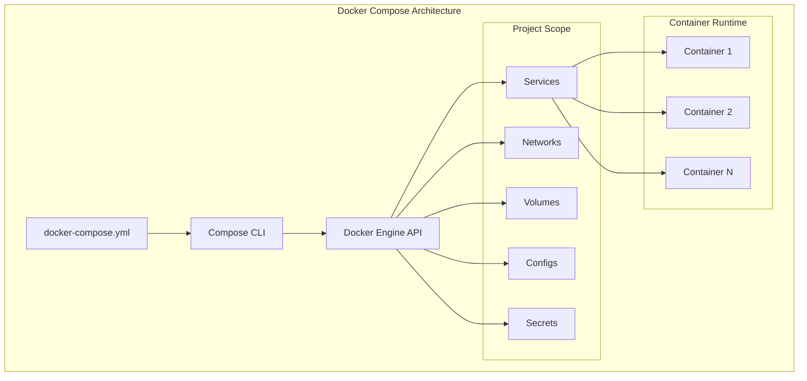
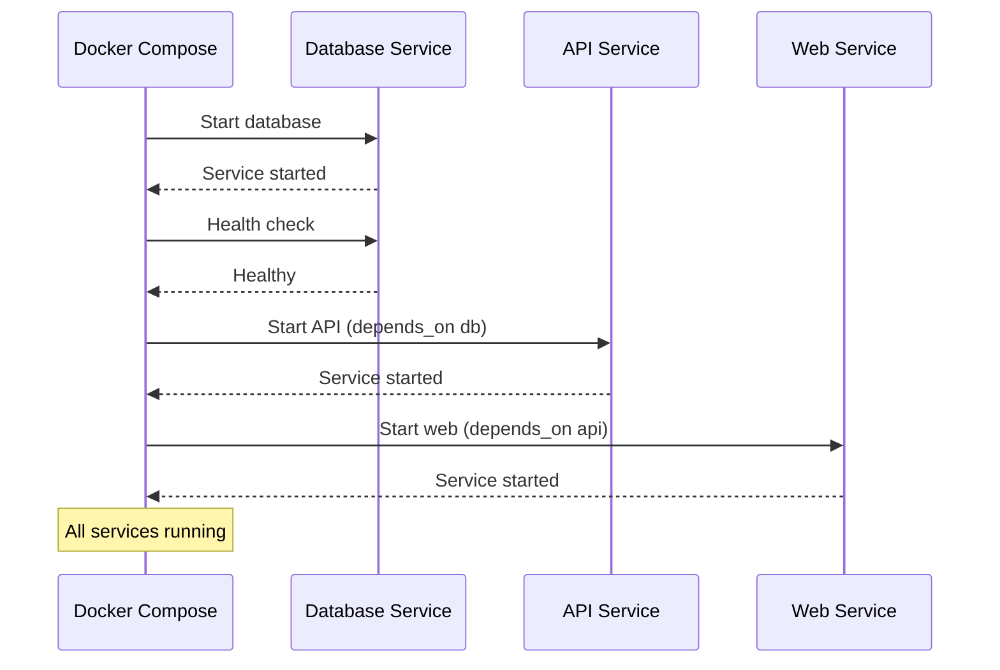

# Session 6: Docker Compose 아키텍처 및 서비스 오케스트레이션

## 📍 교과과정에서의 위치
이 세션은 **Week 2 > Day 1 > Session 6**으로, Docker 보안 모델 이해를 바탕으로 멀티 컨테이너 애플리케이션의 오케스트레이션 아키텍처를 심화 분석합니다.

## 학습 목표 (5분)
- **Docker Compose 아키텍처**와 **서비스 정의 모델** 완전 이해
- **네트워킹 및 볼륨 오케스트레이션** 메커니즘 분석
- **스케일링 및 로드 밸런싱** 전략과 **의존성 관리** 원리

## 1. 이론: Docker Compose 아키텍처 (20분)

### Compose 시스템 구조



### 서비스 정의 모델

```
Docker Compose 핵심 개념:

Project (프로젝트):
├── 관련된 서비스들의 논리적 그룹
├── 디렉토리 이름 또는 -p 옵션으로 정의
├── 네트워크, 볼륨 등 리소스 네임스페이스
├── 환경별 설정 분리 (dev, staging, prod)
├── 서비스 간 의존성 및 통신 관리
└── 전체 애플리케이션 생명주기 관리

Service (서비스):
├── 동일한 이미지로 실행되는 컨테이너 집합
├── 수평 확장 가능한 단위
├── 로드 밸런싱 자동 제공
├── 서비스 디스커버리 내장
├── 헬스 체크 및 재시작 정책
├── 리소스 제한 및 배치 제약
└── 롤링 업데이트 지원

Network (네트워크):
├── 서비스 간 통신 채널
├── 격리된 네트워크 세그먼트
├── DNS 기반 서비스 해석
├── 외부 네트워크 연결
├── 네트워크 정책 적용
└── 멀티 호스트 네트워킹 (Swarm)

Volume (볼륨):
├── 데이터 영속성 보장
├── 서비스 간 데이터 공유
├── 외부 볼륨 마운트
├── 백업 및 복구 지원
├── 성능 최적화 옵션
└── 클라우드 스토리지 통합
```

### YAML 구성 파일 구조 분석

```yaml
# Docker Compose 파일 구조 (개념 예시)
version: '3.8'

services:
  web:
    image: nginx:alpine
    ports:
      - "80:80"
    depends_on:
      - api
    networks:
      - frontend
    volumes:
      - ./nginx.conf:/etc/nginx/nginx.conf:ro
    deploy:
      replicas: 2
      resources:
        limits:
          cpus: '0.5'
          memory: 512M

  api:
    build:
      context: ./api
      dockerfile: Dockerfile
    environment:
      - DATABASE_URL=postgresql://user:pass@db:5432/myapp
    depends_on:
      db:
        condition: service_healthy
    networks:
      - frontend
      - backend

  db:
    image: postgres:13
    environment:
      POSTGRES_DB: myapp
      POSTGRES_USER: user
      POSTGRES_PASSWORD: pass
    volumes:
      - db_data:/var/lib/postgresql/data
    networks:
      - backend
    healthcheck:
      test: ["CMD-SHELL", "pg_isready -U user"]
      interval: 30s
      timeout: 10s
      retries: 3

networks:
  frontend:
    driver: bridge
  backend:
    driver: bridge
    internal: true

volumes:
  db_data:
    driver: local
```

## 2. 이론: 서비스 오케스트레이션 메커니즘 (15분)

### 의존성 관리 및 시작 순서



### 서비스 디스커버리 및 로드 밸런싱

```
오케스트레이션 메커니즘:

서비스 디스커버리:
├── DNS 기반 서비스 이름 해석
├── 서비스명으로 다른 서비스 접근
├── 동적 IP 주소 할당 및 관리
├── 컨테이너 재시작 시 자동 업데이트
├── 네트워크별 독립적인 DNS 네임스페이스
└── 외부 서비스 연결 지원

로드 밸런싱:
├── 라운드 로빈 알고리즘 기본 제공
├── 서비스 스케일링 시 자동 부하 분산
├── 헬스 체크 기반 트래픽 라우팅
├── 세션 지속성 미지원 (상태 비저장)
├── 컨테이너 장애 시 자동 제외
└── 외부 로드 밸런서와 통합 가능

스케일링 전략:
├── 수평 확장 (replicas 증가)
├── 리소스 기반 자동 스케일링
├── 트래픽 패턴 분석 기반 스케일링
├── 블루-그린 배포 지원
├── 롤링 업데이트 전략
└── 카나리 배포 패턴
```

## 3. 이론: 환경 관리 및 설정 전략 (10분)

### 환경별 구성 관리

```
환경 관리 전략:

다중 Compose 파일:
├── docker-compose.yml (기본 설정)
├── docker-compose.override.yml (개발 환경)
├── docker-compose.prod.yml (프로덕션 환경)
├── docker-compose.test.yml (테스트 환경)
├── 파일 병합을 통한 설정 오버라이드
└── 환경별 특화 설정 분리

환경 변수 관리:
├── .env 파일을 통한 기본값 설정
├── 환경별 .env 파일 분리
├── 시스템 환경 변수 우선순위
├── 민감한 정보 별도 관리
├── 설정 템플릿화 및 자동화
└── 컨테이너별 환경 변수 격리

시크릿 관리:
├── Docker Secrets (Swarm 모드)
├── 외부 시크릿 관리 시스템 연동
├── 파일 기반 시크릿 마운트
├── 런타임 시크릿 주입
├── 시크릿 로테이션 전략
└── 접근 권한 및 감사 로그
```

### 모니터링 및 로깅 통합

```
운영 관리 기능:

로깅 전략:
├── 중앙집중식 로그 수집
├── 구조화된 로그 포맷 (JSON)
├── 로그 레벨 및 필터링
├── 로그 로테이션 및 보관
├── 실시간 로그 스트리밍
└── 로그 분석 및 알림

모니터링 통합:
├── 메트릭 수집 및 시각화
├── 헬스 체크 및 상태 모니터링
├── 리소스 사용량 추적
├── 성능 지표 분석
├── 알림 및 에스컬레이션
└── 대시보드 및 리포팅

백업 및 복구:
├── 데이터 볼륨 백업 전략
├── 설정 파일 버전 관리
├── 전체 스택 스냅샷
├── 재해 복구 계획
├── 자동화된 복구 프로세스
└── 복구 테스트 및 검증
```

## 4. 개념 예시: Compose 구성 분석 (12분)

### 마이크로서비스 아키텍처 예시

```yaml
# 마이크로서비스 Compose 구성 (개념 예시)
version: '3.8'

services:
  nginx:
    image: nginx:alpine
    ports:
      - "80:80"
    volumes:
      - ./nginx.conf:/etc/nginx/nginx.conf
    depends_on:
      - user-service
      - order-service

  user-service:
    build: ./user-service
    environment:
      - DB_HOST=user-db
    depends_on:
      - user-db

  order-service:
    build: ./order-service
    environment:
      - DB_HOST=order-db
    depends_on:
      - order-db

  user-db:
    image: postgres:13
    environment:
      POSTGRES_DB: users

  order-db:
    image: postgres:13
    environment:
      POSTGRES_DB: orders
```

### 환경별 설정 오버라이드 예시

```bash
# 개발 환경 실행 (개념 예시)
docker-compose up -d

# 프로덕션 환경 실행 (개념 예시)
docker-compose -f docker-compose.yml -f docker-compose.prod.yml up -d

# 스케일링 예시 (개념 예시)
docker-compose up -d --scale api=3 --scale worker=5
```

## 5. 토론 및 정리 (8분)

### 핵심 개념 정리
- **Docker Compose**를 통한 멀티 컨테이너 오케스트레이션
- **서비스 디스커버리**와 **로드 밸런싱** 자동화
- **환경별 구성 관리**와 **설정 분리** 전략
- **모니터링 및 로깅** 통합을 통한 운영 효율성

### 토론 주제
"마이크로서비스 아키텍처에서 Docker Compose의 역할과 Kubernetes와의 차이점은 무엇인가?"

## 💡 핵심 키워드
- **오케스트레이션**: 서비스, 네트워크, 볼륨 관리
- **의존성 관리**: depends_on, 헬스 체크, 시작 순서
- **환경 관리**: 다중 Compose 파일, 환경 변수, 시크릿
- **운영 관리**: 모니터링, 로깅, 백업, 스케일링

## 📚 참고 자료
- [Docker Compose 개요](https://docs.docker.com/compose/)
- [Compose 파일 레퍼런스](https://docs.docker.com/compose/compose-file/)
