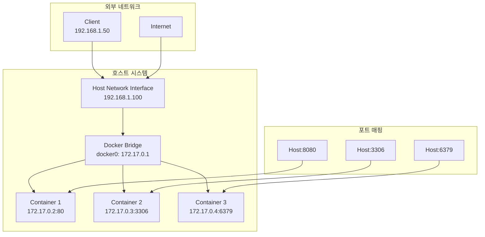

# Session 7: 포트 매핑 및 네트워크 기초

## 📍 교과과정에서의 위치
이 세션은 **Week 2 > Day 1 > Session 7**로, Docker 네트워킹의 기초인 포트 매핑을 실습합니다. Week 1에서 학습한 네트워킹 이론을 바탕으로 실제 웹 서버 컨테이너를 외부에서 접근 가능하게 만드는 과정을 체험합니다.

## 학습 목표 (5분)
- **포트 매핑** 개념과 **네트워크 기초** 이해
- **웹 서버 컨테이너** 실행 및 **외부 접근** 설정
- **네트워크 문제 해결** 및 **보안 고려사항** 학습

## 1. 이론: 포트 매핑 개념과 네트워크 기초 (20분)

### Docker 네트워킹 아키텍처



### 포트 매핑 동작 원리

```
포트 매핑 과정:
1. 클라이언트가 Host:8080으로 요청
2. Docker가 iptables 규칙으로 트래픽 포워딩
3. 172.17.0.2:80 (컨테이너 내부)로 전달
4. 컨테이너 애플리케이션이 응답 처리
5. 역방향으로 응답 전달

iptables 규칙 예시:
-A DOCKER -d 172.17.0.2/32 ! -i docker0 -o docker0 -p tcp -m tcp --dport 80 -j ACCEPT
-A DOCKER -t nat -A DOCKER ! -i docker0 -p tcp -m tcp --dport 8080 -j DNAT --to-destination 172.17.0.2:80
```

### 네트워크 모드별 특징

| 모드 | 설명 | 포트 매핑 | 사용 사례 |
|------|------|-----------|-----------|
| **bridge** | 기본 모드, 격리된 네트워크 | 필요 | 일반적인 웹 애플리케이션 |
| **host** | 호스트 네트워크 직접 사용 | 불필요 | 고성능 네트워크 애플리케이션 |
| **none** | 네트워크 없음 | 불가능 | 보안이 중요한 배치 작업 |
| **container** | 다른 컨테이너와 네트워크 공유 | 공유 | 사이드카 패턴 |

## 2. 실습: 기본 포트 매핑 (12분)

### 단일 포트 매핑

```bash
# 기본 웹 서버 실행 (포트 매핑)
docker run -d -p 8080:80 --name web-nginx nginx:latest

# 포트 매핑 확인
docker ps
# PORTS 컬럼에서 0.0.0.0:8080->80/tcp 확인

# 웹 브라우저 또는 curl로 접근 테스트
curl http://localhost:8080
curl -I http://localhost:8080

# 다른 포트로 추가 웹 서버 실행
docker run -d -p 8081:80 --name web-apache httpd:latest
curl http://localhost:8081
```

### 다중 포트 매핑

```bash
# 여러 포트를 동시에 매핑
docker run -d \
  -p 8082:80 \
  -p 8443:443 \
  --name web-multi nginx:latest

# 포트 확인
docker port web-multi

# MySQL 컨테이너 (데이터베이스 포트)
docker run -d \
  -p 3306:3306 \
  -e MYSQL_ROOT_PASSWORD=mypassword \
  --name mysql-db mysql:8.0

# Redis 컨테이너 (캐시 서버 포트)
docker run -d \
  -p 6379:6379 \
  --name redis-cache redis:latest
```

### 특정 인터페이스 바인딩

```bash
# 모든 인터페이스에 바인딩 (기본값)
docker run -d -p 8084:80 --name web-all nginx:latest

# 로컬호스트만 바인딩 (외부 접근 차단)
docker run -d -p 127.0.0.1:8085:80 --name web-local nginx:latest

# 특정 IP 주소에 바인딩
docker run -d -p 192.168.1.100:8086:80 --name web-specific nginx:latest

# 접근 테스트
curl http://localhost:8084    # 성공
curl http://localhost:8085    # 성공
curl http://192.168.1.100:8086  # 성공 (해당 IP가 있는 경우)
```

## 3. 실습: 동적 포트 할당 (8분)

### 자동 포트 할당

```bash
# Docker가 자동으로 포트 할당
docker run -d -P --name web-auto nginx:latest

# 할당된 포트 확인
docker ps
docker port web-auto

# 할당된 포트로 접근
ASSIGNED_PORT=$(docker port web-auto 80 | cut -d: -f2)
echo "Assigned port: $ASSIGNED_PORT"
curl http://localhost:$ASSIGNED_PORT
```

### 포트 범위 매핑

```bash
# 포트 범위 매핑 (여러 서비스용)
docker run -d -p 8090-8095:80 --name web-range nginx:latest

# 사용 가능한 포트 확인
docker port web-range

# UDP 포트 매핑
docker run -d -p 5353:53/udp --name dns-server alpine:latest

# TCP와 UDP 동시 매핑
docker run -d \
  -p 8096:80/tcp \
  -p 8096:80/udp \
  --name web-both nginx:latest
```

## 4. 실습: 네트워크 문제 해결 (10분)

### 포트 충돌 해결

```bash
# 포트 충돌 상황 생성
docker run -d -p 8080:80 --name web1 nginx:latest
docker run -d -p 8080:80 --name web2 nginx:latest  # 오류 발생

# 오류 메시지 확인
docker logs web2

# 사용 중인 포트 확인 (호스트)
netstat -tlnp | grep 8080
# 또는
ss -tlnp | grep 8080

# 해결: 다른 포트 사용
docker rm web2
docker run -d -p 8081:80 --name web2 nginx:latest
```

### 네트워크 연결 테스트

```bash
# 컨테이너 네트워크 정보 확인
docker inspect web1 | grep -A 10 "NetworkSettings"

# 컨테이너 IP 주소 확인
docker inspect --format='{{.NetworkSettings.IPAddress}}' web1

# 컨테이너 간 통신 테스트
CONTAINER_IP=$(docker inspect --format='{{.NetworkSettings.IPAddress}}' web1)
docker run --rm alpine:latest ping -c 3 $CONTAINER_IP

# 호스트에서 컨테이너로 직접 접근
curl http://$CONTAINER_IP:80
```

### 방화벽 및 보안 확인

```bash
# Docker가 생성한 iptables 규칙 확인
sudo iptables -t nat -L DOCKER
sudo iptables -L DOCKER

# 포트 접근 가능성 테스트
# 외부에서 접근 (다른 머신에서)
# curl http://[HOST_IP]:8080

# 로컬 방화벽 상태 확인 (Ubuntu)
sudo ufw status

# Docker 서비스 포트 확인
sudo netstat -tlnp | grep docker
```

## 5. 실습: 실제 웹 애플리케이션 배포 (15분)

### 정적 웹사이트 배포

```bash
# HTML 파일 준비
mkdir -p ./my-website
cat > ./my-website/index.html << EOF
<!DOCTYPE html>
<html>
<head>
    <title>My Docker Website</title>
</head>
<body>
    <h1>Welcome to My Docker Website!</h1>
    <p>This is running in a Docker container.</p>
    <p>Current time: <span id="time"></span></p>
    <script>
        document.getElementById('time').textContent = new Date().toLocaleString();
    </script>
</body>
</html>
EOF

# 볼륨 마운트로 웹사이트 배포
docker run -d \
  -p 8090:80 \
  -v $(pwd)/my-website:/usr/share/nginx/html \
  --name my-website nginx:latest

# 웹사이트 접근 확인
curl http://localhost:8090
```

### Node.js 애플리케이션 배포

```bash
# 간단한 Node.js 앱 준비
mkdir -p ./node-app
cat > ./node-app/app.js << EOF
const http = require('http');
const port = 3000;

const server = http.createServer((req, res) => {
  res.writeHead(200, {'Content-Type': 'text/html'});
  res.end(\`
    <h1>Node.js in Docker</h1>
    <p>Request URL: \${req.url}</p>
    <p>Method: \${req.method}</p>
    <p>Timestamp: \${new Date().toISOString()}</p>
  \`);
});

server.listen(port, () => {
  console.log(\`Server running at http://localhost:\${port}/\`);
});
EOF

# Node.js 컨테이너로 실행
docker run -d \
  -p 8091:3000 \
  -v $(pwd)/node-app:/app \
  -w /app \
  --name node-app node:16-alpine \
  node app.js

# 애플리케이션 접근 확인
curl http://localhost:8091
curl http://localhost:8091/api/test
```

### 데이터베이스 연동 테스트

```bash
# MySQL 컨테이너 실행 (이미 실행 중이면 스킵)
docker run -d \
  -p 3306:3306 \
  -e MYSQL_ROOT_PASSWORD=mypassword \
  -e MYSQL_DATABASE=testdb \
  --name mysql-server mysql:8.0

# MySQL 연결 테스트 (MySQL 클라이언트 컨테이너 사용)
docker run -it --rm mysql:8.0 mysql -h host.docker.internal -P 3306 -u root -p

# 컨테이너 내부에서 MySQL 명령어:
# SHOW DATABASES;
# USE testdb;
# CREATE TABLE users (id INT, name VARCHAR(50));
# INSERT INTO users VALUES (1, 'Docker User');
# SELECT * FROM users;
# EXIT;
```

## 6. 보안 고려사항 및 모범 사례 (5분)

### 포트 매핑 보안 원칙

```bash
# 1. 필요한 포트만 노출
docker run -d -p 127.0.0.1:8080:80 --name secure-web nginx:latest  # 로컬만
docker run -d -p 8080:80 --name public-web nginx:latest            # 전체 공개

# 2. 비표준 포트 사용
docker run -d -p 8443:80 --name web-nonstandard nginx:latest

# 3. 환경별 포트 분리
docker run -d -p 8080:80 --name web-dev nginx:latest      # 개발
docker run -d -p 8081:80 --name web-staging nginx:latest  # 스테이징
# 프로덕션은 80:80 또는 로드밸런서 사용

# 4. 포트 스캔 방지
docker run -d \
  -p 127.0.0.1:8080:80 \
  --restart unless-stopped \
  --name secure-app nginx:latest
```

### 네트워크 모니터링

```bash
# 활성 연결 모니터링
docker exec web-nginx netstat -an | grep :80

# 실시간 트래픽 확인
docker logs -f web-nginx

# 리소스 사용량 모니터링
docker stats web-nginx --no-stream
```

## 💡 핵심 키워드
- **포트 매핑**: -p 옵션으로 호스트-컨테이너 포트 연결
- **브리지 네트워크**: Docker 기본 네트워크 모드
- **iptables**: Docker가 사용하는 네트워크 규칙 관리
- **네트워크 격리**: 컨테이너별 독립적 네트워크 스택

## 📚 참고 자료
- [Docker 네트워킹 가이드](https://docs.docker.com/network/)
- [포트 매핑 레퍼런스](https://docs.docker.com/engine/reference/run/#expose-incoming-ports)
- [Docker 보안 가이드](https://docs.docker.com/engine/security/)

## 🔧 실습 체크리스트
- [ ] 기본 포트 매핑으로 웹 서버 실행
- [ ] 다중 포트 및 특정 인터페이스 바인딩
- [ ] 동적 포트 할당 및 확인
- [ ] 포트 충돌 문제 해결
- [ ] 실제 웹 애플리케이션 배포 및 접근
