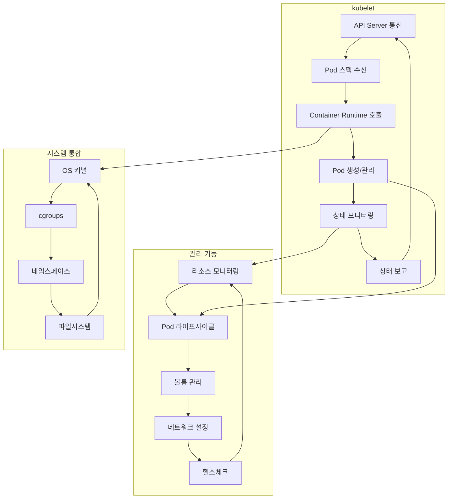
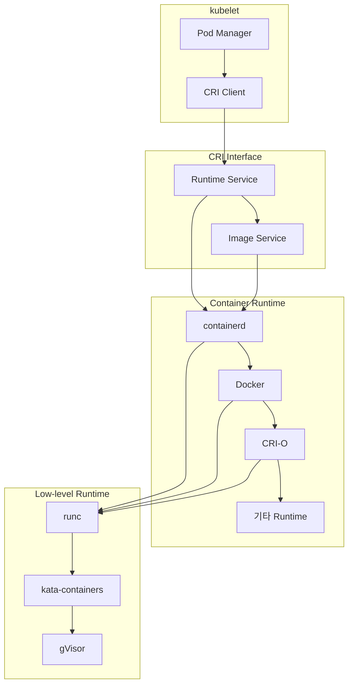
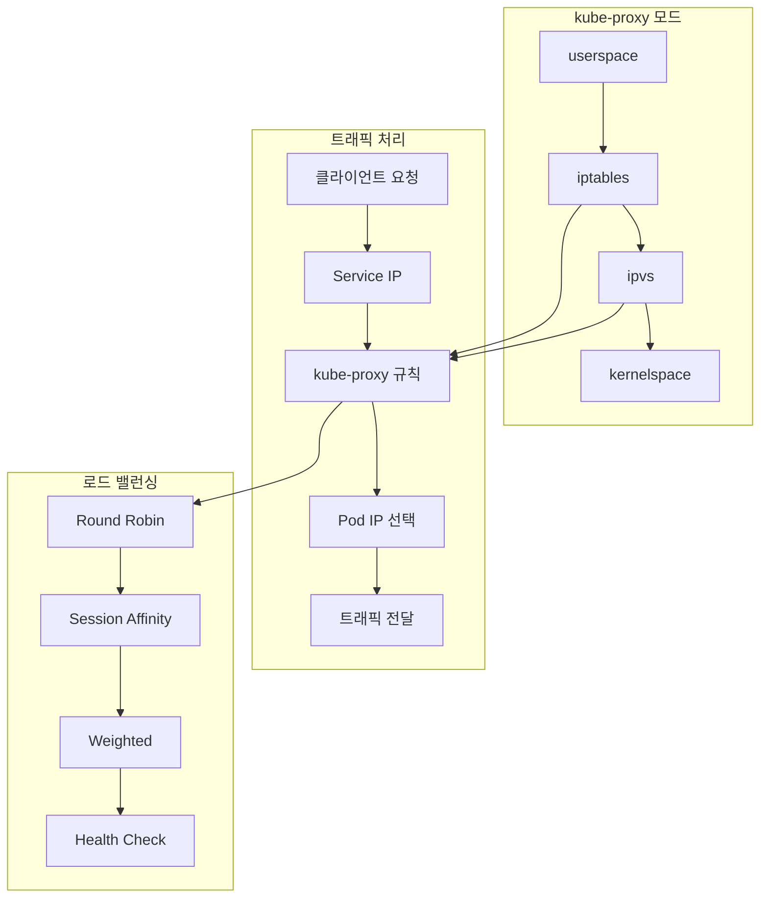
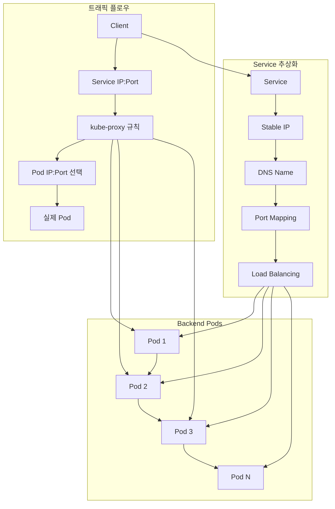

# Session 7: kubelet과 kube-proxy

## 📍 교과과정에서의 위치
이 세션은 **Week 2 > Day 1 > Session 7**로, 워커 노드의 핵심 구성 요소인 kubelet과 kube-proxy의 역할과 기능을 심화 학습합니다.

## 학습 목표 (5분)
- **kubelet**의 **노드 에이전트** 역할과 **Pod 관리** 기능 이해
- **Container Runtime Interface (CRI)** 개념과 **구현체** 학습
- **kube-proxy**의 **네트워킹** 기능과 **트래픽 라우팅** 메커니즘 파악
- **Service 추상화**와 **로드 밸런싱** 원리 이해

## 1. kubelet의 노드 에이전트 역할 (15분)

### kubelet 아키텍처



### kubelet 핵심 기능
```
kubelet 핵심 기능:

Pod 관리:
├── Pod 스펙 해석 및 검증
├── 컨테이너 생성 및 시작
├── 라이프사이클 관리 (생성→실행→종료)
├── 재시작 정책 적용
└── 리소스 할당 및 제한

상태 모니터링:
├── Liveness Probe: 컨테이너 생존 확인
├── Readiness Probe: 서비스 준비 상태 확인
├── Startup Probe: 초기 시작 확인
├── 리소스 사용량 수집
└── 노드 상태 보고

볼륨 관리:
├── 볼륨 마운트 및 언마운트
├── 스토리지 드라이버 연동
├── 데이터 영속성 보장
├── 볼륨 플러그인 관리
└── 백업 및 복구 지원

네트워크 설정:
├── Pod IP 할당
├── 네트워크 네임스페이스 생성
├── CNI 플러그인 호출
├── 네트워크 정책 적용
└── 트래픽 라우팅 설정
```

## 2. Container Runtime Interface (CRI) 개념 (12분)

### CRI 아키텍처



### CRI 구현체 비교
```
주요 CRI 구현체:

containerd:
├── CNCF 졸업 프로젝트
├── Docker에서 분리된 런타임
├── 경량화 및 성능 최적화
├── Kubernetes 기본 런타임
└── 산업 표준으로 자리잡음

Docker (dockershim):
├── 초기 Kubernetes 기본 런타임
├── Kubernetes 1.24부터 제거
├── 개발 환경에서 여전히 사용
├── Docker Desktop 통합
└── 레거시 지원 목적

CRI-O:
├── Kubernetes 전용 런타임
├── OCI 표준 완전 준수
├── 최소한의 기능만 제공
├── Red Hat 주도 개발
└── 엔터프라이즈 환경 최적화

성능 비교:
├── 시작 시간: CRI-O < containerd < Docker
├── 메모리 사용: CRI-O < containerd < Docker
├── 기능 풍부함: Docker > containerd > CRI-O
└── Kubernetes 통합: CRI-O > containerd > Docker
```

## 3. kube-proxy의 네트워킹 기능 (10분)

### kube-proxy 동작 모드



### 네트워킹 모드 비교
```
kube-proxy 동작 모드:

iptables 모드:
├── 기본 모드 (대부분 환경)
├── 커널 수준 패킷 처리
├── 높은 성능과 안정성
├── 복잡한 규칙 관리
└── 대규모 환경에서 성능 저하

IPVS 모드:
├── 고성능 로드 밸런싱
├── 다양한 스케줄링 알고리즘
├── 대규모 서비스 지원
├── 커널 모듈 의존성
└── 복잡한 설정 필요

userspace 모드 (레거시):
├── 초기 구현 방식
├── 사용자 공간에서 처리
├── 성능 제한
├── 호환성 목적으로만 사용
└── 새로운 환경에서 비추천
```

## 4. Service 추상화와 트래픽 라우팅 (10분)

### Service 추상화 모델



### 로드 밸런싱 전략
```
Service 로드 밸런싱:

기본 전략:
├── Round Robin: 순차적 분산
├── Random: 무작위 선택
├── Session Affinity: 세션 유지
└── Weighted: 가중치 기반

고급 기능:
├── Health Check: 건강한 Pod만 선택
├── Readiness Gate: 준비 상태 확인
├── Topology Aware: 지역 기반 라우팅
└── External Traffic Policy: 외부 트래픽 정책

성능 최적화:
├── Connection Pooling: 연결 재사용
├── Keep-Alive: 연결 유지
├── Circuit Breaker: 장애 격리
└── Retry Logic: 재시도 메커니즘
```

## 💬 그룹 토론: 네트워킹 추상화가 가져다주는 가치 (8분)

### 토론 주제
**"Kubernetes의 네트워킹 추상화(Service, kube-proxy)가 애플리케이션 개발과 운영에 미치는 영향은 무엇인가?"**

### 토론 가이드라인

#### 개발자 관점 (3분)
- **단순화**: 복잡한 네트워킹 로직 숨김
- **이식성**: 환경에 독립적인 서비스 통신
- **확장성**: 자동 로드 밸런싱과 서비스 디스커버리

#### 운영자 관점 (3분)
- **관리 효율성**: 중앙집중식 네트워크 정책
- **모니터링**: 트래픽 가시성과 디버깅
- **보안**: 네트워크 분할과 접근 제어

#### 비즈니스 관점 (2분)
- **안정성**: 자동 장애 복구와 트래픽 재분산
- **성능**: 최적화된 라우팅과 로드 밸런싱
- **비용**: 리소스 효율성과 운영 비용 절감

## 💡 핵심 개념 정리
- **kubelet**: 워커 노드의 에이전트, Pod 라이프사이클 관리
- **CRI**: 컨테이너 런타임 표준 인터페이스, 런타임 추상화
- **kube-proxy**: 네트워크 프록시, Service 구현체
- **Service 추상화**: 안정적인 네트워크 엔드포인트 제공

## 📚 참고 자료
- [kubelet 공식 문서](https://kubernetes.io/docs/reference/command-line-tools-reference/kubelet/)
- [Container Runtime Interface](https://kubernetes.io/docs/concepts/architecture/cri/)
- [kube-proxy 구성](https://kubernetes.io/docs/reference/command-line-tools-reference/kube-proxy/)

## 다음 세션 준비
다음 세션에서는 **아키텍처 종합 및 토론**을 통해 Day 1에서 학습한 모든 내용을 통합적으로 정리합니다.