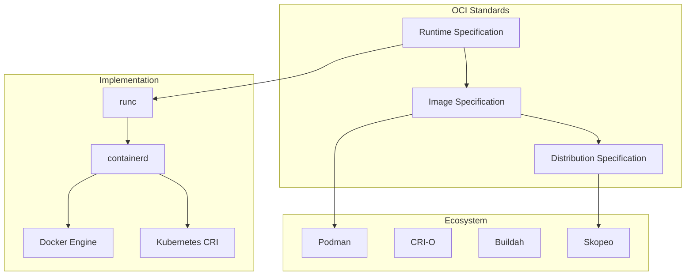
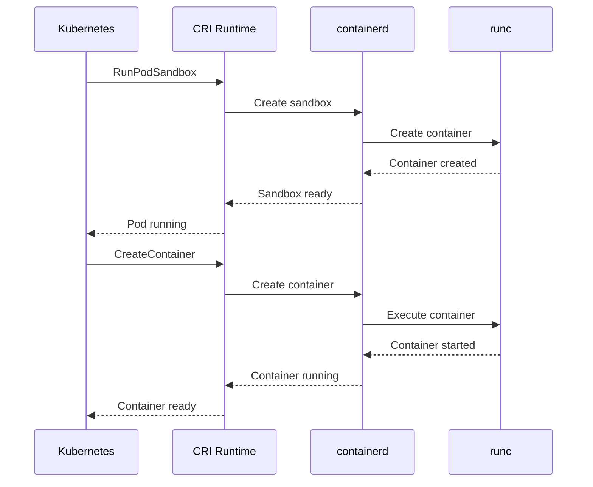

# Session 7: 컨테이너 생태계 및 표준화 동향

## 📍 교과과정에서의 위치
이 세션은 **Week 2 > Day 1 > Session 7**로, Docker Compose 오케스트레이션 이해를 바탕으로 컨테이너 생태계 전반과 표준화 동향을 심화 분석합니다.

## 학습 목표 (5분)
- **컨테이너 생태계**와 **OCI 표준** 완전 이해
- **컨테이너 런타임** 비교 분석과 **CRI 인터페이스** 구조
- **클라우드 네이티브** 트렌드와 **미래 발전 방향** 전망

## 1. 이론: 컨테이너 표준화 및 OCI (20분)

### Open Container Initiative (OCI) 표준



### OCI 표준 구성 요소

```
OCI 표준 상세 분석:

Runtime Specification:
├── 컨테이너 실행 환경 표준 정의
├── 파일시스템 번들 구조 명세
├── 설정 파일 (config.json) 형식
├── 라이프사이클 관리 (create, start, kill, delete)
├── 리소스 제한 및 보안 설정
├── 네임스페이스 및 cgroups 구성
├── 플랫폼별 특화 설정 지원
└── 런타임 간 호환성 보장

Image Specification:
├── 컨테이너 이미지 형식 표준화
├── 매니페스트 (manifest) 구조 정의
├── 레이어 압축 및 해시 알고리즘
├── 이미지 메타데이터 형식
├── 멀티 아키텍처 이미지 지원
├── 이미지 서명 및 검증 체계
├── 콘텐츠 주소 지정 방식
└── 레지스트리 간 호환성

Distribution Specification:
├── 이미지 배포 프로토콜 표준
├── HTTP API 엔드포인트 정의
├── 인증 및 권한 부여 메커니즘
├── 이미지 업로드/다운로드 프로세스
├── 태그 및 레퍼런스 관리
├── 콘텐츠 검색 및 디스커버리
├── 미러링 및 복제 지원
└── 보안 및 무결성 보장
```

### 컨테이너 런타임 생태계

```
주요 컨테이너 런타임:

High-level Runtime:
├── containerd: Docker, Kubernetes 기본 런타임
├── CRI-O: Kubernetes 전용 경량 런타임
├── Podman: 데몬리스 컨테이너 엔진
├── LXD: 시스템 컨테이너 전문
├── rkt (CoreOS): 보안 중심 런타임 (deprecated)
└── gVisor: 샌드박스 기반 보안 런타임

Low-level Runtime:
├── runc: OCI 표준 참조 구현
├── crun: C 언어 기반 고성능 런타임
├── kata-containers: VM 기반 보안 런타임
├── firecracker: AWS Lambda 기반 마이크로VM
├── youki: Rust 언어 기반 런타임
└── runsc: gVisor 샌드박스 런타임

특수 목적 런타임:
├── Singularity: HPC 및 과학 컴퓨팅
├── Charliecloud: 비특권 HPC 컨테이너
├── Sysbox: 시스템 컨테이너 런타임
├── WasmEdge: WebAssembly 런타임
└── Krustlet: Kubernetes WebAssembly 노드
```

## 2. 이론: Container Runtime Interface (CRI) (15분)

### CRI 아키텍처 분석



### CRI 인터페이스 구조

```
CRI 핵심 기능:

Pod Lifecycle Management:
├── RunPodSandbox: Pod 네트워크 네임스페이스 생성
├── StopPodSandbox: Pod 네트워크 정리
├── RemovePodSandbox: Pod 리소스 완전 제거
├── PodSandboxStatus: Pod 상태 조회
├── ListPodSandbox: Pod 목록 조회
└── 네트워크 및 스토리지 격리 관리

Container Lifecycle:
├── CreateContainer: 컨테이너 생성
├── StartContainer: 컨테이너 시작
├── StopContainer: 컨테이너 정지
├── RemoveContainer: 컨테이너 제거
├── ContainerStatus: 컨테이너 상태 조회
├── ListContainers: 컨테이너 목록 조회
├── ExecSync: 동기 명령 실행
└── Exec: 비동기 명령 실행

Image Management:
├── ListImages: 이미지 목록 조회
├── ImageStatus: 이미지 상태 확인
├── PullImage: 이미지 다운로드
├── RemoveImage: 이미지 삭제
├── ImageFsInfo: 이미지 파일시스템 정보
└── 이미지 캐시 및 정리 관리

Runtime Information:
├── Version: 런타임 버전 정보
├── Status: 런타임 상태 확인
├── UpdateRuntimeConfig: 런타임 설정 업데이트
└── 런타임 메트릭 및 통계 정보
```

## 3. 이론: 클라우드 네이티브 생태계 (10분)

### CNCF 프로젝트 생태계

```
Cloud Native Computing Foundation:

Graduated Projects:
├── Kubernetes: 컨테이너 오케스트레이션
├── Prometheus: 모니터링 및 알림
├── Envoy: 서비스 프록시
├── CoreDNS: DNS 서버
├── containerd: 컨테이너 런타임
├── Fluentd: 로그 수집 및 처리
├── Jaeger: 분산 추적
├── TiKV: 분산 키-값 스토어
├── Vitess: 데이터베이스 클러스터링
└── Helm: Kubernetes 패키지 관리

Incubating Projects:
├── Istio: 서비스 메시
├── gRPC: 고성능 RPC 프레임워크
├── CNI: 컨테이너 네트워크 인터페이스
├── Notary: 콘텐츠 신뢰 및 서명
├── SPIFFE/SPIRE: 보안 ID 프레임워크
├── Open Policy Agent: 정책 엔진
├── Falco: 런타임 보안 모니터링
└── Linkerd: 서비스 메시

Sandbox Projects:
├── 새로운 혁신 기술들
├── 실험적 프로젝트들
├── 커뮤니티 주도 개발
└── 미래 기술 트렌드 반영
```

### 컨테이너 보안 발전 방향

```
보안 기술 트렌드:

Zero Trust Architecture:
├── 네트워크 경계 보안에서 ID 기반 보안으로
├── 모든 통신 암호화 및 인증
├── 최소 권한 원칙 적용
├── 지속적인 검증 및 모니터링
├── 마이크로세그멘테이션
└── 정책 기반 접근 제어

Supply Chain Security:
├── 소프트웨어 공급망 보안 강화
├── 이미지 서명 및 검증 의무화
├── SBOM (Software Bill of Materials)
├── 취약점 스캔 자동화
├── 컴플라이언스 자동 검사
└── 보안 정책 as Code

Runtime Security:
├── 행동 기반 이상 탐지
├── 머신러닝 기반 위협 분석
├── 실시간 보안 모니터링
├── 자동화된 대응 체계
├── 포렌식 및 감사 로그
└── 보안 오케스트레이션
```

## 4. 개념 예시: 생태계 도구 비교 (12분)

### 런타임 비교 분석 예시

```bash
# Docker 런타임 정보 (개념 예시)
docker system info | grep -i runtime
# Default Runtime: runc
# Runtimes: runc

# Podman 사용 예시 (개념 예시)
podman run --rm alpine echo "Hello from Podman"
# 데몬리스 실행, 루트리스 지원

# containerd 직접 사용 예시 (개념 예시)
ctr images pull docker.io/library/alpine:latest
ctr run docker.io/library/alpine:latest mycontainer
```

### OCI 호환성 테스트 예시

```bash
# OCI 번들 생성 (개념 예시)
mkdir mycontainer
cd mycontainer
runc spec

# config.json 구조 확인 (개념 예시)
cat config.json | jq '.process.args'
# ["sh"]

# OCI 런타임으로 실행 (개념 예시)
sudo runc run mycontainer
```

### CNCF 도구 통합 예시

```yaml
# Cloud Native 스택 예시 (개념 예시)
apiVersion: v1
kind: Pod
metadata:
  name: cloud-native-app
  annotations:
    prometheus.io/scrape: "true"
    linkerd.io/inject: enabled
spec:
  containers:
  - name: app
    image: myapp:latest
    ports:
    - containerPort: 8080
  - name: envoy-proxy
    image: envoyproxy/envoy:latest
```

## 5. 토론 및 정리 (8분)

### 핵심 개념 정리
- **OCI 표준**을 통한 컨테이너 생태계 표준화
- **CRI 인터페이스**로 Kubernetes와 런타임 분리
- **CNCF 생태계**의 클라우드 네이티브 기술 발전
- **보안 및 공급망** 관리의 중요성 증대

### 토론 주제
"컨테이너 기술의 표준화가 클라우드 네이티브 생태계 발전에 미치는 영향과 미래 전망은 무엇인가?"

## 💡 핵심 키워드
- **표준화**: OCI, Runtime Spec, Image Spec, Distribution Spec
- **런타임 생태계**: containerd, CRI-O, Podman, runc
- **클라우드 네이티브**: CNCF, Kubernetes, 서비스 메시
- **보안 트렌드**: Zero Trust, Supply Chain, Runtime Security

## 📚 참고 자료
- [OCI 표준 문서](https://opencontainers.org/)
- [CNCF 프로젝트](https://www.cncf.io/projects/)
- [CRI 인터페이스](https://kubernetes.io/docs/concepts/architecture/cri/)
