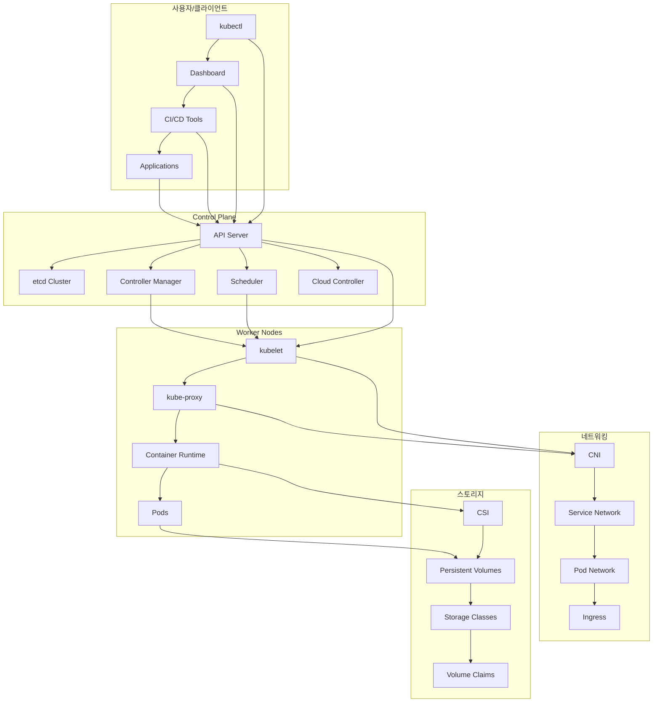
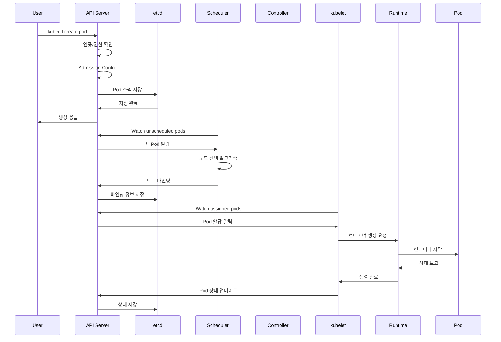
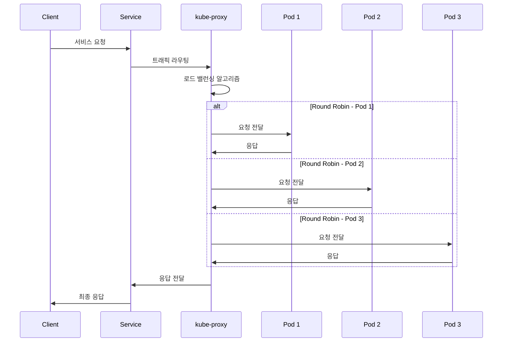
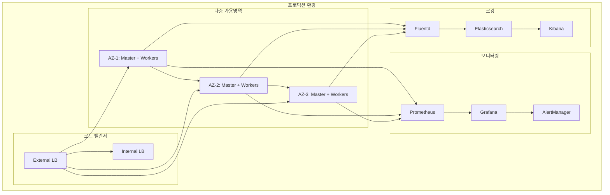
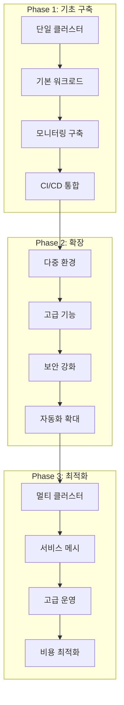

# Session 8: 아키텍처 종합 및 토론

## 📍 교과과정에서의 위치
이 세션은 **Week 2 > Day 1 > Session 8**로, Day 1에서 학습한 Kubernetes 아키텍처의 모든 구성 요소를 통합적으로 정리하고 실무 적용 관점에서 토론합니다.

## 학습 목표 (5분)
- **Kubernetes 전체 아키텍처** 종합 정리
- **컴포넌트 간 상호작용** 플로우 완전 이해
- **실제 운영 환경** 고려사항 파악
- **Kubernetes 도입** 시 핵심 고려사항 학습

## 1. Kubernetes 전체 아키텍처 종합 정리 (15분)

### 통합 아키텍처 뷰



### 아키텍처 계층 분석
```
Kubernetes 아키텍처 계층:

사용자 인터페이스 계층:
├── kubectl CLI 도구
├── Kubernetes Dashboard
├── IDE 통합 도구
├── CI/CD 파이프라인 도구
└── 커스텀 애플리케이션

API 계층:
├── RESTful API 서버
├── 인증 및 권한 부여
├── Admission Control
├── API 버전 관리
└── 확장성 및 플러그인

제어 계층 (Control Plane):
├── 클러스터 상태 관리 (etcd)
├── 스케줄링 (Scheduler)
├── 상태 제어 (Controllers)
├── 클라우드 통합 (Cloud Controller)
└── 정책 적용 및 거버넌스

실행 계층 (Data Plane):
├── 노드 관리 (kubelet)
├── 네트워크 프록시 (kube-proxy)
├── 컨테이너 런타임 (CRI)
├── 워크로드 실행 (Pods)
└── 리소스 모니터링

인프라 계층:
├── 네트워킹 (CNI)
├── 스토리지 (CSI)
├── 컴퓨팅 리소스
├── 보안 및 격리
└── 모니터링 및 로깅
```

## 2. 컴포넌트 간 상호작용 플로우 분석 (12분)

### Pod 생성 플로우



### 서비스 트래픽 플로우



## 3. 실제 운영 환경 고려사항 (10분)

### 운영 환경 아키텍처 설계



### 운영 고려사항 체크리스트
```
프로덕션 환경 고려사항:

고가용성 (High Availability):
├── 다중 마스터 노드 구성 (홀수 개)
├── 다중 가용영역 분산 배치
├── etcd 클러스터 백업 전략
├── 로드 밸런서 이중화
└── 네트워크 분할 대응 방안

보안 (Security):
├── RBAC 권한 체계 설계
├── 네트워크 정책 적용
├── Pod Security Standards
├── 이미지 보안 스캔
├── 시크릿 관리 (Vault 연동)
└── 감사 로깅 활성화

성능 (Performance):
├── 리소스 요청/제한 설정
├── HPA/VPA 자동 스케일링
├── 노드 오토스케일링
├── 네트워크 최적화
├── 스토리지 성능 튜닝
└── 모니터링 및 알림

운영 (Operations):
├── 백업 및 복구 전략
├── 업그레이드 계획
├── 장애 대응 절차
├── 용량 계획
├── 비용 최적화
└── 문서화 및 교육

규정 준수 (Compliance):
├── 데이터 보호 규정
├── 감사 요구사항
├── 보안 표준 준수
├── 로그 보존 정책
└── 접근 제어 정책
```

## 4. 실무 적용 시나리오 분석 (10분)

### 도입 단계별 전략



## 💬 그룹 토론: Kubernetes 도입 시 가장 큰 도전과제 (13분)

### 토론 주제
**"조직에서 Kubernetes를 도입할 때 직면하는 가장 큰 도전과제는 무엇이며, 이를 어떻게 극복할 수 있는가?"**

### 토론 가이드라인

#### 기술적 도전과제 (4분)
- **복잡성**: 학습 곡선과 운영 복잡성
- **디버깅**: 분산 환경에서의 문제 추적
- **성능**: 오버헤드와 리소스 사용량
- **통합**: 기존 시스템과의 연동

#### 조직적 도전과제 (4분)
- **문화 변화**: DevOps 문화 정착
- **역량 부족**: 전문 인력 확보와 교육
- **프로세스**: 기존 프로세스 변경
- **거버넌스**: 정책과 표준 수립

#### 극복 방안 (3분)
- **점진적 도입**: 단계별 마이그레이션
- **교육과 훈련**: 지속적인 역량 개발
- **도구 활용**: 관리 도구와 자동화
- **커뮤니티**: 오픈소스 생태계 활용

#### 성공 요인 (2분)
- **경영진 지원**: 리더십과 투자
- **명확한 목표**: 도입 목적과 성과 지표
- **실험 문화**: 실패를 통한 학습
- **지속적 개선**: 피드백과 최적화

## 💡 Day 1 핵심 개념 총정리
- **Kubernetes 아키텍처**: 마스터-워커 구조의 분산 시스템
- **핵심 컴포넌트**: API 서버, etcd, 스케줄러, 컨트롤러, kubelet, kube-proxy
- **설계 원칙**: 선언적 구성, Control Loop, 자동화, 확장성
- **운영 고려사항**: 고가용성, 보안, 성능, 모니터링

## 📚 참고 자료
- [Kubernetes 아키텍처 개요](https://kubernetes.io/docs/concepts/overview/components/)
- [프로덕션 환경 구성](https://kubernetes.io/docs/setup/production-environment/)
- [운영 모범 사례](https://kubernetes.io/docs/concepts/cluster-administration/)

## 다음 날 준비
내일은 **Kubernetes 핵심 오브젝트 이론**에 대해 학습합니다. Pod, Service, Deployment 등 핵심 오브젝트의 개념과 설계 원리를 이론적으로 심화 학습할 예정입니다.

---
**Day 1 완료! Kubernetes 아키텍처의 전체적인 이해를 바탕으로 내일은 구체적인 오브젝트들을 학습합니다!** 🚀