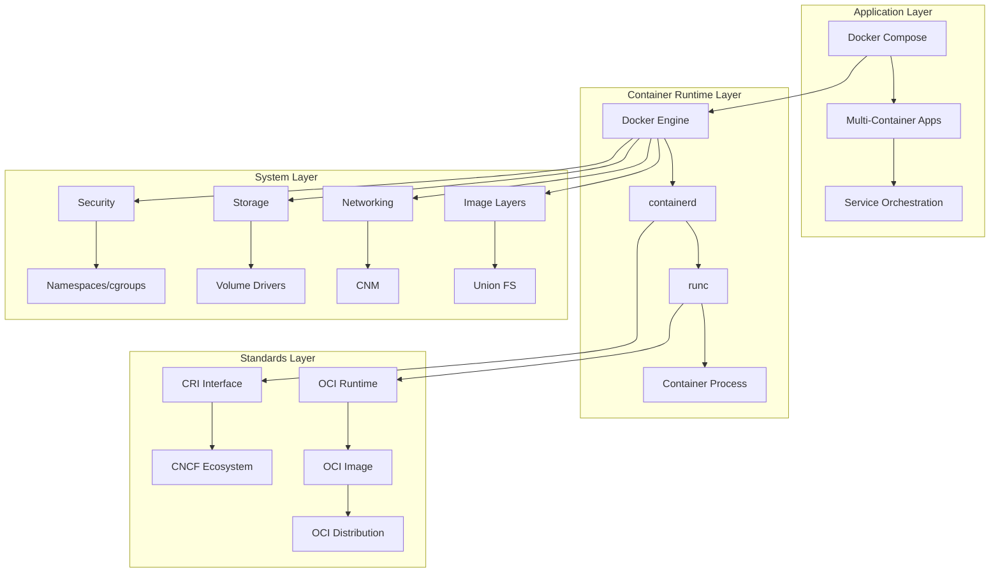

# Session 8: Day 1 종합 정리 및 심화 토론

## 📍 교과과정에서의 위치
이 세션은 **Week 2 > Day 1 > Session 8**로, 하루 동안 학습한 Docker 심화 이론들을 종합 정리하고 실무 적용 관점에서 심화 토론을 진행합니다.

## 학습 목표 (5분)
- **Docker 심화 개념들** 간의 **상호 연관성** 완전 이해
- **실무 시나리오** 기반 **아키텍처 설계** 능력 배양
- **미래 기술 트렌드**와 **학습 방향** 설정

## 1. 종합 정리: Docker 심화 아키텍처 통합 (15분)

### 전체 아키텍처 통합 뷰



### 핵심 개념 간 상호작용

```
Docker 생태계 통합 분석:

아키텍처 계층별 역할:
├── Engine Layer: dockerd → containerd → runc 파이프라인
├── Storage Layer: 레이어 시스템 + 볼륨 관리 + CoW 최적화
├── Network Layer: CNM 모델 + 서비스 디스커버리 + 로드 밸런싱
├── Security Layer: 다층 격리 + 권한 관리 + 취약점 대응
├── Orchestration Layer: Compose + 의존성 관리 + 환경 분리
├── Standards Layer: OCI 호환성 + CRI 통합 + CNCF 생태계
└── 각 계층 간 표준 인터페이스를 통한 모듈화

실무 적용 시나리오:
├── 개발 환경: Compose + 바인드 마운트 + 개발자 도구 통합
├── 테스트 환경: 격리된 네트워크 + 임시 스토리지 + 자동화
├── 스테이징 환경: 프로덕션 유사 구성 + 모니터링 + 성능 테스트
├── 프로덕션 환경: 보안 강화 + 고가용성 + 성능 최적화
└── 클라우드 환경: 관리형 서비스 + 스케일링 + 비용 최적화

기술 진화 방향:
├── 표준화: OCI → CRI → CNI → CSI 표준 확산
├── 보안: Zero Trust → Supply Chain → Runtime Protection
├── 성능: 경량화 → 최적화 → 하드웨어 가속
├── 운영: 자동화 → 관찰가능성 → AIOps
└── 생태계: 클라우드 네이티브 → 엣지 컴퓨팅 → 서버리스
```

## 2. 실무 시나리오 분석 (20분)

### 시나리오 1: 마이크로서비스 아키텍처 설계

```
요구사항 분석:
- 10개 마이크로서비스
- 일일 100만 요청 처리
- 99.9% 가용성 보장
- 보안 컴플라이언스 준수

아키텍처 설계 고려사항:

네트워킹 전략:
├── 서비스별 독립 네트워크 세그먼트
├── API Gateway를 통한 외부 트래픽 제어
├── 서비스 메시 도입 검토 (Istio/Linkerd)
├── 내부 통신 암호화 (mTLS)
├── 네트워크 정책 기반 마이크로세그멘테이션
└── DNS 기반 서비스 디스커버리 + 헬스 체크

스토리지 전략:
├── 상태 비저장 서비스 설계 원칙
├── 데이터베이스별 전용 볼륨 할당
├── 로그 중앙집중화 (ELK/EFK 스택)
├── 설정 정보 외부화 (ConfigMap/Secret)
├── 백업 자동화 및 재해 복구 계획
└── 성능 모니터링 및 용량 계획

보안 전략:
├── 최소 권한 원칙 적용
├── 이미지 취약점 스캔 자동화
├── 런타임 보안 모니터링
├── 네트워크 트래픽 암호화
├── 접근 제어 및 감사 로그
└── 보안 정책 as Code
```

### 시나리오 2: 레거시 애플리케이션 컨테이너화

```
마이그레이션 전략:

단계별 접근법:
├── 1단계: 애플리케이션 분석 및 의존성 파악
├── 2단계: 컨테이너 이미지 최적화
├── 3단계: 데이터 마이그레이션 전략 수립
├── 4단계: 네트워크 및 보안 설정
├── 5단계: 모니터링 및 로깅 통합
└── 6단계: 점진적 트래픽 전환

기술적 고려사항:
├── 레거시 의존성 처리 (특정 OS 버전, 라이브러리)
├── 상태 관리 및 세션 처리
├── 파일 시스템 권한 및 사용자 매핑
├── 네트워크 포트 및 프로토콜 호환성
├── 데이터베이스 연결 및 트랜잭션 처리
└── 성능 최적화 및 리소스 튜닝

위험 관리:
├── 롤백 계획 수립
├── 카나리 배포를 통한 점진적 전환
├── 성능 및 안정성 모니터링
├── 사용자 영향 최소화 전략
├── 데이터 무결성 보장
└── 비즈니스 연속성 계획
```

## 3. 심화 토론: 실무 적용 과제 (12분)

### 토론 주제 1: 성능 vs 보안 트레이드오프

```
토론 포인트:

성능 최적화 요구사항:
├── 낮은 지연시간 (< 100ms)
├── 높은 처리량 (> 10,000 TPS)
├── 리소스 효율성 (CPU, 메모리)
├── 네트워크 오버헤드 최소화
└── 스토리지 I/O 최적화

보안 강화 요구사항:
├── 다층 보안 아키텍처
├── 실시간 위협 탐지
├── 데이터 암호화 (전송/저장)
├── 접근 제어 및 감사
└── 컴플라이언스 준수

균형점 찾기:
├── 위험 기반 보안 정책 수립
├── 성능 영향 최소화 보안 도구 선택
├── 하드웨어 가속 활용 (암호화, 네트워킹)
├── 캐싱 전략을 통한 성능 보완
└── 모니터링 기반 동적 조정
```

### 토론 주제 2: 클라우드 네이티브 전환 전략

```
전환 과제:

기술적 도전:
├── 모놀리식 → 마이크로서비스 분해
├── 상태 관리 및 데이터 일관성
├── 분산 시스템 복잡성 증가
├── 네트워크 지연 및 장애 처리
└── 관찰가능성 및 디버깅 어려움

조직적 도전:
├── DevOps 문화 정착
├── 팀 구조 및 역할 재정의
├── 기술 역량 개발 및 교육
├── 프로세스 및 도구 표준화
└── 변화 관리 및 저항 극복

성공 전략:
├── 점진적 마이그레이션 (Strangler Fig 패턴)
├── 자동화 우선 접근법
├── 실패 허용 문화 구축
├── 지속적 학습 및 개선
└── 비즈니스 가치 중심 우선순위
```

## 4. 미래 학습 방향 설정 (5분)

### 다음 단계 학습 로드맵

```
Week 2 이후 학습 계획:

즉시 적용 가능 기술:
├── Kubernetes 기초 및 아키텍처
├── CI/CD 파이프라인 구축
├── Infrastructure as Code (Terraform)
├── 모니터링 및 로깅 시스템
└── 보안 도구 및 정책 관리

중장기 발전 기술:
├── 서비스 메시 (Istio, Linkerd)
├── GitOps 및 ArgoCD
├── 클라우드 네이티브 보안
├── 멀티 클라우드 전략
└── 엣지 컴퓨팅 및 IoT

실무 경험 축적:
├── 개인 프로젝트 컨테이너화
├── 오픈소스 기여 활동
├── 커뮤니티 참여 및 네트워킹
├── 인증 취득 (CKA, CKAD, CKS)
└── 기술 블로그 및 발표 활동
```

## 5. 종합 정리 및 다음 주 예고 (3분)

### Day 1 핵심 성과
- **Docker Engine 아키텍처** 완전 이해
- **레이어 시스템과 CoW** 메커니즘 분석
- **네트워킹과 스토리지** 심화 지식 습득
- **보안 모델과 격리** 기술 이해
- **Compose 오케스트레이션** 설계 능력
- **컨테이너 생태계** 전반적 조망

### Week 2 Day 2 예고
- **컨테이너 최적화 기법** 심화 분석
- **프로덕션 운영** 모범 사례
- **성능 튜닝** 및 **문제 해결** 방법론
- **엔터프라이즈 환경** 적용 전략

## 💡 핵심 키워드
- **통합 아키텍처**: Engine + Storage + Network + Security
- **실무 적용**: 마이크로서비스, 레거시 마이그레이션
- **트레이드오프**: 성능 vs 보안, 복잡성 vs 유연성
- **미래 방향**: 클라우드 네이티브, 표준화, 자동화

## 📚 추가 학습 자료
- [Docker 공식 문서](https://docs.docker.com/)
- [CNCF 기술 레이더](https://radar.cncf.io/)
- [컨테이너 보안 가이드](https://kubernetes.io/docs/concepts/security/)
