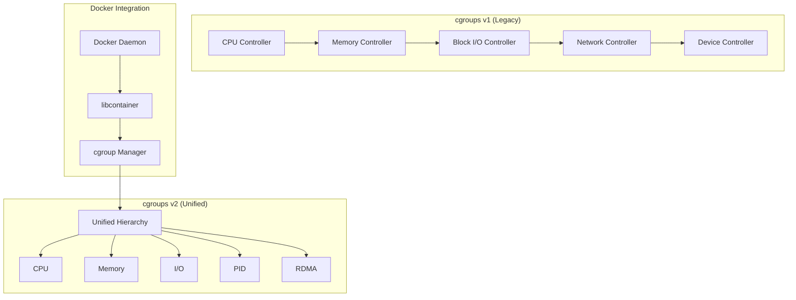
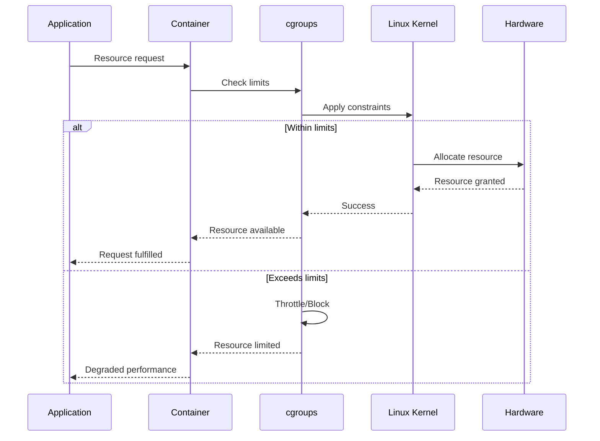

# Session 1: 컨테이너 리소스 관리 및 제한

## 📍 교과과정에서의 위치
이 세션은 **Week 2 > Day 2 > Session 1**로, Day 1에서 학습한 Docker 아키텍처를 바탕으로 컨테이너 리소스 관리와 성능 최적화 기법을 심화 분석합니다.

## 학습 목표 (5분)
- **cgroups 기반 리소스 제어** 메커니즘 완전 이해
- **CPU, 메모리, I/O 제한** 전략과 **성능 영향** 분석
- **리소스 모니터링** 및 **동적 조정** 기법 습득

## 1. 이론: cgroups 리소스 제어 아키텍처 (20분)

### cgroups v1 vs v2 비교 분석



### 리소스 제어 메커니즘 상세

```
cgroups 리소스 제어 원리:

CPU 제어 메커니즘:
├── CFS (Completely Fair Scheduler) 기반
├── cpu.cfs_period_us: 스케줄링 주기 (기본 100ms)
├── cpu.cfs_quota_us: 할당된 CPU 시간
├── cpu.shares: 상대적 CPU 가중치 (기본 1024)
├── cpu.rt_period_us: 실시간 스케줄링 주기
├── cpu.rt_runtime_us: 실시간 CPU 할당량
├── cpuset.cpus: 특정 CPU 코어 할당
└── cpuset.mems: NUMA 메모리 노드 할당

메모리 제어 메커니즘:
├── memory.limit_in_bytes: 메모리 사용량 제한
├── memory.soft_limit_in_bytes: 소프트 제한 (권장)
├── memory.memsw.limit_in_bytes: 메모리+스왑 제한
├── memory.swappiness: 스왑 사용 경향성 (0-100)
├── memory.oom_control: OOM Killer 제어
├── memory.use_hierarchy: 계층적 제한 적용
├── memory.kmem.limit_in_bytes: 커널 메모리 제한
└── memory.stat: 메모리 사용 통계

블록 I/O 제어:
├── blkio.weight: I/O 가중치 (100-1000)
├── blkio.weight_device: 디바이스별 가중치
├── blkio.throttle.read_bps_device: 읽기 대역폭 제한
├── blkio.throttle.write_bps_device: 쓰기 대역폭 제한
├── blkio.throttle.read_iops_device: 읽기 IOPS 제한
├── blkio.throttle.write_iops_device: 쓰기 IOPS 제한
└── blkio.stat: I/O 통계 정보

네트워크 제어:
├── net_cls.classid: 네트워크 클래스 ID
├── net_prio.prioidx: 네트워크 우선순위 인덱스
├── TC (Traffic Control)와 연동
├── 대역폭 제한 및 QoS 정책
├── 패킷 분류 및 우선순위
└── 네트워크 네임스페이스 통합
```

## 2. 이론: Docker 리소스 제한 전략 (15분)

### 리소스 제한 옵션 분석

```
Docker 리소스 제한 매개변수:

CPU 제한 옵션:
├── --cpus: CPU 코어 수 제한 (소수점 지원)
├── --cpu-shares: 상대적 CPU 가중치
├── --cpuset-cpus: 특정 CPU 코어 할당
├── --cpu-period: CFS 스케줄러 주기
├── --cpu-quota: CFS 할당량
├── --cpu-rt-period: 실시간 스케줄링 주기
└── --cpu-rt-runtime: 실시간 CPU 할당량

메모리 제한 옵션:
├── --memory (-m): 메모리 사용량 제한
├── --memory-swap: 메모리+스왑 총 제한
├── --memory-swappiness: 스왑 사용 경향성
├── --memory-reservation: 소프트 메모리 제한
├── --oom-kill-disable: OOM Killer 비활성화
├── --oom-score-adj: OOM 점수 조정
└── --kernel-memory: 커널 메모리 제한

I/O 제한 옵션:
├── --blkio-weight: 블록 I/O 가중치
├── --blkio-weight-device: 디바이스별 가중치
├── --device-read-bps: 읽기 대역폭 제한
├── --device-write-bps: 쓰기 대역폭 제한
├── --device-read-iops: 읽기 IOPS 제한
├── --device-write-iops: 쓰기 IOPS 제한
└── --storage-opt: 스토리지 드라이버 옵션

네트워크 제한:
├── Docker 자체적으로 네트워크 대역폭 제한 미지원
├── TC (Traffic Control) 외부 도구 활용
├── 네트워크 네임스페이스 기반 격리
├── iptables 규칙을 통한 트래픽 제어
└── 서드파티 CNI 플러그인 활용
```

### 성능 영향 분석



## 3. 이론: 리소스 모니터링 및 최적화 (10분)

### 모니터링 메트릭 체계

```
핵심 모니터링 지표:

CPU 메트릭:
├── CPU 사용률 (user, system, idle)
├── CPU 스로틀링 발생 횟수
├── 컨텍스트 스위치 빈도
├── 로드 애버리지 (1분, 5분, 15분)
├── CPU 대기 시간 (I/O wait, steal)
└── 프로세스별 CPU 사용량

메모리 메트릭:
├── 메모리 사용량 (RSS, VSZ, PSS)
├── 캐시 및 버퍼 사용량
├── 스왑 사용량 및 스왑 인/아웃
├── 페이지 폴트 발생 횟수
├── OOM 이벤트 발생 여부
└── 메모리 압박 상태 지표

I/O 메트릭:
├── 디스크 읽기/쓰기 대역폭
├── IOPS (Input/Output Operations Per Second)
├── I/O 대기 시간 (latency)
├── 큐 깊이 및 대기 큐 길이
├── 디스크 사용률 (utilization)
└── 파일시스템 사용량

네트워크 메트릭:
├── 네트워크 처리량 (송신/수신)
├── 패킷 드롭 및 에러율
├── 연결 수 및 연결 상태
├── 네트워크 지연시간
├── 대역폭 사용률
└── DNS 해석 시간
```

### 동적 리소스 조정 전략

```
자동 스케일링 전략:

수직 스케일링 (Vertical):
├── 리소스 사용량 기반 자동 조정
├── CPU/메모리 제한 동적 변경
├── 애플리케이션 재시작 없는 조정
├── 임계값 기반 트리거 설정
├── 점진적 리소스 증감
└── 비용 최적화 고려

수평 스케일링 (Horizontal):
├── 컨테이너 인스턴스 수 조정
├── 로드 밸런서 자동 업데이트
├── 서비스 디스커버리 연동
├── 트래픽 패턴 기반 예측
├── 최소/최대 인스턴스 제한
└── 스케일 다운 지연 정책

예측적 스케일링:
├── 과거 패턴 분석 기반 예측
├── 머신러닝 모델 활용
├── 비즈니스 이벤트 연동
├── 계절성 및 주기성 고려
├── 사전 리소스 준비
└── 비용 효율성 최적화
```

## 4. 개념 예시: 리소스 제한 구성 (12분)

### CPU 제한 설정 예시

```bash
# CPU 제한 예시 (개념 예시)
# 1.5 CPU 코어로 제한
docker run -d --cpus="1.5" nginx

# CPU 가중치 설정 (상대적 우선순위)
docker run -d --cpu-shares=512 nginx

# 특정 CPU 코어에 할당
docker run -d --cpuset-cpus="0,1" nginx

# CPU 사용량 모니터링 (개념 예시)
docker stats --format "table {{.Container}}\t{{.CPUPerc}}\t{{.MemUsage}}"
```

### 메모리 제한 설정 예시

```bash
# 메모리 제한 예시 (개념 예시)
# 512MB 메모리 제한
docker run -d --memory=512m nginx

# 메모리 + 스왑 제한
docker run -d --memory=512m --memory-swap=1g nginx

# 소프트 메모리 제한 (권장사항)
docker run -d --memory=512m --memory-reservation=256m nginx

# OOM Killer 비활성화 (주의 필요)
docker run -d --memory=512m --oom-kill-disable nginx
```

### I/O 제한 설정 예시

```bash
# 블록 I/O 제한 예시 (개념 예시)
# 읽기 대역폭 제한 (10MB/s)
docker run -d --device-read-bps /dev/sda:10mb nginx

# 쓰기 IOPS 제한 (100 IOPS)
docker run -d --device-write-iops /dev/sda:100 nginx

# I/O 가중치 설정
docker run -d --blkio-weight=500 nginx
```

### Docker Compose 리소스 제한 예시

```yaml
# Compose 리소스 제한 (개념 예시)
version: '3.8'
services:
  web:
    image: nginx
    deploy:
      resources:
        limits:
          cpus: '1.5'
          memory: 512M
        reservations:
          cpus: '0.5'
          memory: 256M
    
  api:
    image: myapi
    deploy:
      resources:
        limits:
          cpus: '2.0'
          memory: 1G
      replicas: 3
```

## 5. 토론 및 정리 (8분)

### 핵심 개념 정리
- **cgroups**를 통한 세밀한 리소스 제어
- **Docker 리소스 제한** 옵션의 적절한 활용
- **모니터링 기반** 성능 최적화 전략
- **동적 스케일링**을 통한 효율적 리소스 관리

### 토론 주제
"컨테이너 환경에서 리소스 제한과 성능 최적화의 균형점을 찾는 최적의 전략은 무엇인가?"

## 💡 핵심 키워드
- **리소스 제어**: cgroups, CPU 제한, 메모리 제한, I/O 제한
- **성능 모니터링**: 메트릭, 임계값, 알림, 대시보드
- **최적화 전략**: 수직/수평 스케일링, 예측적 스케일링
- **운영 효율성**: 자동화, 비용 최적화, 성능 튜닝

## 📚 참고 자료
- [Docker 리소스 제한](https://docs.docker.com/config/containers/resource_constraints/)
- [cgroups 문서](https://www.kernel.org/doc/Documentation/cgroup-v2.txt)
