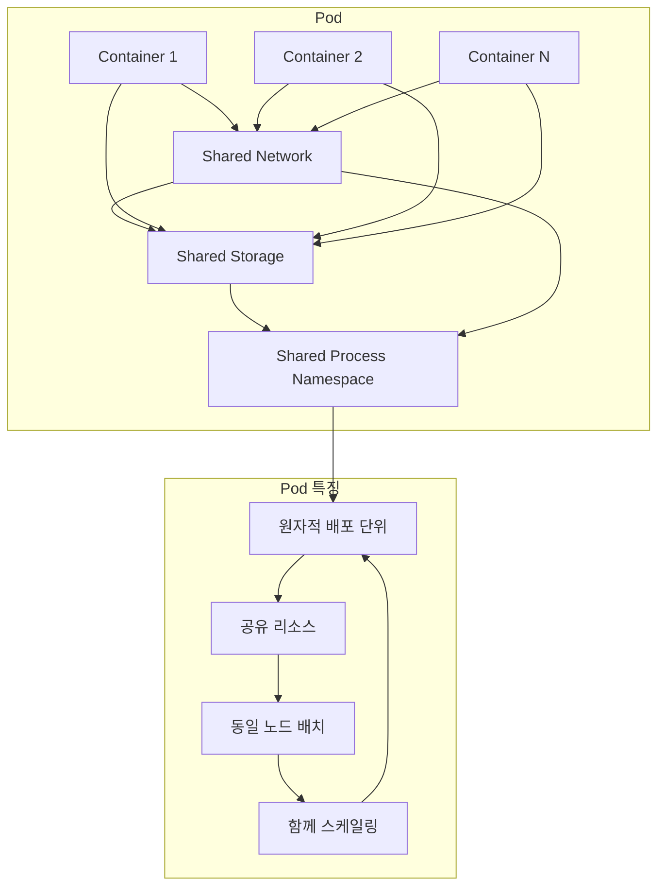
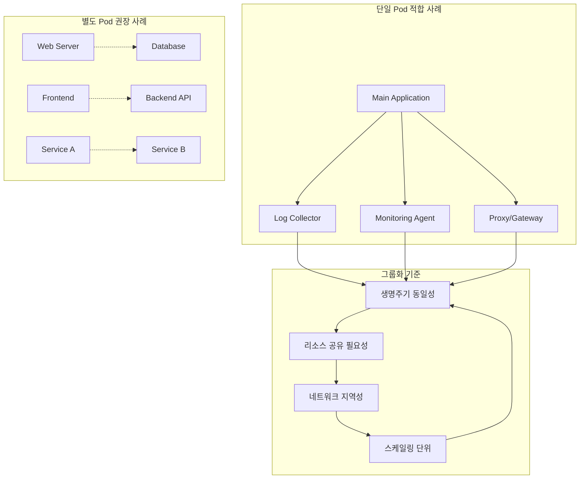
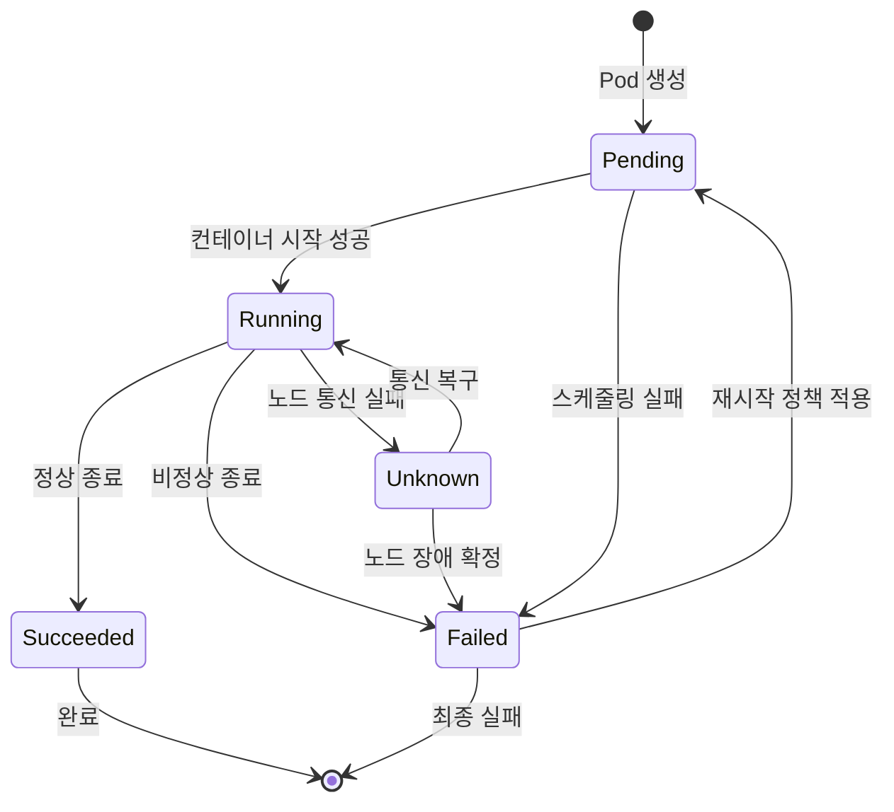
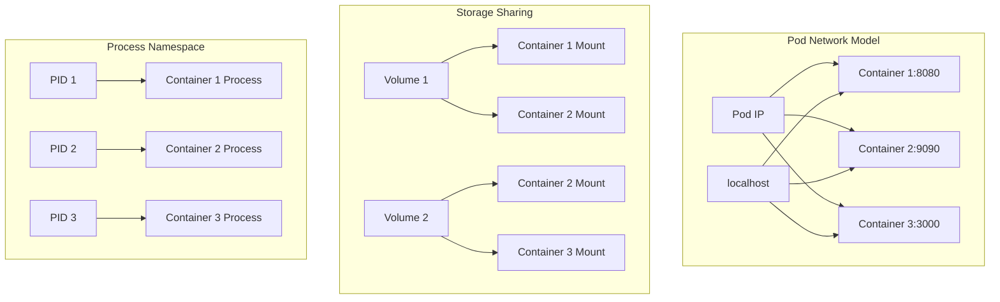

# Session 1: Pod 개념과 설계 원리

## 📍 교과과정에서의 위치
이 세션은 **Week 2 > Day 2 > Session 1**로, Kubernetes의 가장 기본적인 배포 단위인 Pod의 개념과 설계 원리를 학습합니다. Day 1에서 학습한 아키텍처를 바탕으로 실제 워크로드가 어떻게 구성되는지 이해합니다.

## 학습 목표 (5분)
- **Pod**의 **정의**와 **최소 배포 단위** 개념 완전 이해
- **컨테이너 그룹화** 원칙과 **사이드카 패턴** 학습
- **Pod 라이프사이클**과 **상태 전이** 메커니즘 파악
- **리소스 공유**와 **네트워크 모델** 이해

## 1. Pod의 정의와 최소 배포 단위 개념 (15분)

### Pod 기본 개념



### Pod vs Container 비교
```
Pod vs Container 개념 비교:

Container (Docker 관점):
   🔹 단일 프로세스 격리
   🔹 개별 네트워크 네임스페이스
   🔹 독립적인 파일시스템
   🔹 개별 라이프사이클 관리
   🔹 직접적인 컨테이너 조작

Pod (Kubernetes 관점):
   🔹 다중 컨테이너 그룹
   🔹 공유 네트워크 네임스페이스
   🔹 공유 스토리지 볼륨
   🔹 통합 라이프사이클 관리
   🔹 선언적 상태 관리

설계 철학:
   🔹 Container: 프로세스 중심 격리
   🔹 Pod: 애플리케이션 중심 그룹화
   🔹 Container: 기술적 추상화
   🔹 Pod: 비즈니스 로직 단위
   🔹 Container: 실행 환경, Pod: 배포 단위
```

## 2. 컨테이너 그룹화 원칙과 사이드카 패턴 (12분)

### 컨테이너 그룹화 원칙



### 사이드카 패턴 분석
```
사이드카 패턴 (Sidecar Pattern):

정의:
   🔹 주 컨테이너를 보조하는 컨테이너
   🔹 동일한 Pod 내에서 실행
   🔹 주 애플리케이션 로직과 분리
   🔹 횡단 관심사 처리

일반적인 사용 사례:
   🔹 로깅 에이전트 (Fluentd, Filebeat)
   🔹 모니터링 에이전트 (Prometheus exporter)
   🔹 서비스 메시 프록시 (Envoy, Istio)
   🔹 설정 관리 (Config reloader)
   🔹 보안 프록시 (TLS termination)
   🔹 데이터 동기화 (Git sync)

장점:
   🔹 관심사 분리 (Separation of Concerns)
   🔹 재사용성 (Reusability)
   🔹 독립적 개발 및 배포
   🔹 언어 독립성
   🔹 표준화된 보조 기능

단점:
   🔹 리소스 오버헤드
   🔹 복잡성 증가
   🔹 디버깅 어려움
   🔹 네트워크 지연 가능성
```

## 3. Pod 라이프사이클과 상태 전이 메커니즘 (10분)

### Pod 상태 전이 다이어그램



### Pod 라이프사이클 단계
```
Pod 라이프사이클 상세:

Pending (대기):
   🔹 Pod가 생성되었지만 아직 실행되지 않음
   🔹 스케줄링 대기 중
   🔹 이미지 다운로드 중
   🔹 볼륨 마운트 대기
   🔹 리소스 할당 대기

Running (실행):
   🔹 Pod가 노드에 바인딩됨
   🔹 모든 컨테이너가 생성됨
   🔹 최소 하나의 컨테이너가 실행 중
   🔹 컨테이너 시작 중이거나 재시작 중
   🔹 정상 작동 상태

Succeeded (성공):
   🔹 모든 컨테이너가 성공적으로 종료
   🔹 재시작되지 않음
   🔹 Job이나 CronJob에서 주로 발생
   🔹 일회성 작업 완료

Failed (실패):
   🔹 모든 컨테이너가 종료됨
   🔹 최소 하나의 컨테이너가 실패로 종료
   🔹 재시작 정책에 따라 재시작 시도
   🔹 최대 재시작 횟수 초과 시 최종 실패

Unknown (알 수 없음):
   🔹 Pod 상태를 확인할 수 없음
   🔹 노드와의 통신 문제
   🔹 kubelet 응답 없음
   🔹 네트워크 분할 상황
```

## 4. 리소스 공유와 네트워크 모델 (10분)

### Pod 내 리소스 공유 모델



### 리소스 공유 메커니즘
```
Pod 내 리소스 공유:

네트워크 공유:
   🔹 단일 IP 주소 할당
   🔹 포트 공간 공유 (포트 충돌 주의)
   🔹 localhost 통신 가능
   🔹 네트워크 네임스페이스 공유
   🔹 DNS 설정 공유

스토리지 공유:
   🔹 볼륨을 여러 컨테이너가 마운트
   🔹 파일 시스템 공유 가능
   🔹 데이터 교환 및 통신
   🔹 로그 수집 패턴 구현
   🔹 설정 파일 공유

프로세스 네임스페이스:
   🔹 선택적 공유 (shareProcessNamespace)
   🔹 프로세스 간 시그널 전송 가능
   🔹 디버깅 및 모니터링 용이
   🔹 보안 고려사항 존재
   🔹 기본적으로는 격리됨

리소스 제한:
   🔹 CPU/메모리 제한은 컨테이너별
   🔹 Pod 전체 리소스는 합산
   🔹 QoS 클래스는 Pod 단위
   🔹 리소스 경합 시 우선순위 적용
   🔹 노드 리소스 할당 단위
```

## 💬 그룹 토론: Pod가 최소 배포 단위인 이유와 설계 철학 (8분)

### 토론 주제
**"왜 Kubernetes는 컨테이너가 아닌 Pod를 최소 배포 단위로 선택했으며, 이 설계 결정이 가져다주는 장점과 단점은 무엇인가?"**

### 토론 가이드라인

#### 설계 철학 분석 (3분)
- **애플리케이션 중심**: 비즈니스 로직 단위의 그룹화
- **리소스 공유**: 밀접한 결합이 필요한 컨테이너들
- **운영 단순화**: 함께 관리되어야 하는 구성 요소들

#### 장점 분석 (3분)
- **사이드카 패턴**: 횡단 관심사의 효과적 분리
- **리소스 효율성**: 네트워크와 스토리지 공유
- **운영 일관성**: 동일한 라이프사이클 관리

#### 단점 및 고려사항 (2분)
- **복잡성**: 컨테이너 간 의존성 관리
- **리소스 낭비**: 불필요한 결합으로 인한 오버헤드
- **디버깅**: 다중 컨테이너 환경의 문제 추적

## 💡 핵심 개념 정리
- **Pod**: Kubernetes의 최소 배포 단위, 하나 이상의 컨테이너 그룹
- **사이드카 패턴**: 주 애플리케이션을 보조하는 컨테이너 패턴
- **라이프사이클**: Pending → Running → Succeeded/Failed 상태 전이
- **리소스 공유**: 네트워크, 스토리지, 프로세스 네임스페이스 공유

## 📚 참고 자료
- [Pod 개념](https://kubernetes.io/docs/concepts/workloads/pods/)
- [Pod 라이프사이클](https://kubernetes.io/docs/concepts/workloads/pods/pod-lifecycle/)
- [사이드카 패턴](https://kubernetes.io/docs/concepts/cluster-administration/logging/#sidecar-container-with-logging-agent)

## 다음 세션 준비
다음 세션에서는 **ReplicaSet과 Deployment**에 대해 학습합니다. Pod의 복제본 관리와 선언적 배포 모델을 이론적으로 이해할 예정입니다.