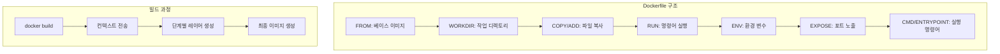
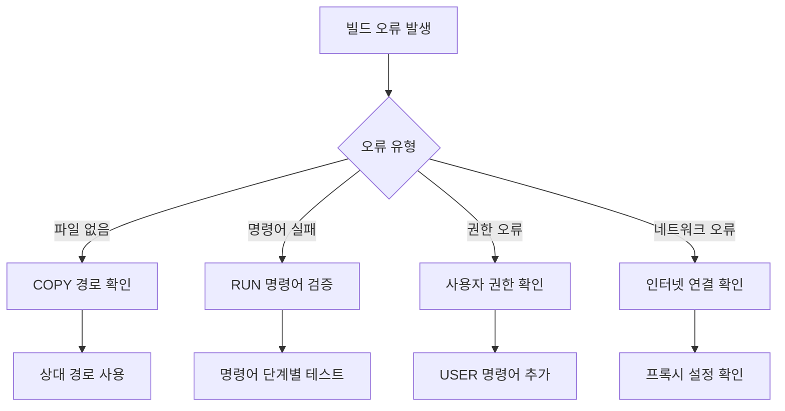

# Session 1: Dockerfile 기본 문법과 구조

## 📍 교과과정에서의 위치
이 세션은 **Week 2 > Day 2 > Session 1**로, Day 1에서 학습한 이미지 다운로드와 컨테이너 실행을 바탕으로 직접 이미지를 생성하는 방법을 학습합니다. Week 1의 이미지 레이어 이론을 실제 Dockerfile로 구현합니다.

## 학습 목표 (5분)
- **Dockerfile 문법**과 **명령어 체계** 이해
- **첫 번째 Dockerfile** 작성 및 **빌드** 실습
- **이미지 레이어** 구조와 **빌드 과정** 체험

## 1. 이론: Dockerfile 문법과 명령어 체계 (20분)

### Dockerfile 구조와 실행 순서



### 주요 Dockerfile 명령어

```dockerfile
# 기본 구조 예시
FROM ubuntu:20.04                    # 베이스 이미지 지정
LABEL maintainer="user@example.com"  # 메타데이터 추가
WORKDIR /app                         # 작업 디렉토리 설정
COPY . .                            # 파일 복사
RUN apt-get update && apt-get install -y python3  # 명령어 실행
ENV NODE_ENV=production             # 환경 변수 설정
EXPOSE 3000                         # 포트 노출 선언
CMD ["python3", "app.py"]           # 기본 실행 명령어
```

### 명령어별 특징과 용도

| 명령어 | 용도 | 레이어 생성 | 예시 |
|--------|------|-------------|------|
| **FROM** | 베이스 이미지 지정 | ✅ | `FROM node:16-alpine` |
| **RUN** | 빌드 시 명령어 실행 | ✅ | `RUN npm install` |
| **COPY** | 파일/디렉토리 복사 | ✅ | `COPY . /app` |
| **ADD** | 파일 복사 + 압축 해제 | ✅ | `ADD archive.tar.gz /app` |
| **WORKDIR** | 작업 디렉토리 변경 | ❌ | `WORKDIR /app` |
| **ENV** | 환경 변수 설정 | ❌ | `ENV PORT=3000` |
| **EXPOSE** | 포트 노출 선언 | ❌ | `EXPOSE 80` |
| **CMD** | 기본 실행 명령어 | ❌ | `CMD ["npm", "start"]` |

### 레이어 캐싱 메커니즘

```
빌드 캐시 동작:
├── 각 명령어마다 레이어 생성
├── 명령어가 변경되지 않으면 캐시 사용
├── 변경된 명령어부터 다시 빌드
└── 파일 변경 시 해당 COPY부터 재빌드

최적화 원칙:
├── 자주 변경되지 않는 명령어를 앞쪽에 배치
├── 패키지 설치를 소스 코드 복사보다 먼저
├── .dockerignore로 불필요한 파일 제외
└── 명령어 체이닝으로 레이어 수 최소화
```

## 2. 실습: 첫 번째 Dockerfile 작성 (15분)

### 간단한 HTML 웹사이트 이미지 생성

```bash
# 실습 디렉토리 생성
mkdir -p ~/docker-practice/day2/session1
cd ~/docker-practice/day2/session1

# HTML 파일 생성
cat > index.html << 'EOF'
<!DOCTYPE html>
<html lang="ko">
<head>
    <meta charset="UTF-8">
    <meta name="viewport" content="width=device-width, initial-scale=1.0">
    <title>My First Docker Image</title>
    <style>
        body { font-family: Arial, sans-serif; margin: 40px; background: #f0f0f0; }
        .container { background: white; padding: 20px; border-radius: 8px; box-shadow: 0 2px 4px rgba(0,0,0,0.1); }
        h1 { color: #333; }
        .info { background: #e7f3ff; padding: 10px; border-left: 4px solid #2196F3; margin: 20px 0; }
    </style>
</head>
<body>
    <div class="container">
        <h1>🐳 My First Docker Image</h1>
        <p>이 페이지는 직접 만든 Docker 이미지에서 실행되고 있습니다!</p>
        <div class="info">
            <strong>빌드 정보:</strong><br>
            - 베이스 이미지: nginx:alpine<br>
            - 빌드 시간: <span id="buildTime"></span><br>
            - 컨테이너 ID: <span id="hostname"></span>
        </div>
        <p>Docker 이미지 빌드 성공! 🎉</p>
    </div>
    
    <script>
        document.getElementById('buildTime').textContent = new Date().toLocaleString();
        fetch('/hostname').then(r => r.text()).then(h => 
            document.getElementById('hostname').textContent = h
        ).catch(() => 
            document.getElementById('hostname').textContent = 'Unknown'
        );
    </script>
</body>
</html>
EOF
```

### 첫 번째 Dockerfile 작성

```dockerfile
# Dockerfile 생성
cat > Dockerfile << 'EOF'
# 베이스 이미지로 nginx alpine 버전 사용
FROM nginx:alpine

# 메타데이터 추가
LABEL maintainer="student@example.com"
LABEL description="My first Docker image with custom HTML"
LABEL version="1.0"

# HTML 파일을 nginx 웹 루트로 복사
COPY index.html /usr/share/nginx/html/

# nginx가 사용하는 포트 노출
EXPOSE 80

# nginx는 이미 CMD가 설정되어 있으므로 별도 설정 불필요
# 기본적으로 nginx -g "daemon off;" 가 실행됨
EOF
```

### 이미지 빌드 및 실행

```bash
# 이미지 빌드
docker build -t my-first-image:v1.0 .

# 빌드 과정 관찰
# Step 1/4 : FROM nginx:alpine
# Step 2/4 : LABEL maintainer="student@example.com"
# Step 3/4 : COPY index.html /usr/share/nginx/html/
# Step 4/4 : EXPOSE 80

# 생성된 이미지 확인
docker images my-first-image

# 컨테이너 실행
docker run -d -p 8080:80 --name my-web my-first-image:v1.0

# 웹사이트 접근 확인
curl http://localhost:8080
# 또는 웹 브라우저에서 http://localhost:8080 접속
```

## 3. 실습: Python 애플리케이션 이미지 (10분)

### Python Flask 애플리케이션 준비

```bash
# 새 디렉토리 생성
mkdir -p python-app && cd python-app

# Python 애플리케이션 작성
cat > app.py << 'EOF'
from flask import Flask, jsonify
import os
import socket
from datetime import datetime

app = Flask(__name__)

@app.route('/')
def home():
    return '''
    <h1>🐍 Python Flask in Docker</h1>
    <p>이 애플리케이션은 Docker 컨테이너에서 실행 중입니다.</p>
    <ul>
        <li><a href="/info">시스템 정보</a></li>
        <li><a href="/env">환경 변수</a></li>
        <li><a href="/health">헬스 체크</a></li>
    </ul>
    '''

@app.route('/info')
def info():
    return jsonify({
        'hostname': socket.gethostname(),
        'timestamp': datetime.now().isoformat(),
        'python_version': os.sys.version,
        'flask_env': os.environ.get('FLASK_ENV', 'production')
    })

@app.route('/env')
def env():
    return jsonify(dict(os.environ))

@app.route('/health')
def health():
    return jsonify({'status': 'healthy', 'timestamp': datetime.now().isoformat()})

if __name__ == '__main__':
    port = int(os.environ.get('PORT', 5000))
    app.run(host='0.0.0.0', port=port, debug=True)
EOF

# requirements.txt 생성
cat > requirements.txt << 'EOF'
Flask==2.3.3
Werkzeug==2.3.7
EOF
```

### Python 애플리케이션 Dockerfile

```dockerfile
cat > Dockerfile << 'EOF'
# Python 3.9 slim 이미지 사용 (크기 최적화)
FROM python:3.9-slim

# 메타데이터
LABEL maintainer="student@example.com"
LABEL description="Python Flask application in Docker"

# 작업 디렉토리 설정
WORKDIR /app

# 의존성 파일 먼저 복사 (캐시 최적화)
COPY requirements.txt .

# Python 패키지 설치
RUN pip install --no-cache-dir -r requirements.txt

# 애플리케이션 코드 복사
COPY app.py .

# 환경 변수 설정
ENV FLASK_ENV=production
ENV PORT=5000

# 포트 노출
EXPOSE 5000

# 애플리케이션 실행
CMD ["python", "app.py"]
EOF
```

### Python 이미지 빌드 및 테스트

```bash
# 이미지 빌드
docker build -t python-flask-app:v1.0 .

# 빌드 과정에서 각 단계의 레이어 생성 확인
docker history python-flask-app:v1.0

# 컨테이너 실행
docker run -d -p 8081:5000 --name flask-app python-flask-app:v1.0

# 애플리케이션 테스트
curl http://localhost:8081/
curl http://localhost:8081/info
curl http://localhost:8081/health

# 로그 확인
docker logs flask-app
```

## 4. 빌드 컨텍스트와 .dockerignore (10분)

### 빌드 컨텍스트 이해

```bash
# 현재 디렉토리 구조 확인
ls -la

# 빌드 컨텍스트에 포함되는 파일들 확인
echo "This is a test file" > test.txt
echo "node_modules/" > .gitignore
mkdir -p node_modules logs temp
echo "dummy" > node_modules/dummy.js
echo "log entry" > logs/app.log
echo "temp file" > temp/cache.tmp

# .dockerignore 파일 생성
cat > .dockerignore << 'EOF'
# 버전 관리 파일
.git
.gitignore

# 로그 및 임시 파일
logs/
temp/
*.log
*.tmp

# 개발 도구
node_modules/
.vscode/
.idea/

# OS 생성 파일
.DS_Store
Thumbs.db

# 빌드 아티팩트
dist/
build/
*.pyc
__pycache__/
EOF

# .dockerignore 적용 전후 빌드 시간 비교
time docker build -t test-context:before .

# 불필요한 파일 정리 후 다시 빌드
time docker build -t test-context:after .
```

### 빌드 최적화 확인

```bash
# 이미지 크기 비교
docker images | grep -E "(python-flask-app|my-first-image)"

# 레이어 구조 분석
docker history python-flask-app:v1.0 --format "table {{.CreatedBy}}\t{{.Size}}"

# 빌드 캐시 테스트 (파일 수정 후 재빌드)
echo "# Updated" >> app.py
docker build -t python-flask-app:v1.1 .
# 캐시 사용 여부 확인
```

## 5. Q&A 및 문제 해결 (5분)

### 일반적인 빌드 오류 해결



### 유용한 빌드 명령어

```bash
# 빌드 과정 상세 출력
docker build --progress=plain -t my-app .

# 캐시 사용하지 않고 빌드
docker build --no-cache -t my-app .

# 특정 Dockerfile 사용
docker build -f Dockerfile.dev -t my-app-dev .

# 빌드 인수 전달
docker build --build-arg VERSION=1.0 -t my-app .

# 빌드 컨텍스트 확인
docker build --dry-run -t my-app .
```

## 💡 핵심 키워드
- **Dockerfile**: 이미지 빌드 명세서, 선언적 구성
- **빌드 컨텍스트**: docker build 시 전송되는 파일들
- **레이어 캐싱**: 빌드 성능 최적화의 핵심
- **.dockerignore**: 불필요한 파일 제외로 빌드 최적화

## 📚 참고 자료
- [Dockerfile 레퍼런스](https://docs.docker.com/engine/reference/builder/)
- [Docker 빌드 모범 사례](https://docs.docker.com/develop/dev-best-practices/)
- [.dockerignore 가이드](https://docs.docker.com/engine/reference/builder/#dockerignore-file)

## 🔧 실습 체크리스트
- [ ] 첫 번째 Dockerfile 작성 및 빌드 성공
- [ ] HTML 웹사이트 이미지 생성 및 실행
- [ ] Python Flask 애플리케이션 이미지 구축
- [ ] .dockerignore 파일 작성 및 빌드 최적화
- [ ] 빌드 캐시 메커니즘 이해 및 활용
