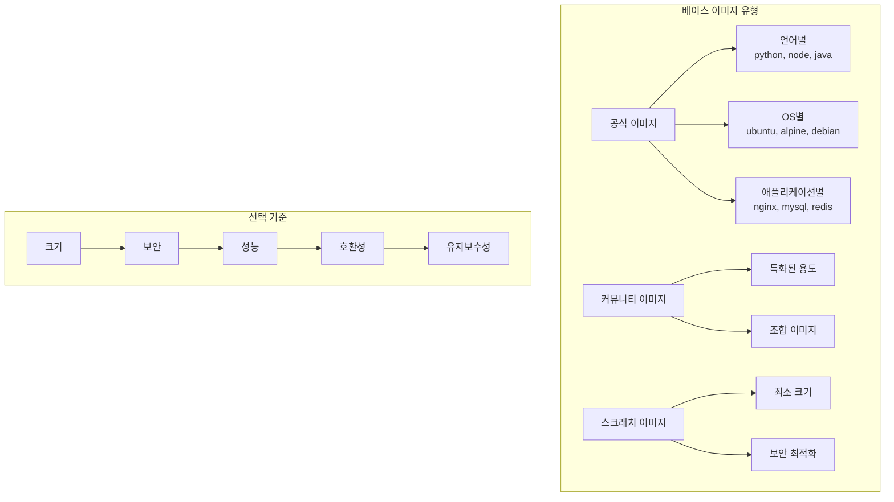
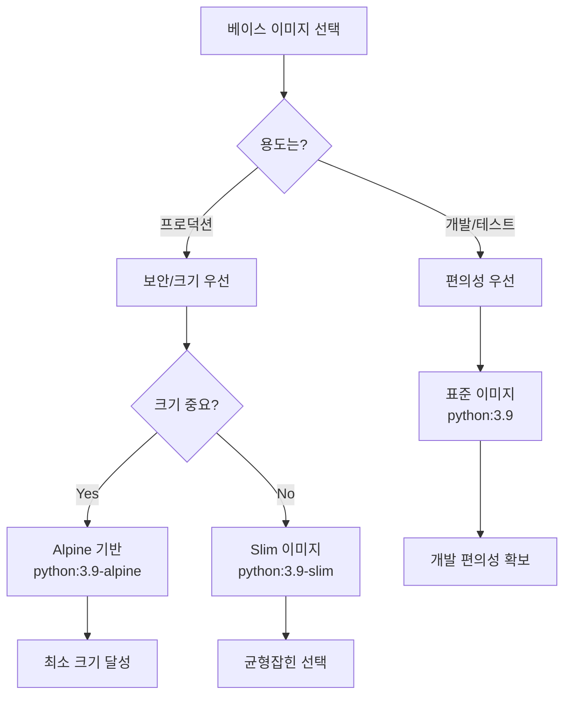

# Session 2: 베이스 이미지 선택과 FROM 명령어

## 📍 교과과정에서의 위치
이 세션은 **Week 2 > Day 2 > Session 2**로, Dockerfile의 첫 번째 명령어인 FROM을 심화 학습합니다. Week 1에서 학습한 이미지 레이어 이론과 Session 1의 기본 Dockerfile 작성을 바탕으로 베이스 이미지 선택 전략을 실습합니다.

## 학습 목표 (5분)
- **베이스 이미지 선택** 전략과 **고려사항** 이해
- **다양한 베이스 이미지**로 **빌드 비교** 실습
- **이미지 크기**와 **보안성** 최적화 방법 학습

## 1. 이론: 베이스 이미지 선택 전략과 고려사항 (20분)

### 베이스 이미지 분류 체계



### 주요 베이스 이미지 비교

| 이미지 | 크기 | 보안 | 패키지 매니저 | 사용 사례 |
|--------|------|------|---------------|-----------|
| **ubuntu:20.04** | ~72MB | 중간 | apt | 개발, 테스트 환경 |
| **alpine:latest** | ~5MB | 높음 | apk | 프로덕션, 마이크로서비스 |
| **debian:slim** | ~69MB | 중간 | apt | 안정성 중시 환경 |
| **scratch** | 0MB | 최고 | 없음 | 정적 바이너리 전용 |
| **distroless** | ~20MB | 높음 | 없음 | 보안 중시 프로덕션 |

### 언어별 베이스 이미지 전략

```
Python 애플리케이션:
├── python:3.9 (기본, 개발용)
├── python:3.9-slim (크기 최적화)
├── python:3.9-alpine (최소 크기)
└── python:3.9-slim-bullseye (특정 OS 버전)

Node.js 애플리케이션:
├── node:16 (기본, 모든 도구 포함)
├── node:16-alpine (경량화)
├── node:16-slim (중간 크기)
└── node:16-bullseye-slim (특정 버전)

Java 애플리케이션:
├── openjdk:11 (기본 JDK)
├── openjdk:11-jre (런타임만)
├── openjdk:11-jre-slim (최적화)
└── eclipse-temurin:11-jre-alpine (Eclipse 배포판)
```

### 보안 고려사항

```
베이스 이미지 보안 체크리스트:
├── 공식 이미지 사용 (Docker Official Images)
├── 최신 버전 사용 (보안 패치 적용)
├── 취약점 스캔 결과 확인
├── 불필요한 패키지 최소화
├── 정기적인 업데이트 계획
└── 신뢰할 수 있는 레지스트리 사용
```

## 2. 실습: 다양한 베이스 이미지 비교 (15분)

### 동일 애플리케이션, 다른 베이스 이미지

```bash
# 실습 디렉토리 준비
mkdir -p ~/docker-practice/day2/session2
cd ~/docker-practice/day2/session2

# 공통 Python 애플리케이션 작성
cat > app.py << 'EOF'
import sys
import platform
import os
from datetime import datetime

def get_system_info():
    return {
        'python_version': sys.version,
        'platform': platform.platform(),
        'architecture': platform.architecture(),
        'hostname': platform.node(),
        'timestamp': datetime.now().isoformat(),
        'base_image': os.environ.get('BASE_IMAGE', 'unknown')
    }

if __name__ == '__main__':
    info = get_system_info()
    print("=== System Information ===")
    for key, value in info.items():
        print(f"{key}: {value}")
EOF
```

### 1. 표준 Python 이미지

```dockerfile
# Dockerfile.standard
cat > Dockerfile.standard << 'EOF'
FROM python:3.9

LABEL base_image="python:3.9"
ENV BASE_IMAGE="python:3.9"

WORKDIR /app
COPY app.py .

CMD ["python", "app.py"]
EOF

# 빌드 및 크기 확인
docker build -f Dockerfile.standard -t python-app:standard .
docker images python-app:standard
```

### 2. Slim 이미지

```dockerfile
# Dockerfile.slim
cat > Dockerfile.slim << 'EOF'
FROM python:3.9-slim

LABEL base_image="python:3.9-slim"
ENV BASE_IMAGE="python:3.9-slim"

WORKDIR /app
COPY app.py .

CMD ["python", "app.py"]
EOF

# 빌드 및 크기 확인
docker build -f Dockerfile.slim -t python-app:slim .
docker images python-app:slim
```

### 3. Alpine 이미지

```dockerfile
# Dockerfile.alpine
cat > Dockerfile.alpine << 'EOF'
FROM python:3.9-alpine

LABEL base_image="python:3.9-alpine"
ENV BASE_IMAGE="python:3.9-alpine"

WORKDIR /app
COPY app.py .

CMD ["python", "app.py"]
EOF

# 빌드 및 크기 확인
docker build -f Dockerfile.alpine -t python-app:alpine .
docker images python-app:alpine
```

### 4. Ubuntu 기반 커스텀 이미지

```dockerfile
# Dockerfile.ubuntu
cat > Dockerfile.ubuntu << 'EOF'
FROM ubuntu:20.04

LABEL base_image="ubuntu:20.04"
ENV BASE_IMAGE="ubuntu:20.04"

# 패키지 업데이트 및 Python 설치
RUN apt-get update && \
    apt-get install -y python3 python3-pip && \
    apt-get clean && \
    rm -rf /var/lib/apt/lists/*

WORKDIR /app
COPY app.py .

CMD ["python3", "app.py"]
EOF

# 빌드 및 크기 확인
docker build -f Dockerfile.ubuntu -t python-app:ubuntu .
docker images python-app:ubuntu
```

### 이미지 크기 비교 및 실행 테스트

```bash
# 모든 이미지 크기 비교
echo "=== Image Size Comparison ==="
docker images python-app --format "table {{.Repository}}\t{{.Tag}}\t{{.Size}}"

# 각 이미지 실행 및 결과 비교
echo -e "\n=== Standard Python Image ==="
docker run --rm python-app:standard

echo -e "\n=== Slim Python Image ==="
docker run --rm python-app:slim

echo -e "\n=== Alpine Python Image ==="
docker run --rm python-app:alpine

echo -e "\n=== Ubuntu Python Image ==="
docker run --rm python-app:ubuntu

# 빌드 시간 비교 (재빌드)
echo -e "\n=== Build Time Comparison ==="
time docker build -f Dockerfile.standard -t python-app:standard . --no-cache
time docker build -f Dockerfile.slim -t python-app:slim . --no-cache
time docker build -f Dockerfile.alpine -t python-app:alpine . --no-cache
time docker build -f Dockerfile.ubuntu -t python-app:ubuntu . --no-cache
```

## 3. 실습: 웹 서버 베이스 이미지 비교 (10분)

### Nginx 기반 정적 웹사이트

```bash
# HTML 파일 준비
cat > index.html << 'EOF'
<!DOCTYPE html>
<html>
<head>
    <title>Base Image Comparison</title>
    <style>
        body { font-family: Arial, sans-serif; margin: 40px; }
        .comparison { display: flex; gap: 20px; flex-wrap: wrap; }
        .card { border: 1px solid #ddd; padding: 20px; border-radius: 8px; min-width: 200px; }
        .standard { background-color: #e3f2fd; }
        .alpine { background-color: #f3e5f5; }
        .slim { background-color: #e8f5e8; }
    </style>
</head>
<body>
    <h1>🐳 Docker Base Image Comparison</h1>
    <div class="comparison">
        <div class="card standard">
            <h3>Standard Image</h3>
            <p>Full-featured base image</p>
            <p>Size: Large (~900MB)</p>
            <p>Use: Development</p>
        </div>
        <div class="card alpine">
            <h3>Alpine Image</h3>
            <p>Minimal Linux distribution</p>
            <p>Size: Small (~50MB)</p>
            <p>Use: Production</p>
        </div>
        <div class="card slim">
            <h3>Slim Image</h3>
            <p>Reduced package set</p>
            <p>Size: Medium (~150MB)</p>
            <p>Use: Balanced approach</p>
        </div>
    </div>
</body>
</html>
EOF
```

### 다양한 Nginx 베이스 이미지

```dockerfile
# Dockerfile.nginx-standard
cat > Dockerfile.nginx-standard << 'EOF'
FROM nginx:latest

COPY index.html /usr/share/nginx/html/
EXPOSE 80
EOF

# Dockerfile.nginx-alpine
cat > Dockerfile.nginx-alpine << 'EOF'
FROM nginx:alpine

COPY index.html /usr/share/nginx/html/
EXPOSE 80
EOF

# 빌드 및 비교
docker build -f Dockerfile.nginx-standard -t web-app:nginx-standard .
docker build -f Dockerfile.nginx-alpine -t web-app:nginx-alpine .

# 크기 비교
docker images web-app

# 실행 테스트
docker run -d -p 8082:80 --name web-standard web-app:nginx-standard
docker run -d -p 8083:80 --name web-alpine web-app:nginx-alpine

# 접근 테스트
curl -I http://localhost:8082
curl -I http://localhost:8083
```

## 4. 실습: 멀티 아키텍처 이미지 (10분)

### 플랫폼별 이미지 확인

```bash
# 현재 플랫폼 확인
docker version --format '{{.Server.Os}}/{{.Server.Arch}}'

# 멀티 아키텍처 이미지 정보 확인
docker manifest inspect nginx:alpine

# 특정 플랫폼 이미지 빌드
docker build --platform linux/amd64 -f Dockerfile.alpine -t python-app:alpine-amd64 .
docker build --platform linux/arm64 -f Dockerfile.alpine -t python-app:alpine-arm64 . 2>/dev/null || echo "ARM64 not supported on this system"

# 플랫폼별 이미지 확인
docker images python-app | grep alpine
```

### 베이스 이미지 선택 가이드라인

```dockerfile
# 개발 환경용 Dockerfile
cat > Dockerfile.dev << 'EOF'
# 개발 시에는 편의성을 위해 full 이미지 사용
FROM python:3.9

# 개발 도구 설치
RUN pip install --no-cache-dir \
    pytest \
    black \
    flake8 \
    mypy

WORKDIR /app
COPY . .

# 개발 서버 실행
CMD ["python", "-m", "flask", "run", "--host=0.0.0.0", "--debug"]
EOF

# 프로덕션 환경용 Dockerfile
cat > Dockerfile.prod << 'EOF'
# 프로덕션에서는 보안과 크기를 위해 alpine 사용
FROM python:3.9-alpine

# 필수 패키지만 설치
RUN apk add --no-cache \
    gcc \
    musl-dev \
    && pip install --no-cache-dir flask gunicorn \
    && apk del gcc musl-dev

WORKDIR /app
COPY app.py .

# 프로덕션 서버 실행
CMD ["gunicorn", "--bind", "0.0.0.0:5000", "app:app"]
EOF
```

## 5. 베이스 이미지 보안 및 최적화 (10분)

### 이미지 취약점 스캔

```bash
# Docker Scout를 사용한 취약점 스캔 (Docker Desktop 포함)
docker scout cves python-app:standard
docker scout cves python-app:alpine

# 또는 Trivy 사용 (별도 설치 필요)
# docker run --rm -v /var/run/docker.sock:/var/run/docker.sock \
#   aquasec/trivy:latest image python-app:standard
```

### 최적화된 베이스 이미지 선택

```dockerfile
# 최적화된 Python 이미지 예시
cat > Dockerfile.optimized << 'EOF'
# 1단계: 빌드 환경 (필요한 도구 포함)
FROM python:3.9-alpine as builder

# 빌드 의존성 설치
RUN apk add --no-cache gcc musl-dev

WORKDIR /app
COPY requirements.txt .
RUN pip install --user --no-cache-dir -r requirements.txt

# 2단계: 런타임 환경 (최소한의 패키지만)
FROM python:3.9-alpine

# 빌드된 패키지만 복사
COPY --from=builder /root/.local /root/.local
COPY app.py /app/

WORKDIR /app

# PATH에 사용자 설치 경로 추가
ENV PATH=/root/.local/bin:$PATH

CMD ["python", "app.py"]
EOF

# 최적화된 이미지 빌드
echo "flask==2.3.3" > requirements.txt
docker build -f Dockerfile.optimized -t python-app:optimized .

# 크기 비교
docker images python-app --format "table {{.Tag}}\t{{.Size}}"
```

### 베이스 이미지 업데이트 전략

```bash
# 이미지 태그 전략 예시
cat > update-strategy.md << 'EOF'
베이스 이미지 업데이트 전략:

1. 고정 버전 사용 (권장)
   FROM python:3.9.18-alpine3.18
   
2. 마이너 버전 고정
   FROM python:3.9-alpine
   
3. 메이저 버전만 고정 (주의 필요)
   FROM python:3-alpine
   
4. 최신 버전 (비권장)
   FROM python:alpine

보안 업데이트 주기:
- 월 1회 베이스 이미지 업데이트 확인
- 중요 보안 패치 시 즉시 업데이트
- 자동화된 취약점 스캔 설정
EOF

cat update-strategy.md
```

## 6. Q&A 및 정리 (5분)

### 베이스 이미지 선택 결정 트리



### 실습 결과 정리

```bash
# 최종 이미지 크기 비교 요약
echo "=== Final Image Size Summary ==="
docker images --format "table {{.Repository}}\t{{.Tag}}\t{{.Size}}" | grep -E "(python-app|web-app)"

# 정리: 테스트 컨테이너 중지 및 삭제
docker stop web-standard web-alpine 2>/dev/null || true
docker rm web-standard web-alpine 2>/dev/null || true
```

## 💡 핵심 키워드
- **베이스 이미지**: FROM 명령어로 지정하는 기반 이미지
- **Alpine Linux**: 보안과 크기에 최적화된 경량 배포판
- **Slim 이미지**: 불필요한 패키지를 제거한 중간 크기 이미지
- **멀티 아키텍처**: 다양한 CPU 아키텍처 지원 이미지

## 📚 참고 자료
- [Docker Official Images](https://hub.docker.com/search?q=&type=image&image_filter=official)
- [Alpine Linux](https://alpinelinux.org/)
- [Distroless Images](https://github.com/GoogleContainerTools/distroless)

## 🔧 실습 체크리스트
- [ ] 다양한 베이스 이미지로 동일 앱 빌드
- [ ] 이미지 크기 비교 및 분석
- [ ] Alpine vs Slim vs Standard 특성 이해
- [ ] 멀티 아키텍처 이미지 확인
- [ ] 보안 및 최적화 고려사항 적용
