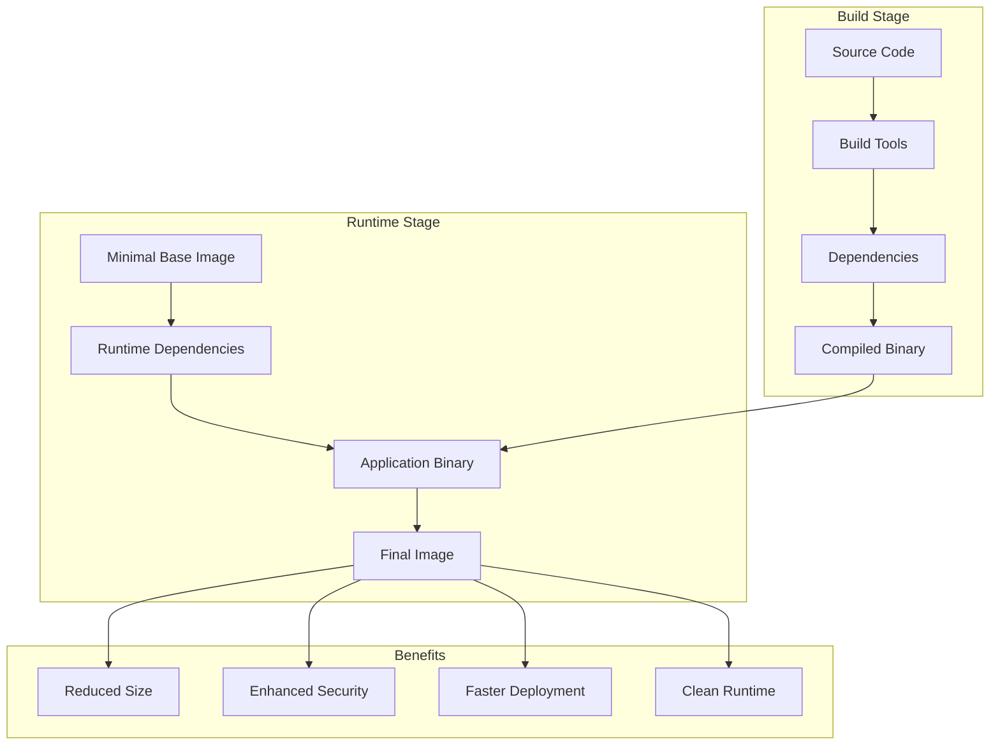
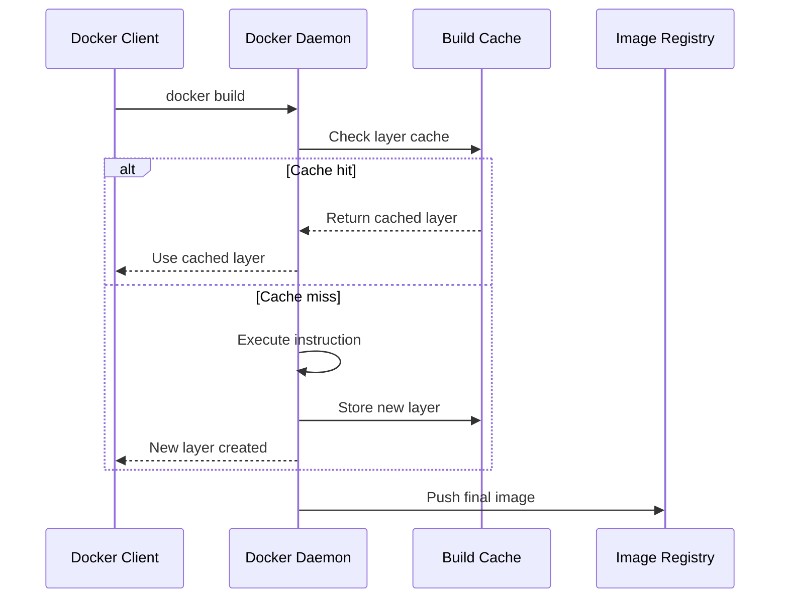

# Session 2: 이미지 최적화 및 빌드 전략

## 📍 교과과정에서의 위치
이 세션은 **Week 2 > Day 2 > Session 2**로, 컨테이너 리소스 관리 이해를 바탕으로 Docker 이미지 최적화와 효율적인 빌드 전략을 심화 분석합니다.

## 학습 목표 (5분)
- **멀티 스테이지 빌드** 고급 기법과 **이미지 최적화** 전략
- **빌드 캐시 메커니즘**과 **레이어 최적화** 기법
- **보안 강화**와 **성능 향상**을 위한 이미지 설계 원리

## 1. 이론: 멀티 스테이지 빌드 아키텍처 (20분)

### 멀티 스테이지 빌드 구조 분석



### 고급 멀티 스테이지 패턴

```dockerfile
# 고급 멀티 스테이지 빌드 예시 (개념 예시)

# 1. 의존성 캐시 스테이지
FROM node:16-alpine AS deps
WORKDIR /app
COPY package*.json ./
RUN npm ci --only=production && npm cache clean --force

# 2. 개발 의존성 스테이지
FROM node:16-alpine AS dev-deps
WORKDIR /app
COPY package*.json ./
RUN npm ci

# 3. 빌드 스테이지
FROM dev-deps AS builder
COPY . .
RUN npm run build && npm run test

# 4. 런타임 스테이지
FROM node:16-alpine AS runtime
RUN addgroup -g 1001 -S nodejs && \
    adduser -S nextjs -u 1001
WORKDIR /app
COPY --from=deps /app/node_modules ./node_modules
COPY --from=builder /app/dist ./dist
COPY --from=builder /app/public ./public
USER nextjs
EXPOSE 3000
CMD ["node", "dist/server.js"]
```

### 이미지 크기 최적화 전략

```
이미지 최적화 기법:

베이스 이미지 선택:
├── Alpine Linux: 최소 크기 (5MB)
├── Distroless: Google의 보안 강화 이미지
├── Scratch: 정적 바이너리용 빈 이미지
├── Slim 태그: 공식 이미지의 경량 버전
├── 특정 언어 런타임: node:alpine, python:slim
└── 보안 패치 주기 고려

레이어 최적화:
├── RUN 명령어 체이닝으로 레이어 수 감소
├── 패키지 설치와 정리를 동일 레이어에서
├── 임시 파일 생성과 삭제 통합
├── .dockerignore로 불필요한 파일 제외
├── COPY 명령어 순서 최적화
└── 자주 변경되지 않는 레이어를 하위에 배치

불필요한 요소 제거:
├── 패키지 매니저 캐시 정리
├── 개발 도구 및 헤더 파일 제거
├── 문서 및 매뉴얼 페이지 삭제
├── 로그 파일 및 임시 파일 정리
├── 테스트 파일 및 예제 코드 제외
└── 바이너리 스트리핑 (디버그 정보 제거)

압축 및 최적화:
├── 이미지 압축 알고리즘 활용
├── 중복 파일 제거 및 하드링크
├── 심볼릭 링크 최적화
├── 파일 권한 최소화
├── 환경 변수 최적화
└── 메타데이터 정리
```

## 2. 이론: 빌드 캐시 최적화 메커니즘 (15분)

### Docker 빌드 캐시 동작 원리



### 캐시 무효화 최소화 전략

```
빌드 캐시 최적화:

레이어 순서 최적화:
├── 자주 변경되지 않는 명령어를 상위에 배치
├── 종속성 설치를 소스 코드 복사보다 먼저
├── 설정 파일을 애플리케이션 코드와 분리
├── 환경별 설정을 마지막에 적용
├── 빌드 인수(ARG)를 적절한 위치에 배치
└── 조건부 빌드 로직 최적화

파일 변경 감지 최적화:
├── .dockerignore를 통한 불필요한 파일 제외
├── COPY 명령어의 세밀한 제어
├── 파일 체크섬 기반 캐시 무효화
├── 타임스탬프 변경 최소화
├── 빌드 컨텍스트 크기 최소화
└── 네트워크 리소스 캐싱

외부 캐시 활용:
├── Docker BuildKit 고급 캐시 기능
├── 레지스트리 기반 캐시 공유
├── 로컬 캐시 볼륨 활용
├── CI/CD 파이프라인 캐시 통합
├── 분산 빌드 캐시 시스템
└── 캐시 정책 및 만료 관리

BuildKit 고급 기능:
├── --cache-from: 외부 이미지에서 캐시 가져오기
├── --cache-to: 캐시를 외부로 내보내기
├── 병렬 빌드 및 의존성 해결
├── 마운트 캐시 (RUN --mount=type=cache)
├── 시크릿 마운트 (RUN --mount=type=secret)
└── SSH 에이전트 포워딩
```

## 3. 이론: 보안 강화 이미지 설계 (10분)

### 보안 중심 이미지 구성

```
보안 강화 전략:

최소 권한 원칙:
├── 비특권 사용자로 실행 (USER 지시어)
├── 필요한 권한만 부여 (Linux Capabilities)
├── 읽기 전용 루트 파일시스템
├── 임시 파일용 tmpfs 볼륨 사용
├── 불필요한 setuid/setgid 비트 제거
└── 파일 권한 최소화 (chmod 644/755)

취약점 최소화:
├── 최신 베이스 이미지 사용
├── 보안 패치 정기 적용
├── 불필요한 패키지 설치 금지
├── 개발 도구 제거 (컴파일러, 디버거)
├── 네트워크 서비스 최소화
└── 기본 계정 및 패스워드 변경

시크릿 관리:
├── 이미지에 시크릿 정보 포함 금지
├── 빌드 시 시크릿 마운트 활용
├── 환경 변수 대신 파일 기반 시크릿
├── 런타임 시크릿 주입
├── 시크릿 로테이션 지원
└── 접근 로그 및 감사

이미지 서명 및 검증:
├── Docker Content Trust (DCT) 활용
├── Notary를 통한 이미지 서명
├── 공급망 보안 강화
├── 이미지 스캔 자동화
├── 취약점 데이터베이스 연동
└── 정책 기반 이미지 승인
```

### Distroless 및 Scratch 이미지 활용

```dockerfile
# Distroless 이미지 예시 (개념 예시)
FROM golang:1.19-alpine AS builder
WORKDIR /app
COPY go.mod go.sum ./
RUN go mod download
COPY . .
RUN CGO_ENABLED=0 GOOS=linux go build -o main .

FROM gcr.io/distroless/static-debian11
COPY --from=builder /app/main /
USER 65534:65534
EXPOSE 8080
ENTRYPOINT ["/main"]

# Scratch 이미지 예시 (개념 예시)
FROM golang:1.19-alpine AS builder
WORKDIR /app
COPY . .
RUN CGO_ENABLED=0 GOOS=linux go build -a -ldflags '-extldflags "-static"' -o main .

FROM scratch
COPY --from=builder /app/main /main
COPY --from=builder /etc/ssl/certs/ca-certificates.crt /etc/ssl/certs/
USER 1000:1000
EXPOSE 8080
ENTRYPOINT ["/main"]
```

## 4. 개념 예시: 최적화 기법 적용 (12분)

### Node.js 애플리케이션 최적화 예시

```dockerfile
# 최적화된 Node.js Dockerfile (개념 예시)
# 1. 베이스 이미지 선택
FROM node:18-alpine AS base
RUN apk add --no-cache dumb-init
WORKDIR /app
COPY package*.json ./

# 2. 의존성 설치 (프로덕션)
FROM base AS deps
RUN npm ci --only=production && npm cache clean --force

# 3. 개발 의존성 및 빌드
FROM base AS build
RUN npm ci
COPY . .
RUN npm run build && npm run test

# 4. 최종 런타임 이미지
FROM node:18-alpine AS runtime
RUN addgroup -g 1001 -S nodejs && \
    adduser -S nextjs -u 1001 && \
    apk add --no-cache dumb-init
WORKDIR /app
COPY --from=deps --chown=nextjs:nodejs /app/node_modules ./node_modules
COPY --from=build --chown=nextjs:nodejs /app/dist ./dist
COPY --from=build --chown=nextjs:nodejs /app/package.json ./package.json
USER nextjs
EXPOSE 3000
ENTRYPOINT ["dumb-init", "--"]
CMD ["node", "dist/server.js"]
```

### Python 애플리케이션 최적화 예시

```dockerfile
# 최적화된 Python Dockerfile (개념 예시)
FROM python:3.11-slim AS base
ENV PYTHONUNBUFFERED=1 \
    PYTHONDONTWRITEBYTECODE=1 \
    PIP_NO_CACHE_DIR=1 \
    PIP_DISABLE_PIP_VERSION_CHECK=1

# 시스템 의존성 설치
RUN apt-get update && apt-get install -y --no-install-recommends \
    build-essential \
    && rm -rf /var/lib/apt/lists/*

WORKDIR /app

# Python 의존성 설치
FROM base AS deps
COPY requirements.txt .
RUN pip install --user -r requirements.txt

# 애플리케이션 빌드
FROM base AS build
COPY . .
RUN python -m compileall .

# 최종 런타임 이미지
FROM python:3.11-slim AS runtime
ENV PYTHONUNBUFFERED=1 \
    PYTHONDONTWRITEBYTECODE=1 \
    PATH="/home/appuser/.local/bin:$PATH"

RUN useradd --create-home --shell /bin/bash appuser
WORKDIR /app
COPY --from=deps --chown=appuser:appuser /root/.local /home/appuser/.local
COPY --from=build --chown=appuser:appuser /app .
USER appuser
EXPOSE 8000
CMD ["python", "app.py"]
```

### 빌드 성능 측정 예시

```bash
# 빌드 시간 측정 (개념 예시)
time docker build -t myapp:optimized .

# 이미지 크기 비교 (개념 예시)
docker images | grep myapp
# myapp:optimized    latest    abc123    50MB
# myapp:original     latest    def456    200MB

# 레이어 분석 (개념 예시)
docker history myapp:optimized --no-trunc

# 빌드 캐시 효과 확인 (개념 예시)
docker build -t myapp:cached . --progress=plain
# => CACHED [2/8] COPY package*.json ./
# => CACHED [3/8] RUN npm ci --only=production
```

## 5. 토론 및 정리 (8분)

### 핵심 개념 정리
- **멀티 스테이지 빌드**를 통한 이미지 크기 최소화
- **빌드 캐시 최적화**로 빌드 시간 단축
- **보안 강화** 이미지 설계 원칙
- **성능과 보안**의 균형잡힌 최적화

### 토론 주제
"이미지 최적화에서 크기, 보안, 빌드 시간의 트레이드오프를 어떻게 균형있게 관리할 것인가?"

## 💡 핵심 키워드
- **멀티 스테이지**: 빌드 분리, 크기 최적화, 보안 강화
- **빌드 캐시**: 레이어 캐싱, 무효화 최소화, BuildKit
- **이미지 최적화**: Alpine, Distroless, Scratch, 레이어 최적화
- **보안 설계**: 최소 권한, 취약점 관리, 시크릿 보호

## 📚 참고 자료
- [Docker 멀티 스테이지 빌드](https://docs.docker.com/develop/dockerfile_best-practices/)
- [BuildKit 고급 기능](https://docs.docker.com/engine/reference/builder/)
