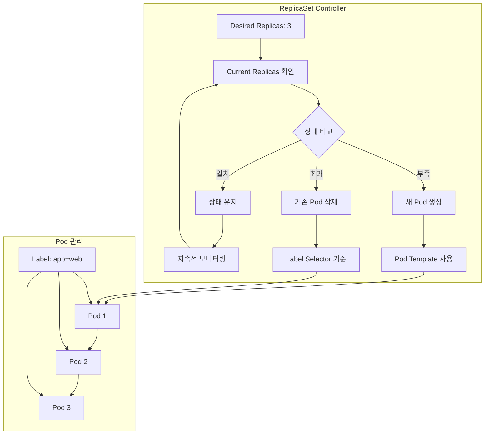
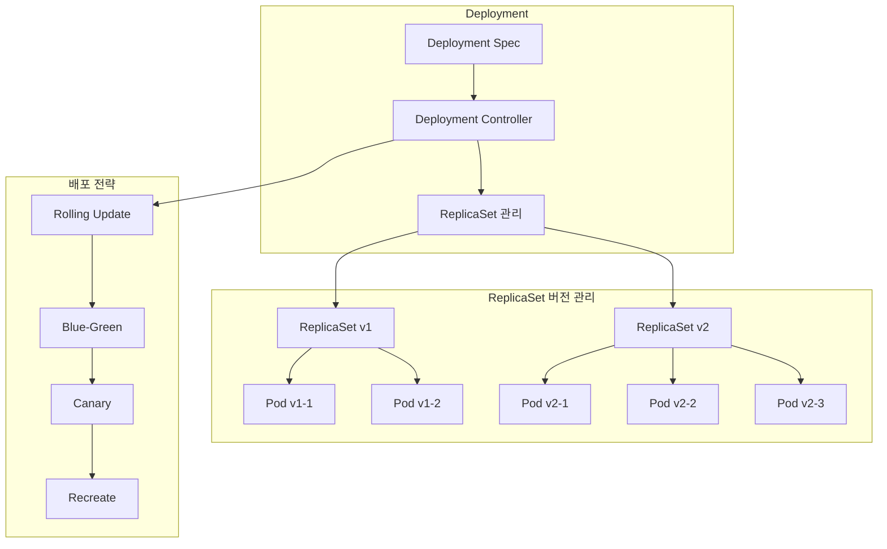
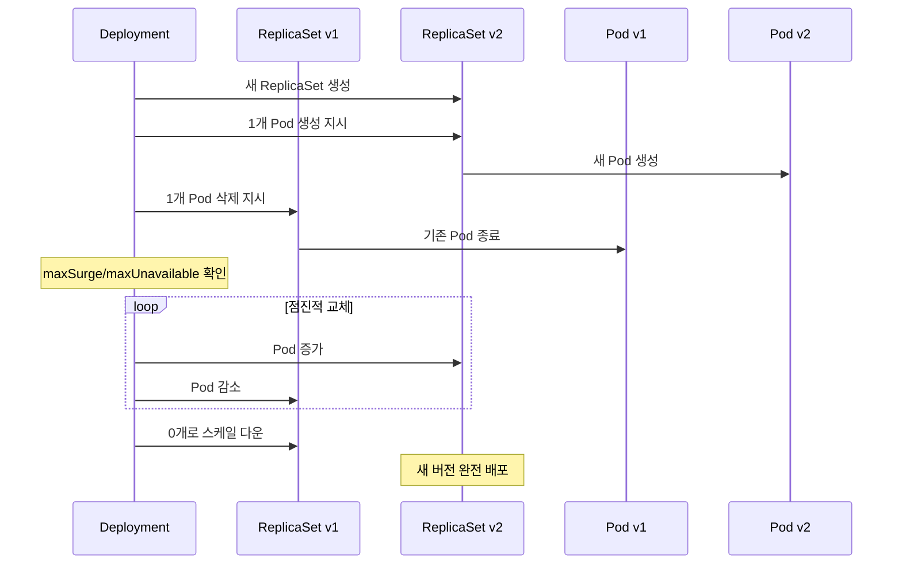
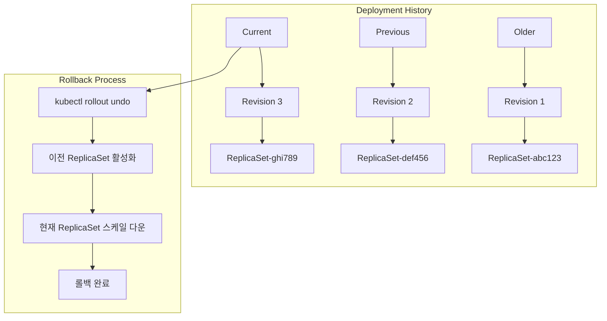

# Session 2: ReplicaSet과 Deployment

## 📍 교과과정에서의 위치
이 세션은 **Week 2 > Day 2 > Session 2**로, Pod의 복제본 관리와 선언적 배포를 담당하는 ReplicaSet과 Deployment의 개념과 관계를 학습합니다.

## 학습 목표 (5분)
- **ReplicaSet**의 **복제본 관리** 역할과 **동작 원리** 이해
- **Deployment**의 **선언적 배포** 모델과 **추상화** 개념 학습
- **롤링 업데이트**와 **배포 전략** 이론 파악
- **버전 관리**와 **롤백** 메커니즘 이해

## 1. ReplicaSet의 복제본 관리 역할 (15분)

### ReplicaSet 동작 원리



### ReplicaSet 핵심 기능
```
ReplicaSet 핵심 기능:

복제본 관리:
   🔹 원하는 Pod 수 유지
   🔹 장애 Pod 자동 교체
   🔹 스케일링 지원 (수평적 확장)
   🔹 Label Selector 기반 Pod 선택
   🔹 Pod Template 기반 생성

상태 조정 (Reconciliation):
   🔹 Desired State vs Current State 비교
   🔹 부족한 Pod 자동 생성
   🔹 초과한 Pod 자동 삭제
   🔹 지속적인 상태 모니터링
   🔹 Control Loop 패턴 구현

Pod 선택 메커니즘:
   🔹 Label Selector를 통한 Pod 식별
   🔹 소유권 관계 설정
   🔹 고아 Pod 입양 (Adoption)
   🔹 중복 관리 방지
   🔹 네임스페이스 범위 내 동작

제한사항:
   🔹 직접적인 업데이트 불가
   🔹 롤링 업데이트 미지원
   🔹 배포 히스토리 관리 없음
   🔹 고급 배포 전략 부재
```

## 2. Deployment의 선언적 배포 모델 (12분)

### Deployment 아키텍처



### Deployment vs ReplicaSet 비교
```
Deployment vs ReplicaSet:

ReplicaSet (저수준):
   🔹 Pod 복제본 직접 관리
   🔹 단순한 스케일링만 지원
   🔹 업데이트 시 수동 관리 필요
   🔹 롤백 기능 없음
   🔹 배포 히스토리 미제공
   🔹 직접 사용 비권장

Deployment (고수준):
   🔹 ReplicaSet을 통한 간접 관리
   🔹 선언적 업데이트 지원
   🔹 자동 롤링 업데이트
   🔹 롤백 및 히스토리 관리
   🔹 다양한 배포 전략 지원
   🔹 권장되는 워크로드 관리 방식

관계:
   🔹 Deployment → ReplicaSet → Pod
   🔹 1:N 관계 (버전별 ReplicaSet)
   🔹 소유권 체인 형성
   🔹 계층적 추상화
   🔹 상위 레벨 관리 권장
```

## 3. 롤링 업데이트와 배포 전략 이론 (10분)

### 롤링 업데이트 프로세스



### 배포 전략 비교
```
주요 배포 전략:

Rolling Update (기본):
   🔹 점진적 Pod 교체
   🔹 무중단 배포 가능
   🔹 리소스 효율적
   🔹 일시적 버전 혼재
   🔹 가장 일반적인 방식

Recreate:
   🔹 모든 Pod 동시 교체
   🔹 다운타임 발생
   🔹 리소스 절약
   🔹 버전 일관성 보장
   🔹 개발/테스트 환경 적합

Blue-Green (외부 도구):
   🔹 완전한 환경 복제
   🔹 즉시 전환 가능
   🔹 빠른 롤백
   🔹 높은 리소스 비용
   🔹 미션 크리티컬 서비스

Canary (외부 도구):
   🔹 일부 트래픽만 새 버전
   🔹 점진적 트래픽 증가
   🔹 위험 최소화
   🔹 복잡한 트래픽 관리
   🔹 A/B 테스트 가능
```

## 4. 버전 관리와 롤백 메커니즘 (10분)

### 배포 히스토리 관리



### 롤백 메커니즘
```
롤백 메커니즘:

히스토리 관리:
   🔹 revisionHistoryLimit 설정 (기본 10)
   🔹 각 배포마다 새 ReplicaSet 생성
   🔹 이전 ReplicaSet 보존 (0개로 스케일)
   🔹 배포 원인 및 시간 기록
   🔹 어노테이션을 통한 메타데이터 저장

롤백 프로세스:
   🔹 이전 ReplicaSet 식별
   🔹 이전 버전으로 스케일 업
   🔹 현재 버전 스케일 다운
   🔹 롤링 업데이트 방식 적용
   🔹 새로운 리비전 번호 할당

롤백 전략:
   🔹 즉시 롤백: 문제 발견 시 즉시 실행
   🔹 자동 롤백: 헬스체크 실패 시 자동
   🔹 부분 롤백: 특정 Pod만 이전 버전
   🔹 완전 롤백: 전체 배포 이전 상태
   🔹 점진적 롤백: 단계적 이전 버전 적용

모니터링 포인트:
   🔹 배포 진행 상황 추적
   🔹 Pod 상태 및 헬스체크
   🔹 애플리케이션 메트릭 모니터링
   🔹 에러율 및 응답시간 확인
   🔹 사용자 피드백 수집
```

## 💬 그룹 토론: 선언적 배포 모델의 장점과 실무 적용 (8분)

### 토론 주제
**"Kubernetes의 선언적 배포 모델이 기존 명령적 배포 방식과 비교해 어떤 장점을 제공하며, 실무에서 어떻게 활용해야 하는가?"**

### 토론 가이드라인

#### 선언적 vs 명령적 (3분)
- 선언적: 원하는 최종 상태 정의, 시스템이 자동 달성
- 명령적: 단계별 명령 실행, 수동 상태 관리
- 멱등성: 동일한 결과 보장 vs 실행 순서 의존

#### 실무 장점 (3분)
- 자동화: 수동 개입 최소화, 오류 감소
- 일관성: 환경 간 동일한 배포 보장
- 복구: 자동 상태 조정 및 복구

#### 적용 전략 (2분)
- GitOps: 코드로 관리되는 배포 상태
- CI/CD 통합: 파이프라인과의 자연스러운 연결
- 모니터링: 상태 기반 알림 및 대응

## 💡 핵심 개념 정리
- ReplicaSet: Pod 복제본 관리, Control Loop 패턴
- Deployment: 선언적 배포, ReplicaSet 추상화
- 롤링 업데이트: 무중단 점진적 배포
- 롤백: 이전 버전으로 안전한 복구

## 다음 세션 준비
다음 세션에서는 **Service와 네트워킹**에 대해 학습합니다.