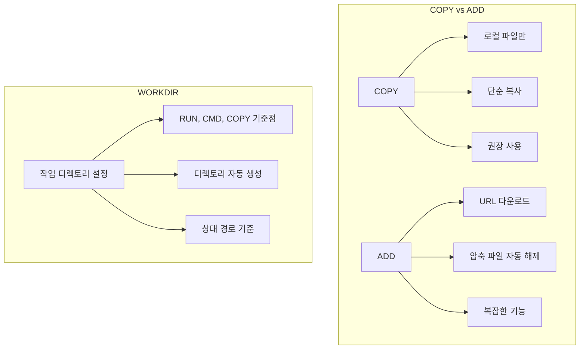
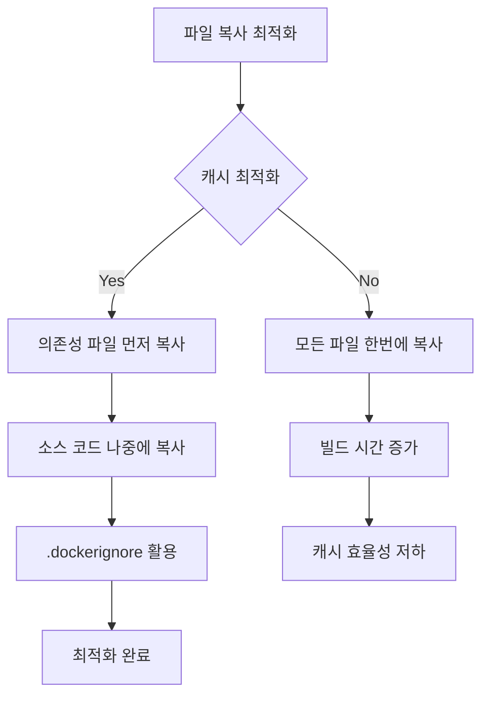

# Session 3: 파일 복사와 작업 디렉토리 설정

## 📍 교과과정에서의 위치
이 세션은 **Week 2 > Day 2 > Session 3**으로, Dockerfile에서 파일을 관리하는 핵심 명령어들을 실습합니다. Session 2의 베이스 이미지 선택을 바탕으로 실제 애플리케이션 파일들을 컨테이너로 복사하고 구조화하는 방법을 학습합니다.

## 학습 목표 (5분)
- **COPY, ADD, WORKDIR** 명령어 **차이점** 이해
- **웹 애플리케이션 파일 구조** 구성 실습
- **파일 권한**과 **소유권** 관리 방법 학습

## 1. 이론: COPY, ADD, WORKDIR 명령어 차이점 (20분)

### 파일 복사 명령어 비교



### 명령어별 상세 기능

| 명령어 | 기능 | 소스 | 대상 | 특수 기능 |
|--------|------|------|------|-----------|
| **COPY** | 파일/디렉토리 복사 | 로컬만 | 컨테이너 | 단순 복사 |
| **ADD** | 파일/디렉토리 복사 | 로컬, URL | 컨테이너 | 압축 해제, URL 다운로드 |
| **WORKDIR** | 작업 디렉토리 변경 | - | 컨테이너 | 디렉토리 생성 |

### 파일 복사 패턴과 모범 사례

```dockerfile
# 모범 사례 예시
FROM node:16-alpine

# 1. 작업 디렉토리 설정 (먼저)
WORKDIR /app

# 2. 의존성 파일 먼저 복사 (캐시 최적화)
COPY package*.json ./

# 3. 의존성 설치
RUN npm ci --only=production

# 4. 소스 코드 복사 (나중에)
COPY . .

# 잘못된 예시 (캐시 비효율적)
# COPY . .                    # 모든 파일을 먼저 복사
# RUN npm install             # 소스 변경 시마다 재설치
```

### 파일 권한과 소유권 관리

```
파일 권한 관리 방법:

1. COPY/ADD 시 권한 설정:
   COPY --chown=user:group source dest
   COPY --chmod=755 script.sh /usr/local/bin/

2. RUN으로 권한 변경:
   RUN chmod +x /app/start.sh
   RUN chown -R app:app /app

3. USER 명령어로 실행 사용자 변경:
   USER app
   
보안 원칙:
├── root 사용자로 실행 금지
├── 필요한 최소 권한만 부여
├── 실행 파일에만 실행 권한
└── 민감한 파일은 읽기 전용
```

## 2. 실습: 웹 애플리케이션 파일 구조 구성 (15분)

### React 프론트엔드 애플리케이션 구조

```bash
# 실습 디렉토리 생성
mkdir -p ~/docker-practice/day2/session3/react-app
cd ~/docker-practice/day2/session3/react-app

# React 애플리케이션 파일 구조 생성
mkdir -p src public build

# package.json 생성
cat > package.json << 'EOF'
{
  "name": "react-docker-app",
  "version": "1.0.0",
  "private": true,
  "dependencies": {
    "react": "^18.2.0",
    "react-dom": "^18.2.0",
    "react-scripts": "5.0.1"
  },
  "scripts": {
    "start": "react-scripts start",
    "build": "react-scripts build",
    "test": "react-scripts test",
    "eject": "react-scripts eject"
  },
  "browserslist": {
    "production": [
      ">0.2%",
      "not dead",
      "not op_mini all"
    ],
    "development": [
      "last 1 chrome version",
      "last 1 firefox version",
      "last 1 safari version"
    ]
  }
}
EOF

# public/index.html
cat > public/index.html << 'EOF'
<!DOCTYPE html>
<html lang="en">
<head>
    <meta charset="utf-8" />
    <meta name="viewport" content="width=device-width, initial-scale=1" />
    <title>React Docker App</title>
</head>
<body>
    <noscript>You need to enable JavaScript to run this app.</noscript>
    <div id="root"></div>
</body>
</html>
EOF

# src/index.js
cat > src/index.js << 'EOF'
import React from 'react';
import ReactDOM from 'react-dom/client';
import App from './App';

const root = ReactDOM.createRoot(document.getElementById('root'));
root.render(<App />);
EOF

# src/App.js
cat > src/App.js << 'EOF'
import React from 'react';

function App() {
  return (
    <div style={{ padding: '20px', fontFamily: 'Arial, sans-serif' }}>
      <h1>🐳 React in Docker</h1>
      <p>이 React 애플리케이션은 Docker 컨테이너에서 실행되고 있습니다.</p>
      <div style={{ background: '#f0f0f0', padding: '15px', borderRadius: '5px', margin: '20px 0' }}>
        <h3>파일 구조 최적화</h3>
        <ul>
          <li>package.json 먼저 복사 → 의존성 설치</li>
          <li>소스 코드 나중에 복사 → 캐시 최적화</li>
          <li>빌드 결과물만 프로덕션 이미지에 포함</li>
        </ul>
      </div>
      <p>현재 시간: {new Date().toLocaleString()}</p>
    </div>
  );
}

export default App;
EOF
```

### 개발용 Dockerfile (모든 파일 포함)

```dockerfile
# Dockerfile.dev
cat > Dockerfile.dev << 'EOF'
FROM node:16-alpine

# 작업 디렉토리 설정
WORKDIR /app

# 의존성 파일 먼저 복사 (캐시 최적화)
COPY package*.json ./

# 의존성 설치
RUN npm install

# 소스 코드 복사
COPY public/ public/
COPY src/ src/

# 개발 서버 포트 노출
EXPOSE 3000

# 개발 서버 실행
CMD ["npm", "start"]
EOF
```

### 프로덕션용 Dockerfile (빌드 결과물만)

```dockerfile
# Dockerfile.prod
cat > Dockerfile.prod << 'EOF'
# 빌드 스테이지
FROM node:16-alpine as build

WORKDIR /app

# 의존성 설치
COPY package*.json ./
RUN npm ci --only=production --silent

# 소스 코드 복사 및 빌드
COPY public/ public/
COPY src/ src/
RUN npm run build

# 프로덕션 스테이지
FROM nginx:alpine

# 빌드 결과물만 복사
COPY --from=build /app/build /usr/share/nginx/html

# Nginx 설정 (선택사항)
COPY nginx.conf /etc/nginx/conf.d/default.conf

EXPOSE 80
CMD ["nginx", "-g", "daemon off;"]
EOF

# Nginx 설정 파일
cat > nginx.conf << 'EOF'
server {
    listen 80;
    server_name localhost;
    
    location / {
        root /usr/share/nginx/html;
        index index.html index.htm;
        try_files $uri $uri/ /index.html;
    }
    
    # 정적 파일 캐싱
    location ~* \.(js|css|png|jpg|jpeg|gif|ico|svg)$ {
        expires 1y;
        add_header Cache-Control "public, immutable";
    }
}
EOF
```

## 3. 실습: 복잡한 파일 구조 관리 (10분)

### 다층 디렉토리 구조 애플리케이션

```bash
# 복잡한 프로젝트 구조 생성
mkdir -p complex-app/{frontend,backend,database,docs,scripts}
cd complex-app

# 프론트엔드 파일들
mkdir -p frontend/{src,public,build}
echo "Frontend source code" > frontend/src/main.js
echo "Frontend public files" > frontend/public/index.html

# 백엔드 파일들
mkdir -p backend/{src,config,tests}
echo "Backend application" > backend/src/app.py
echo "Database config" > backend/config/database.yml

# 데이터베이스 스크립트
mkdir -p database/{migrations,seeds}
echo "CREATE TABLE users..." > database/migrations/001_create_users.sql
echo "INSERT INTO users..." > database/seeds/users.sql

# 문서 및 스크립트
echo "# Project Documentation" > docs/README.md
echo "#!/bin/bash\necho 'Setup script'" > scripts/setup.sh

# 프로젝트 루트 파일들
cat > docker-compose.yml << 'EOF'
version: '3.8'
services:
  frontend:
    build: ./frontend
    ports:
      - "3000:3000"
  backend:
    build: ./backend
    ports:
      - "5000:5000"
  database:
    image: postgres:13
    environment:
      POSTGRES_DB: myapp
EOF

cat > .dockerignore << 'EOF'
# 개발 도구
.git
.gitignore
.vscode
.idea

# 로그 및 임시 파일
*.log
*.tmp
.DS_Store
Thumbs.db

# 빌드 아티팩트
node_modules
dist
build
__pycache__
*.pyc

# 문서 (프로덕션에 불필요)
docs/
README.md
*.md

# 테스트 파일
tests/
*.test.js
*.spec.py
EOF
```

### 선택적 파일 복사 Dockerfile

```dockerfile
# 백엔드 Dockerfile
cat > backend/Dockerfile << 'EOF'
FROM python:3.9-slim

WORKDIR /app

# 의존성 파일만 먼저 복사
COPY requirements.txt ./
RUN pip install --no-cache-dir -r requirements.txt

# 설정 파일 복사
COPY config/ config/

# 소스 코드 복사 (테스트 파일 제외)
COPY src/ src/

# 데이터베이스 마이그레이션 파일 복사
COPY --from=database-files ../database/migrations/ database/migrations/

# 실행 권한 설정
RUN chmod +x src/app.py

# 비root 사용자 생성 및 전환
RUN adduser --disabled-password --gecos '' appuser && \
    chown -R appuser:appuser /app
USER appuser

EXPOSE 5000
CMD ["python", "src/app.py"]
EOF

# requirements.txt 생성
cat > backend/requirements.txt << 'EOF'
flask==2.3.3
psycopg2-binary==2.9.7
python-dotenv==1.0.0
EOF
```

## 4. 실습: 파일 권한과 보안 (10분)

### 보안 강화된 Dockerfile

```dockerfile
# 보안 강화 예시
cat > Dockerfile.secure << 'EOF'
FROM node:16-alpine

# 보안 업데이트
RUN apk update && apk upgrade && apk add --no-cache dumb-init

# 비root 사용자 생성
RUN addgroup -g 1001 -S nodejs && \
    adduser -S nextjs -u 1001

# 애플리케이션 디렉토리 생성 및 권한 설정
RUN mkdir -p /app && chown -R nextjs:nodejs /app

WORKDIR /app

# 의존성 파일 복사 (root로)
COPY --chown=nextjs:nodejs package*.json ./

# 사용자 전환 후 의존성 설치
USER nextjs
RUN npm ci --only=production && npm cache clean --force

# 소스 코드 복사 (올바른 권한으로)
COPY --chown=nextjs:nodejs . .

# 실행 스크립트 권한 설정
USER root
COPY --chmod=755 start.sh /usr/local/bin/start.sh
USER nextjs

EXPOSE 3000

# dumb-init으로 PID 1 문제 해결
ENTRYPOINT ["dumb-init", "--"]
CMD ["start.sh"]
EOF

# 시작 스크립트 생성
cat > start.sh << 'EOF'
#!/bin/sh
echo "Starting application as user: $(whoami)"
echo "Working directory: $(pwd)"
echo "File permissions:"
ls -la

exec npm start
EOF
```

### 파일 권한 테스트

```bash
# 권한 테스트용 Dockerfile
cat > Dockerfile.permissions << 'EOF'
FROM alpine:latest

# 테스트 파일들 생성
RUN echo "#!/bin/sh\necho 'Executable script'" > /test-executable.sh && \
    echo "Regular file content" > /test-regular.txt && \
    echo "Secret content" > /test-secret.txt

# 다양한 권한 설정
RUN chmod 755 /test-executable.sh && \
    chmod 644 /test-regular.txt && \
    chmod 600 /test-secret.txt

# 사용자 생성 및 파일 소유권 변경
RUN adduser -D testuser && \
    chown testuser:testuser /test-secret.txt

# 권한 확인 명령어
CMD ["sh", "-c", "ls -la /test-* && echo '--- As testuser ---' && su testuser -c 'ls -la /test-*'"]
EOF

# 빌드 및 실행
docker build -f Dockerfile.permissions -t permission-test .
docker run --rm permission-test
```

## 5. 실습: .dockerignore 최적화 (10분)

### 프로젝트별 .dockerignore 패턴

```bash
# Node.js 프로젝트용 .dockerignore
cat > .dockerignore.nodejs << 'EOF'
# 의존성 (package.json으로 재설치)
node_modules
npm-debug.log*
yarn-debug.log*
yarn-error.log*

# 빌드 아티팩트
dist
build
.next
out

# 개발 도구
.vscode
.idea
*.swp
*.swo

# 테스트 및 커버리지
coverage
.nyc_output
*.lcov

# 환경 설정 (보안)
.env
.env.local
.env.*.local

# OS 생성 파일
.DS_Store
Thumbs.db

# Git
.git
.gitignore
EOF

# Python 프로젝트용 .dockerignore
cat > .dockerignore.python << 'EOF'
# Python 캐시
__pycache__
*.pyc
*.pyo
*.pyd
.Python

# 가상환경
venv
env
ENV

# 테스트 및 커버리지
.pytest_cache
.coverage
htmlcov
.tox

# IDE
.vscode
.idea
*.swp

# 빌드 아티팩트
build
dist
*.egg-info

# 문서
docs/_build
EOF

# .dockerignore 효과 테스트
echo "=== .dockerignore 테스트 ==="

# 테스트 파일들 생성
mkdir -p test-ignore/{node_modules,dist,docs}
echo "dependency" > test-ignore/node_modules/package.js
echo "build output" > test-ignore/dist/app.js
echo "documentation" > test-ignore/docs/readme.md
echo "source code" > test-ignore/app.js

cd test-ignore

# .dockerignore 없이 빌드
cat > Dockerfile.no-ignore << 'EOF'
FROM alpine:latest
COPY . /app
RUN ls -la /app
EOF

# .dockerignore 있이 빌드
cp ../.dockerignore.nodejs .dockerignore
cat > Dockerfile.with-ignore << 'EOF'
FROM alpine:latest
COPY . /app
RUN ls -la /app
EOF

echo "--- Without .dockerignore ---"
docker build -f Dockerfile.no-ignore -t test-no-ignore . 2>/dev/null | grep "COPY"

echo "--- With .dockerignore ---"
docker build -f Dockerfile.with-ignore -t test-with-ignore . 2>/dev/null | grep "COPY"

cd ..
```

## 6. Q&A 및 정리 (5분)

### 파일 복사 최적화 체크리스트



### 실습 결과 정리

```bash
# 빌드된 이미지들 크기 비교
echo "=== Image Size Comparison ==="
docker images --format "table {{.Repository}}\t{{.Tag}}\t{{.Size}}" | grep -E "(react-app|permission-test)"

# 정리
docker system prune -f
```

## 💡 핵심 키워드
- **COPY vs ADD**: 단순 복사 vs 고급 기능 (URL, 압축 해제)
- **WORKDIR**: 작업 디렉토리 설정, 자동 생성
- **파일 권한**: --chown, --chmod 옵션으로 보안 강화
- **.dockerignore**: 불필요한 파일 제외로 빌드 최적화

## 📚 참고 자료
- [Dockerfile COPY 레퍼런스](https://docs.docker.com/engine/reference/builder/#copy)
- [.dockerignore 가이드](https://docs.docker.com/engine/reference/builder/#dockerignore-file)
- [Docker 보안 모범 사례](https://docs.docker.com/develop/security-best-practices/)

## 🔧 실습 체크리스트
- [ ] COPY와 ADD 명령어 차이점 이해
- [ ] WORKDIR로 작업 디렉토리 구조화
- [ ] 캐시 최적화를 위한 파일 복사 순서
- [ ] 파일 권한과 소유권 보안 설정
- [ ] .dockerignore로 빌드 최적화
