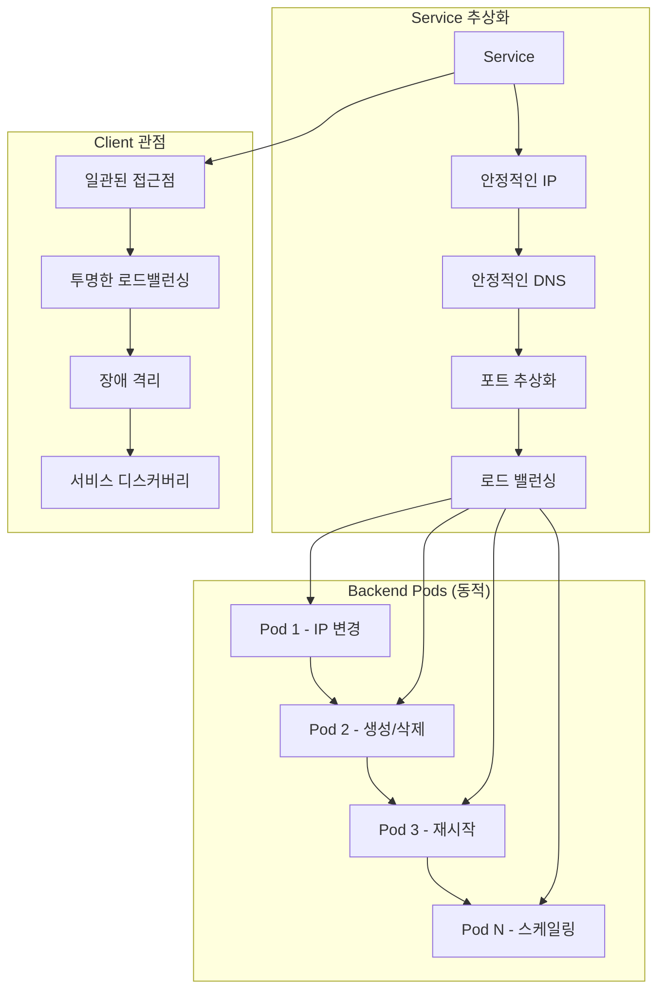
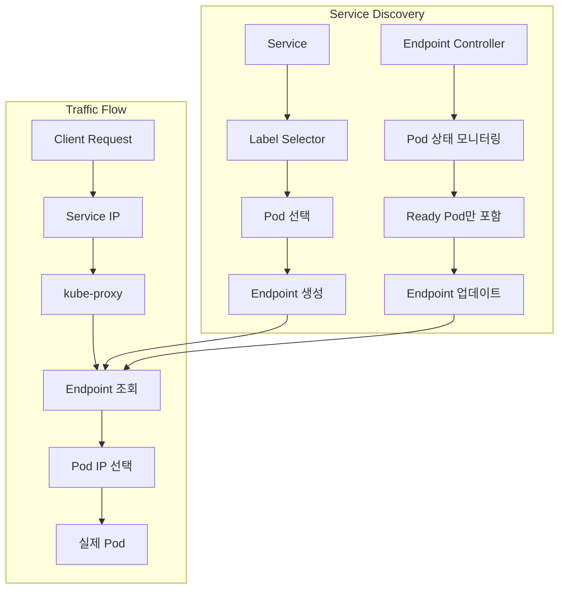
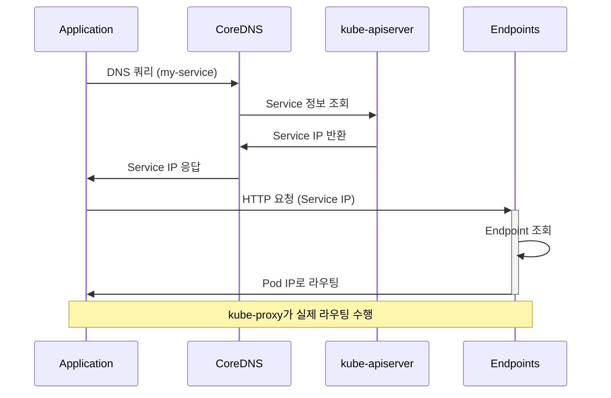
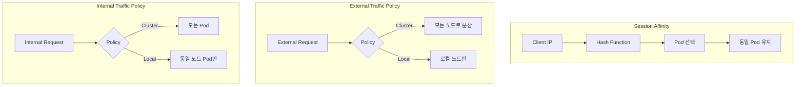

# Session 3: Service와 네트워킹

## 📍 교과과정에서의 위치
이 세션은 **Week 2 > Day 2 > Session 3**으로, Kubernetes의 네트워크 추상화 핵심인 Service 개념과 다양한 Service 타입의 특징을 학습합니다.

## 학습 목표 (5분)
- **Service 추상화** 모델과 **네트워크 안정성** 개념 이해
- **ClusterIP, NodePort, LoadBalancer** 타입별 특징 분석
- **Endpoint**와 **서비스 디스커버리** 메커니즘 파악
- **DNS 기반 서비스** 해결 원리 이해

## 1. Service 추상화 모델과 타입별 특징 (15분)

### Service 추상화 개념



### Service 타입 비교
```
Service 타입별 특징:

ClusterIP (기본):
├── 클러스터 내부에서만 접근 가능
├── 가상 IP 할당 (Cluster IP 대역)
├── kube-proxy가 트래픽 라우팅
├── 마이크로서비스 간 통신
├── 외부 노출 없음
└── 가장 일반적인 Service 타입

NodePort:
├── 모든 노드의 특정 포트로 접근
├── ClusterIP 기능 + 노드 포트 바인딩
├── 포트 범위: 30000-32767 (기본)
├── 외부에서 <NodeIP>:<NodePort>로 접근
├── 개발/테스트 환경에 적합
└── 프로덕션에서는 제한적 사용

LoadBalancer:
├── 클라우드 제공업체의 로드밸런서 사용
├── NodePort 기능 + 외부 로드밸런서
├── 자동으로 외부 IP 할당
├── 클라우드 환경에서만 동작
├── 프로덕션 환경에 적합
└── 비용 발생 (클라우드 LB)

ExternalName:
├── 외부 서비스를 클러스터 내부로 매핑
├── DNS CNAME 레코드 생성
├── 실제 Pod 없이 외부 서비스 참조
├── 서비스 추상화 유지
└── 외부 의존성 관리
```

## 2. Endpoint와 서비스 디스커버리 메커니즘 (12분)

### Endpoint 동작 원리



### 서비스 디스커버리 메커니즘
```
서비스 디스커버리 구현:

DNS 기반 디스커버리:
├── CoreDNS가 클러스터 DNS 제공
├── Service 이름으로 자동 DNS 레코드 생성
├── <service-name>.<namespace>.svc.cluster.local
├── 네임스페이스 내에서는 서비스명만으로 접근
├── 크로스 네임스페이스 접근 시 FQDN 사용
└── DNS 캐싱으로 성능 최적화

환경 변수 기반:
├── Pod 생성 시 Service 정보를 환경 변수로 주입
├── <SERVICE_NAME>_SERVICE_HOST
├── <SERVICE_NAME>_SERVICE_PORT
├── 레거시 지원 목적
└── DNS 방식 권장

Endpoint 기반 동적 업데이트:
├── Pod 상태 변화 실시간 반영
├── Ready 상태 Pod만 트래픽 수신
├── 헬스체크 실패 시 자동 제외
├── 스케일링 시 자동 포함/제외
└── 무중단 서비스 업데이트

서비스 메시 통합:
├── Istio, Linkerd 등과 연동
├── 고급 트래픽 관리
├── 보안 정책 적용
├── 관찰성 향상
└── 마이크로서비스 패턴 지원
```

## 3. DNS 기반 서비스 해결 원리 (10분)

### DNS 해결 과정



### DNS 네이밍 규칙
```
Kubernetes DNS 네이밍:

Service DNS 형식:
├── <service-name>.<namespace>.svc.<cluster-domain>
├── 기본 클러스터 도메인: cluster.local
├── 동일 네임스페이스: <service-name>만으로 접근
├── 다른 네임스페이스: <service-name>.<namespace>
└── 완전한 FQDN: 모든 경우에 사용 가능

Pod DNS 형식:
├── <pod-ip>.<namespace>.pod.<cluster-domain>
├── IP 주소의 점(.)을 하이픈(-)으로 변경
├── 예: 10-244-1-5.default.pod.cluster.local
├── 직접 Pod 접근 시 사용 (비권장)
└── Service를 통한 접근 권장

Headless Service:
├── ClusterIP: None으로 설정
├── Service IP 할당 없음
├── Pod IP 직접 반환
├── StatefulSet과 함께 사용
├── 개별 Pod 접근 필요 시
└── DNS 라운드 로빈 제공

DNS 정책:
├── ClusterFirst: 클러스터 DNS 우선
├── ClusterFirstWithHostNet: 호스트 네트워크 + 클러스터 DNS
├── Default: 노드 DNS 설정 사용
├── None: 사용자 정의 DNS 설정
└── Pod별 DNS 정책 설정 가능
```

## 4. 고급 Service 기능 (10분)

### Session Affinity와 트래픽 정책



### 고급 기능 분석
```
Service 고급 기능:

Session Affinity:
├── ClientIP 기반 세션 유지
├── 동일 클라이언트 → 동일 Pod
├── 상태 저장 애플리케이션에 유용
├── 로드 밸런싱 효율성 저하 가능
└── timeoutSeconds로 세션 만료 설정

External Traffic Policy:
├── Cluster: 모든 노드로 트래픽 분산
├── Local: 요청 받은 노드의 Pod만 사용
├── Local 사용 시 소스 IP 보존
├── 노드 간 홉 제거로 지연 시간 감소
└── 불균등 분산 가능성

Internal Traffic Policy:
├── 클러스터 내부 트래픽 정책
├── Cluster: 모든 Pod 대상
├── Local: 동일 노드 Pod만 대상
├── 네트워크 지연 최소화
└── 리소스 지역성 활용

Health Check:
├── Readiness Probe 기반 트래픽 제어
├── 준비되지 않은 Pod 자동 제외
├── 롤링 업데이트 시 무중단 서비스
├── 장애 Pod 자동 격리
└── 서비스 품질 보장
```

## 💬 그룹 토론: Service 추상화가 마이크로서비스에 미치는 영향 (8분)

### 토론 주제
**"Kubernetes Service 추상화가 마이크로서비스 아키텍처 구현과 운영에 미치는 영향과 가치는 무엇인가?"**

## 💡 핵심 개념 정리
- **Service**: 네트워크 추상화, 안정적인 접근점 제공
- **타입**: ClusterIP, NodePort, LoadBalancer, ExternalName
- **Endpoint**: 동적 Pod 목록 관리, 서비스 디스커버리
- **DNS**: 이름 기반 서비스 해결, CoreDNS 통합

## 다음 세션 준비
다음 세션에서는 **ConfigMap과 Secret**에 대해 학습합니다.