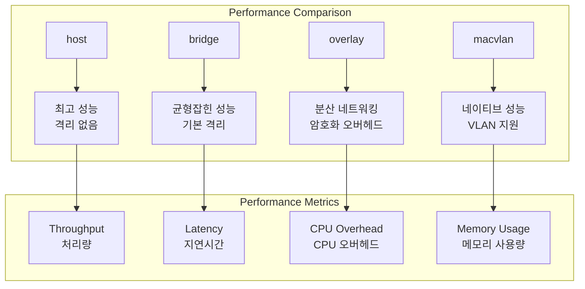
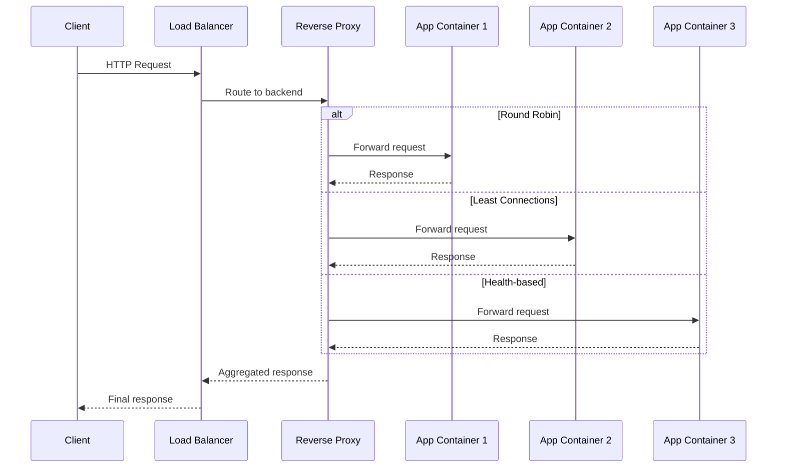

# Session 3: 컨테이너 네트워크 성능 최적화

## 📍 교과과정에서의 위치
이 세션은 **Week 2 > Day 2 > Session 3**으로, 이미지 최적화 이해를 바탕으로 컨테이너 네트워킹의 성능 최적화와 고급 네트워크 구성 기법을 심화 분석합니다.

## 학습 목표 (5분)
- **네트워크 드라이버별 성능 특성** 비교 분석
- **트래픽 최적화** 및 **로드 밸런싱** 고급 기법
- **네트워크 보안과 성능**의 균형잡힌 설계 전략

## 1. 이론: 네트워크 드라이버 성능 분석 (20분)

### 네트워크 드라이버 성능 비교



### 네트워크 성능 특성 상세 분석

```
네트워크 드라이버별 성능 특성:

host 네트워크:
├── 처리량: 네이티브 성능 (100% 기준)
├── 지연시간: 최소 (< 0.1ms 추가 지연)
├── CPU 오버헤드: 없음 (0% 추가)
├── 메모리 사용량: 최소
├── 격리 수준: 없음 (보안 위험)
├── 포트 충돌: 가능성 높음
├── 사용 사례: 고성능 네트워크 애플리케이션
└── 제한사항: 단일 호스트, 보안 취약

bridge 네트워크:
├── 처리량: 90-95% (NAT 오버헤드)
├── 지연시간: 낮음 (0.1-0.5ms 추가)
├── CPU 오버헤드: 낮음 (5-10%)
├── 메모리 사용량: 보통
├── 격리 수준: 네트워크 네임스페이스
├── 포트 매핑: 유연한 포트 관리
├── 사용 사례: 일반적인 컨테이너 애플리케이션
└── 제한사항: 단일 호스트 네트워킹

overlay 네트워크:
├── 처리량: 70-85% (VXLAN 캡슐화)
├── 지연시간: 보통 (1-5ms 추가)
├── CPU 오버헤드: 높음 (15-25%)
├── 메모리 사용량: 높음
├── 격리 수준: 멀티 호스트 격리
├── 암호화: 기본 제공 (성능 영향)
├── 사용 사례: 분산 마이크로서비스
└── 제한사항: 복잡한 설정, 성능 오버헤드

macvlan 네트워크:
├── 처리량: 95-98% (거의 네이티브)
├── 지연시간: 매우 낮음 (< 0.2ms)
├── CPU 오버헤드: 매우 낮음 (2-5%)
├── 메모리 사용량: 낮음
├── 격리 수준: VLAN 기반 격리
├── MAC 주소: 컨테이너별 고유 MAC
├── 사용 사례: 레거시 네트워크 통합
└── 제한사항: 물리 네트워크 의존성
```

### 네트워크 최적화 기법

```
성능 최적화 전략:

커널 바이패스 기술:
├── DPDK (Data Plane Development Kit)
├── SR-IOV (Single Root I/O Virtualization)
├── 사용자 공간 네트워킹
├── 하드웨어 오프로딩
├── 제로 카피 네트워킹
└── 인터럽트 코어스싱

네트워크 튜닝:
├── TCP 윈도우 크기 최적화
├── TCP 혼잡 제어 알고리즘 선택
├── 네트워크 버퍼 크기 조정
├── IRQ 밸런싱 및 CPU 어피니티
├── NUMA 토폴로지 고려
└── 네트워크 인터페이스 큐 설정

컨테이너 네트워크 최적화:
├── 네트워크 네임스페이스 최적화
├── veth 페어 성능 튜닝
├── 브리지 설정 최적화
├── iptables 규칙 최소화
├── 네트워크 폴링 모드 설정
└── 컨테이너별 네트워크 리소스 할당
```

## 2. 이론: 로드 밸런싱 및 트래픽 관리 (15분)

### 고급 로드 밸런싱 아키텍처



### 로드 밸런싱 알고리즘 비교

```
로드 밸런싱 전략:

기본 알고리즘:
├── Round Robin: 순차적 요청 분산
├── Weighted Round Robin: 가중치 기반 분산
├── Least Connections: 최소 연결 수 기준
├── Weighted Least Connections: 가중치 + 연결 수
├── IP Hash: 클라이언트 IP 기반 해싱
└── Random: 무작위 선택

고급 알고리즘:
├── Least Response Time: 응답 시간 기준
├── Resource Based: 리소스 사용률 기준
├── Adaptive: 동적 성능 지표 기반
├── Geographic: 지리적 위치 기반
├── Content-based: 요청 내용 기반
└── Machine Learning: AI 기반 예측

세션 지속성:
├── Session Affinity (Sticky Sessions)
├── 쿠키 기반 세션 관리
├── IP 기반 세션 바인딩
├── 외부 세션 스토어 활용
├── 상태 비저장 설계 권장
└── 세션 복제 및 동기화

헬스 체크:
├── HTTP/HTTPS 헬스 체크
├── TCP 포트 연결 확인
├── 사용자 정의 헬스 체크
├── 다층 헬스 체크 (L4/L7)
├── 장애 감지 및 복구 자동화
└── 그레이스풀 셧다운 지원
```

### 트래픽 셰이핑 및 QoS

```
트래픽 관리 기법:

대역폭 제어:
├── 컨테이너별 대역폭 제한
├── 서비스별 QoS 정책
├── 우선순위 기반 트래픽 분류
├── 버스트 트래픽 처리
├── 공정한 대역폭 분배
└── 동적 대역폭 할당

트래픽 셰이핑:
├── Token Bucket 알고리즘
├── Leaky Bucket 알고리즘
├── 계층적 토큰 버킷 (HTB)
├── 클래스 기반 큐잉 (CBQ)
├── 가중 공정 큐잉 (WFQ)
└── 적응형 트래픽 제어

혼잡 제어:
├── TCP 혼잡 윈도우 관리
├── 백프레셔 메커니즘
├── 적응형 재전송 타이머
├── 선택적 확인응답 (SACK)
├── 명시적 혼잡 알림 (ECN)
└── 버퍼 블로트 방지
```

## 3. 이론: 네트워크 보안과 성능 균형 (10분)

### 보안 강화와 성능 최적화

```
보안-성능 균형 전략:

암호화 최적화:
├── 하드웨어 가속 암호화 (AES-NI)
├── TLS 1.3 최신 프로토콜 사용
├── 세션 재사용 및 티켓 활용
├── OCSP 스테이플링
├── 암호화 알고리즘 최적화
└── 키 교환 최적화 (ECDHE)

네트워크 격리:
├── 마이크로세그멘테이션
├── 네트워크 정책 엔진
├── 서비스 메시 보안
├── 제로 트러스트 네트워킹
├── 동적 방화벽 규칙
└── 트래픽 검사 최적화

DDoS 방어:
├── 레이트 리미팅
├── 연결 제한
├── SYN 쿠키 활용
├── 트래픽 패턴 분석
├── 자동 차단 메커니즘
└── CDN 및 프록시 활용

모니터링 및 감지:
├── 실시간 트래픽 분석
├── 이상 행동 탐지
├── 네트워크 플로우 모니터링
├── 침입 탐지 시스템 (IDS)
├── 보안 이벤트 상관관계 분석
└── 자동화된 대응 체계
```

## 4. 개념 예시: 네트워크 최적화 구성 (12분)

### 고성능 네트워크 구성 예시

```yaml
# Docker Compose 네트워크 최적화 (개념 예시)
version: '3.8'

networks:
  frontend:
    driver: bridge
    driver_opts:
      com.docker.network.bridge.name: br-frontend
      com.docker.network.driver.mtu: 9000
  backend:
    driver: bridge
    internal: true
    driver_opts:
      com.docker.network.bridge.name: br-backend
      com.docker.network.driver.mtu: 9000

services:
  nginx:
    image: nginx:alpine
    networks:
      - frontend
    ports:
      - "80:80"
      - "443:443"
    sysctls:
      - net.core.somaxconn=65535
      - net.ipv4.tcp_max_syn_backlog=65535
    ulimits:
      nofile:
        soft: 65535
        hard: 65535

  app:
    image: myapp:latest
    networks:
      - frontend
      - backend
    deploy:
      replicas: 3
    sysctls:
      - net.ipv4.tcp_keepalive_time=600
      - net.ipv4.tcp_keepalive_intvl=60
```

### 네트워크 성능 측정 예시

```bash
# 네트워크 처리량 테스트 (개념 예시)
# iperf3를 사용한 대역폭 측정
docker run --rm --network host iperf3 -c target_host -t 30

# 지연시간 측정
docker exec container_name ping -c 100 target_host

# 네트워크 연결 상태 확인
docker exec container_name ss -tuln

# 네트워크 통계 확인
docker exec container_name cat /proc/net/dev
```

### 로드 밸런서 구성 예시

```nginx
# NGINX 로드 밸런서 설정 (개념 예시)
upstream backend {
    least_conn;
    server app1:8080 weight=3 max_fails=3 fail_timeout=30s;
    server app2:8080 weight=2 max_fails=3 fail_timeout=30s;
    server app3:8080 weight=1 max_fails=3 fail_timeout=30s;
    keepalive 32;
}

server {
    listen 80;
    
    location / {
        proxy_pass http://backend;
        proxy_http_version 1.1;
        proxy_set_header Connection "";
        proxy_set_header Host $host;
        proxy_set_header X-Real-IP $remote_addr;
        proxy_connect_timeout 5s;
        proxy_send_timeout 10s;
        proxy_read_timeout 10s;
    }
    
    location /health {
        access_log off;
        return 200 "healthy\n";
    }
}
```

### 네트워크 모니터링 설정 예시

```yaml
# Prometheus 네트워크 모니터링 (개념 예시)
version: '3.8'
services:
  cadvisor:
    image: gcr.io/cadvisor/cadvisor:latest
    ports:
      - "8080:8080"
    volumes:
      - /:/rootfs:ro
      - /var/run:/var/run:ro
      - /sys:/sys:ro
      - /var/lib/docker/:/var/lib/docker:ro
    command:
      - '--housekeeping_interval=10s'
      - '--docker_only=true'

  node-exporter:
    image: prom/node-exporter:latest
    ports:
      - "9100:9100"
    command:
      - '--path.procfs=/host/proc'
      - '--path.sysfs=/host/sys'
      - '--collector.filesystem.ignored-mount-points'
      - '^/(sys|proc|dev|host|etc|rootfs/var/lib/docker/containers|rootfs/var/lib/docker/overlay2|rootfs/run/docker/netns|rootfs/var/lib/docker/aufs)($$|/)'
```

## 5. 토론 및 정리 (8분)

### 핵심 개념 정리
- **네트워크 드라이버별** 성능 특성과 적절한 선택 기준
- **로드 밸런싱** 알고리즘과 트래픽 관리 기법
- **보안과 성능**의 균형잡힌 네트워크 설계
- **모니터링 기반** 네트워크 최적화 전략

### 토론 주제
"마이크로서비스 아키텍처에서 네트워크 성능과 보안을 동시에 만족하는 최적의 네트워크 설계 전략은 무엇인가?"

## 💡 핵심 키워드
- **네트워크 성능**: 처리량, 지연시간, CPU 오버헤드
- **로드 밸런싱**: 알고리즘, 세션 지속성, 헬스 체크
- **트래픽 관리**: QoS, 대역폭 제어, 혼잡 제어
- **보안 최적화**: 암호화, 격리, DDoS 방어, 모니터링

## 📚 참고 자료
- [Docker 네트워킹 성능](https://docs.docker.com/network/drivers/)
- [컨테이너 네트워크 최적화](https://kubernetes.io/docs/concepts/cluster-administration/networking/)
