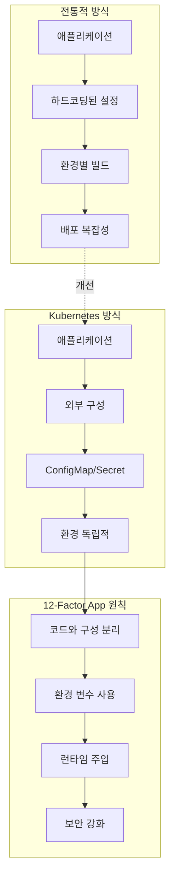
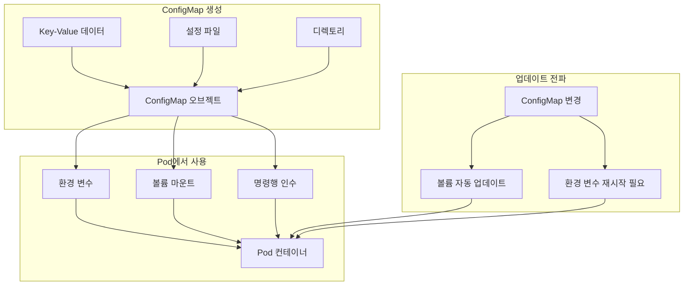
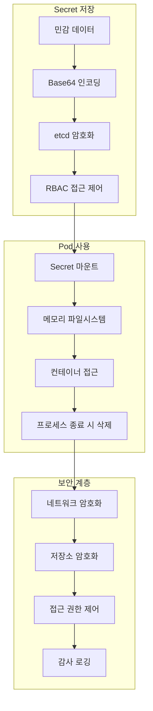
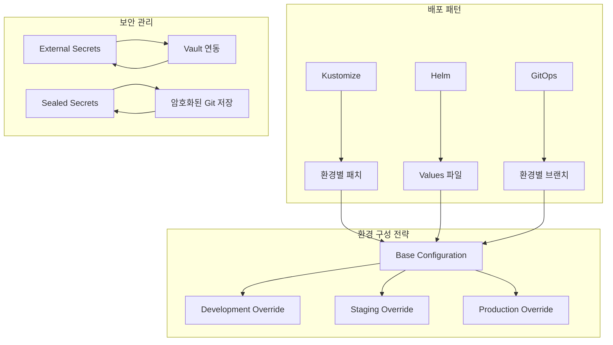

# Session 4: ConfigMap과 Secret

## 📍 교과과정에서의 위치
이 세션은 **Week 2 > Day 2 > Session 4**로, Kubernetes의 구성 관리 핵심인 ConfigMap과 Secret의 개념과 보안 모델을 학습합니다.

## 학습 목표 (5분)
- **구성 관리** 패턴과 **외부화** 원칙 이해
- **ConfigMap**의 **설정 데이터** 관리 방식 학습
- **Secret**의 **민감 정보** 보안 모델 파악
- **환경별 구성** 관리 전략 이해

## 1. 구성 관리 패턴과 외부화 원칙 (15분)

### 구성 외부화 개념



### 구성 관리 모범 사례
```
구성 외부화 원칙:

12-Factor App 준수:
   🔹 코드와 구성의 엄격한 분리
   🔹 환경 변수를 통한 구성 주입
   🔹 빌드-릴리스-실행 단계 분리
   🔹 환경 간 동일한 코드베이스
   🔹 보안 정보 별도 관리

구성 계층화:
   🔹 기본 구성 (Default)
   🔹 환경별 구성 (Dev/Staging/Prod)
   🔹 애플리케이션별 구성
   🔹 인스턴스별 구성
   🔹 런타임 오버라이드

보안 고려사항:
   🔹 민감 정보와 일반 설정 분리
   🔹 최소 권한 원칙 적용
   🔹 암호화 저장 및 전송
   🔹 접근 로깅 및 감사
   🔹 정기적인 로테이션

버전 관리:
   🔹 구성 변경 이력 추적
   🔹 롤백 가능한 구성 관리
   🔹 변경 승인 프로세스
   🔹 환경 간 구성 동기화
   🔹 자동화된 배포 파이프라인
```

## 2. ConfigMap의 설정 데이터 관리 방식 (12분)

### ConfigMap 사용 패턴



### ConfigMap 활용 방식
```
ConfigMap 활용 패턴:

데이터 저장 방식:
   🔹 Key-Value 쌍으로 저장
   🔹 텍스트 데이터만 지원 (바이너리 불가)
   🔹 최대 1MB 크기 제한
   🔹 UTF-8 인코딩 필수
   🔹 네임스페이스 범위 내 유효

Pod에서 사용 방법:
   🔹 환경 변수로 주입
   🔹 볼륨으로 마운트
   🔹 명령행 인수로 전달
   🔹 init 컨테이너에서 처리
   🔹 사이드카 패턴으로 관리

환경 변수 주입:
   🔹 전체 ConfigMap 주입
   🔹 특정 키만 선택적 주입
   🔹 키 이름 변경 가능
   🔹 기본값 설정 가능
   🔹 Pod 재시작 시에만 업데이트

볼륨 마운트:
   🔹 파일 시스템으로 마운트
   🔹 각 키가 파일로 생성
   🔹 실시간 업데이트 지원 (subPath 제외)
   🔹 읽기 전용 마운트
   🔹 파일 권한 설정 가능

업데이트 전략:
   🔹 볼륨: 자동 업데이트 (최대 1분 지연)
   🔹 환경 변수: Pod 재시작 필요
   🔹 애플리케이션 리로드 메커니즘 필요
   🔹 롤링 업데이트 트리거 가능
   🔹 구성 변경 모니터링 권장
```

## 3. Secret의 민감 정보 보안 모델 (12분)

### Secret 보안 아키텍처



### Secret 타입과 보안 모델
```
Secret 타입별 특징:

Opaque (기본):
   🔹 임의의 사용자 정의 데이터
   🔹 가장 일반적인 Secret 타입
   🔹 애플리케이션 비밀번호, API 키 등
   🔹 Base64 인코딩으로 저장
   🔹 사용자가 직접 관리

kubernetes.io/dockerconfigjson:
   🔹 Docker 레지스트리 인증 정보
   🔹 프라이빗 이미지 풀링 시 사용
   🔹 imagePullSecrets로 Pod에 연결
   🔹 자동으로 Docker 설정 형식 생성
   🔹 여러 레지스트리 지원 가능

kubernetes.io/tls:
   🔹 TLS 인증서와 개인 키
   🔹 Ingress TLS 종료에 사용
   🔹 tls.crt와 tls.key 필드 필수
   🔹 인증서 자동 갱신 지원
   🔹 cert-manager와 연동 가능

kubernetes.io/service-account-token:
   🔹 ServiceAccount 토큰 저장
   🔹 API 서버 인증에 사용
   🔹 자동 생성 및 관리
   🔹 토큰 만료 및 갱신
   🔹 RBAC과 연동

보안 특징:
   🔹 etcd에서 암호화 저장 (encryption at rest)
   🔹 전송 중 TLS 암호화 (encryption in transit)
   🔹 메모리 파일시스템 사용 (tmpfs)
   🔹 RBAC 기반 접근 제어
   🔹 네임스페이스 격리
   🔹 감사 로깅 지원
```

## 4. 환경별 구성 관리 전략 (8분)

### 환경별 구성 패턴



### 환경별 관리 전략
```
환경별 구성 관리:

계층적 구성:
   🔹 기본 구성 (모든 환경 공통)
   🔹 환경별 오버라이드 (dev/staging/prod)
   🔹 지역별 설정 (region-specific)
   🔹 클러스터별 설정 (cluster-specific)
   🔹 애플리케이션별 커스터마이징

도구별 접근법:
   🔹 Kustomize: 패치 기반 오버라이드
   🔹 Helm: 템플릿과 Values 파일
   🔹 Jsonnet: 프로그래밍 방식 구성
   🔹 Kapitan: 다층 구성 관리
   🔹 ArgoCD: GitOps 기반 배포

보안 정보 관리:
   🔹 External Secrets Operator
   🔹 HashiCorp Vault 연동
   🔹 AWS Secrets Manager
   🔹 Azure Key Vault
   🔹 Google Secret Manager
   🔹 Sealed Secrets (Bitnami)

모범 사례:
   🔹 환경별 네임스페이스 분리
   🔹 RBAC 기반 접근 제어
   🔹 구성 변경 승인 프로세스
   🔹 자동화된 구성 검증
   🔹 구성 드리프트 감지
   🔹 재해 복구 계획 수립
```

## 💬 그룹 토론: 구성 관리 외부화의 중요성과 보안 고려사항 (8분)

### 토론 주제
**"구성 관리 외부화가 현대 애플리케이션 개발과 운영에 미치는 영향과 보안 고려사항은 무엇인가?"**

## 💡 핵심 개념 정리
- **ConfigMap**: 일반 구성 데이터, 환경 변수/볼륨 주입
- **Secret**: 민감 정보, 암호화 저장, 보안 모델
- **외부화**: 12-Factor App, 코드와 구성 분리
- **환경 관리**: 계층적 구성, 도구 기반 관리

## 다음 세션 준비
다음 세션에서는 **Volume과 PersistentVolume**에 대해 학습합니다.