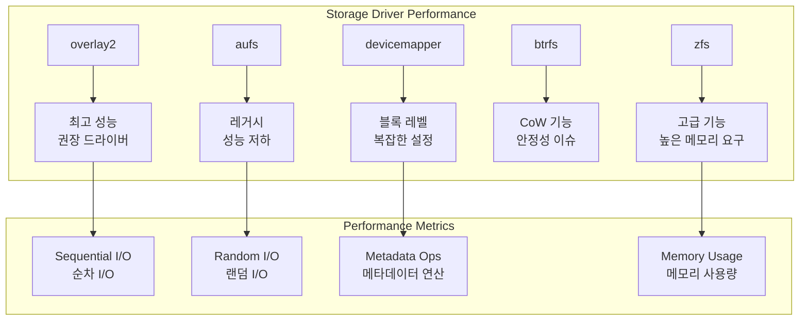
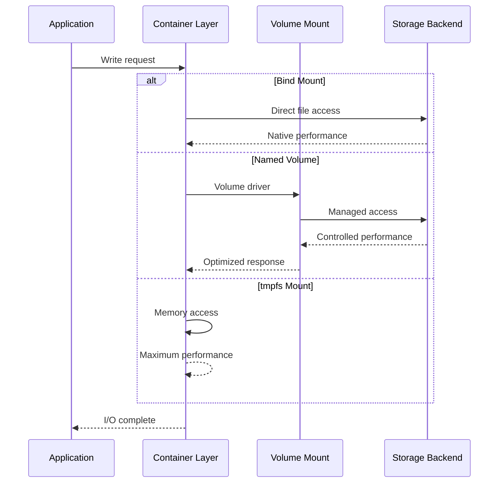

# Session 4: 스토리지 성능 튜닝

## 📍 교과과정에서의 위치
이 세션은 **Week 2 > Day 2 > Session 4**로, 네트워크 성능 최적화 이해를 바탕으로 컨테이너 스토리지 시스템의 성능 튜닝과 I/O 최적화 기법을 심화 분석합니다.

## 학습 목표 (5분)
- **스토리지 드라이버별 성능 특성** 비교 분석
- **I/O 성능 최적화** 기법과 **파일시스템 튜닝** 전략
- **데이터 백업 및 복구** 성능 최적화 방법론

## 1. 이론: 스토리지 드라이버 성능 분석 (20분)

### 스토리지 드라이버 성능 비교



### 스토리지 드라이버별 성능 특성

```
스토리지 드라이버 성능 분석:

overlay2 (권장):
├── 순차 읽기: 95-98% (네이티브 대비)
├── 순차 쓰기: 90-95% (CoW 오버헤드)
├── 랜덤 읽기: 85-90% (레이어 탐색)
├── 랜덤 쓰기: 80-85% (첫 쓰기 비용)
├── 메타데이터 연산: 매우 빠름
├── 메모리 사용량: 낮음
├── CPU 오버헤드: 최소
└── 디스크 사용량: 효율적

aufs (레거시):
├── 순차 읽기: 80-85% (다중 레이어)
├── 순차 쓰기: 70-75% (복잡한 CoW)
├── 랜덤 읽기: 60-70% (레이어 순회)
├── 랜덤 쓰기: 50-60% (성능 저하)
├── 메타데이터 연산: 느림
├── 메모리 사용량: 높음
├── CPU 오버헤드: 높음
└── 디스크 사용량: 비효율적

devicemapper:
├── 순차 읽기: 85-90% (블록 레벨)
├── 순차 쓰기: 75-80% (스냅샷 오버헤드)
├── 랜덤 읽기: 70-80% (블록 매핑)
├── 랜덤 쓰기: 60-70% (메타데이터 업데이트)
├── 메타데이터 연산: 보통
├── 메모리 사용량: 높음 (메타데이터)
├── CPU 오버헤드: 보통
└── 디스크 사용량: 설정에 따라 가변

btrfs:
├── 순차 읽기: 90-95% (네이티브 CoW)
├── 순차 쓰기: 80-85% (CoW 특성)
├── 랜덤 읽기: 75-85% (B-tree 구조)
├── 랜덤 쓰기: 70-80% (프래그멘테이션)
├── 메타데이터 연산: 빠름 (B-tree)
├── 메모리 사용량: 보통
├── CPU 오버헤드: 보통
└── 디스크 사용량: 압축 지원

zfs:
├── 순차 읽기: 95-98% (ARC 캐시)
├── 순차 쓰기: 85-90% (ZIL 최적화)
├── 랜덤 읽기: 90-95% (L2ARC)
├── 랜덤 쓰기: 80-85% (CoW + 압축)
├── 메타데이터 연산: 매우 빠름
├── 메모리 사용량: 매우 높음 (ARC)
├── CPU 오버헤드: 높음 (압축/체크섬)
└── 디스크 사용량: 압축 및 중복제거
```

### I/O 패턴 최적화 전략

```
I/O 성능 최적화:

파일시스템 레벨 최적화:
├── 마운트 옵션 튜닝 (noatime, relatime)
├── 블록 크기 최적화 (4K, 8K, 16K)
├── 저널링 모드 선택 (ordered, writeback)
├── 읽기 전용 마운트 활용
├── 압축 및 중복제거 설정
└── 예약 블록 비율 조정

I/O 스케줄러 최적화:
├── noop: SSD 및 가상화 환경
├── deadline: 실시간 응답성 중요
├── cfq: 공정한 I/O 분배
├── mq-deadline: 멀티큐 환경
├── kyber: 지연시간 기반 스케줄링
└── bfq: 대화형 워크로드

블록 디바이스 튜닝:
├── 큐 깊이 (queue depth) 조정
├── 읽기 전방 (read-ahead) 설정
├── I/O 병합 (merge) 최적화
├── 디스크 스케줄러 파라미터
├── 블록 크기 정렬 (alignment)
└── 디바이스별 최적화 설정

애플리케이션 레벨 최적화:
├── 버퍼링 전략 최적화
├── 비동기 I/O (AIO) 활용
├── 메모리 매핑 (mmap) 사용
├── 배치 I/O 처리
├── 캐싱 계층 구현
└── I/O 패턴 분석 및 최적화
```

## 2. 이론: 볼륨 성능 최적화 (15분)

### 볼륨 타입별 성능 특성



### 볼륨 최적화 전략

```
볼륨 성능 최적화:

로컬 볼륨 최적화:
├── 전용 디스크 파티션 할당
├── SSD 스토리지 활용
├── RAID 구성 최적화 (RAID 0, 10)
├── 파일시스템 선택 (ext4, xfs, btrfs)
├── 마운트 옵션 튜닝
└── 디렉토리 구조 최적화

네트워크 볼륨 최적화:
├── 고속 네트워크 인터페이스 (10GbE, InfiniBand)
├── 네트워크 지연시간 최소화
├── 대역폭 할당 및 QoS
├── 로컬 캐싱 구현
├── 압축 및 중복제거
└── 멀티패스 I/O 구성

클라우드 볼륨 최적화:
├── 프로비저닝된 IOPS 활용
├── 볼륨 타입 선택 (gp3, io2, st1)
├── 볼륨 크기 및 성능 비례
├── 스냅샷 최적화
├── 암호화 성능 고려
└── 지역별 배치 최적화

메모리 기반 최적화:
├── tmpfs 볼륨 활용
├── 메모리 디스크 (ramdisk)
├── 페이지 캐시 최적화
├── 스왑 설정 최적화
├── NUMA 토폴로지 고려
└── 메모리 압축 기술
```

### 캐싱 전략

```
다층 캐싱 아키텍처:

애플리케이션 캐시:
├── 인메모리 캐시 (Redis, Memcached)
├── 애플리케이션 레벨 캐시
├── 쿼리 결과 캐싱
├── 세션 캐시
├── 정적 콘텐츠 캐시
└── CDN 통합

파일시스템 캐시:
├── 페이지 캐시 최적화
├── 디렉토리 엔트리 캐시 (dcache)
├── 아이노드 캐시 (icache)
├── 버퍼 캐시 관리
├── 읽기 전방 (readahead)
└── 쓰기 지연 (write-behind)

스토리지 캐시:
├── SSD 캐시 계층
├── 하드웨어 RAID 캐시
├── 스토리지 컨트롤러 캐시
├── 네트워크 스토리지 캐시
├── 분산 캐시 시스템
└── 계층적 스토리지 관리 (HSM)

캐시 정책:
├── LRU (Least Recently Used)
├── LFU (Least Frequently Used)
├── ARC (Adaptive Replacement Cache)
├── 2Q (Two Queue)
├── CLOCK 알고리즘
└── 사용자 정의 정책
```

## 3. 이론: 백업 및 복구 성능 최적화 (10분)

### 고성능 백업 전략

```
백업 성능 최적화:

증분 백업 최적화:
├── 블록 레벨 변경 감지
├── 파일 레벨 델타 백업
├── 스냅샷 기반 백업
├── 체인지 로그 활용
├── 압축 및 중복제거
└── 병렬 백업 처리

스냅샷 기술 활용:
├── 파일시스템 스냅샷 (LVM, Btrfs, ZFS)
├── 스토리지 레벨 스냅샷
├── 애플리케이션 일관성 스냅샷
├── 크래시 일관성 vs 애플리케이션 일관성
├── 스냅샷 체인 관리
└── 자동 스냅샷 스케줄링

네트워크 백업 최적화:
├── 대역폭 스로틀링
├── 압축 전송
├── 암호화 오버헤드 최소화
├── 멀티스트림 전송
├── 재시도 및 체크포인트
└── 네트워크 QoS 적용

복구 성능 최적화:
├── 병렬 복구 처리
├── 우선순위 기반 복구
├── 부분 복구 지원
├── 인플레이스 복구
├── 핫 스탠바이 시스템
└── 자동 장애조치 (failover)
```

## 4. 개념 예시: 스토리지 튜닝 구성 (12분)

### 고성능 스토리지 설정 예시

```yaml
# Docker Compose 스토리지 최적화 (개념 예시)
version: '3.8'

services:
  database:
    image: postgres:13
    volumes:
      # 고성능 로컬 볼륨
      - db_data:/var/lib/postgresql/data:Z
      # 로그용 tmpfs (휘발성)
      - type: tmpfs
        target: /var/log/postgresql
        tmpfs:
          size: 100M
    environment:
      # PostgreSQL 성능 튜닝
      POSTGRES_INITDB_ARGS: "--data-checksums --wal-segsize=64"
    command: >
      postgres
      -c shared_buffers=256MB
      -c effective_cache_size=1GB
      -c maintenance_work_mem=64MB
      -c checkpoint_completion_target=0.9
      -c wal_buffers=16MB
      -c default_statistics_target=100

  app:
    image: myapp:latest
    volumes:
      # 애플리케이션 캐시용 볼륨
      - app_cache:/app/cache
      # 임시 파일용 tmpfs
      - type: tmpfs
        target: /tmp
        tmpfs:
          size: 512M
          mode: 1777

volumes:
  db_data:
    driver: local
    driver_opts:
      type: ext4
      device: /dev/sdb1
      o: "rw,noatime,data=writeback"
  
  app_cache:
    driver: local
    driver_opts:
      type: tmpfs
      device: tmpfs
      o: "size=1G,uid=1000,gid=1000"
```

### 스토리지 성능 모니터링 예시

```bash
# I/O 성능 측정 (개념 예시)
# 순차 쓰기 성능 테스트
docker run --rm -v myvolume:/data alpine \
  dd if=/dev/zero of=/data/testfile bs=1M count=1000 oflag=direct

# 랜덤 I/O 성능 테스트
docker run --rm -v myvolume:/data alpine \
  fio --name=random-rw --ioengine=libaio --iodepth=4 \
      --rw=randrw --bs=4k --direct=1 --size=1G \
      --numjobs=1 --runtime=60 --group_reporting \
      --filename=/data/fio-test

# 실시간 I/O 모니터링
docker run --rm --pid=host --privileged alpine \
  iostat -x 1

# 컨테이너별 I/O 통계
docker stats --format "table {{.Container}}\t{{.BlockIO}}"
```

### 백업 성능 최적화 예시

```bash
# 고성능 백업 스크립트 (개념 예시)
#!/bin/bash

# 병렬 압축 백업
docker run --rm \
  -v myvolume:/source:ro \
  -v backup_storage:/backup \
  alpine tar -I pigz -cf /backup/backup-$(date +%Y%m%d).tar.gz /source

# 증분 백업 (rsync 기반)
docker run --rm \
  -v myvolume:/source:ro \
  -v backup_storage:/backup \
  alpine rsync -avz --delete --link-dest=/backup/previous /source/ /backup/current/

# 스냅샷 기반 백업
docker run --rm \
  -v /var/lib/docker:/docker:ro \
  -v backup_storage:/backup \
  alpine sh -c "
    # LVM 스냅샷 생성
    lvcreate -L1G -s -n docker-snap /dev/vg0/docker
    # 스냅샷 마운트 및 백업
    mount /dev/vg0/docker-snap /mnt/snap
    tar -czf /backup/docker-snap-$(date +%Y%m%d).tar.gz -C /mnt/snap .
    # 정리
    umount /mnt/snap
    lvremove -f /dev/vg0/docker-snap
  "
```

### 스토리지 드라이버 벤치마크 예시

```bash
# 스토리지 드라이버 성능 비교 (개념 예시)
for driver in overlay2 aufs devicemapper; do
  echo "Testing $driver driver..."
  
  # Docker 데몬 재시작 (드라이버 변경)
  sudo systemctl stop docker
  sudo dockerd --storage-driver=$driver &
  
  # 성능 테스트
  time docker run --rm alpine dd if=/dev/zero of=/tmp/test bs=1M count=100
  
  # 결과 기록
  echo "$driver: $(time)" >> benchmark_results.txt
done
```

## 5. 토론 및 정리 (8분)

### 핵심 개념 정리
- **스토리지 드라이버별** 성능 특성과 최적 선택 기준
- **I/O 최적화** 기법과 파일시스템 튜닝 전략
- **볼륨 성능** 최적화와 캐싱 계층 설계
- **백업 및 복구** 성능 향상 방법론

### 토론 주제
"데이터 집약적 애플리케이션에서 스토리지 성능과 데이터 안정성을 동시에 보장하는 최적의 아키텍처는 무엇인가?"

## 💡 핵심 키워드
- **스토리지 성능**: I/O 패턴, 드라이버 최적화, 파일시스템 튜닝
- **볼륨 최적화**: 로컬/네트워크/클라우드 볼륨, 캐싱 전략
- **백업 최적화**: 증분 백업, 스냅샷, 병렬 처리
- **모니터링**: I/O 메트릭, 성능 벤치마크, 실시간 분석

## 📚 참고 자료
- [Docker 스토리지 드라이버](https://docs.docker.com/storage/storagedriver/)
- [Linux I/O 성능 튜닝](https://www.kernel.org/doc/Documentation/block/)
