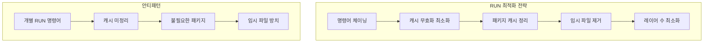
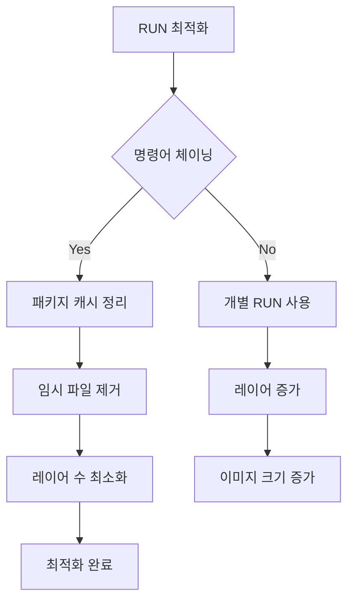

# Session 4: 패키지 설치와 RUN 명령어 최적화

## 📍 교과과정에서의 위치
이 세션은 **Week 2 > Day 2 > Session 4**로, Dockerfile에서 가장 많이 사용되는 RUN 명령어를 최적화하는 방법을 실습합니다. Session 3의 파일 구조 설정을 바탕으로 실제 애플리케이션 환경을 구성하는 과정을 학습합니다.

## 학습 목표 (5분)
- **RUN 명령어 최적화**와 **레이어 관리** 기법 습득
- **Node.js/Python 애플리케이션** 환경 구성 실습
- **패키지 매니저** 활용과 **캐시 전략** 이해

## 1. 이론: RUN 명령어 최적화와 레이어 관리 (20분)

### RUN 명령어 최적화 원칙



### 레이어 최적화 비교

```dockerfile
# ❌ 비효율적인 방법 (여러 레이어)
FROM ubuntu:20.04
RUN apt-get update
RUN apt-get install -y python3
RUN apt-get install -y python3-pip
RUN apt-get install -y curl
RUN apt-get install -y git
RUN rm -rf /var/lib/apt/lists/*

# ✅ 효율적인 방법 (단일 레이어)
FROM ubuntu:20.04
RUN apt-get update && \
    apt-get install -y \
        python3 \
        python3-pip \
        curl \
        git && \
    apt-get clean && \
    rm -rf /var/lib/apt/lists/*
```

### 패키지 매니저별 최적화 패턴

```
APT (Ubuntu/Debian):
├── apt-get update && apt-get install -y packages
├── apt-get clean
├── rm -rf /var/lib/apt/lists/*
└── --no-install-recommends 옵션 사용

YUM/DNF (RHEL/CentOS/Fedora):
├── yum install -y packages
├── yum clean all
└── rm -rf /var/cache/yum

APK (Alpine):
├── apk add --no-cache packages
├── apk del build-dependencies
└── 자동 캐시 정리

NPM (Node.js):
├── npm ci --only=production
├── npm cache clean --force
└── node_modules 최적화

PIP (Python):
├── pip install --no-cache-dir packages
├── pip install --user (권한 최소화)
└── requirements.txt 활용
```

## 2. 실습: Node.js 애플리케이션 환경 구성 (15분)

### Express.js API 서버 구축

```bash
# 실습 디렉토리 생성
mkdir -p ~/docker-practice/day2/session4/nodejs-api
cd ~/docker-practice/day2/session4/nodejs-api

# package.json 생성
cat > package.json << 'EOF'
{
  "name": "nodejs-docker-api",
  "version": "1.0.0",
  "description": "Node.js API server in Docker",
  "main": "server.js",
  "scripts": {
    "start": "node server.js",
    "dev": "nodemon server.js",
    "test": "jest"
  },
  "dependencies": {
    "express": "^4.18.2",
    "cors": "^2.8.5",
    "helmet": "^7.0.0",
    "morgan": "^1.10.0",
    "dotenv": "^16.3.1"
  },
  "devDependencies": {
    "nodemon": "^3.0.1",
    "jest": "^29.6.2"
  },
  "engines": {
    "node": ">=16.0.0"
  }
}
EOF

# Express 서버 코드
cat > server.js << 'EOF'
const express = require('express');
const cors = require('cors');
const helmet = require('helmet');
const morgan = require('morgan');
require('dotenv').config();

const app = express();
const PORT = process.env.PORT || 3000;

// 미들웨어
app.use(helmet());
app.use(cors());
app.use(morgan('combined'));
app.use(express.json());

// 라우트
app.get('/', (req, res) => {
  res.json({
    message: '🚀 Node.js API Server in Docker',
    timestamp: new Date().toISOString(),
    environment: process.env.NODE_ENV || 'development',
    version: process.env.npm_package_version,
    node_version: process.version
  });
});

app.get('/health', (req, res) => {
  res.json({
    status: 'healthy',
    uptime: process.uptime(),
    memory: process.memoryUsage(),
    timestamp: new Date().toISOString()
  });
});

app.get('/api/users', (req, res) => {
  const users = [
    { id: 1, name: 'Docker User', email: 'docker@example.com' },
    { id: 2, name: 'Container User', email: 'container@example.com' }
  ];
  res.json(users);
});

// 에러 핸들링
app.use((err, req, res, next) => {
  console.error(err.stack);
  res.status(500).json({ error: 'Something went wrong!' });
});

app.listen(PORT, '0.0.0.0', () => {
  console.log(`🚀 Server running on port ${PORT}`);
  console.log(`📊 Environment: ${process.env.NODE_ENV || 'development'}`);
  console.log(`🐳 Container: ${process.env.HOSTNAME || 'localhost'}`);
});
EOF

# 환경 변수 파일
cat > .env << 'EOF'
NODE_ENV=production
PORT=3000
API_VERSION=v1
EOF
```

### 최적화된 Node.js Dockerfile

```dockerfile
# Dockerfile.optimized
cat > Dockerfile.optimized << 'EOF'
FROM node:18-alpine

# 메타데이터
LABEL maintainer="student@example.com"
LABEL description="Optimized Node.js API server"

# 보안 업데이트 및 필수 도구 설치
RUN apk update && \
    apk upgrade && \
    apk add --no-cache \
        dumb-init \
        curl && \
    rm -rf /var/cache/apk/*

# 비root 사용자 생성
RUN addgroup -g 1001 -S nodejs && \
    adduser -S -u 1001 -G nodejs nodejs

# 애플리케이션 디렉토리 생성
RUN mkdir -p /app && \
    chown -R nodejs:nodejs /app

WORKDIR /app

# 의존성 파일 복사 (캐시 최적화)
COPY --chown=nodejs:nodejs package*.json ./

# 사용자 전환 후 의존성 설치
USER nodejs

# 프로덕션 의존성만 설치 및 캐시 정리
RUN npm ci --only=production --silent && \
    npm cache clean --force

# 소스 코드 복사
COPY --chown=nodejs:nodejs . .

# 헬스체크 추가
HEALTHCHECK --interval=30s --timeout=3s --start-period=5s --retries=3 \
  CMD curl -f http://localhost:3000/health || exit 1

EXPOSE 3000

# dumb-init으로 시그널 처리 개선
ENTRYPOINT ["dumb-init", "--"]
CMD ["npm", "start"]
EOF
```

### 개발용 vs 프로덕션용 Dockerfile 비교

```dockerfile
# Dockerfile.dev (개발용)
cat > Dockerfile.dev << 'EOF'
FROM node:18

WORKDIR /app

# 모든 의존성 설치 (개발 도구 포함)
COPY package*.json ./
RUN npm install

# 소스 코드 복사
COPY . .

# 개발 서버 실행 (nodemon 사용)
EXPOSE 3000
CMD ["npm", "run", "dev"]
EOF

# Dockerfile.prod (프로덕션용)
cat > Dockerfile.prod << 'EOF'
FROM node:18-alpine as builder

WORKDIR /app
COPY package*.json ./
RUN npm ci --only=production && npm cache clean --force

FROM node:18-alpine

# 보안 강화
RUN apk add --no-cache dumb-init && \
    addgroup -g 1001 -S nodejs && \
    adduser -S -u 1001 -G nodejs nodejs

WORKDIR /app
COPY --from=builder --chown=nodejs:nodejs /app/node_modules ./node_modules
COPY --chown=nodejs:nodejs . .

USER nodejs
EXPOSE 3000

ENTRYPOINT ["dumb-init", "--"]
CMD ["node", "server.js"]
EOF
```

## 3. 실습: Python 애플리케이션 환경 구성 (10분)

### Flask REST API 서버

```bash
# Python 프로젝트 디렉토리
mkdir -p python-api && cd python-api

# requirements.txt
cat > requirements.txt << 'EOF'
Flask==2.3.3
Flask-CORS==4.0.0
gunicorn==21.2.0
python-dotenv==1.0.0
requests==2.31.0
psycopg2-binary==2.9.7
redis==4.6.0
EOF

# Flask 애플리케이션
cat > app.py << 'EOF'
from flask import Flask, jsonify, request
from flask_cors import CORS
import os
import sys
import platform
from datetime import datetime
import socket

app = Flask(__name__)
CORS(app)

@app.route('/')
def home():
    return jsonify({
        'message': '🐍 Python Flask API in Docker',
        'timestamp': datetime.now().isoformat(),
        'python_version': sys.version,
        'platform': platform.platform(),
        'hostname': socket.gethostname(),
        'environment': os.environ.get('FLASK_ENV', 'production')
    })

@app.route('/health')
def health():
    return jsonify({
        'status': 'healthy',
        'timestamp': datetime.now().isoformat(),
        'version': '1.0.0'
    })

@app.route('/api/data')
def get_data():
    return jsonify({
        'data': [
            {'id': 1, 'name': 'Docker', 'type': 'Container'},
            {'id': 2, 'name': 'Python', 'type': 'Language'},
            {'id': 3, 'name': 'Flask', 'type': 'Framework'}
        ],
        'count': 3,
        'timestamp': datetime.now().isoformat()
    })

if __name__ == '__main__':
    port = int(os.environ.get('PORT', 5000))
    debug = os.environ.get('FLASK_ENV') == 'development'
    app.run(host='0.0.0.0', port=port, debug=debug)
EOF
```

### 최적화된 Python Dockerfile

```dockerfile
# Python Dockerfile
cat > Dockerfile << 'EOF'
FROM python:3.11-slim

# 메타데이터
LABEL maintainer="student@example.com"
LABEL description="Optimized Python Flask API"

# 시스템 업데이트 및 필수 패키지 설치
RUN apt-get update && \
    apt-get install -y --no-install-recommends \
        gcc \
        libc6-dev \
        curl && \
    apt-get clean && \
    rm -rf /var/lib/apt/lists/*

# 비root 사용자 생성
RUN useradd --create-home --shell /bin/bash app

WORKDIR /app

# 의존성 파일 복사 및 설치
COPY requirements.txt .
RUN pip install --no-cache-dir --upgrade pip && \
    pip install --no-cache-dir -r requirements.txt && \
    apt-get purge -y gcc libc6-dev && \
    apt-get autoremove -y

# 소스 코드 복사 및 권한 설정
COPY --chown=app:app . .

# 사용자 전환
USER app

# 헬스체크
HEALTHCHECK --interval=30s --timeout=10s --start-period=5s --retries=3 \
  CMD curl -f http://localhost:5000/health || exit 1

EXPOSE 5000

# Gunicorn으로 프로덕션 서버 실행
CMD ["gunicorn", "--bind", "0.0.0.0:5000", "--workers", "4", "app:app"]
EOF
```

## 4. 실습: 빌드 도구 분리 패턴 (10분)

### 컴파일이 필요한 애플리케이션 (Go 예시)

```bash
# Go 애플리케이션 예시
mkdir -p go-api && cd go-api

# Go 소스 코드
cat > main.go << 'EOF'
package main

import (
    "encoding/json"
    "fmt"
    "log"
    "net/http"
    "os"
    "runtime"
    "time"
)

type Response struct {
    Message   string `json:"message"`
    Timestamp string `json:"timestamp"`
    GoVersion string `json:"go_version"`
    OS        string `json:"os"`
    Arch      string `json:"arch"`
    Hostname  string `json:"hostname"`
}

func main() {
    http.HandleFunc("/", func(w http.ResponseWriter, r *http.Request) {
        hostname, _ := os.Hostname()
        
        response := Response{
            Message:   "🚀 Go API in Docker",
            Timestamp: time.Now().Format(time.RFC3339),
            GoVersion: runtime.Version(),
            OS:        runtime.GOOS,
            Arch:      runtime.GOARCH,
            Hostname:  hostname,
        }
        
        w.Header().Set("Content-Type", "application/json")
        json.NewEncoder(w).Encode(response)
    })
    
    http.HandleFunc("/health", func(w http.ResponseWriter, r *http.Request) {
        w.Header().Set("Content-Type", "application/json")
        json.NewEncoder(w).Encode(map[string]string{
            "status": "healthy",
            "timestamp": time.Now().Format(time.RFC3339),
        })
    })
    
    port := os.Getenv("PORT")
    if port == "" {
        port = "8080"
    }
    
    fmt.Printf("🚀 Server starting on port %s\n", port)
    log.Fatal(http.ListenAndServe(":"+port, nil))
}
EOF

# go.mod 파일
cat > go.mod << 'EOF'
module go-api

go 1.21
EOF
```

### 멀티 스테이지 빌드로 크기 최적화

```dockerfile
# Go 멀티 스테이지 Dockerfile
cat > Dockerfile << 'EOF'
# 빌드 스테이지
FROM golang:1.21-alpine AS builder

# 빌드 도구 설치
RUN apk add --no-cache git ca-certificates

WORKDIR /app

# 의존성 파일 복사
COPY go.mod go.sum ./
RUN go mod download

# 소스 코드 복사 및 빌드
COPY . .
RUN CGO_ENABLED=0 GOOS=linux go build -a -installsuffix cgo -o main .

# 런타임 스테이지
FROM alpine:latest

# 보안 업데이트 및 CA 인증서
RUN apk --no-cache add ca-certificates tzdata && \
    adduser -D -s /bin/sh appuser

WORKDIR /root/

# 빌드된 바이너리만 복사
COPY --from=builder /app/main .

# 비root 사용자로 실행
USER appuser

EXPOSE 8080

CMD ["./main"]
EOF

# 빌드 및 크기 비교
docker build -t go-api:multistage .
docker images go-api

# 단일 스테이지와 비교 (참고용)
cat > Dockerfile.single << 'EOF'
FROM golang:1.21-alpine

WORKDIR /app
COPY . .
RUN go build -o main .

EXPOSE 8080
CMD ["./main"]
EOF

docker build -f Dockerfile.single -t go-api:single .
docker images go-api
```

## 5. 실습: 패키지 캐시 최적화 (10분)

### 캐시 전략 비교

```dockerfile
# 캐시 최적화 테스트
cat > Dockerfile.cache-test << 'EOF'
FROM node:18-alpine

WORKDIR /app

# ❌ 비효율적: 소스 변경 시 npm install 재실행
# COPY . .
# RUN npm install

# ✅ 효율적: package.json 변경 시만 npm install 재실행
COPY package*.json ./
RUN npm ci --only=production

# 소스 코드는 나중에 복사
COPY . .

CMD ["npm", "start"]
EOF
```

### 빌드 시간 측정

```bash
# 초기 빌드 시간 측정
echo "=== Initial Build ==="
time docker build -f Dockerfile.optimized -t nodejs-api:v1 .

# 소스 코드 수정 후 재빌드
echo "console.log('Updated');" >> server.js

echo "=== Rebuild after source change ==="
time docker build -f Dockerfile.optimized -t nodejs-api:v2 .

# 의존성 변경 후 재빌드
echo '"lodash": "^4.17.21",' >> package.json

echo "=== Rebuild after dependency change ==="
time docker build -f Dockerfile.optimized -t nodejs-api:v3 .
```

## 6. Q&A 및 정리 (5분)

### RUN 명령어 최적화 체크리스트



### 실습 결과 비교

```bash
# 최종 이미지 크기 비교
echo "=== Final Image Sizes ==="
docker images --format "table {{.Repository}}\t{{.Tag}}\t{{.Size}}" | grep -E "(nodejs-api|python-api|go-api)"

# 빌드 레이어 분석
docker history nodejs-api:v1 --format "table {{.CreatedBy}}\t{{.Size}}" | head -10
```

## 💡 핵심 키워드
- **RUN 최적화**: 명령어 체이닝, 캐시 정리, 레이어 최소화
- **패키지 매니저**: apt, apk, npm, pip 최적화 패턴
- **빌드 캐시**: 의존성 파일 우선 복사로 캐시 효율성 향상
- **멀티 스테이지**: 빌드 도구와 런타임 분리로 크기 최적화

## 📚 참고 자료
- [Dockerfile 모범 사례](https://docs.docker.com/develop/dev-best-practices/)
- [Node.js Docker 가이드](https://nodejs.org/en/docs/guides/nodejs-docker-webapp/)
- [Python Docker 최적화](https://pythonspeed.com/articles/dockerizing-python-is-hard/)

## 🔧 실습 체크리스트
- [ ] RUN 명령어 체이닝으로 레이어 최적화
- [ ] 패키지 매니저별 캐시 정리 적용
- [ ] Node.js/Python 환경 구성 완료
- [ ] 멀티 스테이지 빌드로 크기 최적화
- [ ] 빌드 캐시 전략으로 빌드 시간 단축
