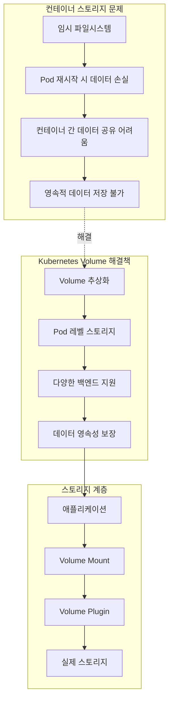
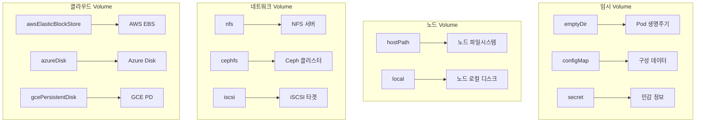
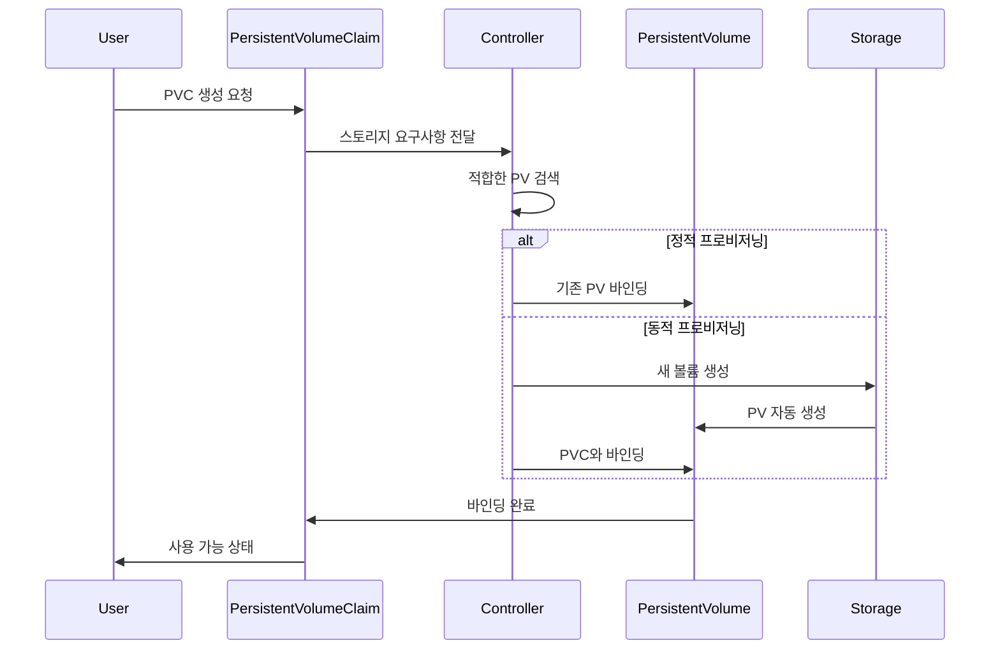
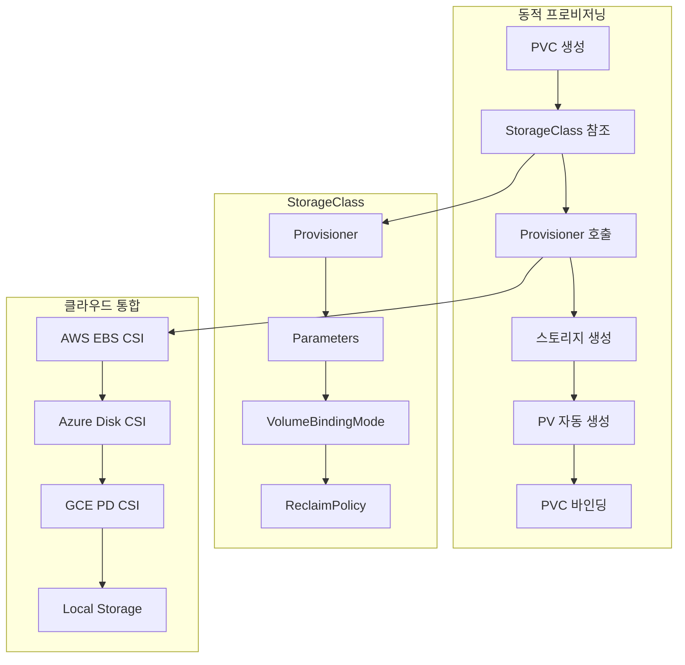

# Session 5: Volume과 PersistentVolume

## 📍 교과과정에서의 위치
이 세션은 **Week 2 > Day 2 > Session 5**로, Kubernetes의 스토리지 추상화 모델인 Volume과 PersistentVolume의 개념과 데이터 영속성 관리를 학습합니다.

## 학습 목표 (5분)
- **스토리지 추상화** 모델과 **데이터 영속성** 개념 이해
- **Volume 타입**과 **라이프사이클** 관리 학습
- **PersistentVolume**과 **PersistentVolumeClaim** 관계 파악
- **StorageClass**와 **동적 프로비저닝** 메커니즘 이해

## 1. 스토리지 추상화 모델과 데이터 영속성 (15분)

### 스토리지 추상화 개념



### 데이터 영속성 레벨
```
데이터 영속성 분류:

Container 레벨 (임시):
├── 컨테이너 파일시스템
├── 컨테이너 재시작 시 손실
├── 임시 데이터, 캐시 용도
├── 성능 우수, 영속성 없음
└── 기본 컨테이너 동작

Pod 레벨 (Pod 생명주기):
├── Pod 내 컨테이너 간 공유
├── Pod 재시작 시 유지
├── Pod 삭제 시 손실
├── emptyDir, hostPath 등
└── 임시 공유 스토리지

Node 레벨 (노드 생명주기):
├── 노드의 로컬 스토리지 사용
├── Pod 재스케줄링 시 손실 가능
├── 노드 장애 시 데이터 손실
├── hostPath, local volume
└── 성능 우수, 가용성 제한

Cluster 레벨 (영구 저장):
├── 클러스터 외부 스토리지
├── Pod/노드 독립적 생명주기
├── 고가용성 및 내구성
├── PersistentVolume 사용
└── 네트워크 스토리지 기반

External 레벨 (클라우드):
├── 클라우드 제공업체 스토리지
├── 관리형 서비스 활용
├── 백업, 스냅샷 지원
├── EBS, Azure Disk, GCE PD
└── 최고 수준의 내구성
```

## 2. Volume 타입과 라이프사이클 관리 (12분)

### 주요 Volume 타입



### Volume 타입별 특징
```
Volume 타입 상세:

emptyDir:
├── Pod 생성 시 빈 디렉토리 생성
├── Pod 내 컨테이너 간 데이터 공유
├── Pod 삭제 시 데이터 손실
├── 메모리 기반 옵션 지원 (medium: Memory)
├── 임시 파일, 캐시, 스크래치 공간
└── 가장 기본적인 Volume 타입

hostPath:
├── 노드의 파일시스템 경로 마운트
├── 노드별 데이터 저장
├── Pod 재스케줄링 시 데이터 손실 가능
├── 보안 위험 (노드 파일시스템 접근)
├── 개발/테스트 환경에서 주로 사용
└── 프로덕션에서는 신중히 사용

configMap/secret:
├── Kubernetes 오브젝트를 Volume으로 마운트
├── 구성 파일이나 인증서 제공
├── 읽기 전용 마운트
├── 실시간 업데이트 지원
├── 파일 권한 설정 가능
└── 구성 관리 패턴의 핵심

persistentVolumeClaim:
├── PersistentVolume 추상화 사용
├── 스토리지 요구사항 선언
├── 동적/정적 프로비저닝 지원
├── 스토리지 클래스 기반 선택
├── 가장 권장되는 영구 스토리지 방식
└── 클라우드 네이티브 패턴

네트워크 스토리지:
├── NFS, Ceph, GlusterFS 등
├── 다중 노드에서 동시 접근 가능
├── ReadWriteMany 액세스 모드 지원
├── 네트워크 지연 및 성능 고려
└── 공유 스토리지 요구사항에 적합
```

## 3. PersistentVolume과 PersistentVolumeClaim 관계 (12분)

### PV/PVC 바인딩 프로세스



### PV/PVC 관계 모델
```
PV/PVC 관계 분석:

PersistentVolume (PV):
├── 클러스터 레벨 리소스
├── 실제 스토리지 볼륨 표현
├── 관리자가 사전 생성 (정적)
├── StorageClass가 자동 생성 (동적)
├── 용량, 액세스 모드, 정책 정의
└── 네임스페이스 독립적

PersistentVolumeClaim (PVC):
├── 네임스페이스 레벨 리소스
├── 스토리지 요구사항 선언
├── 사용자/애플리케이션이 생성
├── PV와 1:1 바인딩 관계
├── Pod에서 Volume으로 사용
└── 스토리지 추상화 인터페이스

바인딩 조건:
├── 용량: PV >= PVC 요청 용량
├── 액세스 모드: PV와 PVC 일치
├── 스토리지 클래스: 동일한 클래스
├── 라벨 셀렉터: PVC 셀렉터와 PV 라벨 매칭
├── 볼륨 모드: 파일시스템 vs 블록
└── 우선순위: 가장 적합한 PV 선택

액세스 모드:
├── ReadWriteOnce (RWO): 단일 노드 읽기/쓰기
├── ReadOnlyMany (ROX): 다중 노드 읽기 전용
├── ReadWriteMany (RWX): 다중 노드 읽기/쓰기
├── ReadWriteOncePod (RWOP): 단일 Pod 읽기/쓰기
└── 스토리지 백엔드별 지원 모드 상이

회수 정책 (Reclaim Policy):
├── Retain: PVC 삭제 후 PV 유지
├── Delete: PVC 삭제 시 PV도 삭제
├── Recycle: 데이터 삭제 후 재사용 (deprecated)
└── 데이터 보호 및 리소스 관리 고려
```

## 4. StorageClass와 동적 프로비저닝 (8분)

### 동적 프로비저닝 아키텍처



### StorageClass 구성 요소
```
StorageClass 상세:

핵심 구성 요소:
├── provisioner: 스토리지 프로비저너 지정
├── parameters: 프로비저너별 매개변수
├── volumeBindingMode: 바인딩 시점 제어
├── reclaimPolicy: 볼륨 회수 정책
├── allowVolumeExpansion: 볼륨 확장 허용
└── mountOptions: 마운트 옵션

VolumeBindingMode:
├── Immediate: PVC 생성 즉시 바인딩
├── WaitForFirstConsumer: Pod 생성 시 바인딩
├── 토폴로지 인식 스케줄링 지원
├── 지역/가용영역 고려 배치
└── 성능 최적화

클라우드별 Provisioner:
├── AWS: ebs.csi.aws.com
├── Azure: disk.csi.azure.com
├── GCP: pd.csi.storage.gke.io
├── VMware: csi.vsphere.vmware.com
└── OpenStack: cinder.csi.openstack.org

동적 프로비저닝 장점:
├── 자동 스토리지 생성
├── 온디맨드 리소스 할당
├── 표준화된 스토리지 정책
├── 운영 부담 감소
├── 클라우드 네이티브 패턴
└── 비용 효율성 향상
```

## 💬 그룹 토론: 클라우드 환경에서 스토리지 추상화의 가치 (8분)

### 토론 주제
**"클라우드 환경에서 Kubernetes 스토리지 추상화가 제공하는 가치와 고려해야 할 운영상 이슈는 무엇인가?"**

## 💡 핵심 개념 정리
- **Volume**: Pod 레벨 스토리지, 다양한 백엔드 지원
- **PV/PVC**: 스토리지 추상화, 선언적 스토리지 요청
- **StorageClass**: 동적 프로비저닝, 스토리지 정책 정의
- **데이터 영속성**: 컨테이너 → Pod → 클러스터 → 외부 레벨

## 다음 세션 준비
다음 세션에서는 **Namespace와 리소스 격리**에 대해 학습합니다.