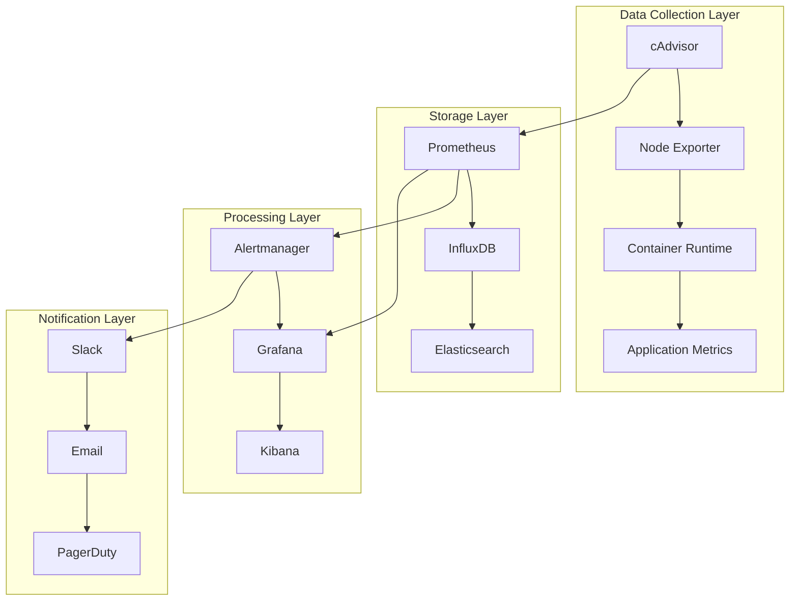
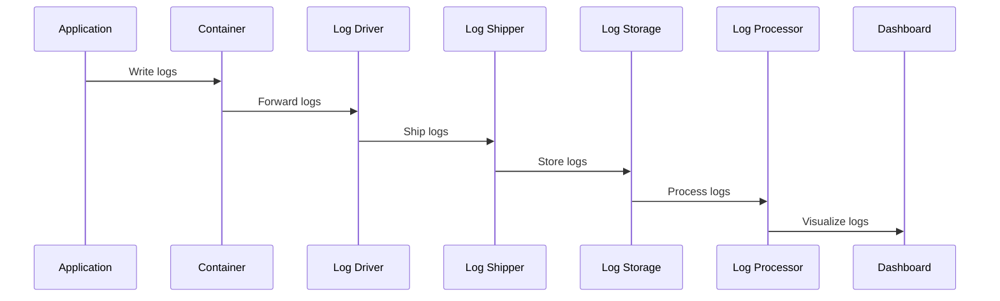

# Session 5: 컨테이너 모니터링 아키텍처

## 📍 교과과정에서의 위치
이 세션은 **Week 2 > Day 2 > Session 5**로, 스토리지 성능 튜닝 이해를 바탕으로 컨테이너 환경의 종합적인 모니터링 시스템 아키텍처를 심화 분석합니다.

## 학습 목표 (5분)
- **컨테이너 모니터링 아키텍처** 설계 원리와 **메트릭 수집** 체계
- **로깅 시스템** 구조와 **중앙집중식 로그 관리** 전략
- **알림 및 대시보드** 구성과 **관찰가능성** 구현 방법론

## 1. 이론: 컨테이너 모니터링 아키텍처 (20분)

### 모니터링 시스템 전체 구조



### 메트릭 수집 체계

```
컨테이너 메트릭 분류:

인프라 메트릭:
├── CPU 사용률 (user, system, idle, iowait)
├── 메모리 사용량 (RSS, cache, swap, available)
├── 디스크 I/O (read/write IOPS, throughput, latency)
├── 네트워크 I/O (packets, bytes, errors, drops)
├── 파일시스템 사용량 (used, available, inodes)
├── 로드 애버리지 (1m, 5m, 15m)
└── 시스템 프로세스 수 및 상태

컨테이너 메트릭:
├── 컨테이너 상태 (running, stopped, paused)
├── 리소스 사용량 (CPU, memory, I/O 제한 대비)
├── 네트워크 트래픽 (컨테이너별 송수신)
├── 볼륨 사용량 (마운트된 볼륨별)
├── 프로세스 수 및 스레드 수
├── 파일 디스크립터 사용량
└── 컨테이너 재시작 횟수 및 이유

애플리케이션 메트릭:
├── 비즈니스 메트릭 (주문 수, 사용자 수)
├── 성능 메트릭 (응답 시간, 처리량)
├── 에러 메트릭 (에러율, 예외 발생)
├── 가용성 메트릭 (업타임, 헬스 체크)
├── 사용자 경험 메트릭 (페이지 로드 시간)
└── 커스텀 비즈니스 로직 메트릭

보안 메트릭:
├── 인증 실패 횟수
├── 권한 에스컬레이션 시도
├── 비정상적인 네트워크 연결
├── 파일 시스템 변경 감지
├── 프로세스 실행 패턴 분석
└── 보안 정책 위반 이벤트
```

### 메트릭 수집 도구 비교

```
주요 모니터링 도구:

cAdvisor (Container Advisor):
├── Google에서 개발한 컨테이너 모니터링
├── 실시간 리소스 사용량 및 성능 데이터
├── Docker, containerd, CRI-O 지원
├── Prometheus 메트릭 형식 지원
├── 웹 UI 제공 (포트 8080)
├── 경량화된 에이전트
├── 자동 컨테이너 발견
└── 히스토리컬 데이터 제한적

Node Exporter:
├── Prometheus 공식 시스템 메트릭 수집기
├── 하드웨어 및 OS 메트릭 수집
├── 700+ 메트릭 제공
├── 텍스트 파일 기반 커스텀 메트릭
├── 모듈러 아키텍처 (collector 활성화/비활성화)
├── 낮은 리소스 사용량
├── 다양한 플랫폼 지원
└── 커뮤니티 활발

Prometheus:
├── 시계열 데이터베이스 및 모니터링 시스템
├── Pull 기반 메트릭 수집
├── PromQL 쿼리 언어
├── 서비스 디스커버리 지원
├── 알림 규칙 엔진
├── 고가용성 구성 가능
├── 장기 저장을 위한 원격 스토리지 연동
└── CNCF 졸업 프로젝트

Grafana:
├── 메트릭 시각화 및 대시보드
├── 다중 데이터 소스 지원
├── 풍부한 차트 및 패널 타입
├── 알림 및 노티피케이션
├── 사용자 및 팀 관리
├── 플러그인 생태계
├── 임베딩 및 공유 기능
└── 엔터프라이즈 기능 제공
```

## 2. 이론: 로깅 시스템 아키텍처 (15분)

### 중앙집중식 로깅 구조



### 로그 수집 및 처리 전략

```
로깅 아키텍처 구성:

로그 수집 계층:
├── 컨테이너 로그 드라이버 (json-file, syslog, fluentd)
├── 로그 에이전트 (Fluentd, Fluent Bit, Filebeat)
├── 사이드카 패턴 로그 수집
├── 중앙집중식 로그 수집기
├── 로그 라우팅 및 필터링
└── 백프레셔 및 버퍼링 관리

로그 전송 계층:
├── 비동기 전송 및 배치 처리
├── 압축 및 암호화
├── 재시도 및 에러 핸들링
├── 로드 밸런싱 및 장애조치
├── 네트워크 최적화
└── 메타데이터 추가 (태그, 라벨)

로그 저장 계층:
├── Elasticsearch: 검색 및 분석 최적화
├── InfluxDB: 시계열 로그 데이터
├── MongoDB: 구조화되지 않은 로그
├── S3/Object Storage: 장기 보관
├── 파티셔닝 및 인덱싱 전략
└── 데이터 라이프사이클 관리

로그 처리 계층:
├── 실시간 스트림 처리 (Kafka, Kinesis)
├── 로그 파싱 및 구조화
├── 로그 집계 및 통계
├── 이상 탐지 및 패턴 분석
├── 로그 상관관계 분석
└── 머신러닝 기반 분석
```

### 구조화된 로깅 전략

```
로그 표준화 및 구조화:

로그 레벨 표준화:
├── TRACE: 상세한 디버깅 정보
├── DEBUG: 개발 및 디버깅 정보
├── INFO: 일반적인 정보 메시지
├── WARN: 경고 메시지 (잠재적 문제)
├── ERROR: 에러 메시지 (처리 가능한 오류)
├── FATAL: 치명적 오류 (애플리케이션 종료)
└── 환경별 로그 레벨 설정

JSON 구조화 로깅:
├── 타임스탬프 (ISO 8601 형식)
├── 로그 레벨 및 메시지
├── 서비스 및 컴포넌트 식별자
├── 요청 ID 및 세션 ID
├── 사용자 ID 및 IP 주소
├── 에러 코드 및 스택 트레이스
├── 성능 메트릭 (응답 시간, 처리량)
└── 커스텀 컨텍스트 정보

로그 샘플링 및 필터링:
├── 로그 볼륨 제어 (샘플링 비율)
├── 중요도 기반 필터링
├── 중복 로그 제거
├── PII (개인정보) 마스킹
├── 민감한 정보 제거
└── 로그 압축 및 최적화
```

## 3. 이론: 관찰가능성 및 알림 시스템 (10분)

### 관찰가능성 3요소 통합

```
Observability 구성 요소:

메트릭 (Metrics):
├── 시스템 상태의 수치적 표현
├── 시계열 데이터로 저장
├── 집계 및 통계 분석 가능
├── 실시간 모니터링 및 알림
├── 대시보드 시각화
└── 용량 계획 및 트렌드 분석

로그 (Logs):
├── 이벤트 기반 상세 정보
├── 디버깅 및 문제 해결
├── 감사 및 컴플라이언스
├── 사용자 행동 분석
├── 보안 이벤트 추적
└── 비즈니스 인텔리전스

트레이스 (Traces):
├── 분산 시스템 요청 추적
├── 서비스 간 의존성 분석
├── 성능 병목 지점 식별
├── 에러 전파 경로 추적
├── 마이크로서비스 가시성
└── 사용자 경험 최적화

통합 분석:
├── 메트릭-로그-트레이스 상관관계
├── 컨텍스트 기반 문제 해결
├── 자동화된 근본 원인 분석
├── 예측적 장애 감지
├── 지능형 알림 시스템
└── 자가 치유 시스템 구현
```

### 알림 및 에스컬레이션 전략

```
알림 시스템 설계:

알림 규칙 설계:
├── 임계값 기반 알림 (정적/동적)
├── 트렌드 기반 알림 (증가율, 패턴)
├── 이상 탐지 기반 알림 (ML/통계)
├── 복합 조건 알림 (AND/OR 로직)
├── 시간 윈도우 기반 평가
└── 알림 우선순위 분류

알림 채널 관리:
├── 이메일: 상세 정보 및 문서화
├── Slack/Teams: 실시간 협업
├── SMS: 긴급 상황 알림
├── PagerDuty: 온콜 관리
├── 웹훅: 자동화 시스템 연동
└── 모바일 푸시: 즉시 알림

에스컬레이션 정책:
├── 1차 대응자 (5분 내 응답)
├── 2차 에스컬레이션 (15분 후)
├── 관리자 에스컬레이션 (30분 후)
├── 경영진 알림 (1시간 후)
├── 자동 티켓 생성
└── 외부 지원팀 연락

알림 피로도 관리:
├── 알림 그룹핑 및 집계
├── 중복 알림 제거
├── 알림 빈도 제한
├── 유지보수 모드 설정
├── 알림 효과성 분석
└── 지속적인 규칙 최적화
```

## 4. 개념 예시: 모니터링 시스템 구성 (12분)

### Prometheus + Grafana 스택 예시

```yaml
# 모니터링 스택 구성 (개념 예시)
version: '3.8'

services:
  prometheus:
    image: prom/prometheus:latest
    ports:
      - "9090:9090"
    volumes:
      - ./prometheus.yml:/etc/prometheus/prometheus.yml
      - prometheus_data:/prometheus
    command:
      - '--config.file=/etc/prometheus/prometheus.yml'
      - '--storage.tsdb.path=/prometheus'
      - '--web.console.libraries=/etc/prometheus/console_libraries'
      - '--web.console.templates=/etc/prometheus/consoles'
      - '--storage.tsdb.retention.time=200h'
      - '--web.enable-lifecycle'

  grafana:
    image: grafana/grafana:latest
    ports:
      - "3000:3000"
    volumes:
      - grafana_data:/var/lib/grafana
      - ./grafana/provisioning:/etc/grafana/provisioning
    environment:
      - GF_SECURITY_ADMIN_PASSWORD=admin
      - GF_USERS_ALLOW_SIGN_UP=false

  cadvisor:
    image: gcr.io/cadvisor/cadvisor:latest
    ports:
      - "8080:8080"
    volumes:
      - /:/rootfs:ro
      - /var/run:/var/run:ro
      - /sys:/sys:ro
      - /var/lib/docker/:/var/lib/docker:ro
    privileged: true

  node-exporter:
    image: prom/node-exporter:latest
    ports:
      - "9100:9100"
    volumes:
      - /proc:/host/proc:ro
      - /sys:/host/sys:ro
      - /:/rootfs:ro
    command:
      - '--path.procfs=/host/proc'
      - '--path.rootfs=/rootfs'
      - '--path.sysfs=/host/sys'
      - '--collector.filesystem.ignored-mount-points=^/(sys|proc|dev|host|etc)($$|/)'

volumes:
  prometheus_data:
  grafana_data:
```

### ELK 스택 로깅 시스템 예시

```yaml
# ELK 스택 구성 (개념 예시)
version: '3.8'

services:
  elasticsearch:
    image: docker.elastic.co/elasticsearch/elasticsearch:7.15.0
    environment:
      - discovery.type=single-node
      - "ES_JAVA_OPTS=-Xms512m -Xmx512m"
    ports:
      - "9200:9200"
    volumes:
      - elasticsearch_data:/usr/share/elasticsearch/data

  logstash:
    image: docker.elastic.co/logstash/logstash:7.15.0
    ports:
      - "5044:5044"
      - "9600:9600"
    volumes:
      - ./logstash/pipeline:/usr/share/logstash/pipeline
      - ./logstash/config:/usr/share/logstash/config
    depends_on:
      - elasticsearch

  kibana:
    image: docker.elastic.co/kibana/kibana:7.15.0
    ports:
      - "5601:5601"
    environment:
      - ELASTICSEARCH_HOSTS=http://elasticsearch:9200
    depends_on:
      - elasticsearch

  filebeat:
    image: docker.elastic.co/beats/filebeat:7.15.0
    volumes:
      - ./filebeat/filebeat.yml:/usr/share/filebeat/filebeat.yml:ro
      - /var/lib/docker/containers:/var/lib/docker/containers:ro
      - /var/run/docker.sock:/var/run/docker.sock:ro
    depends_on:
      - logstash

volumes:
  elasticsearch_data:
```

### 알림 규칙 설정 예시

```yaml
# Prometheus 알림 규칙 (개념 예시)
groups:
- name: container.rules
  rules:
  - alert: ContainerHighCPU
    expr: rate(container_cpu_usage_seconds_total[5m]) > 0.8
    for: 5m
    labels:
      severity: warning
    annotations:
      summary: "Container CPU usage is above 80%"
      description: "Container {{ $labels.name }} CPU usage is {{ $value }}%"

  - alert: ContainerHighMemory
    expr: container_memory_usage_bytes / container_spec_memory_limit_bytes > 0.9
    for: 2m
    labels:
      severity: critical
    annotations:
      summary: "Container memory usage is above 90%"
      description: "Container {{ $labels.name }} memory usage is {{ $value }}%"

  - alert: ContainerDown
    expr: up == 0
    for: 1m
    labels:
      severity: critical
    annotations:
      summary: "Container is down"
      description: "Container {{ $labels.instance }} has been down for more than 1 minute"
```

## 5. 토론 및 정리 (8분)

### 핵심 개념 정리
- **다층 모니터링 아키텍처**를 통한 종합적 가시성 확보
- **메트릭, 로그, 트레이스** 통합을 통한 관찰가능성 구현
- **지능형 알림 시스템**과 에스컬레이션 전략
- **성능과 비용**을 고려한 모니터링 시스템 설계

### 토론 주제
"대규모 마이크로서비스 환경에서 모니터링 데이터의 폭증을 관리하면서도 중요한 신호를 놓치지 않는 전략은 무엇인가?"

## 💡 핵심 키워드
- **모니터링 아키텍처**: 메트릭 수집, 저장, 시각화, 알림
- **관찰가능성**: Metrics, Logs, Traces 통합
- **로깅 시스템**: 중앙집중화, 구조화, 실시간 처리
- **알림 관리**: 규칙 설계, 에스컬레이션, 피로도 관리

## 📚 참고 자료
- [Prometheus 모니터링](https://prometheus.io/docs/)
- [Grafana 대시보드](https://grafana.com/docs/)
- [ELK 스택 가이드](https://www.elastic.co/guide/)
