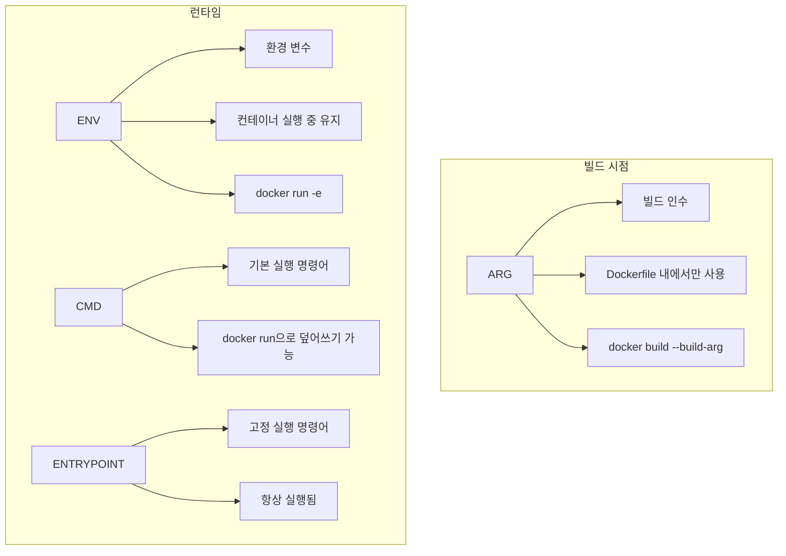
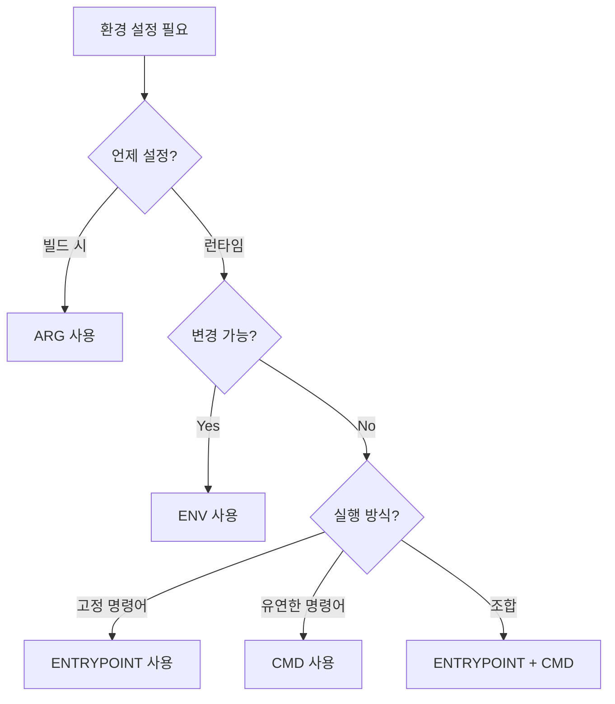

# Session 5: 환경 변수와 실행 명령어 설정

## 📍 교과과정에서의 위치
이 세션은 **Week 2 > Day 2 > Session 5**로, Dockerfile에서 환경 설정과 실행 명령어를 다루는 핵심 명령어들을 실습합니다. Session 4의 패키지 설치를 바탕으로 애플리케이션의 동작을 제어하는 방법을 학습합니다.

## 학습 목표 (5분)
- **ENV, ARG, CMD, ENTRYPOINT** 명령어 **차이점** 이해
- **설정 가능한 애플리케이션** 이미지 구축 실습
- **빌드 시점 vs 런타임** 설정 관리 방법 학습

## 1. 이론: ENV, ARG, CMD, ENTRYPOINT 차이점 (20분)

### 환경 설정 명령어 비교



### 명령어별 특징과 사용 시점

| 명령어 | 사용 시점 | 덮어쓰기 | 용도 | 예시 |
|--------|-----------|----------|------|------|
| **ARG** | 빌드 시 | ❌ | 빌드 인수 | `ARG VERSION=1.0` |
| **ENV** | 런타임 | ✅ | 환경 변수 | `ENV NODE_ENV=production` |
| **CMD** | 런타임 | ✅ | 기본 명령어 | `CMD ["npm", "start"]` |
| **ENTRYPOINT** | 런타임 | ❌ | 고정 명령어 | `ENTRYPOINT ["docker-entrypoint.sh"]` |

### CMD vs ENTRYPOINT 조합 패턴

```dockerfile
# 패턴 1: CMD만 사용 (완전 덮어쓰기 가능)
CMD ["npm", "start"]
# docker run myapp → npm start 실행
# docker run myapp echo "hello" → echo "hello" 실행

# 패턴 2: ENTRYPOINT만 사용 (고정 실행)
ENTRYPOINT ["npm", "start"]
# docker run myapp → npm start 실행
# docker run myapp echo "hello" → npm start echo "hello" 실행 (오류)

# 패턴 3: ENTRYPOINT + CMD 조합 (권장)
ENTRYPOINT ["npm"]
CMD ["start"]
# docker run myapp → npm start 실행
# docker run myapp run dev → npm run dev 실행
```

## 2. 실습: 설정 가능한 웹 애플리케이션 (15분)

### 환경별 설정이 가능한 Express 앱

```bash
# 실습 디렉토리 생성
mkdir -p ~/docker-practice/day2/session5/configurable-app
cd ~/docker-practice/day2/session5/configurable-app

# 설정 가능한 Express 애플리케이션
cat > server.js << 'EOF'
const express = require('express');
const path = require('path');

const app = express();

// 환경 변수에서 설정 읽기
const config = {
  port: process.env.PORT || 3000,
  env: process.env.NODE_ENV || 'development',
  appName: process.env.APP_NAME || 'Configurable App',
  version: process.env.APP_VERSION || '1.0.0',
  debug: process.env.DEBUG === 'true',
  maxConnections: parseInt(process.env.MAX_CONNECTIONS) || 100,
  dbUrl: process.env.DATABASE_URL || 'sqlite://memory',
  logLevel: process.env.LOG_LEVEL || 'info'
};

// 미들웨어
app.use(express.json());

// 정적 파일 서빙
app.use(express.static('public'));

// 라우트
app.get('/', (req, res) => {
  res.json({
    message: `Welcome to ${config.appName}!`,
    version: config.version,
    environment: config.env,
    timestamp: new Date().toISOString(),
    config: {
      port: config.port,
      debug: config.debug,
      maxConnections: config.maxConnections,
      logLevel: config.logLevel
    }
  });
});

app.get('/config', (req, res) => {
  res.json({
    ...config,
    // 민감한 정보는 마스킹
    dbUrl: config.dbUrl.replace(/\/\/.*@/, '//***:***@')
  });
});

app.get('/health', (req, res) => {
  res.json({
    status: 'healthy',
    uptime: process.uptime(),
    memory: process.memoryUsage(),
    timestamp: new Date().toISOString()
  });
});

// 환경별 로깅
const logRequest = (req, res, next) => {
  if (config.debug) {
    console.log(`${new Date().toISOString()} - ${req.method} ${req.path}`);
  }
  next();
};

app.use(logRequest);

// 서버 시작
app.listen(config.port, '0.0.0.0', () => {
  console.log(`🚀 ${config.appName} v${config.version}`);
  console.log(`📊 Environment: ${config.env}`);
  console.log(`🌐 Server running on port ${config.port}`);
  console.log(`🐛 Debug mode: ${config.debug}`);
  console.log(`📊 Log level: ${config.logLevel}`);
});
EOF

# package.json
cat > package.json << 'EOF'
{
  "name": "configurable-app",
  "version": "1.0.0",
  "scripts": {
    "start": "node server.js",
    "dev": "NODE_ENV=development DEBUG=true node server.js",
    "prod": "NODE_ENV=production node server.js"
  },
  "dependencies": {
    "express": "^4.18.2"
  }
}
EOF

# 정적 파일
mkdir -p public
cat > public/index.html << 'EOF'
<!DOCTYPE html>
<html>
<head>
    <title>Configurable Docker App</title>
    <style>
        body { font-family: Arial, sans-serif; margin: 40px; }
        .config { background: #f5f5f5; padding: 15px; border-radius: 5px; }
        .env-var { margin: 5px 0; }
    </style>
</head>
<body>
    <h1>🐳 Configurable Docker Application</h1>
    <div class="config">
        <h3>Environment Configuration</h3>
        <div id="config-info">Loading...</div>
    </div>
    
    <script>
        fetch('/config')
            .then(r => r.json())
            .then(config => {
                const configDiv = document.getElementById('config-info');
                configDiv.innerHTML = Object.entries(config)
                    .map(([key, value]) => `<div class="env-var"><strong>${key}:</strong> ${value}</div>`)
                    .join('');
            });
    </script>
</body>
</html>
EOF
```

### ARG와 ENV를 활용한 Dockerfile

```dockerfile
# 설정 가능한 Dockerfile
cat > Dockerfile << 'EOF'
FROM node:18-alpine

# 빌드 인수 정의 (기본값 포함)
ARG NODE_ENV=production
ARG APP_VERSION=1.0.0
ARG BUILD_DATE
ARG VCS_REF

# 메타데이터 (빌드 인수 활용)
LABEL maintainer="student@example.com" \
      version="${APP_VERSION}" \
      build-date="${BUILD_DATE}" \
      vcs-ref="${VCS_REF}" \
      description="Configurable Node.js application"

# 런타임 환경 변수 설정 (ARG 값 사용)
ENV NODE_ENV=${NODE_ENV} \
    APP_VERSION=${APP_VERSION} \
    APP_NAME="Configurable Docker App" \
    PORT=3000 \
    DEBUG=false \
    LOG_LEVEL=info \
    MAX_CONNECTIONS=100

# 조건부 패키지 설치 (개발 환경에서만 추가 도구)
RUN if [ "$NODE_ENV" = "development" ]; then \
        apk add --no-cache curl vim; \
    fi

WORKDIR /app

# 의존성 설치
COPY package*.json ./
RUN npm ci --only=production

# 소스 코드 복사
COPY . .

# 포트 노출 (환경 변수 사용)
EXPOSE ${PORT}

# 헬스체크 (환경에 따라 다른 간격)
HEALTHCHECK --interval=30s --timeout=10s --start-period=5s --retries=3 \
  CMD curl -f http://localhost:${PORT}/health || exit 1

# ENTRYPOINT와 CMD 조합
ENTRYPOINT ["npm"]
CMD ["start"]
EOF
```

## 3. 실습: 빌드 인수와 환경별 빌드 (10분)

### 환경별 이미지 빌드

```bash
# 개발 환경 빌드
docker build \
  --build-arg NODE_ENV=development \
  --build-arg APP_VERSION=1.0.0-dev \
  --build-arg BUILD_DATE=$(date -u +'%Y-%m-%dT%H:%M:%SZ') \
  --build-arg VCS_REF=$(git rev-parse --short HEAD 2>/dev/null || echo "unknown") \
  -t configurable-app:dev .

# 프로덕션 환경 빌드
docker build \
  --build-arg NODE_ENV=production \
  --build-arg APP_VERSION=1.0.0 \
  --build-arg BUILD_DATE=$(date -u +'%Y-%m-%dT%H:%M:%SZ') \
  -t configurable-app:prod .

# 이미지 메타데이터 확인
docker inspect configurable-app:dev --format='{{json .Config.Labels}}' | jq
docker inspect configurable-app:prod --format='{{json .Config.Labels}}' | jq
```

### 다양한 환경 변수로 실행 테스트

```bash
# 기본 설정으로 실행
docker run -d -p 8080:3000 --name app-default configurable-app:prod

# 커스텀 환경 변수로 실행
docker run -d -p 8081:3000 \
  -e APP_NAME="Custom Docker App" \
  -e DEBUG=true \
  -e LOG_LEVEL=debug \
  -e MAX_CONNECTIONS=200 \
  --name app-custom configurable-app:prod

# 환경 파일 사용
cat > app.env << 'EOF'
APP_NAME=Environment File App
NODE_ENV=staging
DEBUG=true
LOG_LEVEL=warn
MAX_CONNECTIONS=50
DATABASE_URL=postgresql://user:pass@db:5432/myapp
EOF

docker run -d -p 8082:3000 \
  --env-file app.env \
  --name app-envfile configurable-app:prod

# 각 컨테이너 설정 확인
echo "=== Default Configuration ==="
curl -s http://localhost:8080/config | jq

echo -e "\n=== Custom Configuration ==="
curl -s http://localhost:8081/config | jq

echo -e "\n=== Environment File Configuration ==="
curl -s http://localhost:8082/config | jq
```

## 4. 실습: ENTRYPOINT 스크립트 패턴 (10분)

### 초기화 스크립트가 있는 애플리케이션

```bash
# 엔트리포인트 스크립트 생성
cat > docker-entrypoint.sh << 'EOF'
#!/bin/sh
set -e

# 환경 변수 검증
validate_env() {
    echo "🔍 Validating environment variables..."
    
    if [ -z "$APP_NAME" ]; then
        echo "❌ APP_NAME is required"
        exit 1
    fi
    
    if [ "$NODE_ENV" = "production" ] && [ -z "$DATABASE_URL" ]; then
        echo "⚠️  Warning: DATABASE_URL not set in production"
    fi
    
    echo "✅ Environment validation passed"
}

# 데이터베이스 연결 테스트 (시뮬레이션)
test_database() {
    if [ -n "$DATABASE_URL" ]; then
        echo "🔗 Testing database connection..."
        # 실제로는 데이터베이스 연결 테스트
        sleep 1
        echo "✅ Database connection successful"
    fi
}

# 로그 디렉토리 생성
setup_logging() {
    echo "📝 Setting up logging..."
    mkdir -p /app/logs
    touch /app/logs/app.log
    echo "✅ Logging setup complete"
}

# 초기화 실행
echo "🚀 Starting ${APP_NAME} v${APP_VERSION}"
echo "📊 Environment: ${NODE_ENV}"

validate_env
test_database
setup_logging

echo "🎯 Initialization complete, starting application..."

# 원래 명령어 실행
exec "$@"
EOF

# 실행 권한 부여
chmod +x docker-entrypoint.sh
```

### ENTRYPOINT 스크립트를 사용하는 Dockerfile

```dockerfile
# Dockerfile.entrypoint
cat > Dockerfile.entrypoint << 'EOF'
FROM node:18-alpine

# 필수 도구 설치
RUN apk add --no-cache curl

WORKDIR /app

# 엔트리포인트 스크립트 복사
COPY docker-entrypoint.sh /usr/local/bin/
RUN chmod +x /usr/local/bin/docker-entrypoint.sh

# 애플리케이션 파일 복사
COPY package*.json ./
RUN npm ci --only=production

COPY . .

# 환경 변수 기본값
ENV APP_NAME="Docker App" \
    APP_VERSION="1.0.0" \
    NODE_ENV="production" \
    PORT=3000

EXPOSE 3000

# ENTRYPOINT 스크립트 사용
ENTRYPOINT ["docker-entrypoint.sh"]
CMD ["npm", "start"]
EOF

# 빌드 및 테스트
docker build -f Dockerfile.entrypoint -t configurable-app:entrypoint .

# 정상 실행 테스트
docker run -d -p 8083:3000 \
  -e APP_NAME="Entrypoint Test App" \
  -e DATABASE_URL="postgresql://localhost:5432/test" \
  --name app-entrypoint configurable-app:entrypoint

# 로그 확인 (초기화 과정)
docker logs app-entrypoint

# 환경 변수 누락 테스트
docker run --rm \
  -e APP_NAME="" \
  configurable-app:entrypoint echo "This should fail"
```

## 5. 실습: 다중 명령어 지원 패턴 (10분)

### 유연한 명령어 실행이 가능한 이미지

```bash
# 다목적 엔트리포인트 스크립트
cat > flexible-entrypoint.sh << 'EOF'
#!/bin/sh
set -e

# 도움말 표시
show_help() {
    echo "Available commands:"
    echo "  start     - Start the application (default)"
    echo "  dev       - Start in development mode"
    echo "  test      - Run tests"
    echo "  migrate   - Run database migrations"
    echo "  shell     - Open interactive shell"
    echo "  help      - Show this help"
}

# 명령어 처리
case "$1" in
    start|"")
        echo "🚀 Starting application in ${NODE_ENV} mode..."
        exec npm start
        ;;
    dev)
        echo "🔧 Starting in development mode..."
        export NODE_ENV=development
        export DEBUG=true
        exec npm run dev
        ;;
    test)
        echo "🧪 Running tests..."
        exec npm test
        ;;
    migrate)
        echo "🗄️ Running database migrations..."
        # 실제로는 마이그레이션 스크립트 실행
        echo "Migrations completed"
        ;;
    shell)
        echo "🐚 Opening interactive shell..."
        exec /bin/sh
        ;;
    help)
        show_help
        ;;
    *)
        echo "🚀 Executing custom command: $*"
        exec "$@"
        ;;
esac
EOF

chmod +x flexible-entrypoint.sh
```

### 다목적 Dockerfile

```dockerfile
# Dockerfile.flexible
cat > Dockerfile.flexible << 'EOF'
FROM node:18-alpine

RUN apk add --no-cache curl

WORKDIR /app

# 엔트리포인트 스크립트
COPY flexible-entrypoint.sh /usr/local/bin/entrypoint.sh
RUN chmod +x /usr/local/bin/entrypoint.sh

# 애플리케이션 설정
COPY package*.json ./
RUN npm install  # 개발 의존성도 포함

COPY . .

ENV NODE_ENV=production \
    PORT=3000

EXPOSE 3000

ENTRYPOINT ["entrypoint.sh"]
CMD ["start"]
EOF

# 빌드
docker build -f Dockerfile.flexible -t configurable-app:flexible .

# 다양한 명령어 테스트
echo "=== Help ==="
docker run --rm configurable-app:flexible help

echo -e "\n=== Default Start ==="
docker run -d -p 8084:3000 --name app-flexible configurable-app:flexible

echo -e "\n=== Development Mode ==="
docker run --rm configurable-app:flexible dev &
sleep 2 && kill %1 2>/dev/null || true

echo -e "\n=== Shell Access ==="
docker run --rm -it configurable-app:flexible shell -c "echo 'Inside container'; ls -la"

echo -e "\n=== Custom Command ==="
docker run --rm configurable-app:flexible echo "Custom command executed"
```

## 6. Q&A 및 정리 (5분)

### 환경 설정 명령어 선택 가이드



### 실습 결과 정리

```bash
# 실행 중인 컨테이너들 확인
docker ps --format "table {{.Names}}\t{{.Image}}\t{{.Ports}}"

# 각 컨테이너의 환경 변수 확인
for container in app-default app-custom app-envfile app-entrypoint app-flexible; do
    echo "=== $container ==="
    docker exec $container env | grep -E "(APP_|NODE_|PORT|DEBUG)" | sort
    echo
done

# 정리
docker stop $(docker ps -q) 2>/dev/null || true
docker rm $(docker ps -aq) 2>/dev/null || true
```

## 💡 핵심 키워드
- **ARG**: 빌드 시점 인수, --build-arg로 전달
- **ENV**: 런타임 환경 변수, -e 옵션으로 덮어쓰기 가능
- **CMD**: 기본 실행 명령어, docker run으로 덮어쓰기 가능
- **ENTRYPOINT**: 고정 실행 명령어, 항상 실행됨

## 📚 참고 자료
- [Dockerfile ENV 레퍼런스](https://docs.docker.com/engine/reference/builder/#env)
- [ENTRYPOINT vs CMD](https://docs.docker.com/engine/reference/builder/#understand-how-cmd-and-entrypoint-interact)
- [Docker 환경 변수 가이드](https://docs.docker.com/engine/reference/run/#env-environment-variables)

## 🔧 실습 체크리스트
- [ ] ARG와 ENV 명령어 차이점 이해
- [ ] 빌드 인수로 환경별 이미지 생성
- [ ] 런타임 환경 변수로 동작 제어
- [ ] ENTRYPOINT 스크립트로 초기화 로직 구현
- [ ] CMD와 ENTRYPOINT 조합으로 유연한 실행
