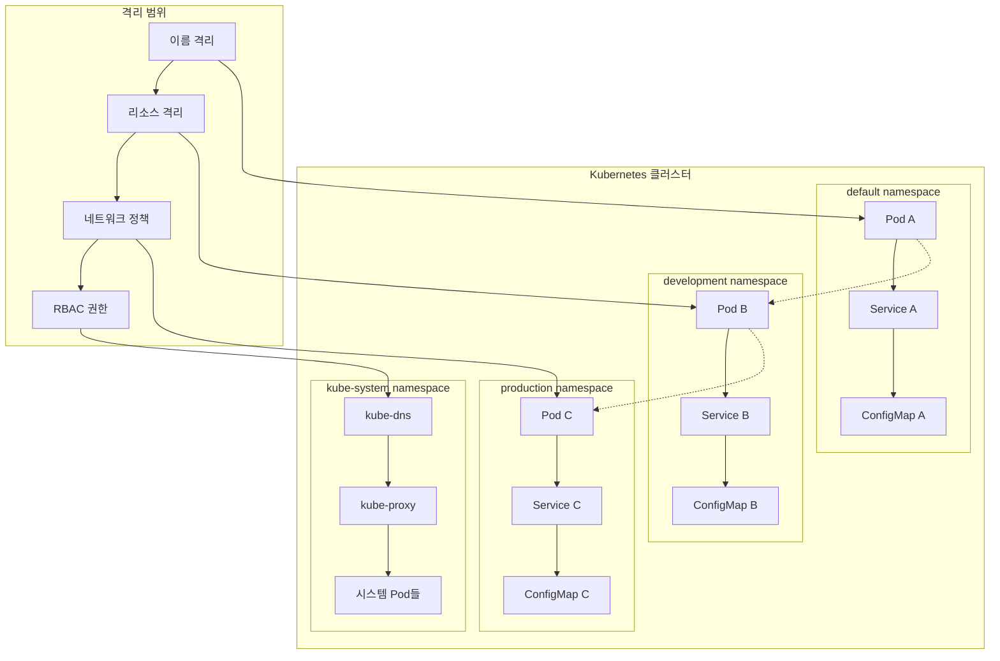
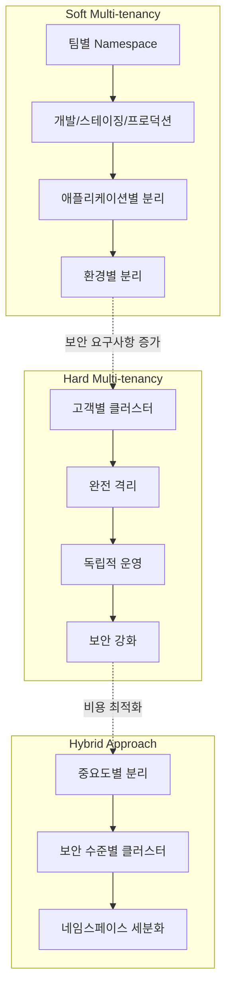
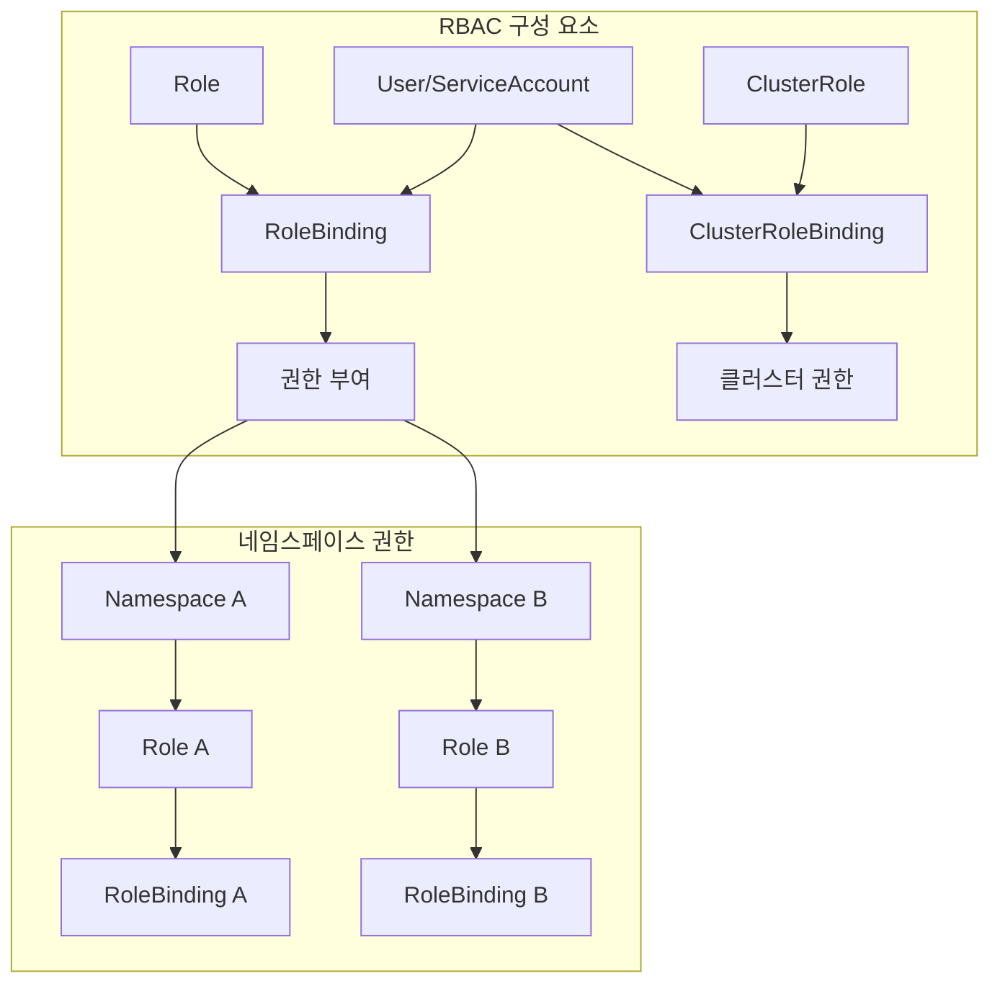
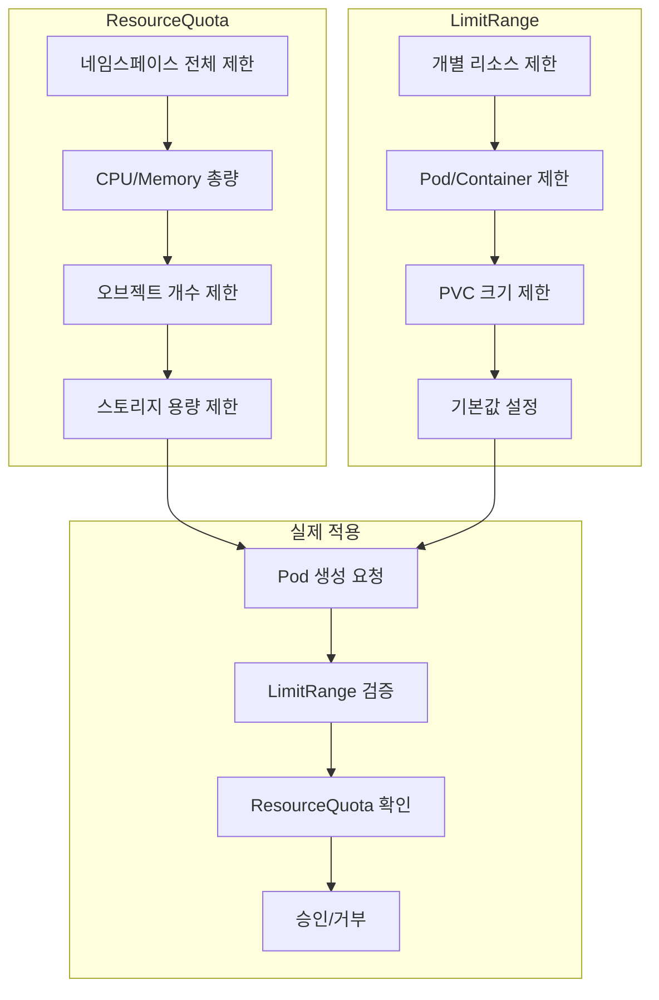

# Session 6: Namespace와 리소스 격리

## 📍 교과과정에서의 위치
이 세션은 **Week 2 > Day 2 > Session 6**으로, Kubernetes의 논리적 격리 메커니즘인 Namespace와 멀티 테넌시 구현 방안을 학습합니다.

## 학습 목표 (5분)
- **Namespace**의 **논리적 격리** 개념과 **멀티 테넌시** 이해
- **리소스 분할** 전략과 **격리 수준** 학습
- **RBAC**과 **네임스페이스** 기반 권한 관리 파악
- **리소스 쿼터**와 **제한** 정책 이해

## 1. Namespace의 논리적 격리 개념 (15분)

### Namespace 격리 모델



### Namespace 격리 수준
```
Namespace 격리 특성:

이름 격리 (Name Isolation):
   🔹 동일 네임스페이스 내 리소스명 유일성
   🔹 다른 네임스페이스 간 동일명 허용
   🔹 DNS 이름 공간 분리
   🔹 리소스 참조 시 네임스페이스 고려
   🔹 FQDN을 통한 크로스 네임스페이스 접근

리소스 격리 (Resource Isolation):
   🔹 대부분의 리소스는 네임스페이스 범위
   🔹 일부 클러스터 레벨 리소스 존재
   🔹 리소스 쿼터를 통한 사용량 제한
   🔹 LimitRange를 통한 개별 리소스 제한
   🔹 네임스페이스별 독립적 관리

네트워크 격리 (Network Isolation):
   🔹 기본적으로 네트워크 격리 없음
   🔹 NetworkPolicy를 통한 트래픽 제어
   🔹 네임스페이스 라벨 기반 정책
   🔹 Ingress/Egress 규칙 적용
   🔹 서비스 메시와 연동 가능

보안 격리 (Security Isolation):
   🔹 RBAC을 통한 권한 분리
   🔹 ServiceAccount 네임스페이스 범위
   🔹 Secret 접근 권한 제어
   🔹 Pod Security Standards 적용
   🔹 감사 로깅 네임스페이스별 설정

격리 한계:
   🔹 물리적 격리 아님 (논리적 격리만)
   🔹 노드 리소스는 공유
   🔹 커널 레벨 격리 부족
   🔹 네트워크 기본 격리 없음
   🔹 완전한 멀티 테넌시 한계
```

## 2. 멀티 테넌시와 리소스 분할 전략 (12분)

### 멀티 테넌시 모델



### 테넌시 전략 비교
```
멀티 테넌시 전략:

Namespace 기반 (Soft Multi-tenancy):
   🔹 단일 클러스터 내 논리적 분리
   🔹 리소스 공유를 통한 효율성
   🔹 관리 복잡성 상대적 낮음
   🔹 보안 격리 수준 제한
   🔹 비용 효율적
   🔹 내부 팀/프로젝트 분리에 적합
   🔹 신뢰할 수 있는 테넌트 환경

클러스터 기반 (Hard Multi-tenancy):
   🔹 물리적/논리적 완전 격리
   🔹 독립적인 Control Plane
   🔹 최고 수준의 보안 격리
   🔹 관리 복잡성 높음
   🔹 리소스 오버헤드 큼
   🔹 외부 고객/파트너 분리에 적합
   🔹 규정 준수 요구사항 충족

하이브리드 접근법:
   🔹 보안 수준별 클러스터 분리
   🔹 클러스터 내 네임스페이스 세분화
   🔹 워크로드 특성별 배치
   🔹 비용과 보안의 균형
   🔹 점진적 격리 수준 적용
   🔹 조직 구조 반영

선택 기준:
   🔹 보안 요구사항 수준
   🔹 규정 준수 필요성
   🔹 테넌트 간 신뢰 수준
   🔹 운영 복잡성 허용 범위
   🔹 비용 예산 고려
   🔹 조직 정책 및 문화
```

## 3. RBAC과 네임스페이스 기반 권한 관리 (10분)

### RBAC 아키텍처



### 권한 관리 모델
```
RBAC 권한 관리:

Role vs ClusterRole:
   🔹 Role: 네임스페이스 범위 권한
   🔹 ClusterRole: 클러스터 전체 권한
   🔹 Role: Pod, Service, ConfigMap 등
   🔹 ClusterRole: Node, PV, Namespace 등
   🔹 ClusterRole을 네임스페이스에서도 사용 가능
   🔹 권한 범위에 따른 선택

RoleBinding vs ClusterRoleBinding:
   🔹 RoleBinding: 네임스페이스 내 권한 바인딩
   🔹 ClusterRoleBinding: 클러스터 전체 권한 바인딩
   🔹 Subject: User, Group, ServiceAccount
   🔹 다중 Subject 바인딩 가능
   🔹 상속 관계 없음 (명시적 바인딩)

권한 설계 원칙:
   🔹 최소 권한 원칙 (Principle of Least Privilege)
   🔹 역할 기반 권한 분리
   🔹 네임스페이스별 권한 격리
   🔹 서비스 어카운트 활용
   🔹 정기적인 권한 검토
   🔹 감사 로깅 활성화

모범 사례:
   🔹 기본 권한 최소화
   🔹 그룹 기반 권한 관리
   🔹 자동화된 권한 프로비저닝
   🔹 권한 변경 승인 프로세스
   🔹 임시 권한 부여 메커니즘
   🔹 권한 사용 모니터링
```

## 4. 리소스 쿼터와 제한 정책 (10분)

### 리소스 관리 아키텍처



### 리소스 제한 정책
```
리소스 제한 메커니즘:

ResourceQuota (네임스페이스 레벨):
   🔹 CPU/Memory 총 사용량 제한
   🔹 스토리지 총 용량 제한
   🔹 오브젝트 개수 제한 (Pod, Service 등)
   🔹 네임스페이스 전체 리소스 거버넌스
   🔹 팀별/프로젝트별 리소스 할당
   🔹 비용 관리 및 공정한 리소스 분배

LimitRange (개별 리소스 레벨):
   🔹 Pod/Container별 최소/최대 리소스
   🔹 PVC 스토리지 크기 제한
   🔹 기본 요청/제한값 설정
   🔹 리소스 비율 제한 (request:limit)
   🔹 개별 리소스 거버넌스
   🔹 리소스 낭비 방지

QoS 클래스:
   🔹 Guaranteed: requests = limits
   🔹 Burstable: requests < limits
   🔹 BestEffort: requests/limits 없음
   🔹 우선순위 기반 스케줄링
   🔹 리소스 부족 시 축출 순서
   🔹 성능 예측 가능성

리소스 모니터링:
   🔹 네임스페이스별 사용량 추적
   🔹 쿼터 초과 알림
   🔹 리소스 효율성 분석
   🔹 용량 계획 데이터 수집
   🔹 비용 할당 및 차지백
```

## 💬 그룹 토론: 멀티 테넌시 구현을 위한 격리 전략 (8분)

### 토론 주제
**"Kubernetes에서 효과적인 멀티 테넌시를 구현하기 위한 격리 전략과 보안 고려사항은 무엇인가?"**

## 💡 핵심 개념 정리
- Namespace: 논리적 격리, 이름 공간 분리
- 멀티 테넌시: Soft vs Hard 테넌시 모델
- RBAC: 역할 기반 접근 제어, 네임스페이스 권한
- 리소스 쿼터: 사용량 제한, 공정한 리소스 분배

## 다음 세션 준비
다음 세션에서는 **Labels과 Selectors**에 대해 학습합니다.