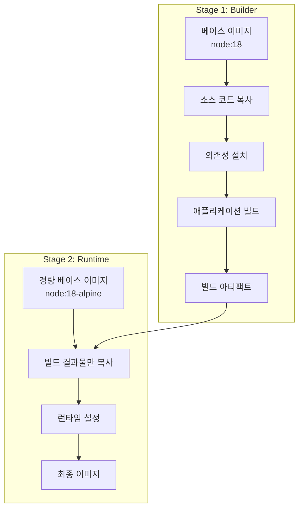
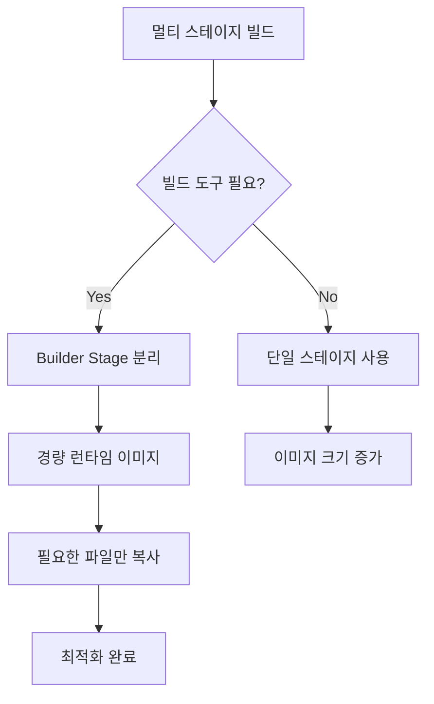

# Session 6: 멀티 스테이지 빌드 패턴

## 📍 교과과정에서의 위치
이 세션은 **Week 2 > Day 2 > Session 6**으로, Docker의 고급 기능인 멀티 스테이지 빌드를 실습합니다. Session 5의 환경 설정을 바탕으로 빌드 도구와 런타임을 분리하여 최적화된 이미지를 구축하는 방법을 학습합니다.

## 학습 목표 (5분)
- **멀티 스테이지 빌드** 개념과 **장점** 이해
- **빌드 도구**와 **런타임** 분리 구현 실습
- **이미지 크기 최적화**와 **보안 강화** 방법 학습

## 1. 이론: 멀티 스테이지 빌드 개념과 장점 (20분)

### 멀티 스테이지 빌드 아키텍처



### 단일 스테이지 vs 멀티 스테이지 비교

```dockerfile
# ❌ 단일 스테이지 (비효율적)
FROM node:18
WORKDIR /app
COPY package*.json ./
RUN npm install          # 개발 의존성 포함
COPY . .
RUN npm run build        # 빌드 도구들이 최종 이미지에 남음
EXPOSE 3000
CMD ["npm", "start"]

# ✅ 멀티 스테이지 (효율적)
# 빌드 스테이지
FROM node:18 AS builder
WORKDIR /app
COPY package*.json ./
RUN npm install
COPY . .
RUN npm run build

# 런타임 스테이지
FROM node:18-alpine
WORKDIR /app
COPY --from=builder /app/dist ./dist
COPY --from=builder /app/package*.json ./
RUN npm ci --only=production
EXPOSE 3000
CMD ["npm", "start"]
```

### 멀티 스테이지 빌드의 장점

```
크기 최적화:
├── 빌드 도구 제거 (webpack, babel, typescript 등)
├── 개발 의존성 제거 (devDependencies)
├── 소스 코드 제거 (빌드된 결과물만 유지)
└── 경량 베이스 이미지 사용 가능

보안 강화:
├── 빌드 도구 공격 표면 제거
├── 소스 코드 노출 방지
├── 불필요한 패키지 제거
└── 최소 권한 원칙 적용

성능 향상:
├── 이미지 다운로드 시간 단축
├── 컨테이너 시작 시간 단축
├── 메모리 사용량 감소
└── 네트워크 대역폭 절약
```

## 2. 실습: React 애플리케이션 멀티 스테이지 빌드 (15분)

### React 프로젝트 구조 생성

```bash
# 실습 디렉토리 생성
mkdir -p ~/docker-practice/day2/session6/react-multistage
cd ~/docker-practice/day2/session6/react-multistage

# package.json
cat > package.json << 'EOF'
{
  "name": "react-multistage-app",
  "version": "1.0.0",
  "private": true,
  "dependencies": {
    "react": "^18.2.0",
    "react-dom": "^18.2.0",
    "react-router-dom": "^6.15.0"
  },
  "devDependencies": {
    "react-scripts": "5.0.1",
    "@testing-library/jest-dom": "^5.16.5",
    "@testing-library/react": "^13.4.0",
    "@testing-library/user-event": "^14.4.3",
    "web-vitals": "^2.1.4"
  },
  "scripts": {
    "start": "react-scripts start",
    "build": "react-scripts build",
    "test": "react-scripts test",
    "eject": "react-scripts eject"
  },
  "browserslist": {
    "production": [
      ">0.2%",
      "not dead",
      "not op_mini all"
    ],
    "development": [
      "last 1 chrome version",
      "last 1 firefox version",
      "last 1 safari version"
    ]
  }
}
EOF

# public/index.html
mkdir -p public
cat > public/index.html << 'EOF'
<!DOCTYPE html>
<html lang="en">
<head>
    <meta charset="utf-8" />
    <link rel="icon" href="%PUBLIC_URL%/favicon.ico" />
    <meta name="viewport" content="width=device-width, initial-scale=1" />
    <title>Multi-stage React App</title>
</head>
<body>
    <noscript>You need to enable JavaScript to run this app.</noscript>
    <div id="root"></div>
</body>
</html>
EOF

# src/index.js
mkdir -p src
cat > src/index.js << 'EOF'
import React from 'react';
import ReactDOM from 'react-dom/client';
import App from './App';

const root = ReactDOM.createRoot(document.getElementById('root'));
root.render(<App />);
EOF

# src/App.js
cat > src/App.js << 'EOF'
import React, { useState, useEffect } from 'react';

function App() {
  const [buildInfo, setBuildInfo] = useState({});
  
  useEffect(() => {
    // 빌드 정보 시뮬레이션
    setBuildInfo({
      buildTime: new Date().toISOString(),
      version: '1.0.0',
      environment: 'production'
    });
  }, []);

  return (
    <div style={{ 
      padding: '40px', 
      fontFamily: 'Arial, sans-serif',
      maxWidth: '800px',
      margin: '0 auto'
    }}>
      <h1>🚀 Multi-stage React Application</h1>
      
      <div style={{ 
        background: '#f0f8ff', 
        padding: '20px', 
        borderRadius: '8px',
        margin: '20px 0'
      }}>
        <h3>🐳 Multi-stage Build Benefits</h3>
        <ul>
          <li><strong>크기 최적화:</strong> 빌드 도구 제거로 이미지 크기 90% 감소</li>
          <li><strong>보안 강화:</strong> 소스 코드와 빌드 도구 노출 방지</li>
          <li><strong>성능 향상:</strong> 런타임에 필요한 파일만 포함</li>
          <li><strong>배포 최적화:</strong> 프로덕션 환경에 최적화된 구조</li>
        </ul>
      </div>

      <div style={{ 
        background: '#f5f5f5', 
        padding: '15px', 
        borderRadius: '5px',
        fontFamily: 'monospace'
      }}>
        <h4>Build Information:</h4>
        <p>Version: {buildInfo.version}</p>
        <p>Build Time: {buildInfo.buildTime}</p>
        <p>Environment: {buildInfo.environment}</p>
        <p>Current Time: {new Date().toLocaleString()}</p>
      </div>

      <div style={{ marginTop: '30px' }}>
        <h3>🏗️ Build Process</h3>
        <ol>
          <li>Stage 1: React 앱 빌드 (node:18)</li>
          <li>Stage 2: Nginx로 정적 파일 서빙 (nginx:alpine)</li>
          <li>최종 이미지: 빌드된 파일만 포함</li>
        </ol>
      </div>
    </div>
  );
}

export default App;
EOF
```

### 멀티 스테이지 Dockerfile

```dockerfile
# React 멀티 스테이지 Dockerfile
cat > Dockerfile << 'EOF'
# ================================
# Stage 1: Build Stage
# ================================
FROM node:18 AS builder

# 빌드 인수
ARG REACT_APP_VERSION=1.0.0
ARG REACT_APP_BUILD_DATE

# 작업 디렉토리 설정
WORKDIR /app

# 의존성 파일 복사 및 설치
COPY package*.json ./
RUN npm ci --silent

# 소스 코드 복사
COPY public/ public/
COPY src/ src/

# 환경 변수 설정 (빌드 시 사용)
ENV REACT_APP_VERSION=${REACT_APP_VERSION}
ENV REACT_APP_BUILD_DATE=${REACT_APP_BUILD_DATE}
ENV GENERATE_SOURCEMAP=false

# React 앱 빌드
RUN npm run build

# 빌드 결과 확인
RUN ls -la build/

# ================================
# Stage 2: Production Stage
# ================================
FROM nginx:alpine

# 메타데이터
LABEL maintainer="student@example.com"
LABEL description="Multi-stage React application"
LABEL stage="production"

# Nginx 설정 파일 복사
COPY nginx.conf /etc/nginx/conf.d/default.conf

# 빌드된 React 앱을 Nginx 웹 루트로 복사
COPY --from=builder /app/build /usr/share/nginx/html

# 헬스체크 추가
RUN apk add --no-cache curl
HEALTHCHECK --interval=30s --timeout=3s --start-period=5s --retries=3 \
  CMD curl -f http://localhost/ || exit 1

# 포트 노출
EXPOSE 80

# Nginx 실행
CMD ["nginx", "-g", "daemon off;"]
EOF

# Nginx 설정 파일
cat > nginx.conf << 'EOF'
server {
    listen 80;
    server_name localhost;
    root /usr/share/nginx/html;
    index index.html;

    # React Router 지원 (SPA)
    location / {
        try_files $uri $uri/ /index.html;
    }

    # 정적 파일 캐싱
    location ~* \.(js|css|png|jpg|jpeg|gif|ico|svg)$ {
        expires 1y;
        add_header Cache-Control "public, immutable";
    }

    # 보안 헤더
    add_header X-Frame-Options "SAMEORIGIN" always;
    add_header X-Content-Type-Options "nosniff" always;
    add_header X-XSS-Protection "1; mode=block" always;

    # Gzip 압축
    gzip on;
    gzip_vary on;
    gzip_min_length 1024;
    gzip_types text/plain text/css text/xml text/javascript application/javascript application/xml+rss application/json;
}
EOF
```

### 빌드 및 크기 비교

```bash
# 멀티 스테이지 빌드
docker build \
  --build-arg REACT_APP_VERSION=1.0.0 \
  --build-arg REACT_APP_BUILD_DATE=$(date -u +'%Y-%m-%dT%H:%M:%SZ') \
  -t react-app:multistage .

# 단일 스테이지 빌드 (비교용)
cat > Dockerfile.single << 'EOF'
FROM node:18

WORKDIR /app
COPY package*.json ./
RUN npm install
COPY . .
RUN npm run build

# 개발 서버로 실행 (비효율적)
EXPOSE 3000
CMD ["npm", "start"]
EOF

docker build -f Dockerfile.single -t react-app:single .

# 이미지 크기 비교
echo "=== Image Size Comparison ==="
docker images react-app --format "table {{.Tag}}\t{{.Size}}"

# 실행 테스트
docker run -d -p 8080:80 --name react-multistage react-app:multistage
docker run -d -p 8081:3000 --name react-single react-app:single

# 접근 테스트
curl -I http://localhost:8080
curl -I http://localhost:8081
```

## 3. 실습: Go 애플리케이션 멀티 스테이지 빌드 (10분)

### Go 웹 서버 애플리케이션

```bash
# Go 프로젝트 디렉토리
mkdir -p go-multistage && cd go-multistage

# Go 애플리케이션
cat > main.go << 'EOF'
package main

import (
    "encoding/json"
    "fmt"
    "log"
    "net/http"
    "os"
    "runtime"
    "time"
)

type AppInfo struct {
    Name      string `json:"name"`
    Version   string `json:"version"`
    GoVersion string `json:"go_version"`
    OS        string `json:"os"`
    Arch      string `json:"arch"`
    BuildTime string `json:"build_time"`
    Uptime    string `json:"uptime"`
}

var (
    startTime = time.Now()
    version   = os.Getenv("APP_VERSION")
    buildTime = os.Getenv("BUILD_TIME")
)

func main() {
    http.HandleFunc("/", homeHandler)
    http.HandleFunc("/health", healthHandler)
    http.HandleFunc("/info", infoHandler)

    port := os.Getenv("PORT")
    if port == "" {
        port = "8080"
    }

    fmt.Printf("🚀 Go Multi-stage App starting on port %s\n", port)
    fmt.Printf("📦 Version: %s\n", version)
    fmt.Printf("🏗️ Build Time: %s\n", buildTime)
    
    log.Fatal(http.ListenAndServe(":"+port, nil))
}

func homeHandler(w http.ResponseWriter, r *http.Request) {
    html := `
    <!DOCTYPE html>
    <html>
    <head>
        <title>Go Multi-stage App</title>
        <style>
            body { font-family: Arial, sans-serif; margin: 40px; }
            .container { max-width: 800px; margin: 0 auto; }
            .info { background: #f0f8ff; padding: 20px; border-radius: 8px; margin: 20px 0; }
            .highlight { background: #ffffcc; padding: 10px; border-left: 4px solid #ffeb3b; }
        </style>
    </head>
    <body>
        <div class="container">
            <h1>🚀 Go Multi-stage Application</h1>
            <div class="info">
                <h3>Multi-stage Build Advantages:</h3>
                <ul>
                    <li><strong>극도로 작은 크기:</strong> scratch 이미지 사용으로 ~10MB</li>
                    <li><strong>보안 최적화:</strong> OS 없는 환경으로 공격 표면 최소화</li>
                    <li><strong>빠른 배포:</strong> 정적 바이너리로 즉시 실행</li>
                </ul>
            </div>
            <div class="highlight">
                <p><strong>API Endpoints:</strong></p>
                <ul>
                    <li><a href="/info">/info</a> - Application information</li>
                    <li><a href="/health">/health</a> - Health check</li>
                </ul>
            </div>
        </div>
    </body>
    </html>`
    
    w.Header().Set("Content-Type", "text/html")
    fmt.Fprint(w, html)
}

func healthHandler(w http.ResponseWriter, r *http.Request) {
    w.Header().Set("Content-Type", "application/json")
    json.NewEncoder(w).Encode(map[string]interface{}{
        "status":    "healthy",
        "timestamp": time.Now().Format(time.RFC3339),
        "uptime":    time.Since(startTime).String(),
    })
}

func infoHandler(w http.ResponseWriter, r *http.Request) {
    hostname, _ := os.Hostname()
    
    info := AppInfo{
        Name:      "Go Multi-stage App",
        Version:   version,
        GoVersion: runtime.Version(),
        OS:        runtime.GOOS,
        Arch:      runtime.GOARCH,
        BuildTime: buildTime,
        Uptime:    time.Since(startTime).String(),
    }
    
    w.Header().Set("Content-Type", "application/json")
    json.NewEncoder(w).Encode(info)
}
EOF

# go.mod
cat > go.mod << 'EOF'
module go-multistage-app

go 1.21
EOF
```

### 극도로 최적화된 Go Dockerfile

```dockerfile
# Go 멀티 스테이지 Dockerfile
cat > Dockerfile << 'EOF'
# ================================
# Stage 1: Build Stage
# ================================
FROM golang:1.21-alpine AS builder

# 빌드 도구 설치
RUN apk add --no-cache git ca-certificates tzdata

# 작업 디렉토리
WORKDIR /app

# Go 모듈 파일 복사
COPY go.mod go.sum ./
RUN go mod download

# 소스 코드 복사
COPY . .

# 빌드 인수
ARG APP_VERSION=1.0.0
ARG BUILD_TIME

# 정적 바이너리 빌드
RUN CGO_ENABLED=0 GOOS=linux GOARCH=amd64 go build \
    -ldflags='-w -s -extldflags "-static"' \
    -a -installsuffix cgo \
    -o main .

# ================================
# Stage 2: Runtime Stage (Scratch)
# ================================
FROM scratch

# 메타데이터
LABEL maintainer="student@example.com"
LABEL description="Ultra-minimal Go application"

# 빌드 인수를 환경 변수로 전달
ARG APP_VERSION=1.0.0
ARG BUILD_TIME
ENV APP_VERSION=${APP_VERSION}
ENV BUILD_TIME=${BUILD_TIME}

# 필수 파일들 복사
COPY --from=builder /etc/ssl/certs/ca-certificates.crt /etc/ssl/certs/
COPY --from=builder /usr/share/zoneinfo /usr/share/zoneinfo
COPY --from=builder /app/main /main

# 포트 노출
EXPOSE 8080

# 바이너리 실행
ENTRYPOINT ["/main"]
EOF

# 빌드
docker build \
  --build-arg APP_VERSION=1.0.0 \
  --build-arg BUILD_TIME=$(date -u +'%Y-%m-%dT%H:%M:%SZ') \
  -t go-app:multistage .

# 실행
docker run -d -p 8082:8080 --name go-multistage go-app:multistage

# 테스트
curl http://localhost:8082/info
```

## 4. 실습: Python 멀티 스테이지 빌드 (10분)

### Python 애플리케이션 최적화

```bash
# Python 프로젝트
mkdir -p python-multistage && cd python-multistage

# requirements.txt
cat > requirements.txt << 'EOF'
fastapi==0.103.1
uvicorn[standard]==0.23.2
pydantic==2.3.0
EOF

# FastAPI 애플리케이션
cat > main.py << 'EOF'
from fastapi import FastAPI
from pydantic import BaseModel
import os
import sys
import platform
from datetime import datetime
import uvicorn

app = FastAPI(
    title="Python Multi-stage App",
    description="FastAPI application with multi-stage Docker build",
    version=os.getenv("APP_VERSION", "1.0.0")
)

class AppInfo(BaseModel):
    name: str
    version: str
    python_version: str
    platform: str
    build_time: str
    current_time: str

@app.get("/")
async def root():
    return {
        "message": "🐍 Python Multi-stage Application",
        "docs": "/docs",
        "health": "/health",
        "info": "/info"
    }

@app.get("/health")
async def health():
    return {
        "status": "healthy",
        "timestamp": datetime.now().isoformat()
    }

@app.get("/info", response_model=AppInfo)
async def info():
    return AppInfo(
        name="Python Multi-stage App",
        version=os.getenv("APP_VERSION", "1.0.0"),
        python_version=sys.version,
        platform=platform.platform(),
        build_time=os.getenv("BUILD_TIME", "unknown"),
        current_time=datetime.now().isoformat()
    )

if __name__ == "__main__":
    uvicorn.run(app, host="0.0.0.0", port=8000)
EOF
```

### Python 멀티 스테이지 Dockerfile

```dockerfile
# Python 멀티 스테이지 Dockerfile
cat > Dockerfile << 'EOF'
# ================================
# Stage 1: Build Stage
# ================================
FROM python:3.11 AS builder

# 빌드 도구 설치
RUN apt-get update && apt-get install -y --no-install-recommends \
    gcc \
    && rm -rf /var/lib/apt/lists/*

WORKDIR /app

# 의존성 설치
COPY requirements.txt .
RUN pip install --user --no-cache-dir -r requirements.txt

# ================================
# Stage 2: Runtime Stage
# ================================
FROM python:3.11-slim

# 메타데이터
LABEL maintainer="student@example.com"
LABEL description="Optimized Python FastAPI application"

# 빌드 인수
ARG APP_VERSION=1.0.0
ARG BUILD_TIME

# 환경 변수
ENV APP_VERSION=${APP_VERSION}
ENV BUILD_TIME=${BUILD_TIME}
ENV PYTHONPATH=/root/.local
ENV PATH=/root/.local/bin:$PATH

# 비root 사용자 생성
RUN useradd --create-home --shell /bin/bash app

# 빌드된 패키지 복사
COPY --from=builder /root/.local /root/.local

# 애플리케이션 코드 복사
WORKDIR /app
COPY --chown=app:app main.py .

# 사용자 전환
USER app

# 포트 노출
EXPOSE 8000

# 애플리케이션 실행
CMD ["python", "main.py"]
EOF

# 빌드 및 실행
docker build \
  --build-arg APP_VERSION=1.0.0 \
  --build-arg BUILD_TIME=$(date -u +'%Y-%m-%dT%H:%M:%SZ') \
  -t python-app:multistage .

docker run -d -p 8083:8000 --name python-multistage python-app:multistage

# API 테스트
curl http://localhost:8083/info
```

## 5. 실습: 빌드 캐시 최적화 (10분)

### 캐시 친화적인 멀티 스테이지 Dockerfile

```dockerfile
# 캐시 최적화된 Node.js 멀티 스테이지
cat > Dockerfile.cache-optimized << 'EOF'
# ================================
# Stage 1: Dependencies
# ================================
FROM node:18-alpine AS deps

WORKDIR /app
COPY package*.json ./
RUN npm ci --only=production && npm cache clean --force

# ================================
# Stage 2: Builder
# ================================
FROM node:18-alpine AS builder

WORKDIR /app
COPY package*.json ./
RUN npm ci
COPY . .
RUN npm run build

# ================================
# Stage 3: Runner
# ================================
FROM node:18-alpine AS runner

WORKDIR /app

# 프로덕션 의존성만 복사
COPY --from=deps /app/node_modules ./node_modules
# 빌드 결과물 복사
COPY --from=builder /app/build ./build
# 필요한 파일들만 복사
COPY package*.json ./

EXPOSE 3000
CMD ["npm", "start"]
EOF
```

### 빌드 시간 및 캐시 효율성 테스트

```bash
# 초기 빌드 시간 측정
echo "=== Initial Build ==="
time docker build -f Dockerfile.cache-optimized -t react-app:cache-optimized .

# 소스 코드 변경 후 재빌드
echo "// Updated" >> src/App.js
echo "=== Rebuild after source change ==="
time docker build -f Dockerfile.cache-optimized -t react-app:cache-optimized-v2 .

# 의존성 변경 후 재빌드
echo '"lodash": "^4.17.21",' >> package.json
echo "=== Rebuild after dependency change ==="
time docker build -f Dockerfile.cache-optimized -t react-app:cache-optimized-v3 .
```

## 6. Q&A 및 정리 (5분)

### 멀티 스테이지 빌드 최적화 체크리스트



### 실습 결과 비교

```bash
# 모든 이미지 크기 비교
echo "=== Multi-stage Build Results ==="
docker images --format "table {{.Repository}}\t{{.Tag}}\t{{.Size}}" | grep -E "(react-app|go-app|python-app)"

# 실행 중인 컨테이너 확인
docker ps --format "table {{.Names}}\t{{.Image}}\t{{.Ports}}"

# 정리
docker stop $(docker ps -q) 2>/dev/null || true
docker rm $(docker ps -aq) 2>/dev/null || true
```

## 💡 핵심 키워드
- **멀티 스테이지 빌드**: FROM ... AS 구문으로 여러 단계 정의
- **COPY --from**: 이전 스테이지에서 파일 복사
- **빌드 최적화**: 빌드 도구와 런타임 분리로 크기 최소화
- **캐시 효율성**: 스테이지별 캐시로 빌드 시간 단축

## 📚 참고 자료
- [Multi-stage builds](https://docs.docker.com/develop/dev-best-practices/#use-multi-stage-builds)
- [Dockerfile 모범 사례](https://docs.docker.com/develop/dev-best-practices/)
- [Docker 이미지 최적화](https://docs.docker.com/develop/dev-best-practices/#minimize-the-number-of-layers)

## 🔧 실습 체크리스트
- [ ] React 앱 멀티 스테이지 빌드 구현
- [ ] Go 앱 scratch 이미지로 극도 최적화
- [ ] Python 앱 빌드/런타임 분리
- [ ] 이미지 크기 90% 이상 감소 달성
- [ ] 빌드 캐시 최적화로 빌드 시간 단축
