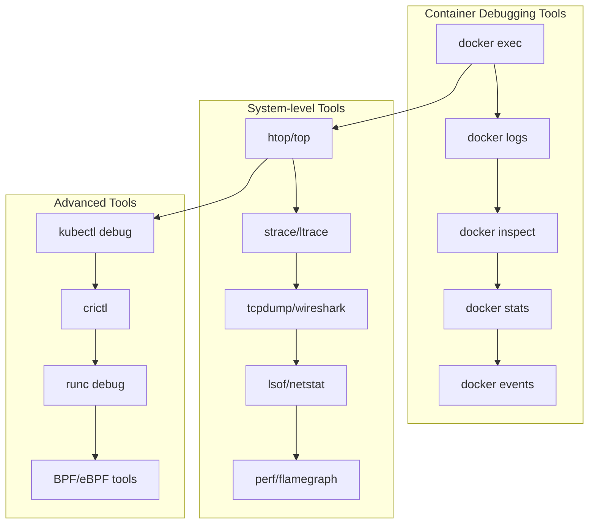
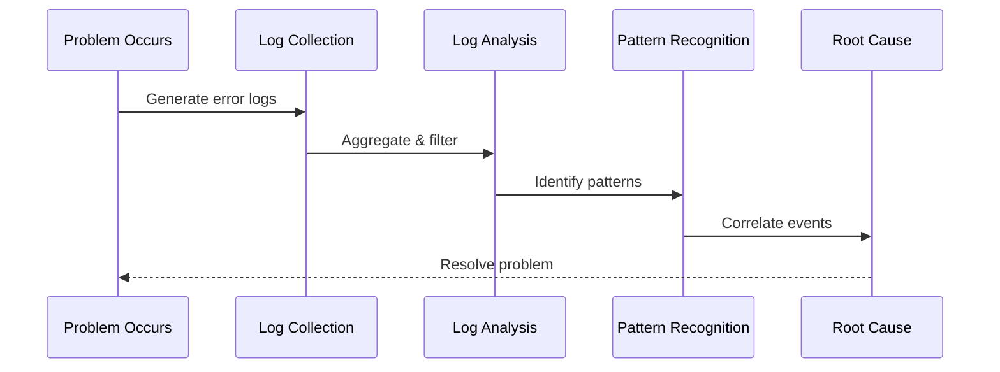

# Session 6: 디버깅 및 문제 해결

## 📍 교과과정에서의 위치
이 세션은 **Week 2 > Day 2 > Session 6**으로, 컨테이너 모니터링 아키텍처 이해를 바탕으로 실제 운영 환경에서의 디버깅 기법과 체계적인 문제 해결 방법론을 심화 분석합니다.

## 학습 목표 (5분)
- **컨테이너 디버깅 도구** 및 **진단 기법** 완전 이해
- **로그 분석** 및 **트러블슈팅** 체계적 접근법
- **성능 병목 지점** 식별과 **근본 원인 분석** 방법론

## 1. 이론: 컨테이너 디버깅 도구 및 기법 (20분)

### 디버깅 도구 생태계



### 컨테이너별 디버깅 전략

```
디버깅 접근 방법론:

컨테이너 상태 진단:
├── docker ps -a: 모든 컨테이너 상태 확인
├── docker inspect: 상세 설정 및 상태 정보
├── docker logs: 컨테이너 로그 분석
├── docker stats: 실시간 리소스 사용량
├── docker events: 실시간 이벤트 스트림
├── docker exec: 컨테이너 내부 접근
├── docker cp: 파일 복사 및 분석
└── docker diff: 파일시스템 변경 사항

프로세스 레벨 디버깅:
├── ps aux: 프로세스 목록 및 상태
├── pstree: 프로세스 트리 구조
├── lsof: 열린 파일 및 네트워크 연결
├── netstat/ss: 네트워크 연결 상태
├── strace: 시스템 콜 추적
├── ltrace: 라이브러리 호출 추적
├── gdb: 디버거를 통한 상세 분석
└── coredump: 크래시 덤프 분석

네트워크 디버깅:
├── ping/traceroute: 네트워크 연결성 확인
├── nslookup/dig: DNS 해석 테스트
├── tcpdump: 패킷 캡처 및 분석
├── wireshark: 네트워크 프로토콜 분석
├── iptables -L: 방화벽 규칙 확인
├── ip route: 라우팅 테이블 분석
├── bridge/brctl: 브리지 네트워크 상태
└── 네트워크 네임스페이스 분석

스토리지 디버깅:
├── df -h: 디스크 사용량 확인
├── du -sh: 디렉토리별 사용량
├── iostat: I/O 통계 및 성능
├── iotop: 프로세스별 I/O 사용량
├── lsblk: 블록 디바이스 구조
├── mount: 마운트 포인트 확인
├── fuser/lsof: 파일 사용 프로세스
└── 파일시스템 무결성 검사
```

### 고급 디버깅 기법

```
심화 디버깅 도구:

eBPF 기반 도구:
├── bpftrace: 동적 추적 및 분석
├── bcc-tools: BPF 컴파일러 컬렉션
├── kubectl-trace: Kubernetes 환경 추적
├── 시스템 콜 추적 및 필터링
├── 네트워크 패킷 분석
├── 파일시스템 I/O 모니터링
├── 메모리 할당 추적
└── CPU 성능 프로파일링

성능 프로파일링:
├── perf: Linux 성능 분석 도구
├── flamegraph: CPU 사용량 시각화
├── pprof: Go 애플리케이션 프로파일링
├── Java Flight Recorder: JVM 프로파일링
├── py-spy: Python 프로파일링
├── 메모리 누수 탐지
├── 핫스팟 분석
└── 병목 지점 식별

컨테이너 런타임 디버깅:
├── crictl: CRI 호환 런타임 디버깅
├── runc debug: OCI 런타임 디버깅
├── containerd 로그 분석
├── Docker 데몬 디버그 모드
├── 런타임 메트릭 수집
├── 컨테이너 생명주기 추적
└── 리소스 제한 검증

분산 추적:
├── Jaeger: 분산 추적 시스템
├── Zipkin: 마이크로서비스 추적
├── OpenTelemetry: 관찰가능성 표준
├── 요청 흐름 추적
├── 서비스 의존성 분석
├── 지연시간 분석
└── 에러 전파 경로 추적
```

## 2. 이론: 로그 분석 및 패턴 인식 (15분)

### 로그 분석 방법론



### 체계적 로그 분석 프로세스

```
로그 분석 단계:

1단계: 로그 수집 및 집계
├── 관련 컨테이너 로그 수집
├── 시간 범위 설정 (문제 발생 전후)
├── 로그 레벨별 필터링
├── 서비스별 로그 분리
├── 에러 패턴 초기 식별
└── 로그 볼륨 및 빈도 분석

2단계: 로그 파싱 및 구조화
├── 타임스탬프 정규화
├── 로그 메시지 파싱
├── 구조화된 필드 추출
├── 에러 코드 및 메시지 분류
├── 요청 ID 기반 추적
└── 컨텍스트 정보 연결

3단계: 패턴 분석 및 상관관계
├── 에러 발생 빈도 분석
├── 시간대별 패턴 식별
├── 서비스 간 의존성 분석
├── 연쇄 장애 패턴 추적
├── 리소스 사용량과 에러 상관관계
└── 외부 요인 영향 분석

4단계: 근본 원인 분석
├── 최초 장애 지점 식별
├── 장애 전파 경로 추적
├── 설정 변경 이력 확인
├── 배포 및 인프라 변경 연관성
├── 외부 의존성 장애 확인
└── 비즈니스 영향도 평가

일반적인 로그 패턴:
├── OutOfMemoryError: 메모리 부족
├── Connection timeout: 네트워크 연결 문제
├── 404/500 HTTP 에러: 애플리케이션 오류
├── Database connection failed: DB 연결 실패
├── Permission denied: 권한 문제
├── Disk space full: 디스크 공간 부족
├── Port already in use: 포트 충돌
└── SSL/TLS handshake failed: 인증서 문제
```

### 자동화된 로그 분석

```
지능형 로그 분석:

머신러닝 기반 분석:
├── 이상 탐지 알고리즘 (Isolation Forest, LSTM)
├── 로그 클러스터링 (K-means, DBSCAN)
├── 패턴 학습 및 예측
├── 자연어 처리 (NLP) 기반 에러 분류
├── 시계열 분석을 통한 트렌드 예측
└── 자동 근본 원인 추론

실시간 로그 모니터링:
├── 스트리밍 로그 처리 (Kafka, Kinesis)
├── 실시간 패턴 매칭
├── 임계값 기반 알림
├── 동적 임계값 조정
├── 컨텍스트 기반 알림 그룹핑
└── 자동 티켓 생성 및 할당

로그 상관관계 분석:
├── 다중 서비스 로그 연관성
├── 메트릭-로그 상관관계
├── 사용자 세션 기반 추적
├── 비즈니스 트랜잭션 추적
├── 인프라 이벤트 연관성
└── 보안 이벤트 상관관계
```

## 3. 이론: 성능 병목 지점 식별 (10분)

### 성능 분석 방법론

```
성능 병목 분석 프로세스:

CPU 병목 분석:
├── CPU 사용률 패턴 분석 (user, system, iowait)
├── 프로세스별 CPU 사용량 추적
├── 컨텍스트 스위치 빈도 분석
├── CPU 바운드 vs I/O 바운드 식별
├── 멀티스레딩 효율성 분석
├── CPU 캐시 미스율 측정
└── NUMA 토폴로지 최적화

메모리 병목 분석:
├── 메모리 사용 패턴 (RSS, VSZ, 캐시)
├── 메모리 누수 탐지
├── 가비지 컬렉션 영향 분석
├── 스왑 사용량 및 페이지 폴트
├── 메모리 단편화 분석
├── 버퍼/캐시 효율성
└── OOM Killer 이벤트 분석

I/O 병목 분석:
├── 디스크 I/O 패턴 (순차/랜덤)
├── I/O 대기 시간 및 큐 깊이
├── 파일시스템 성능 분석
├── 네트워크 I/O 병목
├── 스토리지 레이턴시 분석
├── I/O 스케줄러 효율성
└── 캐시 히트율 분석

네트워크 병목 분석:
├── 네트워크 처리량 및 지연시간
├── 패킷 드롭 및 재전송율
├── 연결 수 및 연결 풀 효율성
├── DNS 해석 시간
├── 로드 밸런서 성능
├── 서비스 메시 오버헤드
└── 네트워크 토폴로지 최적화
```

### 성능 최적화 전략

```
성능 튜닝 접근법:

애플리케이션 레벨:
├── 코드 프로파일링 및 최적화
├── 알고리즘 및 데이터 구조 개선
├── 캐싱 전략 구현
├── 데이터베이스 쿼리 최적화
├── 비동기 처리 도입
├── 연결 풀링 최적화
└── 리소스 사용 패턴 개선

컨테이너 레벨:
├── 리소스 제한 최적화
├── 이미지 크기 최소화
├── 멀티 스테이지 빌드 활용
├── 베이스 이미지 선택 최적화
├── 컨테이너 시작 시간 단축
├── 헬스 체크 최적화
└── 그레이스풀 셧다운 구현

인프라 레벨:
├── 하드웨어 리소스 최적화
├── 네트워크 토폴로지 개선
├── 스토리지 성능 튜닝
├── 로드 밸런싱 전략
├── 오토스케일링 정책
├── 지역별 배치 최적화
└── CDN 및 캐싱 계층 활용
```

## 4. 개념 예시: 디버깅 시나리오 분석 (12분)

### 메모리 누수 디버깅 예시

```bash
# 메모리 사용량 모니터링 (개념 예시)
# 컨테이너 메모리 사용량 추적
docker stats --format "table {{.Container}}\t{{.MemUsage}}\t{{.MemPerc}}" --no-stream

# 프로세스별 메모리 사용량
docker exec container_name ps aux --sort=-%mem | head -10

# 메모리 맵 분석
docker exec container_name cat /proc/PID/smaps

# Java 힙 덤프 생성 (Java 애플리케이션)
docker exec container_name jcmd PID GC.run_finalization
docker exec container_name jcmd PID VM.gc
docker exec container_name jmap -dump:format=b,file=/tmp/heap.hprof PID
```

### 네트워크 연결 문제 디버깅 예시

```bash
# 네트워크 연결 상태 확인 (개념 예시)
# 컨테이너 네트워크 설정 확인
docker network ls
docker network inspect bridge

# 컨테이너 IP 및 포트 확인
docker exec container_name ip addr show
docker exec container_name netstat -tuln

# DNS 해석 테스트
docker exec container_name nslookup service_name
docker exec container_name dig service_name

# 네트워크 연결성 테스트
docker exec container_name ping target_host
docker exec container_name telnet target_host port

# 패킷 캡처 및 분석
docker exec container_name tcpdump -i eth0 -w /tmp/capture.pcap
```

### 성능 병목 분석 예시

```bash
# CPU 성능 분석 (개념 예시)
# CPU 사용률 실시간 모니터링
docker exec container_name top -p PID

# 프로세스별 CPU 사용량
docker exec container_name ps -eo pid,ppid,cmd,%mem,%cpu --sort=-%cpu

# 시스템 콜 추적
docker exec container_name strace -p PID -c

# I/O 성능 분석 (개념 예시)
# I/O 통계 확인
docker exec container_name iostat -x 1

# 프로세스별 I/O 사용량
docker exec container_name iotop -p PID

# 파일 시스템 사용량
docker exec container_name df -h
docker exec container_name du -sh /app/*
```

### 로그 분석 자동화 예시

```bash
# 로그 패턴 분석 스크립트 (개념 예시)
#!/bin/bash

# 에러 로그 집계
docker logs container_name 2>&1 | grep -i error | \
  awk '{print $1, $2, $NF}' | sort | uniq -c | sort -nr

# 응답 시간 분석
docker logs container_name | grep "response_time" | \
  awk '{print $NF}' | sort -n | \
  awk '{
    sum += $1
    count++
    if (count == 1) min = $1
    max = $1
  }
  END {
    print "Min:", min "ms"
    print "Max:", max "ms" 
    print "Avg:", sum/count "ms"
  }'

# 에러율 계산
total_requests=$(docker logs container_name | grep -c "HTTP")
error_requests=$(docker logs container_name | grep -c "HTTP/1.1\" [45]")
error_rate=$(echo "scale=2; $error_requests * 100 / $total_requests" | bc)
echo "Error Rate: $error_rate%"
```

## 5. 토론 및 정리 (8분)

### 핵심 개념 정리
- **체계적 디버깅 접근법**과 도구 활용 전략
- **로그 분석**을 통한 근본 원인 분석 방법론
- **성능 병목 지점** 식별과 최적화 기법
- **자동화된 문제 해결** 시스템 구축 방안

### 토론 주제
"복잡한 마이크로서비스 환경에서 장애 발생 시 신속한 근본 원인 분석을 위한 최적의 디버깅 전략은 무엇인가?"

## 💡 핵심 키워드
- **디버깅 도구**: docker 명령어, 시스템 도구, eBPF, 프로파일링
- **로그 분석**: 패턴 인식, 상관관계 분석, 자동화
- **성능 분석**: 병목 식별, CPU/메모리/I/O/네트워크 분석
- **문제 해결**: 근본 원인 분석, 체계적 접근법, 자동화

## 📚 참고 자료
- [Docker 디버깅 가이드](https://docs.docker.com/config/containers/logging/)
- [Linux 성능 분석 도구](https://www.brendangregg.com/linuxperf.html)
- [컨테이너 트러블슈팅](https://kubernetes.io/docs/tasks/debug-application-cluster/)
